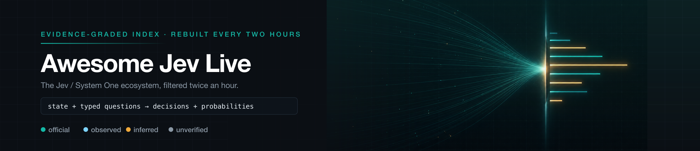
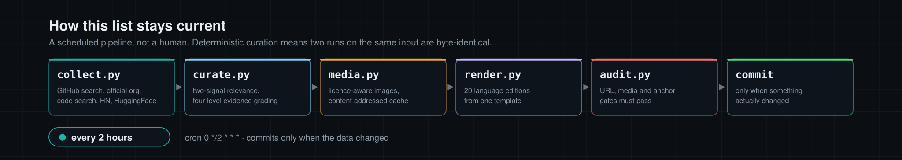

  

<h1 align="center">Awesome Jev Live</h1>

<b>L'index Jev classé par niveau de preuve, reconstruit toutes les deux heures.</b>

  
  
  
  
  
  

<a href="../README.md">English</a> · <a href="README.zh-CN.md">简体中文</a> · <a href="README.zh-TW.md">繁體中文</a> · <a href="README.ja.md">日本語</a> · <a href="README.ko.md">한국어</a> · <a href="README.es.md">Español</a> · <b>Français</b> · <a href="README.de.md">Deutsch</a> · <a href="README.pt-BR.md">Português (Brasil)</a> · <a href="README.ru.md">Русский</a> · <a href="README.it.md">Italiano</a> · <a href="README.ar.md">العربية</a> · <a href="README.hi.md">हिन्दी</a> · <a href="README.tr.md">Türkçe</a> · <a href="README.vi.md">Tiếng Việt</a> · <a href="README.th.md">ไทย</a> · <a href="README.id.md">Bahasa Indonesia</a> · <a href="README.pl.md">Polski</a> · <a href="README.nl.md">Nederlands</a> · <a href="README.uk.md">Українська</a>

> [!NOTE]
> **Index en direct** · Dernière synchronisation: `2026-09-30T01:53:59+08:00` (UTC+8)
> · Entrées: **831** · Nouvelles ce cycle: **70** · Langages d'implémentation: **27**

Chaque entrée ci-dessous a été collectée, filtrée et revérifiée par le pipeline de ce dépôt. Les chiffres et les horodatages proviennent des sources, non d'un instantané rédigé à la main.

## 🔥 Sélection du moment — le premier de chaque catégorie

Une entrée par catégorie, classée par niveau de preuve et par étoiles, recalculée à chaque synchronisation. Un classement, pas une recommandation ; chaque sélection renvoie à sa fiche complète. Les projets ayant publié une capture ou un enregistrement sont préférés, pour que cette bande reste visuelle.

<table>
<tr>
<td width="50%" valign="top">
<b>🏛️ <a href="https://github.com/typesafe-ai/skills">typesafe-ai/skills</a></b>
⭐2410 · ✅ official
Compétences d’agent pour construire avec les System One API de TypeSafe
</td>
<td width="50%" valign="top">

<b>🧰 <a href="https://github.com/john-rocky/coreai-kit">john-rocky/coreai-kit</a></b>
⭐115 · Swift · 👁️ observed
Swift SDK pour exécuter des modèles de chat, de vision et de parole sur iPhone et Mac avec le Core AI d&#x27;Apple. Téléchargement et mise en cache des modèles,…
</td>
</tr>
<tr>
<td width="50%" valign="top">

<b>🤖 <a href="https://github.com/gargpratyush/jev-router">gargpratyush/jev-router</a></b>
⭐483 · JavaScript · 🔎 inferred
Acheminez votre tâche vers le modèle le moins cher de claude code avec jev-router
</td>
<td width="50%" valign="top">

<b>🛡️ <a href="https://github.com/NandhaKishorM/laya">NandhaKishorM/laya</a></b>
⭐28407 · Python · 👁️ observed
Moteur de décision Système 1 non autorégressif. Décisions typées de choix, de score et oui/non sur n’importe quel texte en une seule passe avant, dans plus de 100…
</td>
</tr>
<tr>
<td width="50%" valign="top">

<b>🧪 <a href="https://github.com/ikermoel/open-alternative-jev">ikermoel/open-alternative-jev</a></b>
⭐57 · Python · 👁️ observed
Alternative open source au Jev de TypeSafe : une couche de modèle de style System One qui fournit des décisions typées et calibrées à partir de n’importe quel LLM à…
</td>
<td width="50%" valign="top">

<b>🔬 <a href="https://github.com/TianyuCodings/NanoJev">TianyuCodings/NanoJev</a></b>
⭐2429 · Python · 🔎 inferred
Une nano-réplique de Jev : décisions parallèles, candidats dynamiques et pipeline d’entraînement de bout en bout.
</td>
</tr>
<tr>
<td width="50%" valign="top">

<b>🎮 <a href="https://github.com/zadescoxp/Jev-Trades">zadescoxp/Jev-Trades</a></b>
⭐35 · Python · 👁️ observed
Bot de trading avec le tout nouveau premier modèle système de TypeSafe AI, nommé Jev
</td>
<td width="50%" valign="top">
<b>📰 <a href="https://docs.typesafe.ai/model-jaggedness/jev-1.13">9 类已知缺陷（jaggedness）</a></b>
⭐0 · ✅ official
字面理解、**计数不可靠**、日期比较、多级间接、无关细节大 state、对抗内容、指令与 criteria 矛盾、结构性不变量、生成。官方建议&quot;拆成原子问题在代码里组合&quot;。
</td>
</tr>
</table>

## Sommaire

- [Qu'est-ce que Jev ?](#quest-ce-que-jev)
- [Comment les entrées sont classées](#comment-les-entrées-sont-classées)
- [SDK officiels et outils de développement](#sdk-officiels-et-outils-de-développement) — **7**
- [Clients, SDK et adaptateurs communautaires](#clients-sdk-et-adaptateurs-communautaires) — **128**
- [Outillage d'agents : MCP, hooks, portes de contrôle et agents de codage](#outillage-dagents--mcp-hooks-portes-de-contrôle-et-agents-de-codage) — **258**
- [Routage, garde-fous et approbations](#routage-garde-fous-et-approbations) — **71**
- [Évaluation, calibration et benchmarks](#évaluation-calibration-et-benchmarks) — **84**
- [Reproductions ouvertes, poids et recherche sur l'architecture](#reproductions-ouvertes-poids-et-recherche-sur-larchitecture) — **47**
- [Applications, jeux, robotique et démos interactives](#applications-jeux-robotique-et-démos-interactives) — **47**
- [Articles, discussions et listes sœurs](#articles-discussions-et-listes-sœurs) — **98**
- [Autres projets](#autres-projets) — **91**
- [Projets par langage d'implémentation](#projets-par-langage-dimplémentation)
- [Comment cette liste reste à jour](#comment-cette-liste-reste-à-jour)

## Qu&#x27;est-ce que Jev ?

Jev est le premier **System One model** de TypeSafe AI. Il ne rédige pas de prose. Il prend un état plus des questions dont vous définissez à l'avance l'espace de réponse, et renvoie des valeurs typées avec des distributions de probabilité sur lesquelles votre code peut brancher.

|                       |                                                                                                                                                                                                                                                      |
| --------------------- | ---------------------------------------------------------------------------------------------------------------------------------------------------------------------------------------------------------------------------------------------------- |
| **Forme **            | `state + typed questions` → `constrained answers + probabilities` → `your code`                                                                                                                                                                      |
| **Primitives **       | `Choice` (choisir une option parmi ≤255), `Score` (une grille de 2 à 10), `Noul` (un oui/non probabiliste)                                                                                                                                           |
| **Endpoint **         | `POST https://api.typesafe.ai/v1/systemone`, modèle `jev-1.13.0` / alias `jev-latest`                                                                                                                                                                |
| **Bons cas d'usage ** | routage, triage, notation, modération, vérification et portes de contrôle à faible latence dans un flux borné                                                                                                                                        |
| **Limites connues **  | le comptage n'est pas fiable, l'indirection à plusieurs niveaux est faible, et les documents officiels nomment neuf classes de jaggedness. Une sortie valide au regard du schéma n'est pas une décision correcte : calibrez sur vos propres données. |

## Comment les entrées sont classées

La plupart des listes de ce domaine affirment l'inclusion. Celle-ci dit ce qu'elle a réellement vérifié, puis vous laisse filtrer en conséquence.

| Grade        | Signification                                                                                                                                                        |
| ------------ | -------------------------------------------------------------------------------------------------------------------------------------------------------------------- |
| `official`   | Publié par TypeSafe AI elle-même.                                                                                                                                    |
| `observed`   | Un artefact public qui peut être ouvert et lu — du vrai code, une vraie configuration, ou une déclaration explicite TypeSafe/Jev dans le nom ou les topics du dépôt. |
| `inferred`   | Détecté sur un signal ambigu complété par un vocabulaire corroborant, mais pas encore lu ligne à ligne.                                                              |
| `unverified` | Semble lié, rien de confirmé indépendamment. Répertorié à seule fin de découverte.                                                                                   |

## SDK officiels et outils de développement

Tout ce que publie TypeSafe. Commencez ici.

🏛️ <b><a href="https://github.com/typesafe-ai/skills">typesafe-ai/skills</a></b> · ⭐2410 · ✅ official · 17 天 · ⭐+5

##### 📝 Résumé

Compétences d’agent pour construire avec les System One API de TypeSafe

> 💡 Les propres compétences d’agent du fournisseur. Comme elles sont mises à jour en continu, c’est ce qui se rapproche le plus d’une spécification de la manière dont TypeSafe entend piloter Jev depuis un agent.

##### 📌 Faits de base

| Champ     | Valeur                                     |
| --------- | ------------------------------------------ |
| Catégorie | `SDK officiels et outils de développement` |
| Preuve    | `official`                                 |

##### 📊 Données

| Métrique            | Valeur        |
| ------------------- | ------------- |
| Étoiles             | **2410** (+5) |
| Dernier push        | 2026-09-12    |
| Première apparition | 2026-09-18    |

🏛️ <b><a href="https://github.com/typesafe-ai/system-one-adapter-python">typesafe-ai/system-one-adapter-python</a></b> · ⭐345 · Python · ✅ official · 7 天 · ⭐+3

##### 📝 Résumé

Remplacement direct de TypeSafeClient basé sur LLM APIs

> 💡 Remplacement direct qui fournit la même interface avec un fournisseur LLM ordinaire. C’est la manière honnête de comparer une décision typée à une invite A/B sur vos propres données, avant de vous engager pour l’une ou l’autre.

##### 📌 Faits de base

| Champ     | Valeur                                     |
| --------- | ------------------------------------------ |
| Catégorie | `SDK officiels et outils de développement` |
| Preuve    | `official`                                 |
| Langage   | Python                                     |

##### 📊 Données

| Métrique            | Valeur       |
| ------------------- | ------------ |
| Étoiles             | **345** (+3) |
| Dernier push        | 2026-09-22   |
| Première apparition | 2026-09-18   |

🏛️ <b><a href="https://github.com/typesafe-ai/typesafe-sdk-js">typesafe-ai/typesafe-sdk-js</a></b> · ⭐257 · TypeScript · ✅ official · 13 天

##### 📝 Résumé

La bibliothèque officielle TypeScript/JavaScript pour TypeSafe API

> 💡 Client TypeScript où le type de réponse est déduit de la question posée, de sorte qu’un type de retour incompatible provoque une erreur de compilation plutôt qu’une surprise à l’exécution.

##### 📌 Faits de base

| Champ     | Valeur                                     |
| --------- | ------------------------------------------ |
| Catégorie | `SDK officiels et outils de développement` |
| Preuve    | `official`                                 |
| Langage   | TypeScript                                 |

##### 📊 Données

| Métrique            | Valeur     |
| ------------------- | ---------- |
| Étoiles             | **257**    |
| Dernier push        | 2026-09-15 |
| Première apparition | 2026-09-18 |

🏛️ <b><a href="https://github.com/typesafe-ai/typesafe-sdk-python">typesafe-ai/typesafe-sdk-python</a></b> · ⭐252 · Python · ✅ official · 2 天

##### 📝 Résumé

La bibliothèque officielle Python pour TypeSafe API

> 💡 Clients synchrones et asynchrones. Le chemin le plus rapide d’une clé API à une décision typée, et la référence à laquelle sont comparés les clients communautaires.

🔧 Utilisé dans du code: `src/typesafe_sdk/__init__.py`

##### 📌 Faits de base

| Champ     | Valeur                                     |
| --------- | ------------------------------------------ |
| Catégorie | `SDK officiels et outils de développement` |
| Preuve    | `official`                                 |
| Langage   | Python                                     |

##### 📊 Données

| Métrique            | Valeur     |
| ------------------- | ---------- |
| Étoiles             | **252**    |
| Dernier push        | 2026-09-26 |
| Première apparition | 2026-09-18 |

🏛️ <b><a href="https://github.com/TypeSafeAI/jev-harness">TypeSafeAI/jev-harness</a></b> · ⭐25 · TypeScript · ✅ official · 0 天

##### 📝 Résumé

Un harnais de codage personnalisé pour Jev de TypeSafe AI : un LLM propose, Jev répond à des questions ciblées, le code décide, chaque étape laisse un reçu.

##### 📌 Faits de base

| Champ     | Valeur                                     |
| --------- | ------------------------------------------ |
| Catégorie | `SDK officiels et outils de développement` |
| Preuve    | `official`                                 |
| Langage   | TypeScript                                 |

##### 📊 Données

| Métrique            | Valeur     |
| ------------------- | ---------- |
| Étoiles             | **25**     |
| Dernier push        | 2026-09-29 |
| Première apparition | 2026-09-29 |

🏷 `agent-harness` · `agentic-coding` · `ai-agents` · `ai-governance` · `ai-safety` · `code-review` · `coding-agent` · `developer-tools`

🏛️ <b><a href="https://github.com/typesafe-ai/typesafe-ai.github.io">typesafe-ai/typesafe-ai.github.io</a></b> · ⭐2 · HTML · ✅ official · 117 天

##### 📝 Résumé

Aucune description n'a été publiée en amont.

##### 📌 Faits de base

| Champ     | Valeur                                     |
| --------- | ------------------------------------------ |
| Catégorie | `SDK officiels et outils de développement` |
| Preuve    | `official`                                 |
| Langage   | HTML                                       |

##### 📊 Données

| Métrique            | Valeur     |
| ------------------- | ---------- |
| Étoiles             | **2**      |
| Dernier push        | 2026-06-04 |
| Première apparition | 2026-09-18 |

🏛️ <b><a href="https://github.com/typesafe-ai/WorkflowEvals">typesafe-ai/WorkflowEvals</a></b> · ⭐1 · Python · ✅ official · 0 天 · **NEW**

##### 📝 Résumé

evals.typesafe.ai workflow code published

##### 📌 Faits de base

| Champ     | Valeur                                     |
| --------- | ------------------------------------------ |
| Catégorie | `SDK officiels et outils de développement` |
| Preuve    | `official`                                 |
| Langage   | Python                                     |

##### 📊 Données

| Métrique            | Valeur     |
| ------------------- | ---------- |
| Étoiles             | **1**      |
| Dernier push        | 2026-09-29 |
| Première apparition | 2026-09-30 |

## Clients, SDK et adaptateurs communautaires

Des clients typés pour l'endpoint System One, dans autant de langages que la communauté a eu le temps d'en traiter.

🧰 <b><a href="https://github.com/jexp/neo4jev">jexp/neo4jev</a></b> · ⭐152 · Jupyter · 👁️ observed · 11 天

##### 📝 Résumé

System One Model de Typesafe.ai Jev parcourant un graphe Neo4j à l'aide d'un classifieur appliqué aux relations voisines

##### 📌 Faits de base

| Champ     | Valeur                                       |
| --------- | -------------------------------------------- |
| Catégorie | `Clients, SDK et adaptateurs communautaires` |
| Preuve    | `observed`                                   |
| Langage   | Jupyter                                      |

##### 📊 Données

| Métrique            | Valeur     |
| ------------------- | ---------- |
| Étoiles             | **152**    |
| Dernier push        | 2026-09-18 |
| Première apparition | 2026-09-18 |

🧰 <b><a href="https://github.com/john-rocky/coreai-kit">john-rocky/coreai-kit</a></b> · ⭐115 · Swift · 👁️ observed · 0 天

##### 📝 Résumé

Swift SDK pour exécuter des modèles de chat, de vision et de parole sur iPhone et Mac avec le Core AI d'Apple. Téléchargement et mise en cache des modèles, intégration de FoundationModels et exemples exécutables avec documentation des exigences concernant l'OS, SDK et les modèles.

🔧 Utilisé dans du code: `Sources/CoreAIOps/CoreAI+SystemOne.swift`

##### 📌 Faits de base

| Champ     | Valeur                                       |
| --------- | -------------------------------------------- |
| Catégorie | `Clients, SDK et adaptateurs communautaires` |
| Preuve    | `observed`                                   |
| Langage   | Swift                                        |

##### 📊 Données

| Métrique            | Valeur     |
| ------------------- | ---------- |
| Étoiles             | **115**    |
| Dernier push        | 2026-09-29 |
| Première apparition | 2026-09-23 |

🏷 `apple` · `apple-core-ai` · `asr` · `core-ai` · `coreai` · `foundation-models` · `ios` · `ios-27`

---

<table><tr><th align="center" width="50%">🖼 Image</th><th align="center" width="50%">🎬 Vidéo</th></tr><tr>
<td align="center" valign="top"></td>
<td align="center" valign="top"> enregistrement animé</td>
</tr></table>

🧰 <b><a href="https://github.com/bodepudimuneendra-netizen/laya-jev-GraphRAG">bodepudimuneendra-netizen/laya-jev-GraphRAG</a></b> · ⭐45 · Python · 👁️ observed · 0 天

##### 📝 Résumé

Un framework Agentic GraphRAG indépendant de la base de données utilisant des modèles System One interchangeables (Laya local / Jev cloud). Une couche d’intelligence prête à l’emploi comprenant un pipeline complet en 4 phases, une évaluation continue et un parcours A* personnalisé pour toute base de données graphe.

##### 📌 Faits de base

| Champ     | Valeur                                       |
| --------- | -------------------------------------------- |
| Catégorie | `Clients, SDK et adaptateurs communautaires` |
| Preuve    | `observed`                                   |
| Langage   | Python                                       |

##### 📊 Données

| Métrique            | Valeur     |
| ------------------- | ---------- |
| Étoiles             | **45**     |
| Dernier push        | 2026-09-29 |
| Première apparition | 2026-09-25 |

🏷 `astar-algorithm` · `eval-harness` · `fine-tuning` · `graphdatabase` · `graprag` · `jev` · `laya` · `neo4j`

🧰 <b><a href="https://github.com/MrJev/awesome-jev">MrJev/awesome-jev</a></b> · ⭐16 · Python · 👁️ observed · 0 天

##### 📝 Résumé

Une liste sélectionnée de projets, intégrations et ressources pour Jev, le modèle System One de TypeSafe AI.

##### 📌 Faits de base

| Champ     | Valeur                                       |
| --------- | -------------------------------------------- |
| Catégorie | `Clients, SDK et adaptateurs communautaires` |
| Preuve    | `observed`                                   |
| Langage   | Python                                       |

##### 📊 Données

| Métrique            | Valeur     |
| ------------------- | ---------- |
| Étoiles             | **16**     |
| Dernier push        | 2026-09-29 |
| Première apparition | 2026-09-18 |

🏷 `ai-agents` · `awesome` · `awesome-list` · `jev` · `mcp` · `typesafe`

🧰 <b><a href="https://github.com/ckaraca/awesome-jev">ckaraca/awesome-jev</a></b> · ⭐15 · Python · 👁️ observed · 1 天 · ⭐+1

##### 📝 Résumé

Une liste organisée d’outils, d’intégrations et d’expériences construits sur Jev, le modèle System One de TypeSafe AI pour des décisions rapides et typées.

##### 📌 Faits de base

| Champ     | Valeur                                       |
| --------- | -------------------------------------------- |
| Catégorie | `Clients, SDK et adaptateurs communautaires` |
| Preuve    | `observed`                                   |
| Langage   | Python                                       |

##### 📊 Données

| Métrique            | Valeur      |
| ------------------- | ----------- |
| Étoiles             | **15** (+1) |
| Dernier push        | 2026-09-28  |
| Première apparition | 2026-09-19  |

🏷 `ai-agents` · `awesome` · `awesome-list` · `computer-use` · `jev` · `llm` · `system-one` · `typesafe`

🧰 <b><a href="https://github.com/agencyenterprise/jev-recipes">agencyenterprise/jev-recipes</a></b> · ⭐12 · TypeScript · 👁️ observed · 0 天

##### 📝 Résumé

Plus de 200 recettes Jev prêtes à l’emploi : petites décisions IA calibrées qui routent, notent, filtrent, comparent et étiquettent du texte pour les agents, RAG, le support, la revue de code et la musique. Importez depuis JavaScript ou TypeScript, ou appelez le CLI avec JSON depuis n’importe quel langage.

##### 📌 Faits de base

| Champ     | Valeur                                       |
| --------- | -------------------------------------------- |
| Catégorie | `Clients, SDK et adaptateurs communautaires` |
| Preuve    | `observed`                                   |
| Langage   | TypeScript                                   |

##### 📊 Données

| Métrique            | Valeur     |
| ------------------- | ---------- |
| Étoiles             | **12**     |
| Dernier push        | 2026-09-29 |
| Première apparition | 2026-09-27 |

🏷 `jev` · `jev-ai` · `jev-api` · `jev-model` · `system-one-model` · `system-one-models` · `typesafe` · `typesafe-ai`

---

<table><tr><th align="center" width="50%">🖼 Image</th><th align="center" width="50%">🎬 Vidéo</th></tr><tr>
<td align="center" valign="top"></td>
<td align="center" valign="top"> enregistrement animé</td>
</tr></table>

🧰 <b><a href="https://github.com/Premo-Cloud/typesafe-sdk-java">Premo-Cloud/typesafe-sdk-java</a></b> · ⭐10 · Java · 👁️ observed · 4 天

##### 📝 Résumé

Java SDK communautaire pour Jev, modèle System One de TypeSafe : questions typées en entrée, réponses typées avec probabilités calibrées en sortie. Java 17+, starter Spring Boot (non officiel)

##### 📌 Faits de base

| Champ     | Valeur                                       |
| --------- | -------------------------------------------- |
| Catégorie | `Clients, SDK et adaptateurs communautaires` |
| Preuve    | `observed`                                   |
| Langage   | Java                                         |

##### 📊 Données

| Métrique            | Valeur     |
| ------------------- | ---------- |
| Étoiles             | **10**     |
| Dernier push        | 2026-09-25 |
| Première apparition | 2026-09-18 |

🏷 `java` · `jev` · `sdk` · `spring-boot` · `system-one` · `system-one-models` · `typesafe`

🧰 <b><a href="https://github.com/nshkrdotcom/typesafe_sdk">nshkrdotcom/typesafe_sdk</a></b> · ⭐6 · Elixir · 👁️ observed · 9 天

##### 📝 Résumé

Un port Elixir idiomatique et sûr du point de vue des types de l’TypeScript AI SDK officiel (ai / ai-sdk), fournissant des intégrations LLM unifiées, du texte en flux continu et des sorties structurées, des appels d’outils et des flux de travail agentiques. Jev est leur modèle phare actuel et le premier modèle System One.

##### 📌 Faits de base

| Champ     | Valeur                                       |
| --------- | -------------------------------------------- |
| Catégorie | `Clients, SDK et adaptateurs communautaires` |
| Preuve    | `observed`                                   |
| Langage   | Elixir                                       |

##### 📊 Données

| Métrique            | Valeur     |
| ------------------- | ---------- |
| Étoiles             | **6**      |
| Dernier push        | 2026-09-20 |
| Première apparition | 2026-09-18 |

🏷 `agents` · `ai` · `ai-sdk` · `artificial-intelligence` · `elixir` · `function-calling` · `generative-ai` · `jev`

🧰 <b><a href="https://github.com/xingwudao/OpenJev">xingwudao/OpenJev</a></b> · ⭐6 · Python · 👁️ observed · 11 天

##### 📝 Résumé

OpenJev : une décision API System One indépendante inspirée de Jev, fondée sur les concepts de TypeSafe.ai. Choice, primitives de score et noul, serveur mock local, Python et TypeScript SDKs. Inférence réelle prévue ; non affilié à TypeSafe AI.

##### 📌 Faits de base

| Champ     | Valeur                                       |
| --------- | -------------------------------------------- |
| Catégorie | `Clients, SDK et adaptateurs communautaires` |
| Preuve    | `observed`                                   |
| Langage   | Python                                       |

##### 📊 Données

| Métrique            | Valeur     |
| ------------------- | ---------- |
| Étoiles             | **6**      |
| Dernier push        | 2026-09-18 |
| Première apparition | 2026-09-18 |

🏷 `ai-guardrails` · `classification` · `decision-api` · `jev` · `mock-server` · `openjev` · `probabilistic-inference` · `python-sdk`

🧰 <b><a href="https://github.com/clouatre-labs/decisions-judge-mcp">clouatre-labs/decisions-judge-mcp</a></b> · ⭐4 · JavaScript · 👁️ observed · 2 天

##### 📝 Résumé

Typed decisions for AI agents as an MCP tool: yes/no probability (noul), choice, and score in one fast request. Backed by the TypeSafe System One model.

##### 📌 Faits de base

| Champ     | Valeur                                       |
| --------- | -------------------------------------------- |
| Catégorie | `Clients, SDK et adaptateurs communautaires` |
| Preuve    | `observed`                                   |
| Langage   | JavaScript                                   |

##### 📊 Données

| Métrique            | Valeur     |
| ------------------- | ---------- |
| Étoiles             | **4**      |
| Dernier push        | 2026-09-26 |
| Première apparition | 2026-09-21 |

🏷 `agent` · `ai` · `cli` · `decision-making` · `decisions` · `judge` · `llm` · `mcp`

---

<table><tr><th align="center" width="50%">🖼 Image</th><th align="center" width="50%">🎬 Vidéo</th></tr><tr>
<td align="center" valign="top"></td>
<td align="center" valign="top"> enregistrement animé</td>
</tr></table>

🧰 <b><a href="https://github.com/frodi-karlsson/onesie">frodi-karlsson/onesie</a></b> · ⭐2 · Go · 👁️ observed · 0 天

##### 📝 Résumé

An expressive Unix-pipeable CLI for System One models like Jev

##### 📌 Faits de base

| Champ     | Valeur                                       |
| --------- | -------------------------------------------- |
| Catégorie | `Clients, SDK et adaptateurs communautaires` |
| Preuve    | `observed`                                   |
| Langage   | Go                                           |

##### 📊 Données

| Métrique            | Valeur     |
| ------------------- | ---------- |
| Étoiles             | **2**      |
| Dernier push        | 2026-09-29 |
| Première apparition | 2026-09-28 |

🏷 `cli` · `go` · `golang` · `jev` · `systemone`

🧰 <b><a href="https://github.com/CMaintz/jev-guard">CMaintz/jev-guard</a></b> · ⭐1 · TypeScript · 👁️ observed · 0 天

##### 📝 Résumé

Vets an LLM agent's tool calls through TypeSafe AI's Jev before they run — allow, block, or hold, failing safe on uncertainty.

##### 📌 Faits de base

| Champ     | Valeur                                       |
| --------- | -------------------------------------------- |
| Catégorie | `Clients, SDK et adaptateurs communautaires` |
| Preuve    | `observed`                                   |
| Langage   | TypeScript                                   |

##### 📊 Données

| Métrique            | Valeur     |
| ------------------- | ---------- |
| Étoiles             | **1**      |
| Dernier push        | 2026-09-29 |
| Première apparition | 2026-09-29 |

🏷 `agents` · `ai-agents` · `ai-safety` · `developer-tools` · `guardrails` · `jev` · `langchain` · `llm`

🧰 <b><a href="https://github.com/Bonzokoles/36_chambers">Bonzokoles/36_chambers</a></b> · Python · 👁️ observed · 4 天

##### 📝 Résumé

Federated knowledge retrieval engine for AI agents. Routes queries across specialized backends (FTS5, ChromaDB, graph) via a registry-first orchestrator with TypeSafe/Jev AI routing and evidence re-ranking. Read-only by default, security-gated by design.

##### 📌 Faits de base

| Champ     | Valeur                                       |
| --------- | -------------------------------------------- |
| Catégorie | `Clients, SDK et adaptateurs communautaires` |
| Preuve    | `observed`                                   |
| Langage   | Python                                       |

##### 📊 Données

| Métrique            | Valeur     |
| ------------------- | ---------- |
| Étoiles             | **0**      |
| Dernier push        | 2026-09-24 |
| Première apparition | 2026-09-25 |

🏷 `ai-agents` · `ai-infrastructure` · `chromadb` · `embeddings` · `federated-search` · `fts5` · `information-retrieval` · `jev`

---

<table><tr><th align="center" width="50%">🖼 Image</th><th align="center" width="50%">🎬 Vidéo</th></tr><tr>
<td align="center" valign="top"></td>
<td align="center" valign="top">aucun média publié</td>
</tr></table>

Ressource liée directement depuis le dépôt en amont, faute de licence de redistribution déclarée.

🧰 <b><a href="https://github.com/OpenByteInc/QuantDinger">OpenByteInc/QuantDinger</a></b> · ⭐12313 · Python · 🔎 inferred · 0 天 · ⭐+3

##### 📝 Résumé

Système d’exploitation de trading IA open source, agents de trading et trading « vibe », avec intégration Jev System One. Recherchez, créez des stratégies Python, effectuez des backtests et tradez en simulation ou en réel sur les cryptomonnaies, les actions et le forex. Lancez votre propre SaaS de trading multi-tenant avec gestion des utilisateurs, facturation, paiements et règlement intégrés.

##### 📌 Faits de base

| Champ     | Valeur                                       |
| --------- | -------------------------------------------- |
| Catégorie | `Clients, SDK et adaptateurs communautaires` |
| Preuve    | `inferred`                                   |
| Langage   | Python                                       |

##### 📊 Données

| Métrique            | Valeur         |
| ------------------- | -------------- |
| Étoiles             | **12313** (+3) |
| Dernier push        | 2026-09-28     |
| Première apparition | 2026-09-20     |

🏷 `agent` · `alpaca` · `backtesting` · `binance` · `crypto` · `exchange` · `finance` · `fintech`

---

<table><tr><th align="center" width="50%">🖼 Image</th><th align="center" width="50%">🎬 Vidéo</th></tr><tr>
<td align="center" valign="top"></td>
<td align="center" valign="top">aucun média publié</td>
</tr></table>

🧰 <b><a href="https://github.com/dzhng/jevgrep">dzhng/jevgrep</a></b> · ⭐1717 · TypeScript · 🔎 inferred · 0 天 · ⭐+34

##### 📝 Résumé

Trouvez du code en demandant ce qu’il fait. Un CLI pour agents de codage qui utilise Jev pour découvrir les fichiers pertinents et le contexte source.

##### 📌 Faits de base

| Champ     | Valeur                                       |
| --------- | -------------------------------------------- |
| Catégorie | `Clients, SDK et adaptateurs communautaires` |
| Preuve    | `inferred`                                   |
| Langage   | TypeScript                                   |

##### 📊 Données

| Métrique            | Valeur         |
| ------------------- | -------------- |
| Étoiles             | **1717** (+34) |
| Dernier push        | 2026-09-29     |
| Première apparition | 2026-09-27     |

🏷 `ai-sdk` · `claude-code` · `cli` · `code-search` · `codex` · `coding-agents` · `context-retrieval` · `developer-tools`

---

<table><tr><th align="center" width="50%">🖼 Image</th><th align="center" width="50%">🎬 Vidéo</th></tr><tr>
<td align="center" valign="top"></td>
<td align="center" valign="top">aucun média publié</td>
</tr></table>

🧰 <b><a href="https://github.com/rokbenko/quackd">rokbenko/quackd</a></b> · ⭐244 · Python · 🔎 inferred · 0 天 · ⭐-1

##### 📝 Résumé

Un CLI pour tous vos robots. Connectez-les, commandez-les et laissez-les travailler ensemble, chacun avec une LLM comme cerveau (Claude, OpenAI, Gemini, Grok ou en local via Ollama ou vLLM) et une LLM de décision pour les choix multiples (Jev, Laya, Kev). Pilote Microduck, Open Duck Mini, LeRobot, XLeRobot, AlohaMini, ToddlerBot, ou toute base ROS 2 depuis un ordinateur portable, hors plateforme.

##### 📌 Faits de base

| Champ     | Valeur                                       |
| --------- | -------------------------------------------- |
| Catégorie | `Clients, SDK et adaptateurs communautaires` |
| Preuve    | `inferred`                                   |
| Langage   | Python                                       |

##### 📊 Données

| Métrique            | Valeur       |
| ------------------- | ------------ |
| Étoiles             | **244** (-1) |
| Dernier push        | 2026-09-29   |
| Première apparition | 2026-09-22   |

🏷 `ai-agents` · `alohamini` · `claude` · `gemini` · `jetson` · `jev` · `lerobot` · `local-llm`

---

<table><tr><th align="center" width="50%">🖼 Image</th><th align="center" width="50%">🎬 Vidéo</th></tr><tr>
<td align="center" valign="top"></td>
<td align="center" valign="top"> enregistrement animé</td>
</tr></table>

🧰 <b><a href="https://github.com/supercorp-ai/supercov">supercorp-ai/supercov</a></b> · ⭐140 · Rust · 🔎 inferred · 2 天 · ⭐+1

##### 📝 Résumé

Couverture, sécurité et qualité du code pour les agents de programmation

> 💡 Verdicts de qualité et de couverture du code produits sous forme de décisions typées plutôt que de prose, afin que le résultat puisse directement contrôler un pipeline.

##### 📌 Faits de base

| Champ     | Valeur                                       |
| --------- | -------------------------------------------- |
| Catégorie | `Clients, SDK et adaptateurs communautaires` |
| Preuve    | `inferred`                                   |
| Langage   | Rust                                         |

##### 📊 Données

| Métrique            | Valeur       |
| ------------------- | ------------ |
| Étoiles             | **140** (+1) |
| Dernier push        | 2026-09-27   |
| Première apparition | 2026-09-18   |

🏷 `agent-skills` · `claude-code` · `code-coverage` · `code-quality` · `codex` · `coding-agents` · `coverage` · `gemini-cli-extension`

---

<table><tr><th align="center" width="50%">🖼 Image</th><th align="center" width="50%">🎬 Vidéo</th></tr><tr>
<td align="center" valign="top"></td>
<td align="center" valign="top">aucun média publié</td>
</tr></table>

🧰 <b><a href="https://github.com/socai-io/jev-social">socai-io/jev-social</a></b> · ⭐118 · JavaScript · 🔎 inferred · 0 天

##### 📝 Résumé

Agent de recherche open source et local-first sur les réseaux sociaux pour Instagram, TikTok et LinkedIn. Jev achemine les étapes en lecture seule ; socai CLI capture les preuves citées du navigateur.

##### 📌 Faits de base

| Champ     | Valeur                                       |
| --------- | -------------------------------------------- |
| Catégorie | `Clients, SDK et adaptateurs communautaires` |
| Preuve    | `inferred`                                   |
| Langage   | JavaScript                                   |

##### 📊 Données

| Métrique            | Valeur     |
| ------------------- | ---------- |
| Étoiles             | **118**    |
| Dernier push        | 2026-09-29 |
| Première apparition | 2026-09-26 |

🏷 `agent-skills` · `ai-agents` · `browser-agent` · `browser-automation` · `decision-model` · `deep-research` · `instagram` · `jev`

---

<table><tr><th align="center" width="50%">🖼 Image</th><th align="center" width="50%">🎬 Vidéo</th></tr><tr>
<td align="center" valign="top"></td>
<td align="center" valign="top"> enregistrement animé</td>
</tr></table>

<b>Plus dans cette catégorie</b> · 110

- [CMaintz/jev-sort](https://github.com/CMaintz/jev-sort)
- [jqueryscript/awesome-jev](https://github.com/jqueryscript/awesome-jev) - A curated list of TypeSafe Jev resources, SDKs, agents, MCP servers…
- [juangchuank-ops/jev2api](https://github.com/juangchuank-ops/jev2api) - TypeSafe Jev (typesafe.ai) 反向代理网关：原生 /v1/systemone 透传 + OpenAI 兼容层，含号池与控制台.
- [systemonemodels/systemonemodels-sdk](https://github.com/systemonemodels/systemonemodels-sdk)
- [ak--47/ak-jev](https://github.com/ak--47/ak-jev) - Node.js bindings for TypeSafe.
- [CMaintz/jev-dotnet](https://github.com/CMaintz/jev-dotnet) - Unofficial .NET SDK for TypeSafe AI.
- [CMaintz/jev-java](https://github.com/CMaintz/jev-java) - Unofficial Java SDK for TypeSafe AI.
- [cogcloud-ai/cog-typesafe](https://github.com/cogcloud-ai/cog-typesafe) - TypeSafe.
- [PabloB07/JevMC](https://github.com/PabloB07/JevMC) - Unofficial Java SDK for Jev (TypeSafe.ai System One) - chat moderation for…
- [tijo95/jev-mcp](https://github.com/tijo95/jev-mcp) - Local stdio MCP server for TypeSafe Jev — zero-dependency Python wrapper…
- [realZachi/pg-jev](https://github.com/realZachi/pg-jev) - Posez des questions en langage naturel à vos tables Postgres.
- [sutro-sh/jev-align](https://github.com/sutro-sh/jev-align) - Créez des fonctions IA calibrées à partir de retours humains en utilisant Jev…
- [juspay/neurolink](https://github.com/juspay/neurolink) - La couche de tuyauterie d.
- [keltokhy/jgrep](https://github.com/keltokhy/jgrep) - grep, mais le motif est une description.
- [aaddrick/building-with-typesafe-jev](https://github.com/aaddrick/building-with-typesafe-jev) - Compétence non officielle qui apprend aux agents de codage à construire avec le…
- [qkal/Canny](https://github.com/qkal/Canny) - Empêche les agents de codage IA d.
- [fazlerocks/jevmail](https://github.com/fazlerocks/jevmail) - Triage d.
- [Ying-Kai-Liao/jev-browser](https://github.com/Ying-Kai-Liao/jev-browser) - Automatisation de navigateur où un LLM planifie et Jev (System One Typesafe)…
- [AkashPriyadarshii/jev-curate](https://github.com/AkashPriyadarshii/jev-curate) - Filtreur de jeux de données synthétiques et de préentraînement à haut débit…
- [AkashPriyadarshii/jev-seo](https://github.com/AkashPriyadarshii/jev-seo) - Kit SEO et GEO gratuit pour Rust, propulsé par TypeSafe Jev : audits à 58…
- [yzfly/awesome-jev-zh](https://github.com/yzfly/awesome-jev-zh) - Liste sélectionnée en chinois de Jev / TypeSafe System One : ressources…
- [sharziki/semdecide](https://github.com/sharziki/semdecide) - Décisions sémantiques typées pour les pipelines Unix et CI, propulsées par…
- [AboveColin/HA-Jev](https://github.com/AboveColin/HA-Jev) - Posez une question à votre maison, obtenez un nombre en retour.
- [burnigtm/jev-mcp](https://github.com/burnigtm/jev-mcp) - Serveur MCP qui intègre TypeSafe Jev dans la boucle de programmation de Cursor…
- [tacticocc/Jevbridge](https://github.com/tacticocc/Jevbridge) - Adaptateur ACP et MCP qui relie TypeSafe Jev à n.
- [pinecone-io/cultivar](https://github.com/pinecone-io/cultivar) - Utilisez cultivar pour tester vos compétences et documents d.
- [danvega/jev-spring-boot-starter](https://github.com/danvega/jev-spring-boot-starter) - Un starter Spring Boot 4 simple pour TypeSafe Jev utilisant Spring MVC et…
- [dannote/jev](https://github.com/dannote/jev) - TypeSafe Jev pour OTP : répond à Jev depuis un GenServer et effectue une…
- [shaharia-lab/jev-cli](https://github.com/shaharia-lab/jev-cli) - Outil en ligne de commande pour le modèle Jev de TypeSafe AI.
- [AkashPriyadarshii/jev-superpowers](https://github.com/AkashPriyadarshii/jev-superpowers) - Framework systématique de développement logiciel pour agents de codage IA…
- [Ray-Hughes/jevalyn](https://github.com/Ray-Hughes/jevalyn) - La couche de décision pour votre application Rails.
- [thusinh1969/BrighTO_Router](https://github.com/thusinh1969/BrighTO_Router) - Routeur BrighTO LLM : passerelle Rust LLM auto-hébergée, open source, gratuite…
- [arjun988/Kev](https://github.com/arjun988/Kev) - Moteur de décision System One open source.
- [ruban-24/switchboard](https://github.com/ruban-24/switchboard) - Routeur open source de modèles et d.
- [saibimajdi/typesafeai-dotnet-sdk](https://github.com/saibimajdi/typesafeai-dotnet-sdk) - SDK .NET communautaire pour le System One API TypeSafe AI — questions typées de…
- [tontoko/jev-browser](https://github.com/tontoko/jev-browser) - Un cœur Jev/Playwright ancré : SDK typé, CLI persistant et serveur MCP avec…
- [Elue-dev/jev_elixir](https://github.com/Elue-dev/jev_elixir) - jev_elixir est une petite interface idiomatique pour prendre des décisions…
- [devbackend/jevgo](https://github.com/devbackend/jevgo) - Client Go non officiel pour le TypeSafe AI System One API (Jev) — questions…
- [himomohi/aside-jev](https://github.com/himomohi/aside-jev) - Les agents Aside prennent leurs décisions avec TypeSafe Jev.
- [docxology/daf-jev](https://github.com/docxology/daf-jev) - daf-jev : boîte à outils Python composable pour la décision API de Jev de…
- [haileyok/typesafe-client](https://github.com/haileyok/typesafe-client) - Unofficial Go and Rust clients for the TypeSafe AI System One API (Jev).
- [Olti1947/jev-java](https://github.com/Olti1947/jev-java) - Java SDK idiomatique pour le moteur de décision System One Jev TypeSafe AI.
- [sumleo/prompt2jev](https://github.com/sumleo/prompt2jev) - Compétence d.
- [AkashPriyadarshii/jev-scout](https://github.com/AkashPriyadarshii/jev-scout) - Zero-hallucination open-source repo and crate scout powered by TypeSafe AI Jev…
- [chenrui333/jev-docs](https://github.com/chenrui333/jev-docs) - Community-maintained history of Jev / TypeSafe System One APIs, SDKs, agent…
- [emirbartu/jev-for-all](https://github.com/emirbartu/jev-for-all) - Jev for every agentic development workflow — the System One decision model…
- [Gaurav-Gosain/jev-go](https://github.com/Gaurav-Gosain/jev-go) - Go client for TypeSafe.
- [luigivis/jev-sdk-java](https://github.com/luigivis/jev-sdk-java) - Type-safe Java 21 client for the TypeSafe AI Jev (System One) decision API.
- [Stumble/jev-go](https://github.com/Stumble/jev-go) - Go SDK communautaire pour TypeSafe AI Jev / System One.
- [brnyxx/jev-ra](https://github.com/brnyxx/jev-ra) - Browser use for coding agents, 3-5x faster than browser-use. MCP server + CLI;
- [WXK-AI/jev-opus](https://github.com/WXK-AI/jev-opus) - Claude Opus 5.5 with the effort level re-decided every step by the TypeSafe Jev…
- [Butochnikov/laravel-typesafe-jev](https://github.com/Butochnikov/laravel-typesafe-jev) - Intégration Laravel non officielle pour TypeSafe Jev AI avec réponses typées…
- [freepik-company/jev-mcp](https://github.com/freepik-company/jev-mcp) - MCP server for typed decisions with Jev / System One via OpenRouter or TypeSafe.
- [lzq-0529/jev-span](https://github.com/lzq-0529/jev-span) - Zero-shot named entity recognition on TypeSafe Jev.
- [zhirschtritt/typesafe-go](https://github.com/zhirschtritt/typesafe-go) - Go SDK idiomatique pour le TypeSafe AI API.
- [AboveColin/jevclient](https://github.com/AboveColin/jevclient) - Client Python asynchrone pour TypeSafe Jev.
- [coo-quack/jev-pii-checker](https://github.com/coo-quack/jev-pii-checker) - CLI that finds PII in text with TypeSafe Jev: presence, sensitivity, and…
- [itscloud0/codex-jev-native-router](https://github.com/itscloud0/codex-jev-native-router) - Experimental native Codex Desktop and CLI model routing with Jev and a…
- [Kadihx/jev-x-kit](https://github.com/Kadihx/jev-x-kit) - Offline $0 decision layer for coding agents: Choice/Score/Noul primitives…
- [agugliotta/jev-kmp](https://github.com/agugliotta/jev-kmp) - TypeSafe Jev Kotlin Multiplatform (KMP) SDK for Android, iOS, and JVM.
- [bspiritxp/jev-cli](https://github.com/bspiritxp/jev-cli) - CLI client for TypeSafe Jev (System One) structured decisions: noul / choice /…
- [chayan-bit/Jev-Frame](https://github.com/chayan-bit/Jev-Frame) - Typed, auditable Jev decisions for Python agents, with an optional shared…
- [Coding-Dev-Tools/jev-decision](https://github.com/Coding-Dev-Tools/jev-decision) - Zero-dependency System 1 decision engine, calibrated guardrails, and token…
- [DejaAI2/JevNext](https://github.com/DejaAI2/JevNext) - Decision model on a Qwen3-0.6B backbone with LoRA: fused decision endpoint…
- [getmissionctrl/hs-jev](https://github.com/getmissionctrl/hs-jev) - Haskell client for TypeSafe.
- [Lasimeri/Mechanical-Jev](https://github.com/Lasimeri/Mechanical-Jev) - The asking side of Jev (TypeSafe System One: noul, choice, score) in Rust…
- [marcodicesare-dev/jev-skill](https://github.com/marcodicesare-dev/jev-skill) - Jev skill for Claude Code and Codex: TypeSafe System One guide, Python CLI, 5…
- [PhilippElhaus/Codex-Jev](https://github.com/PhilippElhaus/Codex-Jev) - VS Code Codex Plugin for Jev-gated tool output integration.
- [quaeast/vllm2jev](https://github.com/quaeast/vllm2jev) - Jev-compatible adapter for vLLM: use any vLLM-served LLM for Choice, Score, and…
- [silkyland/use-jev](https://github.com/silkyland/use-jev) - MCP server + CLI exposing TypeSafe.
- [TOSUKUi/jev-bridge](https://github.com/TOSUKUi/jev-bridge) - Jev-style /v1/systemone API in front of any OpenAI-compatible LLM server…
- [AkashPriyadarshii/jev-stars](https://github.com/AkashPriyadarshii/jev-stars) - Local-first GitHub stars memory for AI coding agents: Rust CLI turning 1243…
- [baptiste-mnh/jev-proxy](https://github.com/baptiste-mnh/jev-proxy) - Local proxy for the TypeSafe Jev API: records, caches and replays calls, with a…
- [codebam/jev-guardrails](https://github.com/codebam/jev-guardrails) - Jev-backed guardrails for agent tool calls: library, native…
- [cwdx/chess-with-jev](https://github.com/cwdx/chess-with-jev) - Chess with Jev: every legal move&#x27;s facts worked out in code, Jev&#x27;s move as one…
- [cyysky/local-intern-jev-ultrafast](https://github.com/cyysky/local-intern-jev-ultrafast) - internlm/Intern-Decision-4B with v1/systemone api and jev-ultrafast integration.
- [filiphric/playwright-jev](https://github.com/filiphric/playwright-jev) - Jev browser agent powered by Playwright CLI, with a Trello demo and three-way…
- [ianlintner/jev-shadow-adapter](https://github.com/ianlintner/jev-shadow-adapter) - Shadow-mode observational adapter harness for TypeSafe Jev routing decisions…
- [ivanblagdan/jev-cli](https://github.com/ivanblagdan/jev-cli) - Composable CLI for TypeSafe.
- [Jev-Engineering/jev-integration-evaluator](https://github.com/Jev-Engineering/jev-integration-evaluator) - Evidence-driven JEV integration analysis and evaluation toolkit.
- [JingHao-Leon/awesome-jev-apps](https://github.com/JingHao-Leon/awesome-jev-apps) - Jev 优质应用与生态精选｜System One 决策模型：开源应用·SDK·平台集成·开源复刻·教程 | curated apps &amp; SDKs for…
- [maxtrezzi/jev4s](https://github.com/maxtrezzi/jev4s) - Typed Scala client for Jev (TypeSafe AI). Unofficial.
- [monotykamary/jev-fabric](https://github.com/monotykamary/jev-fabric) - Native process orchestration with typed, explicit Jev decisions.
- [NerdishShah/playwright-cli-jev-bakeoff](https://github.com/NerdishShah/playwright-cli-jev-bakeoff) - Bake-off: Playwright CLI vs CLI+Jev vs Playwright MCP.
- [Nessia-a11y/jev-aigw-demo](https://github.com/Nessia-a11y/jev-aigw-demo) - A demo for jev integration on Prisma AIGW as smart routing.
- [panosru/jev-agent-toolkit](https://github.com/panosru/jev-agent-toolkit) - Jev-powered model routing, skill picking and per-message overrides for Claude…
- [PyModel/jev-skill](https://github.com/PyModel/jev-skill) - Unofficial agent skill for TypeSafe AI.
- [rmosleydb/jev-agent-orchestrator](https://github.com/rmosleydb/jev-agent-orchestrator) - Turn one prompt into a purpose-built agent on Databricks.
- [serpent7776/JevWantstoBeaMillionaire](https://github.com/serpent7776/JevWantstoBeaMillionaire) - Jev (or other agent) plays Who Wants to Be a Millionaire.
- [Sidneeuncharged29/jev-visual](https://github.com/Sidneeuncharged29/jev-visual) - Run vision-language model inference on Apple Silicon with Qwen3.5-0.8B via MLX;
- [sususu98/pi-jev-navigator](https://github.com/sususu98/pi-jev-navigator) - Ultra-low-token System One context navigation and precision SOP dispatch engine…
- [Talya1412/jev-harness](https://github.com/Talya1412/jev-harness) - TypeSafe Jev (System One) integrations for OMP, MCP, Claude Code, and Pi…
- [UMEBOSHIISAN/bonsai-jev-completion-evidence](https://github.com/UMEBOSHIISAN/bonsai-jev-completion-evidence) - Mac mini Bonsai + Jev integration case study, with runnable offline completion…
- [vincentlauriat/MailClassification.jev](https://github.com/vincentlauriat/MailClassification.jev) - Semantic classification of Outlook, Gmail and IMAP mailboxes with Jev…
- [yasdelayu/jev-crypto-scout](https://github.com/yasdelayu/jev-crypto-scout) - Crypto screening: quant signals in code (CoinGecko), news judgment via Jev…
- [Yasir-Khan-7/jev-sentinel](https://github.com/Yasir-Khan-7/jev-sentinel) - Prompt injection protection &amp; tool-call guardrails for LangChain / LangGraph AI…
- [zDud4s/jev-model-router](https://github.com/zDud4s/jev-model-router) - An OpenAI-compatible routing proxy that logs what it would have cost, and…
- [ZeroAlloc-Net/ZeroAlloc.Jev](https://github.com/ZeroAlloc-Net/ZeroAlloc.Jev) - Unofficial .NET client for TypeSafe.
- [pithings/advocaat](https://github.com/pithings/advocaat) - Un petit client sûr du point de vue des types pour poser à l.
- [giuliosmall/pg_typesafe](https://github.com/giuliosmall/pg_typesafe) - Extension PostgreSQL pré-alpha pour la classification catégorielle de TypeSafe…
- [obie/ruby_decision_model](https://github.com/obie/ruby_decision_model) - Client Ruby pour des modèles de décision tels que Jev Typesafe.
- [MiaoWuNYA/rikkahub-sillytavern-android](https://github.com/MiaoWuNYA/rikkahub-sillytavern-android) - Client de chat IA Android : prêt à l.
- [zhulinchng/jevper](https://github.com/zhulinchng/jevper) - Wrapper de classification en forme de Jev (TypeSafe System One) autour de…
- [doronp/jevc](https://github.com/doronp/jevc) - Compile agent policy prose into deterministic verdict programs: narrow evidence…
- [gilljon/typesafe-ai-rs](https://github.com/gilljon/typesafe-ai-rs) - Rust SDK indépendant asynchrone et bloquant pour le TypeSafe AI System One API.
- [y0usaf/typesafe-cli](https://github.com/y0usaf/typesafe-cli) - Posez des questions typées Jev depuis le shell : réponses de noul, de choix et…
- [geilt/typesafe-cli](https://github.com/geilt/typesafe-cli) - CLI et compétence d.
- [Query-farm/vgi-typesafe](https://github.com/Query-farm/vgi-typesafe) - Un worker VGI exposant des questions TypeSafe System One (choix, noul, score) à…
- [fini/warped-sys1-lab](https://github.com/fini/warped-sys1-lab) - Jev (TypeSafe System One) experiment lab: SvelteKit workbench and CLI.
- [iamtalha-arshad/ex_typesafe_ai](https://github.com/iamtalha-arshad/ex_typesafe_ai) - Unofficial Elixir client for the TypeSafe AI API — typed structs, Req-based…

## Outillage d&#x27;agents : MCP, hooks, portes de contrôle et agents de codage

La catégorie qui croît le plus vite : des hooks, des serveurs MCP et des portes de contrôle qui placent une décision typée devant la prochaine action d'un agent.

🤖 <b><a href="https://github.com/tamaratran/fast-jev-compaction">tamaratran/fast-jev-compaction</a></b> · ⭐7182 · TypeScript · 🔎 inferred · 11 天 · ⭐+8

##### 📝 Résumé

Plugin de code Claude qui remplace le résumé de compaction par Jev décisions : chaque appel d’outil et chaque résultat est évalué en une seule requête rapide, les éléments obsolètes sont supprimés ou tronqués, et tout ce qui est conservé reste verbatim.

> 💡 Remplace le résumé de compaction du contexte d’un agent de codage par une décision typée. Un exemple clair de remplacement d’un appel LLM dans un pipeline existant plutôt que de reconstruire le pipeline.

##### 📌 Faits de base

| Champ     | Valeur                                                                         |
| --------- | ------------------------------------------------------------------------------ |
| Catégorie | `Outillage d&#x27;agents : MCP, hooks, portes de contrôle et agents de codage` |
| Preuve    | `inferred`                                                                     |
| Langage   | TypeScript                                                                     |

##### 📊 Données

| Métrique            | Valeur        |
| ------------------- | ------------- |
| Étoiles             | **7182** (+8) |
| Dernier push        | 2026-09-18    |
| Première apparition | 2026-09-18    |

🤖 <b><a href="https://github.com/gargpratyush/jev-router">gargpratyush/jev-router</a></b> · ⭐483 · JavaScript · 🔎 inferred · 10 天 · ⭐+1

##### 📝 Résumé

Acheminez votre tâche vers le modèle le moins cher de claude code avec jev-router

> 💡 Achemine chaque tour vers le modèle le moins cher capable de le gérer. Le cas d’utilisation canonique de réduction des coûts pour un modèle System One.

##### 📌 Faits de base

| Champ     | Valeur                                                                         |
| --------- | ------------------------------------------------------------------------------ |
| Catégorie | `Outillage d&#x27;agents : MCP, hooks, portes de contrôle et agents de codage` |
| Preuve    | `inferred`                                                                     |
| Langage   | JavaScript                                                                     |

##### 📊 Données

| Métrique            | Valeur       |
| ------------------- | ------------ |
| Étoiles             | **483** (+1) |
| Dernier push        | 2026-09-19   |
| Première apparition | 2026-09-18   |

---

<table><tr><th align="center" width="50%">🖼 Image</th><th align="center" width="50%">🎬 Vidéo</th></tr><tr>
<td align="center" valign="top"></td>
<td align="center" valign="top">aucun média publié</td>
</tr></table>

🤖 <b><a href="https://github.com/0xNatoshi/jev-codex-router">0xNatoshi/jev-codex-router</a></b> · ⭐277 · JavaScript · 🔎 inferred · 7 天

##### 📝 Résumé

Routage par tour du modèle et du raisonnement pour Codex, piloté par Jev (TypeSafe System One) : choisit le modèle, la profondeur de réflexion et le mode de rapidité à chaque tour.

> 💡 Routage par tour du modèle et de l'effort de raisonnement pour un agent de programmation, piloté par des décisions typées.

##### 📌 Faits de base

| Champ     | Valeur                                                                         |
| --------- | ------------------------------------------------------------------------------ |
| Catégorie | `Outillage d&#x27;agents : MCP, hooks, portes de contrôle et agents de codage` |
| Preuve    | `inferred`                                                                     |
| Langage   | JavaScript                                                                     |

##### 📊 Données

| Métrique            | Valeur     |
| ------------------- | ---------- |
| Étoiles             | **277**    |
| Dernier push        | 2026-09-22 |
| Première apparition | 2026-09-18 |

🏷 `ai` · `codex` · `jev` · `llm` · `macos` · `routing` · `typesafe`

🤖 <b><a href="https://github.com/AbdelStark/awesome-typesafe-jev">AbdelStark/awesome-typesafe-jev</a></b> · ⭐542 · HTML · 👁️ observed · 1 天 · ⭐+1

##### 📝 Résumé

Awesome Jev : un guide pratique étayé par des sources sur le modèle System One de TypeSafe, avec SDKs, des démos en direct, des outils d’agent et des évaluations indépendantes.

##### 📌 Faits de base

| Champ     | Valeur                                                                         |
| --------- | ------------------------------------------------------------------------------ |
| Catégorie | `Outillage d&#x27;agents : MCP, hooks, portes de contrôle et agents de codage` |
| Preuve    | `observed`                                                                     |
| Langage   | HTML                                                                           |

##### 📊 Données

| Métrique            | Valeur       |
| ------------------- | ------------ |
| Étoiles             | **542** (+1) |
| Dernier push        | 2026-09-28   |
| Première apparition | 2026-09-21   |

🏷 `agent-skills` · `ai-agents` · `awesome` · `awesome-jev` · `awesome-list` · `awesome-lists` · `curated-list` · `developer-tools`

🤖 <b><a href="https://github.com/fatwang2/awesome-jev">fatwang2/awesome-jev</a></b> · ⭐211 · JavaScript · 👁️ observed · 5 天

##### 📝 Résumé

Un répertoire de projets Jev étayé par des sources, avec un workflow de revue réutilisable réservé à Jev GitHub.

🔧 Utilisé dans du code: `entries/nshkrdotcom--typesafe_sdk.json`, `entries/vinnie357--typesafe_sdk_ex.json`

##### 📌 Faits de base

| Champ     | Valeur                                                                         |
| --------- | ------------------------------------------------------------------------------ |
| Catégorie | `Outillage d&#x27;agents : MCP, hooks, portes de contrôle et agents de codage` |
| Preuve    | `observed`                                                                     |
| Langage   | JavaScript                                                                     |

##### 📊 Données

| Métrique            | Valeur     |
| ------------------- | ---------- |
| Étoiles             | **211**    |
| Dernier push        | 2026-09-24 |
| Première apparition | 2026-09-18 |

🏷 `awesome` · `awesome-list` · `github-actions` · `jev` · `open-source` · `typesafe`

🤖 <b><a href="https://github.com/valentynkit/awesome-jev-typesafe">valentynkit/awesome-jev-typesafe</a></b> · ⭐186 · JavaScript · 👁️ observed · 0 天

##### 📝 Résumé

Décisions typées avec le Jev de TypeSafe, le premier modèle System One

##### 📌 Faits de base

| Champ     | Valeur                                                                         |
| --------- | ------------------------------------------------------------------------------ |
| Catégorie | `Outillage d&#x27;agents : MCP, hooks, portes de contrôle et agents de codage` |
| Preuve    | `observed`                                                                     |
| Langage   | JavaScript                                                                     |

##### 📊 Données

| Métrique            | Valeur     |
| ------------------- | ---------- |
| Étoiles             | **186**    |
| Dernier push        | 2026-09-29 |
| Première apparition | 2026-09-19 |

🏷 `ai-agents` · `awesome` · `awesome-list` · `claude-code` · `directory` · `jev` · `llm-agents` · `system-one`

🤖 <b><a href="https://github.com/kraayenjon/awesome-jev">kraayenjon/awesome-jev</a></b> · ⭐161 · 👁️ observed · 2 天

##### 📝 Résumé

Une liste organisée de cas d’utilisation, de projets, de SDKs et de ressources pour Jev. Jev est le modèle System One de TypeSafe AI pour des décisions rapides et typées dans les logiciels — Choice, Score et Noul avec des probabilités calibrées.

##### 📌 Faits de base

| Champ     | Valeur                                                                         |
| --------- | ------------------------------------------------------------------------------ |
| Catégorie | `Outillage d&#x27;agents : MCP, hooks, portes de contrôle et agents de codage` |
| Preuve    | `observed`                                                                     |

##### 📊 Données

| Métrique            | Valeur     |
| ------------------- | ---------- |
| Étoiles             | **161**    |
| Dernier push        | 2026-09-27 |
| Première apparition | 2026-09-19 |

🏷 `agents` · `ai` · `ai-agents` · `api` · `artificial-intelligence` · `automation` · `awesome` · `awesome-list`

🤖 <b><a href="https://github.com/dbreunig/building-with-jev-skill">dbreunig/building-with-jev-skill</a></b> · ⭐144 · 👁️ observed · 11 天 · ⭐+1

##### 📝 Résumé

Une compétence pour écrire et améliorer des programmes qui appellent Jev, le modèle System One de TypeSafe

> 💡 Une compétence pour écrire des programmes qui appellent Jev, plutôt qu’un programme qui appelle Jev. La distinction est importante : elle encode les règles de conception, et non une seule implémentation de celles-ci.

##### 📌 Faits de base

| Champ     | Valeur                                                                         |
| --------- | ------------------------------------------------------------------------------ |
| Catégorie | `Outillage d&#x27;agents : MCP, hooks, portes de contrôle et agents de codage` |
| Preuve    | `observed`                                                                     |

##### 📊 Données

| Métrique            | Valeur       |
| ------------------- | ------------ |
| Étoiles             | **144** (+1) |
| Dernier push        | 2026-09-17   |
| Première apparition | 2026-09-18   |

🤖 <b><a href="https://github.com/GhalebDweikat/winnow">GhalebDweikat/winnow</a></b> · ⭐100 · Python · 👁️ observed · 10 天

##### 📝 Résumé

Un tamis de contexte calibré pour Claude Code : chaque résultat d'outil est évalué par un modèle System One avant d'entrer dans le contexte.

##### 📌 Faits de base

| Champ     | Valeur                                                                         |
| --------- | ------------------------------------------------------------------------------ |
| Catégorie | `Outillage d&#x27;agents : MCP, hooks, portes de contrôle et agents de codage` |
| Preuve    | `observed`                                                                     |
| Langage   | Python                                                                         |

##### 📊 Données

| Métrique            | Valeur     |
| ------------------- | ---------- |
| Étoiles             | **100**    |
| Dernier push        | 2026-09-19 |
| Première apparition | 2026-09-18 |

🏷 `claude-code` · `claude-code-plugin` · `context-management` · `jev` · `llm-agents` · `typesafe`

🤖 <b><a href="https://github.com/Li-Evan/awesome-jev">Li-Evan/awesome-jev</a></b> · ⭐21 · HTML · 👁️ observed · 0 天 · ⭐+1

##### 📝 Résumé

La galerie la plus complète de ce que les gens construisent avec Jev, le modèle System One de TypeSafe : plus de 3 400 projets, démos et présentations classés par scénario, chacun avec son lien, son image et sa description d’origine.

##### 📌 Faits de base

| Champ     | Valeur                                                                         |
| --------- | ------------------------------------------------------------------------------ |
| Catégorie | `Outillage d&#x27;agents : MCP, hooks, portes de contrôle et agents de codage` |
| Preuve    | `observed`                                                                     |
| Langage   | HTML                                                                           |

##### 📊 Données

| Métrique            | Valeur      |
| ------------------- | ----------- |
| Étoiles             | **21** (+1) |
| Dernier push        | 2026-09-29  |
| Première apparition | 2026-09-27  |

🏷 `ai` · `ai-agents` · `awesome` · `awesome-list` · `awesome-lists` · `bilingual` · `classification` · `decision-models`

🤖 <b><a href="https://github.com/ChenneyZhuang/laya-browser-agent">ChenneyZhuang/laya-browser-agent</a></b> · ⭐15 · Python · 👁️ observed · 0 天

##### 📝 Résumé

Alternative Jev locale et open source : décisions d’agent de navigateur avec Laya (modèle System One) sur votre propre machine. Aucun cloud, aucune clé API. Compatible avec Playwright/CDP et MCP.

##### 📌 Faits de base

| Champ     | Valeur                                                                         |
| --------- | ------------------------------------------------------------------------------ |
| Catégorie | `Outillage d&#x27;agents : MCP, hooks, portes de contrôle et agents de codage` |
| Preuve    | `observed`                                                                     |
| Langage   | Python                                                                         |

##### 📊 Données

| Métrique            | Valeur     |
| ------------------- | ---------- |
| Étoiles             | **15**     |
| Dernier push        | 2026-09-29 |
| Première apparition | 2026-09-21 |

🏷 `agent` · `ai-agents` · `apple-silicon` · `browser-agent` · `browser-automation` · `computer-use` · `decision-model` · `jev`

🤖 <b><a href="https://github.com/yohanargentina-oss/Foq">yohanargentina-oss/Foq</a></b> · ⭐9 · Python · 👁️ observed · 9 天

##### 📝 Résumé

⚡ Foq — l’alternative GRATUITE, locale et open-source à Jev. Décisions typées System 1 en ~25 ms — pas de liste d’attente, pas de cloud, pas de coût par token. foq.fr

##### 📌 Faits de base

| Champ     | Valeur                                                                         |
| --------- | ------------------------------------------------------------------------------ |
| Catégorie | `Outillage d&#x27;agents : MCP, hooks, portes de contrôle et agents de codage` |
| Preuve    | `observed`                                                                     |
| Langage   | Python                                                                         |

##### 📊 Données

| Métrique            | Valeur     |
| ------------------- | ---------- |
| Étoiles             | **9**      |
| Dernier push        | 2026-09-20 |
| Première apparition | 2026-09-20 |

🏷 `agentic-ai` · `ai` · `decision-engine` · `foq` · `gguf` · `inference` · `jev` · `jev-alternative`

---

<table><tr><th align="center" width="50%">🖼 Image</th><th align="center" width="50%">🎬 Vidéo</th></tr><tr>
<td align="center" valign="top"></td>
<td align="center" valign="top">aucun média publié</td>
</tr></table>

🤖 <b><a href="https://github.com/caijinchun/nanojev-arena">caijinchun/nanojev-arena</a></b> · ⭐7 · HTML · 👁️ observed · 10 天

##### 📝 Résumé

Arène NanoJev Snake : bataille navale humain contre IA en 1 contre 4 + simulateur d'essaim de 100 agents. Démo locale du modèle Jev System-One (mini-réplique open source).

##### 📌 Faits de base

| Champ     | Valeur                                                                         |
| --------- | ------------------------------------------------------------------------------ |
| Catégorie | `Outillage d&#x27;agents : MCP, hooks, portes de contrôle et agents de codage` |
| Preuve    | `observed`                                                                     |
| Langage   | HTML                                                                           |

##### 📊 Données

| Métrique            | Valeur     |
| ------------------- | ---------- |
| Étoiles             | **7**      |
| Dernier push        | 2026-09-19 |
| Première apparition | 2026-09-20 |

---

<table><tr><th align="center" width="50%">🖼 Image</th><th align="center" width="50%">🎬 Vidéo</th></tr><tr>
<td align="center" valign="top"></td>
<td align="center" valign="top">aucun média publié</td>
</tr></table>

🤖 <b><a href="https://github.com/jev-ai-desktop/Jev-AI-Desktop">jev-ai-desktop/Jev-AI-Desktop</a></b> · ⭐1 · C++ · 👁️ observed · 1 天

##### 📝 Résumé

Jev AI Model is TypeSafe 1.13: jev ai model, jev typesafe, jev api, jev github, jev pricing. noul, choice, score. 32K. Decisions not chat. Windows zip, extract and run. Official free download. Download:🡇

##### 📌 Faits de base

| Champ     | Valeur                                                                         |
| --------- | ------------------------------------------------------------------------------ |
| Catégorie | `Outillage d&#x27;agents : MCP, hooks, portes de contrôle et agents de codage` |
| Preuve    | `observed`                                                                     |
| Langage   | C++                                                                            |

##### 📊 Données

| Métrique            | Valeur     |
| ------------------- | ---------- |
| Étoiles             | **1**      |
| Dernier push        | 2026-09-28 |
| Première apparition | 2026-09-29 |

🏷 `calibrated-decisions` · `jev-agent` · `jev-ai-model` · `jev-api` · `jev-choice` · `jev-console` · `jev-docs` · `jev-github`

---

<table><tr><th align="center" width="50%">🖼 Image</th><th align="center" width="50%">🎬 Vidéo</th></tr><tr>
<td align="center" valign="top"></td>
<td align="center" valign="top">aucun média publié</td>
</tr></table>

🤖 <b><a href="https://github.com/manjunathshiva/jev-frontier-bench">manjunathshiva/jev-frontier-bench</a></b> · ⭐1 · Python · 👁️ observed · 3 天

##### 📝 Résumé

TypeSafe Jev 1.13 vs Claude Fable 5.1, GPT-6 Astra, Kimi K3, MiniMax M3 and DeepSeek V4.1 Flash on 200 typed decisions: accuracy, calibration, agreement with 100 human annotators, latency and cost

##### 📌 Faits de base

| Champ     | Valeur                                                                         |
| --------- | ------------------------------------------------------------------------------ |
| Catégorie | `Outillage d&#x27;agents : MCP, hooks, portes de contrôle et agents de codage` |
| Preuve    | `observed`                                                                     |
| Langage   | Python                                                                         |

##### 📊 Données

| Métrique            | Valeur     |
| ------------------- | ---------- |
| Étoiles             | **1**      |
| Dernier push        | 2026-09-26 |
| Première apparition | 2026-09-26 |

---

<table><tr><th align="center" width="50%">🖼 Image</th><th align="center" width="50%">🎬 Vidéo</th></tr><tr>
<td align="center" valign="top"></td>
<td align="center" valign="top">aucun média publié</td>
</tr></table>

🤖 <b><a href="https://github.com/cedarmuse-creator/jev-decision-maker-at-meteora">cedarmuse-creator/jev-decision-maker-at-meteora</a></b> · Python · 👁️ observed · 5 天

##### 📝 Résumé

Decision Maker at Meteora - a decision agent for Meteora DLMM liquidity on Solana. Named after Jev, TypeSafe AI's System One model (https://console.typesafe.ai/home), which answers its typed Noul and Score questions. Ranks the live pool universe, runs live rug cards, and holds 3-5 pools under explicit hard gates and book rules.

##### 📌 Faits de base

| Champ     | Valeur                                                                         |
| --------- | ------------------------------------------------------------------------------ |
| Catégorie | `Outillage d&#x27;agents : MCP, hooks, portes de contrôle et agents de codage` |
| Preuve    | `observed`                                                                     |
| Langage   | Python                                                                         |

##### 📊 Données

| Métrique            | Valeur     |
| ------------------- | ---------- |
| Étoiles             | **0**      |
| Dernier push        | 2026-09-24 |
| Première apparition | 2026-09-21 |

---

<table><tr><th align="center" width="50%">🖼 Image</th><th align="center" width="50%">🎬 Vidéo</th></tr><tr>
<td align="center" valign="top"></td>
<td align="center" valign="top">aucun média publié</td>
</tr></table>

Ressource liée directement depuis le dépôt en amont, faute de licence de redistribution déclarée.

🤖 <b><a href="https://github.com/JoseVelazcoH/Resonance">JoseVelazcoH/Resonance</a></b> · Python · 👁️ observed · 0 天

##### 📝 Résumé

Transform your Spotify listening experience. The system-one agent scans your music and curates the perfect playlist matching how you feel right now

##### 📌 Faits de base

| Champ     | Valeur                                                                         |
| --------- | ------------------------------------------------------------------------------ |
| Catégorie | `Outillage d&#x27;agents : MCP, hooks, portes de contrôle et agents de codage` |
| Preuve    | `observed`                                                                     |
| Langage   | Python                                                                         |

##### 📊 Données

| Métrique            | Valeur     |
| ------------------- | ---------- |
| Étoiles             | **0**      |
| Dernier push        | 2026-09-28 |
| Première apparition | 2026-09-28 |

🏷 `agents` · `ai` · `ai-agents` · `classification` · `music` · `music-classification` · `self-hosted` · `sentiment-analysis`

---

<table><tr><th align="center" width="50%">🖼 Image</th><th align="center" width="50%">🎬 Vidéo</th></tr><tr>
<td align="center" valign="top"></td>
<td align="center" valign="top"> enregistrement animé</td>
</tr></table>

🤖 <b><a href="https://github.com/Kmasterrr/use-jev">Kmasterrr/use-jev</a></b> · JavaScript · 👁️ observed · 0 天 · **NEW**

##### 📝 Résumé

Claude Code / Codex skill for bounded semantic decisions via Jev (typesafe/jev-1.13) on OpenRouter

##### 📌 Faits de base

| Champ     | Valeur                                                                         |
| --------- | ------------------------------------------------------------------------------ |
| Catégorie | `Outillage d&#x27;agents : MCP, hooks, portes de contrôle et agents de codage` |
| Preuve    | `observed`                                                                     |
| Langage   | JavaScript                                                                     |

##### 📊 Données

| Métrique            | Valeur     |
| ------------------- | ---------- |
| Étoiles             | **0**      |
| Dernier push        | 2026-09-29 |
| Première apparition | 2026-09-30 |

🏷 `ai-agents` · `claude-code` · `claude-skills` · `codex` · `llm` · `openrouter`

---

<table><tr><th align="center" width="50%">🖼 Image</th><th align="center" width="50%">🎬 Vidéo</th></tr><tr>
<td align="center" valign="top"></td>
<td align="center" valign="top">aucun média publié</td>
</tr></table>

<b>Plus dans cette catégorie</b> · 240

- [brida-ai/reflex](https://github.com/brida-ai/reflex) - Open schemas, recipes, templates, examples and agent tooling for Brida Reflex.
- [BYK/jev-mcp](https://github.com/BYK/jev-mcp) - Serveur MCP axé sur l.
- [kolawong/fast-compaction-dsh](https://github.com/kolawong/fast-compaction-dsh) - Verdict-based context compaction for DeepSeek Harness — replaces lossy LLM…
- [rajasekharponakala/jev-mcp](https://github.com/rajasekharponakala/jev-mcp) - MCP server wrapping TypeSafe.
- [andyrewlee/awesome-system-one](https://github.com/andyrewlee/awesome-system-one) - A curated list of System One models, open implementations, agents, SDKs, and…
- [Excalibur9527/dsh-jev](https://github.com/Excalibur9527/dsh-jev) - DSH Plugin（DeepSeek Harness 插件）：每轮对话调用 typesafe.ai systemone(jev)…
- [api-evangelist/typesafe-ai](https://github.com/api-evangelist/typesafe-ai) - TypeSafe AI is a San Francisco AI lab building System One models — a class of…
- [avnish-deobhakta/jev-clinical-calibration](https://github.com/avnish-deobhakta/jev-clinical-calibration) - Pre-registered evaluation of Jev 1.13 vs Claude Opus 5 (reasoning off) and Opus…
- [BFLabsAI/bf-jev-deep-research](https://github.com/BFLabsAI/bf-jev-deep-research) - Agent Skill + estudo verbatim sobre a Jev (TypeSafe AI System One Model)…
- [CodingAbdullah/jev-agent-chess](https://github.com/CodingAbdullah/jev-agent-chess) - Utilizes Jev (System One model) for chess gameplay.
- [CrowBe/weave](https://github.com/CrowBe/weave) - Agent Harness for System One model.
- [dakotac1994/awesome-jev](https://github.com/dakotac1994/awesome-jev) - Awesome list for Jev — TypeSafe AI.
- [dfranco-projects/jev-guardbench](https://github.com/dfranco-projects/jev-guardbench) - Can a System One model (TypeSafe Jev, open-source Kev) replace an LLM-as-judge…
- [jms-dcksn/uipath-jev-guardrail-connector](https://github.com/jms-dcksn/uipath-jev-guardrail-connector) - Connecteur UiPath avec votre propre garde-fou, propulsé par le modèle TypeSafe…
- [lucast4049/openjev](https://github.com/lucast4049/openjev) - Run fast, calibrated, typed decisions on open System One models with a…
- [NatBrian/pokemon-showdown-jev-agent](https://github.com/NatBrian/pokemon-showdown-jev-agent) - Autonomous Pokemon Showdown battle agent powered by Jev AI.
- [nigelleong0703/Taiji](https://github.com/nigelleong0703/Taiji) - Taiji 太极: fast intuition + slow reasoning in one agent system.
- [RosarioDiBartolo/jev-agent-skill](https://github.com/RosarioDiBartolo/jev-agent-skill) - Agent skill connecting Jev and Kev System One models to Codex and AI agents for…
- [solvi-ai/solvi](https://github.com/solvi-ai/solvi) - A runtime where decision models propose and your code decides: typed questions…
- [tiffygk/jev-mode](https://github.com/tiffygk/jev-mode) - Claude Code skills for building with Jev, TypeSafe.
- [browser-use/jev-ultrafast](https://github.com/browser-use/jev-ultrafast) - Agent web le plus rapide et le moins cher.
- [YaoApp/yao](https://github.com/YaoApp/yao) - ✨ Tous vos agents et espaces de travail au même endroit, sur tous vos…
- [jev-chat/jev-chat-jarvis](https://github.com/jev-chat/jev-chat-jarvis) - 副驾对话助手，装在手机里：在 QQ / X / 飞书中读懂对方、给出候选回复、一键填入输入框，是否发送由你决定。非侵入式，仅读取屏幕，不 hook，不修改包.
- [reticlehq/reticle](https://github.com/reticlehq/reticle) - Les agents IA peuvent générer du code, mais ont toujours du mal à comprendre ce…
- [kerpopule/hermes-jev-skills](https://github.com/kerpopule/hermes-jev-skills) - Routage de modèles, mémoire, compaction, sélection de compétences, utilisation…
- [wy-coliney/jev-browser-use](https://github.com/wy-coliney/jev-browser-use) - Opérations dans le navigateur 5 à 10 fois plus rapides : Jev clique, Codex…
- [Alex314618-create/JevRev](https://github.com/Alex314618-create/JevRev) - Un workflow LLM + Jev qui change TOUT.
- [devagrawal09/jev-review](https://github.com/devagrawal09/jev-review) - Un workflow de revue de code par étapes et un tableau de bord local construits…
- [logicrw/awesome-jev-projects](https://github.com/logicrw/awesome-jev-projects) - Jev génial : radar de l.
- [kydlikebtc/awesome-jev](https://github.com/kydlikebtc/awesome-jev) - 1207 ressources publiques pour Jev, modèle de décision System One de TypeSafe…
- [wuyoscar/jev-skill](https://github.com/wuyoscar/jev-skill) - Une superbe collection de cas d.
- [jkudish/jev-mcp](https://github.com/jkudish/jev-mcp) - Jugements rapides, peu coûteux et typés du modèle Jev de TypeSafe, sous forme…
- [walidboulanouar/awesome-jev-use-cases](https://github.com/walidboulanouar/awesome-jev-use-cases) - Liste géniale de cas d.
- [malevrigns/agent-jev](https://github.com/malevrigns/agent-jev) - AgentJev-0.6B — un modèle de décision « System One » rapide pour les agents…
- [Devin-AXIS/jev-dsh-decision](https://github.com/Devin-AXIS/jev-dsh-decision) - Jev Moteur de décision DSH｜plugin de décision structurée pour Agent Harness.
- [angel291592/Intent-Router](https://github.com/angel291592/Intent-Router) - Compilateur d.
- [Heman10x-NGU/openJev-verdict-2.0](https://github.com/Heman10x-NGU/openJev-verdict-2.0) - Moteur de décision non autorégressif calibré de 151M de paramètres, surpassant…
- [BillionsBobby/JevRouter](https://github.com/BillionsBobby/JevRouter) - Un routeur léger propulsé par Jev pour les modèles, les outils et les…
- [vinilana/jev-gateway](https://github.com/vinilana/jev-gateway) - Un moyen simple d.
- [NiazMorshed2007/jev-review](https://github.com/NiazMorshed2007/jev-review) - Plugin MCP privilégiant le local pour la revue continue de la qualité…
- [RomanSlack/jev-drone](https://github.com/RomanSlack/jev-drone) - Drone autonome utilisant uniquement une caméra dans MuJoCo, avec un petit…
- [Amal-David/awesome-jev](https://github.com/Amal-David/awesome-jev) - Jev démonstrations, projets, SDKs et compétences, avec des liens vers les…
- [tamaratran/jev-pruner](https://github.com/tamaratran/jev-pruner) - Plugin Claude Code : raccourcit les longues sorties Bash avec TypeSafe Jev…
- [y0usaf/pi-jev](https://github.com/y0usaf/pi-jev) - TypeSafe Jev comme couche de décision pour l.
- [cookiespiggy/agentic-rl](https://github.com/cookiespiggy/agentic-rl) - Tutoriel Agentic RL en chinois pour débutants complets (33 chapitres) : des…
- [openlayer-ai/jevals](https://github.com/openlayer-ai/jevals) - Évaluations et garde-fous d.
- [Bodila51/grok-bot-jev](https://github.com/Bodila51/grok-bot-jev) - Connectez TypeSafe Jev à Grok Bot comme couche de décision économique…
- [UditAkhourii/quicksilver](https://github.com/UditAkhourii/quicksilver) - Compétence Claude Code : confiez les décisions en masse à Jev.
- [PerryLink/jevcore](https://github.com/PerryLink/jevcore) - TypeSafe Jev pour DeepSeek Harness, le Model Context Protocol et Node standard…
- [yikangy873-gif/jev-desktop](https://github.com/yikangy873-gif/jev-desktop) - Sélection d.
- [iamaamir/system-one](https://github.com/iamaamir/system-one) - Runtime System One neutre vis-à-vis des fournisseurs pour TypeScript et Pi.
- [Nisaka520/JevIntent](https://github.com/Nisaka520/JevIntent) - 微信（plugin FkWeChat）: appuyez longuement sur un message pour analyser…
- [TheoOliveira/pi-jev](https://github.com/TheoOliveira/pi-jev) - Routage sémantique des outils et décisions System One typées pour l.
- [thinkany-ai/autojev](https://github.com/thinkany-ai/autojev) - Le routeur de modèles pour les agents d.
- [jonathanavis96/jev-kit](https://github.com/jonathanavis96/jev-kit) - Tout ce dont vous avez besoin pour exécuter le Jev de TypeSafe avec Claude Code…
- [kyegomez/open-jev](https://github.com/kyegomez/open-jev) - une reconstruction open-source, à partir des premiers principes, des idées…
- [intikhab49/open-jev-typed-decision-engine](https://github.com/intikhab49/open-jev-typed-decision-engine) - Reproduction ouverte de TypeSafe Jev : un moteur de décision typée de 150M…
- [shantanugoel/ask-jev-skill](https://github.com/shantanugoel/ask-jev-skill) - Compétence pour Hermes et d&#x27;autres agents, leur permettant d&#x27;interroger le jev…
- [everyinfra/jev-radar](https://github.com/everyinfra/jev-radar) - 📡 Le plus complet au monde · Le suivi le plus complet au monde de l.
- [FrancoisChastel/jev-code](https://github.com/FrancoisChastel/jev-code) - Jev, le classifieur TypeSafe de type System One, comme outil dans Claude Code…
- [jomatsu/pi-jev-auto-mode](https://github.com/jomatsu/pi-jev-auto-mode) - Mode automatique basé sur Jev (TypeSafe System One) pour l.
- [PyModel/jev-judge-mcp](https://github.com/PyModel/jev-judge-mcp) - Outils de jugement typé pour les agents MCP.
- [OmniJev/OneJev](https://github.com/OmniJev/OneJev) - 🚀🚀 Un modèle de décision System One multimodal qui donne des réponses calibrées…
- [abhishek085/open-spark-jev](https://github.com/abhishek085/open-spark-jev) - Modèles de décision open-source et locaux inspirés de Jev et System One de…
- [Shanghua-Gao/RSI-Jev](https://github.com/Shanghua-Gao/RSI-Jev) - Modèles de décision typés (noul / choice / score) entraînés par une boucle…
- [zjunlp/JevLoop](https://github.com/zjunlp/JevLoop) - La boucle d.
- [luobosibing2/dsh-jev-plugin](https://github.com/luobosibing2/dsh-jev-plugin) - Plugin Native DeepSeek Harness (DSH) intégrant TypeSafe Jev comme couche de…
- [0x7067/claude-jev](https://github.com/0x7067/claude-jev) - Plugin Claude Code : Jev pour les vérifications de règles, la compaction…
- [anandi1989/awesome-jev-usecases](https://github.com/anandi1989/awesome-jev-usecases) - Index étayé par des preuves de cas d.
- [Protocol-Lattice/harness-router](https://github.com/Protocol-Lattice/harness-router) - Routage rapide des décisions pour les frameworks d.
- [philippdubach/pi-jev-router](https://github.com/philippdubach/pi-jev-router) - Un routeur de modèles OpenRouter minimal et Pareto-optimal pour pi, basé sur Jev.
- [iamtoomas/JevLint](https://github.com/iamtoomas/JevLint) - Linting sémantique configurable propulsé par Jev, avec des jugements NOUL au…
- [24601/Augustus](https://github.com/24601/Augustus) - Compétences d.
- [nozomi-koborinai/jev-spec](https://github.com/nozomi-koborinai/jev-spec) - ⚡ Détectez la dérive des spécifications à chaque commit : vérifiez votre code…
- [daftAI2026/awesome-jev](https://github.com/daftAI2026/awesome-jev) - Projets TypeSafe Jev / System One GitHub sélectionnés, alternatives open source…
- [HorusJiang/dsh-jev-tools](https://github.com/HorusJiang/dsh-jev-tools) - Jugement Jev, pas génération : élaguer les longues sorties d.
- [lawrence3699/jev-style](https://github.com/lawrence3699/jev-style) - Petits modèles de décision calibrés sur votre propre machine : serveur local…
- [ranjan2829/AskJev](https://github.com/ranjan2829/AskJev) - AskJev — pilote automatique Jev pour n.
- [zhangxaochen/dsh-jev](https://github.com/zhangxaochen/dsh-jev) - Suite de plugins Jev (modèle de décision System One) pour DeepSeek Harness (dsh).
- [ajensenwaud/hermes-jev-plugin](https://github.com/ajensenwaud/hermes-jev-plugin) - Outils de décision TypeSafe Jev (System One) pour Hermes Agent : jev_check /…
- [assistant-ui/jevia](https://github.com/assistant-ui/jevia) - routage de modèles sensible aux résultats et adaptatif pour les agents de…
- [shimo4228/jev-skill-router](https://github.com/shimo4228/jev-skill-router) - Claude Code plugin: asks TypeSafe Jev which installed skill fits each prompt…
- [ntlm1686/Your-language-model-is-already-a-decision-model](https://github.com/ntlm1686/Your-language-model-is-already-a-decision-model) - We compared unfinetuned Qwen with Jev on decision accuracy, calibration, and…
- [caiovicentino/jev-risk-check-provider](https://github.com/caiovicentino/jev-risk-check-provider) - x402check — LIVE payer-intent risk checks for x402 agent commerce: typed…
- [org2AI/wald-4b](https://github.com/org2AI/wald-4b) - Wald-Q4B: open-weight 4B decision model.
- [vibe-with-me-tools/n8n-nodes-jev](https://github.com/vibe-with-me-tools/n8n-nodes-jev) - Helper n8n community node for Jev by TypeSafe.
- [xafold/jev-router](https://github.com/xafold/jev-router) - jev-router: automatic model and effort switching for Claude Code.
- [abhishekashokvkumar/jev-mcp-dispatcher](https://github.com/abhishekashokvkumar/jev-mcp-dispatcher) - Répartiteur d.
- [Jessie-QingYu/jev-in-the-wild](https://github.com/Jessie-QingYu/jev-in-the-wild) - Real-world Jev use cases, open-source projects, benchmarks and criticism — what…
- [JustineDevs/meta-architect](https://github.com/JustineDevs/meta-architect) - Meta-Architect (MA) is a workflow layer that adds architecture, evidence, and…
- [MongLong0214/jev-gate](https://github.com/MongLong0214/jev-gate) - Not every coding task needs your best model.
- [noetion/dsh-jev](https://github.com/noetion/dsh-jev) - Bundle DSH qui enregistre jev_ask pour les réponses noul, choice et score de…
- [pCwOrM/werr](https://github.com/pCwOrM/werr) - Zero-memory System-1 decision engine &amp; TypeSafe Jev wire-compatible runtime…
- [simota/tenbin](https://github.com/simota/tenbin) - MCP server and agent skill for the TypeSafe AI System One API (Jev): decompose…
- [24601/rh-guard](https://github.com/24601/rh-guard) - Reward-hack radar for coding agents: structural denies + TypeSafe Jev System…
- [bgrablin/hermes-switchyard](https://github.com/bgrablin/hermes-switchyard) - Jev for Hermes: skill discovery, multi-skill advice, adaptive reasoning effort…
- [Charlyhno-eng/jev-codex-pilot](https://github.com/Charlyhno-eng/jev-codex-pilot) - Smart Codex overlay featuring JEV-model-based routing, contextual optimization…
- [deepansh-saxena/jev-guardrails](https://github.com/deepansh-saxena/jev-guardrails) - Comparing LLM-as-judge vs TypeSafe Jev for agent guardrails: same rules, same…
- [greghavens/jev-no-bullshit](https://github.com/greghavens/jev-no-bullshit) - A code harness plugin that uses jev to detect and redirect AI bullshit.
- [jkudish/jev-agent-tools](https://github.com/jkudish/jev-agent-tools) - Jev transport/provider layer: multi-provider transport layer that supports…
- [kdcadmin/jev-decision-kit](https://github.com/kdcadmin/jev-decision-kit) - 一个只负责技能，MCP，skill，插件筛选的jev模型，也能管理技能，MCP，skill和插件.
- [King4s/Jev-AI-Skill](https://github.com/King4s/Jev-AI-Skill) - One AI skill + MCP server for Claude Code, Codex and Hermes: Jev (TypeSafe)…
- [laguagu/jev-skills](https://github.com/laguagu/jev-skills) - Practical agent skills and examples for building with Jev.
- [lgy1027/jevshield](https://github.com/lgy1027/jevshield) - Sub-100ms security gate for AI agent tool calls, powered by TypeSafe.
- [nanami-0713/dsh-jev-decide](https://github.com/nanami-0713/dsh-jev-decide) - DSH plugin: register TypeSafe Jev (System One decision model) as an agent tool…
- [samtay32/jev-system-architect](https://github.com/samtay32/jev-system-architect) - Compétence d.
- [wangkuangkuang/jev-mcp-server](https://github.com/wangkuangkuang/jev-mcp-server) - MCP server for Jev (TypeSafe System One): the three official question types…
- [xz-dev/pi-jev-todo-audit](https://github.com/xz-dev/pi-jev-todo-audit) - Pi extension that audits rpiv-todo board drift every 10 agent loops using…
- [1aifanatic/jev-uipath-coded-agent](https://github.com/1aifanatic/jev-uipath-coded-agent) - FINS demo: a UiPath coded agent for AML alert triage where every decision is…
- [aitofy-dev/jev-awesome-skills](https://github.com/aitofy-dev/jev-awesome-skills) - Open-source Jev skills for Claude Code, Codex, Cursor, and Grok.
- [cnrai/openpave-jev](https://github.com/cnrai/openpave-jev) - PAVE skill for non-autoregressive decision models (Jev / Laya / TypeSafe)…
- [darwintechlab/claude-jev](https://github.com/darwintechlab/claude-jev) - Jev System One for Claude Code — typed Choice/Noul/Score via live TypeSafe API…
- [ericwanderlust/jev-codex-router](https://github.com/ericwanderlust/jev-codex-router) - Auto (Jev) model routing designed for Codex GPT-6 Luna, Sol, and Astra.
- [jevplays-games/jev-factorio-agent](https://github.com/jevplays-games/jev-factorio-agent) - Jev picks what, code owns how - a System One Factorio agent driven by…
- [jms-dcksn/jev-pii-guardrail](https://github.com/jms-dcksn/jev-pii-guardrail) - Un agent codé UiPath avec un garde-fou personnalisé de détection des…
- [Mrchen116/jev-computer-use-skill](https://github.com/Mrchen116/jev-computer-use-skill) - Save LLM calls by letting Codex and other AI agents delegate repetitive…
- [mywwave/cursor-jev](https://github.com/mywwave/cursor-jev) - Cursor plugin that routes subagents with TypeSafe Jev and exposes Choice…
- [omni-/ask-jev](https://github.com/omni-/ask-jev) - Utilisation de Jev, le modèle de type RLCD fourni par TypeSafe AI, pour évaluer…
- [ourines/hermes-jev](https://github.com/ourines/hermes-jev) - Jev decision sidekick for Hermes Agent — TypeSafe and Cloudflare, explicit…
- [rahilmavani/piedpiper-jev-buildathon](https://github.com/rahilmavani/piedpiper-jev-buildathon) - Team piedpiper: failproofai + Jev guardrails that stop the Helix IT agent from…
- [robokrunch/awesome-jev](https://github.com/robokrunch/awesome-jev) - A curated list of resources for Jev — TypeSafe AI.
- [VishiATChoudhary/toolJev](https://github.com/VishiATChoudhary/toolJev) - Code Mode for MCP, where the sub-model is a calibrated decision model (Jev)…
- [xienda/dsh-jev-verify](https://github.com/xienda/dsh-jev-verify) - Jev (TypeSafe System One decision model) for DeepSeek Harness: jev_decision…
- [yctimlin/JevScout](https://github.com/yctimlin/JevScout) - Jev decides what reaches your coding agent: verbatim, recoverable context for…
- [173787247/dsh-wsl-jev](https://github.com/173787247/dsh-wsl-jev) - DeepSeek Harness WSL plugin: TypeSafe Jev / OpenRouter System One.
- [Afloat16/jev-mcp](https://github.com/Afloat16/jev-mcp) - Unofficial conservative MCP server for TypeSafe AI Jev.
- [AlekseiUL/jev-broker](https://github.com/AlekseiUL/jev-broker) - JEV Broker: TypeSafe JEV via OpenRouter for Hermes agents | JEV через…
- [bhanuprakashk90-tech/jev-agent-guardrail](https://github.com/bhanuprakashk90-tech/jev-agent-guardrail) - A real-time safety guardrail and interactive monitoring dashboard for AI agent…
- [bismawy/pi-jev-eye](https://github.com/bismawy/pi-jev-eye) - Ultra-lean supervisor for Pi: zero-token regex guardrails, test verification…
- [ByteBell/jev-filter](https://github.com/ByteBell/jev-filter) - Let TypeSafe.
- [cbruyndoncx/AskJev-MCP](https://github.com/cbruyndoncx/AskJev-MCP) - MCP server for TypeSafe.
- [charetterat/awesome-jev-essentials](https://github.com/charetterat/awesome-jev-essentials) - The Jev projects actually worth your time — picked, compared, kept current.
- [chayan-bit/jev-harness](https://github.com/chayan-bit/jev-harness) - Attach bounded, auditable Jev advisory, shadow judgments, and threshold…
- [ctaxnagomi/instruct-jev](https://github.com/ctaxnagomi/instruct-jev) - INSTRUCT_JEV - TypeSafe AI Jev / System One instruction corpus…
- [drewpayment/jev-route](https://github.com/drewpayment/jev-route) - Claude Code plugin: per-turn model routing with Jev.
- [Faizullah9181/jev-esketcher](https://github.com/Faizullah9181/jev-esketcher) - Generative painting canvas where Jev, TypeSafe.
- [G0-0000/pi-subagent-jev](https://github.com/G0-0000/pi-subagent-jev) - A pi package that gates subagent dispatches through a JEV System One decision…
- [JYeswak/jev_playground](https://github.com/JYeswak/jev_playground) - Measure what Jev can actually do before you build on it.
- [MojoAI-King/jev-paper-trader](https://github.com/MojoAI-King/jev-paper-trader) - Paper trading real Polymarket and Kalshi markets with a fake $100k: can Jev +…
- [nanoDBA/jev-agent-kit](https://github.com/nanoDBA/jev-agent-kit) - A typed judgment layer for Claude Code, Codex and Hermes Agent using TypeSafe.
- [pedroknigge/mcp_jev](https://github.com/pedroknigge/mcp_jev) - Serveur MCP ouvert pour exécuter localement les packs TypeSafe Jev (System One)…
- [qualixar/jev-decision-layer](https://github.com/qualixar/jev-decision-layer) - Open-source AI agent decision layer for Codex, Claude Code, Hermes, Antigravity…
- [sypherin/jev-trace-classifier](https://github.com/sypherin/jev-trace-classifier) - Application of TypeSafe Jev (noul judgment primitive) on the collusion.wiki…
- [7hemas7er/jev-hooks](https://github.com/7hemas7er/jev-hooks) - Claude Code commit reviewer driven by Jev-style typed decisions, with a…
- [7starsseeker/dsh-jev-guard](https://github.com/7starsseeker/dsh-jev-guard) - DeepSeek Harness (DSH) 执行前安全阀门:bash/pwsh 真正执行前先经静态规则 + TypeSafe Jev 语义判定,破坏性操作按…
- [ab2webco/orca-jev-advisor](https://github.com/ab2webco/orca-jev-advisor) - Jev (TypeSafe)-backed decision layer for Orca Lab: judges what agents are about…
- [abyakod/JEV_ADK](https://github.com/abyakod/JEV_ADK) - Agent Development Kit for System-One AI: Sub-100ms non-autoregressive decision…
- [Adaozuishuai/FinJev](https://github.com/Adaozuishuai/FinJev) - Financial research judgment MCP for Agents, powered by Jev.
- [Adityakk9031/jev-fast-playwright](https://github.com/Adityakk9031/jev-fast-playwright) - Agent-agnostic MCP server: low-token browser UI testing via compressed DOM +…
- [ajbmachon/jev-remnants](https://github.com/ajbmachon/jev-remnants) - jvr: find the residual mentions of a removed function, feature or banned…
- [aleksvega/jev-stack](https://github.com/aleksvega/jev-stack) - One command (npx jev-stack) to install the Jev-powered agent toolset: context…
- [anuragfolio/figma-jev-console-mcp](https://github.com/anuragfolio/figma-jev-console-mcp) - Live two-way bridge between a running web app and Figma.
- [anusornc/jev-decision-engine](https://github.com/anusornc/jev-decision-engine) - Ultra-fast System 1 AI structured decision engine &amp; type-safe DSL for AI…
- [avishekjana-89/playwright-jev](https://github.com/avishekjana-89/playwright-jev) - Autonomous, scalable browser automation — Playwright MCP + Typesafe AI Jev.
- [bakiabaci/awesome-jev](https://github.com/bakiabaci/awesome-jev) - The Definitive, Evidence-Backed Radar of 7,400+ Typed Decision Models.
- [BarakChamo/jev-kit](https://github.com/BarakChamo/jev-kit) - Get coding agents to write Jev questions that work the first time: rules…
- [bhrenno2000/jev-agent-kit](https://github.com/bhrenno2000/jev-agent-kit) - Concluded experiment evaluating Jev through MCP for coding agents, with…
- [Bombhub-apk/jev-decision-layer](https://github.com/Bombhub-apk/jev-decision-layer) - Deterministic System One cognitive decision layer, token ROI telemetry…
- [bpmforbusiness/jev-agent-harness](https://github.com/bpmforbusiness/jev-agent-harness) - Jev (TypeSafe AI System One) agent harness guide + video manual — from the…
- [BrayanperezBalladares/jev-agent-routing-lab](https://github.com/BrayanperezBalladares/jev-agent-routing-lab) - Experimental evaluation of Jev as a semantic decision router for…
- [choiyounggi/jev-gate](https://github.com/choiyounggi/jev-gate) - Local Jev-compatible decision model as a Claude Code assistant — Bash risk…
- [chuloontop4-code/jev-instance-review](https://github.com/chuloontop4-code/jev-instance-review) - Best Roblox Studio Instance Reviewer 2026: Typed Jev Criteria and Exact…
- [cwywing/ZCode-Jev](https://github.com/cwywing/ZCode-Jev) - 把 TypeSafe Jev 轻量决策模型接入 ZCode 的决策外脑工具包：零依赖 MCP…
- [cyrusasco/JevCompact](https://github.com/cyrusasco/JevCompact) - Lossless LLM session compaction for Claude Code, Codex and ZCode — Jev…
- [damian87x/jev-claude-orchestrator](https://github.com/damian87x/jev-claude-orchestrator) - Jev-supervised madmax conductor for Claude Code: tiny slices, parallel subagent…
- [danielmaciejpytel/jev-lanepilot](https://github.com/danielmaciejpytel/jev-lanepilot) - Bounded Jev routing for Codex and Claude Code, with explicit policies, one…
- [darrenli6/jev-demo](https://github.com/darrenli6/jev-demo) - JEV Studio is a small Next.js evaluation lab for turning natural-language input…
- [davidalmeida90/jev-for-finance](https://github.com/davidalmeida90/jev-for-finance) - Jev applied to financial research. Jev RAG vs a Vals-style agentic RAG baseline…
- [DavidSilvaProg/laboratorio-jev-fatec](https://github.com/DavidSilvaProg/laboratorio-jev-fatec) - Laboratório didático JEV: Choice, Noul e Score com comparação ao Claude Opus 5.5.
- [Donatasramanauskas007/open-jev](https://github.com/Donatasramanauskas007/open-jev) - Score options in one pass with Gemma 3 4B on MLX or PyTorch, no decoding, for…
- [drycool/jev-router](https://github.com/drycool/jev-router) - Ultra-low latency System-1 decision router for AI agents powered by Laya, FTS5…
- [eitaar/jev-skill-router](https://github.com/eitaar/jev-skill-router) - Semantic skill routing for Pi, powered by Jev.
- [eortizs/jev-json-builder](https://github.com/eortizs/jev-json-builder) - Typed JSON payloads from natural language via TypeSafe Jev — Express…
- [FahadArfin/Jev_Unreal](https://github.com/FahadArfin/Jev_Unreal) - Typed Jev decisions and a guarded MCP workflow for Unreal Engine editor…
- [frederico-kluser/jev-agent-skill](https://github.com/frederico-kluser/jev-agent-skill) - Decisões tipadas em milissegundos com o Jev (System One da TypeSafe) via…
- [fsodanogm2dev/opencode-jev-plugin](https://github.com/fsodanogm2dev/opencode-jev-plugin) - TypeSafe Jev System One decision and aggressive token-saving plugin for…
- [galinauskas/jev-harness](https://github.com/galinauskas/jev-harness) - A demo coding agent that uses TypeSafe.
- [gaunasahoo/Jev-Model-Direct-Approach](https://github.com/gaunasahoo/Jev-Model-Direct-Approach) - Jev Model Direct Approach-Reinforcement Learning for Calibrated Decisions (RLCD).
- [gbesse/jev-rome-proof](https://github.com/gbesse/jev-rome-proof) - Map concrete candidate or training evidence to France Travail ROME 4.0 skills…
- [gbesse/saleor-jev-catalog-review](https://github.com/gbesse/saleor-jev-catalog-review) - Jev decision review for Saleor product webhooks.
- [greenlittleapple/jev-spire-strategist](https://github.com/greenlittleapple/jev-spire-strategist) - Slay the Spire 2 agent: TypeSafe Jev picks each move, a Claude Code session…
- [greghavens/jev-scope-control](https://github.com/greghavens/jev-scope-control) - PreToolUse hook that asks Jev whether a tool call is within the scope the user…
- [j-ctang/claude-code-jev-prune](https://github.com/j-ctang/claude-code-jev-prune) - Jev Prune for Claude Code: lossless context pruning, compaction and filtering.
- [jackchen13755/dsh-jev-kit](https://github.com/jackchen13755/dsh-jev-kit) - Jev decision toolkit for DeepSeek Harness: 22 named typed judgments.
- [JoaoClemer/jev-lab](https://github.com/JoaoClemer/jev-lab) - O Jev (TypeSafe AI) como guardrail em tempo real e como pré-avaliador de…
- [joshpocock/jev-vs-laya-inbox-test](https://github.com/joshpocock/jev-vs-laya-inbox-test) - Test TypeSafe.
- [Juniebentonitic2834/NanoJev](https://github.com/Juniebentonitic2834/NanoJev) - Build a 0.6B parallel decision model that turns states into probability…
- [kholis/jev-router-pi](https://github.com/kholis/jev-router-pi) - Jev-powered automatic model routing for the pi coding agent across z.ai GLM…
- [kofanlabs/jev-browser-chrome](https://github.com/kofanlabs/jev-browser-chrome) - Fast Jev browser agent for existing signed-in Chrome tabs via a local extension…
- [liyifan2004/obsidian-jev-inbox-router](https://github.com/liyifan2004/obsidian-jev-inbox-router) - Obsidian plugin: route incoming notes to the right folder using JEV.
- [lucadidomenico/jev-router-esperimento](https://github.com/lucadidomenico/jev-router-esperimento) - Jev fa davvero risparmiare con Claude Code? Opus 5.5 fisso contro jev-router, 6…
- [lwf225-source/jev-codex-router](https://github.com/lwf225-source/jev-codex-router) - Experimental TypeSafe Jev model routing for Codex Desktop: per-task model and…
- [mad-helpers/jev-decision-layer](https://github.com/mad-helpers/jev-decision-layer) - Deterministic System One cognitive decision layer, token ROI telemetry…
- [masseater/cc-jev-teacher](https://github.com/masseater/cc-jev-teacher) - Claude Code plugin: TypeSafe-judged hooks that make Claude finish the job…
- [maurorosero/hermes-jev-helper](https://github.com/maurorosero/hermes-jev-helper) - Hermes harness plugin — Jev-backed intent classifier that routes each turn to a…
- [MDGChamomile/pi-jev](https://github.com/MDGChamomile/pi-jev) - Experimental consent-gated Jev routing and public-passage reranking for Pi.
- [mhingston/jev-agent-browser](https://github.com/mhingston/jev-agent-browser) - Confidence-gated browser action routing with TypeSafe Jev and agent-browser.
- [mikkel-rs/jev-typesafe-eval](https://github.com/mikkel-rs/jev-typesafe-eval) - Does a $0.17-per-thousand router hold up? An independent function-calling test…
- [niralikhoda/jev-wiki-race](https://github.com/niralikhoda/jev-wiki-race) - One Wikipedia race, three decision APIs: TypeSafe Jev vs Claude vs GPT, with…
- [PeriodBLUE/jev-project-atlas](https://github.com/PeriodBLUE/jev-project-atlas) - A source-verified atlas of GitHub projects built with JEV / TypeSafe System One…
- [peterwanghot/jev-cc-codex-router](https://github.com/peterwanghot/jev-cc-codex-router) - Per-turn model routing proxy for Codex: asks Jev which tier each task needs…
- [raniellimontagna/jev-guard-mcp](https://github.com/raniellimontagna/jev-guard-mcp) - A guarded MCP layer for Jev-powered browser decisions with isolated Playwright…
- [RaulLazaro/dsh-jev-plugin](https://github.com/RaulLazaro/dsh-jev-plugin) - Ask Jev (TypeSafe System One) typed questions from DeepSeek Harness: batch…
- [risa-labs-inc/boss-plugin-jev](https://github.com/risa-labs-inc/boss-plugin-jev) - Ask a decision model structured yes/no, choice, and score questions from a BOSS…
- [rishirajFS/jev-router](https://github.com/rishirajFS/jev-router) - Outcome-based evaluation of Jev as a cost-aware LLM router, on ground-truth…
- [Shalimov04/open-jev](https://github.com/Shalimov04/open-jev) - Distil a prompt into a small, fast, calibrated classifier.
- [ShiqinGuo/jev4jobhunter](https://github.com/ShiqinGuo/jev4jobhunter) - Jev4JobHunter — AI job application plugin with TypeSafe Jev for job matching.
- [silex-ai-lab/jev-realtime-observability](https://github.com/silex-ai-lab/jev-realtime-observability) - Real-time agent observability with a Jev-protocol judge.
- [SomebooksIT/jev-codex](https://github.com/SomebooksIT/jev-codex) - Delegation-first Jev routing, deterministic code review, and preventive…
- [sophia-phillipa/master-jev-hook](https://github.com/sophia-phillipa/master-jev-hook) - Hooks and MCP that make Claude Code, Claude Desktop and Codex delegate…
- [taifoon-io/jev](https://github.com/taifoon-io/jev) - Grade an AI agent&#x27;s job with TypeSafe&#x27;s Jev: did it do the work as the task…
- [tatsuya-tech77/umigame-jev](https://github.com/tatsuya-tech77/umigame-jev) - Sea Turtle Soup (lateral-thinking yes/no riddles) where the game master is Jev…
- [TechyAditya/jev-browser-sidekick-mcp](https://github.com/TechyAditya/jev-browser-sidekick-mcp) - MCP server that runs plain-language browser steps.
- [themsquared/jev-calibration](https://github.com/themsquared/jev-calibration) - Is TypeSafe AI.
- [tmbmartell/jev-mcp](https://github.com/tmbmartell/jev-mcp) - Servidor MCP que expõe o Jev (TypeSafe System One) como ferramenta de…
- [Tokol/DecisionServiceJev](https://github.com/Tokol/DecisionServiceJev) - Reusable UiPath decision-support service powered by TypeSafe AI Jev, providing…
- [Trevorton27/jev-ops](https://github.com/Trevorton27/jev-ops) - ● AI Decision Reliability Control Plane — evaluates autonomous agent actions…
- [victorperr/jev-mcp-elicitation-autopilot](https://github.com/victorperr/jev-mcp-elicitation-autopilot) - Test MCP servers&#x27; human-in-the-loop flows in CI, using TypeSafe&#x27;s Jev as a…
- [vinaychawla-ops/jev-adk-guardrail-example](https://github.com/vinaychawla-ops/jev-adk-guardrail-example) - Jev (TypeSafe decision model) as a risk guardrail inside a Google ADK agent.
- [vitas/dsh-jev-subagent-dispatch](https://github.com/vitas/dsh-jev-subagent-dispatch) - Cut LLM costs: route routine tasks to cheap subagent models.
- [yangzhou-chaofan/awesome-jev-prompt](https://github.com/yangzhou-chaofan/awesome-jev-prompt) - Dernières sélections des 100 meilleures présentations pour jev.
- [YuanTong-Wu/jev-screen](https://github.com/YuanTong-Wu/jev-screen) - Turn an investment idea into an evidence-backed stock list: Jev reads ~20k…
- [ZeroX-01/jev-atlas](https://github.com/ZeroX-01/jev-atlas) - Continuously updated public index of real TypeSafe JEV projects, videos…
- [ZhengSJCode/jev-dsh](https://github.com/ZhengSJCode/jev-dsh) - System One (TypeSafe Jev) decision tool for DeepSeek Harness — bounded choice /…
- [Zyw052/astrbot_plugin_jev_radar](https://github.com/Zyw052/astrbot_plugin_jev_radar) - Jev 意图雷达 — 用 TypeSafe SystemOne(Jev) 读懂消息背后的意图、情绪与风险.
- [rmalde/minecraft-agent](https://github.com/rmalde/minecraft-agent) - Planificateur Astra et contrôleur JEV pour Minecraft, avec enregistrement…
- [notque/vexjoy-agent](https://github.com/notque/vexjoy-agent) - Agent IA VexJoy avec routage intelligent Jev — /do achemine les requêtes en…
- [itsmostafa/system-one-connector](https://github.com/itsmostafa/system-one-connector) - Connecteur System One MCP pour évaluer n.
- [keeltrace/hermes-nerve](https://github.com/keeltrace/hermes-nerve) - Nerve est un système nerveux de supervision pour les agents Hermes, qui ajoute…
- [alanhuangyoo/wev](https://github.com/alanhuangyoo/wev) - Modèles de décision System-One locaux : questions typées en entrée…
- [ciberjohn/Hermes-Skills](https://github.com/ciberjohn/Hermes-Skills) - Compétences de Hermes Agent : pipelines de contenu.
- [Mawfyy/jevflow](https://github.com/Mawfyy/jevflow) - Décisions IA probabilistes comme primitives backend composables — jugements…
- [47vigen/catherd](https://github.com/47vigen/catherd) - Herds coding agents: autopilot builds from your own Claude Code session…
- [darwintechlab/openjev](https://github.com/darwintechlab/openjev) - OpenJev: An Opencode plugin that replaces text-generation decisions with Jev…
- [tamnd/kime](https://github.com/tamnd/kime) - Typed decisions over text in milliseconds.
- [bhavikprit/instinct-ai](https://github.com/bhavikprit/instinct-ai) - ⚡ Runtime IA universel System-1 et passerelle à double cerveau.
- [HiepPP/hiep-paseo-plugin](https://github.com/HiepPP/hiep-paseo-plugin) - Local Paseo plugin exposing Jev evaluations through MCP.
- [jon-devlapaz/tink-route](https://github.com/jon-devlapaz/tink-route) - Dynamic, confidence-aware Agent Skill routing with TypeSafe Jev and Tink.
- [kaustav1996/reflex](https://github.com/kaustav1996/reflex) - A coding agent and personal assistant with System One reflexes (TypeSafe Jev)…
- [lcbkmm/laya-thalamus](https://github.com/lcbkmm/laya-thalamus) - A System1 decision orchestrator for AI agents.

## Routage, garde-fous et approbations

Le cas d'usage de forme production : envoyer chaque requête au modèle le moins cher qui peut réellement la traiter, et garder un contrôle déterministe sur le résultat.

🛡️ <b><a href="https://github.com/NandhaKishorM/laya">NandhaKishorM/laya</a></b> · ⭐28407 · Python · 👁️ observed · 1 天 · ⭐+115

##### 📝 Résumé

Moteur de décision Système 1 non autorégressif. Décisions typées de choix, de score et oui/non sur n’importe quel texte en une seule passe avant, dans plus de 100 langues, avec un routeur qui choisit le bon checkpoint pour chaque requête.

🔧 Utilisé dans du code: `research/benchmarks/feishu_zh/run.py`

##### 📌 Faits de base

| Champ     | Valeur                                |
| --------- | ------------------------------------- |
| Catégorie | `Routage, garde-fous et approbations` |
| Preuve    | `observed`                            |
| Langage   | Python                                |

##### 📊 Données

| Métrique            | Valeur           |
| ------------------- | ---------------- |
| Étoiles             | **28407** (+115) |
| Dernier push        | 2026-09-27       |
| Première apparition | 2026-09-23       |

🏷 `calibration` · `classification` · `decision-model` · `huggingface` · `jev` · `modernbert` · `multilingual` · `nlp`

---

<table><tr><th align="center" width="50%">🖼 Image</th><th align="center" width="50%">🎬 Vidéo</th></tr><tr>
<td align="center" valign="top"></td>
<td align="center" valign="top">aucun média publié</td>
</tr></table>

🛡️ <b><a href="https://github.com/HarnessRouter/SystemOneHarness">HarnessRouter/SystemOneHarness</a></b> · ⭐184 · Python · 👁️ observed · 8 天 · ⭐+1

##### 📝 Résumé

Le harness System One pour les modèles System One. Exécutez Jev et d’autres modèles System One localement ou directement sur HarnessRouter.ai.

##### 📌 Faits de base

| Champ     | Valeur                                |
| --------- | ------------------------------------- |
| Catégorie | `Routage, garde-fous et approbations` |
| Preuve    | `observed`                            |
| Langage   | Python                                |

##### 📊 Données

| Métrique            | Valeur       |
| ------------------- | ------------ |
| Étoiles             | **184** (+1) |
| Dernier push        | 2026-09-21   |
| Première apparition | 2026-09-20   |

🏷 `harness` · `harness-engineering` · `system-one-harness` · `system-one-models`

🛡️ <b><a href="https://github.com/Dicklesworthstone/skillranker">Dicklesworthstone/skillranker</a></b> · ⭐124 · Rust · 👁️ observed · 0 天

##### 📝 Résumé

Rust CLI alimenté par Jev de TypeSafe.ai, qui classe les compétences d’agent pour l’étape suivante à l’aide du contexte de session en direct. Inclut des hooks Claude Code, des JSON structurés, l’abstention et un retour local. Nécessite une clé TypeSafe API.

> 💡 Classe les compétences des agents avec une décision typée. Un modèle utile pour tout problème de type « choisir parmi N candidats » qui était auparavant traité par un prompt.

##### 📌 Faits de base

| Champ     | Valeur                                |
| --------- | ------------------------------------- |
| Catégorie | `Routage, garde-fous et approbations` |
| Preuve    | `observed`                            |
| Langage   | Rust                                  |

##### 📊 Données

| Métrique            | Valeur     |
| ------------------- | ---------- |
| Étoiles             | **124**    |
| Dernier push        | 2026-09-29 |
| Première apparition | 2026-09-18 |

🏷 `agent-skills` · `ai-agents` · `asupersync` · `claude-code` · `cli` · `developer-tools` · `frankentui` · `jev`

🛡️ <b><a href="https://github.com/Sarim-MBZUAI/awesome-jev-security">Sarim-MBZUAI/awesome-jev-security</a></b> · ⭐4 · 👁️ observed · 0 天

##### 📝 Résumé

Curated list of papers on the security, robustness, and safety of TypeSafe Jev / System One models

##### 📌 Faits de base

| Champ     | Valeur                                |
| --------- | ------------------------------------- |
| Catégorie | `Routage, garde-fous et approbations` |
| Preuve    | `observed`                            |

##### 📊 Données

| Métrique            | Valeur     |
| ------------------- | ---------- |
| Étoiles             | **4**      |
| Dernier push        | 2026-09-29 |
| Première apparition | 2026-09-29 |

🛡️ <b><a href="https://github.com/dperezcabrera/ai-chess-lab">dperezcabrera/ai-chess-lab</a></b> · ⭐2 · Python · 👁️ observed · 0 天 · ⭐-1

##### 📝 Résumé

Chess against Jev, TypeSafe AI's System One model, through OpenRouter. Built with the pico framework.

##### 📌 Faits de base

| Champ     | Valeur                                |
| --------- | ------------------------------------- |
| Catégorie | `Routage, garde-fous et approbations` |
| Preuve    | `observed`                            |
| Langage   | Python                                |

##### 📊 Données

| Métrique            | Valeur     |
| ------------------- | ---------- |
| Étoiles             | **2** (-1) |
| Dernier push        | 2026-09-29 |
| Première apparition | 2026-09-29 |

---

<table><tr><th align="center" width="50%">🖼 Image</th><th align="center" width="50%">🎬 Vidéo</th></tr><tr>
<td align="center" valign="top"></td>
<td align="center" valign="top">aucun média publié</td>
</tr></table>

🛡️ <b><a href="https://github.com/alperenerol/jev-1.13-mini-benchmark">alperenerol/jev-1.13-mini-benchmark</a></b> · ⭐1 · Python · 👁️ observed · 0 天

##### 📝 Résumé

Mini benchmark of TypeSafe's jev-1.13 structured decision model (OpenRouter Decisions API) on labeled support-triage: noul/choice/score, consistency, cost, lessons learned

##### 📌 Faits de base

| Champ     | Valeur                                |
| --------- | ------------------------------------- |
| Catégorie | `Routage, garde-fous et approbations` |
| Preuve    | `observed`                            |
| Langage   | Python                                |

##### 📊 Données

| Métrique            | Valeur     |
| ------------------- | ---------- |
| Étoiles             | **1**      |
| Dernier push        | 2026-09-29 |
| Première apparition | 2026-09-20 |

🛡️ <b><a href="https://github.com/CMaintz/jev-triage">CMaintz/jev-triage</a></b> · ⭐1 · TypeScript · 👁️ observed · 0 天

##### 📝 Résumé

Near-free GitHub issue triage powered by TypeSafe AI's Jev - typed, confidence-gated labels that escalate only the uncertain cases.

##### 📌 Faits de base

| Champ     | Valeur                                |
| --------- | ------------------------------------- |
| Catégorie | `Routage, garde-fous et approbations` |
| Preuve    | `observed`                            |
| Langage   | TypeScript                            |

##### 📊 Données

| Métrique            | Valeur     |
| ------------------- | ---------- |
| Étoiles             | **1**      |
| Dernier push        | 2026-09-29 |
| Première apparition | 2026-09-29 |

🏷 `ai` · `automation` · `ci` · `classification` · `confidence-calibration` · `developer-tools` · `devtools` · `github-action`

🛡️ <b><a href="https://github.com/creativoma/here-we-go-jev">creativoma/here-we-go-jev</a></b> · ⭐1 · TypeScript · 👁️ observed · 2 天

##### 📝 Résumé

Local playground and test bench for TypeSafe's Jev System One model: typed questions, calibrated-probability answers, and side-by-side comparison with an LLM baseline.

##### 📌 Faits de base

| Champ     | Valeur                                |
| --------- | ------------------------------------- |
| Catégorie | `Routage, garde-fous et approbations` |
| Preuve    | `observed`                            |
| Langage   | TypeScript                            |

##### 📊 Données

| Métrique            | Valeur     |
| ------------------- | ---------- |
| Étoiles             | **1**      |
| Dernier push        | 2026-09-26 |
| Première apparition | 2026-09-27 |

🏷 `ai` · `bun` · `calibration` · `classification` · `evaluation` · `jev` · `llm` · `openrouter`

---

<table><tr><th align="center" width="50%">🖼 Image</th><th align="center" width="50%">🎬 Vidéo</th></tr><tr>
<td align="center" valign="top"></td>
<td align="center" valign="top">aucun média publié</td>
</tr></table>

🛡️ <b><a href="https://github.com/dharmeshgurnani/CodeOtter">dharmeshgurnani/CodeOtter</a></b> · ⭐1 · TypeScript · 👁️ observed · 0 天

##### 📝 Résumé

Autonomous, self-hosted AI code reviews, calibrated scoring gauges, and merge gates from any open model.

##### 📌 Faits de base

| Champ     | Valeur                                |
| --------- | ------------------------------------- |
| Catégorie | `Routage, garde-fous et approbations` |
| Preuve    | `observed`                            |
| Langage   | TypeScript                            |

##### 📊 Données

| Métrique            | Valeur     |
| ------------------- | ---------- |
| Étoiles             | **1**      |
| Dernier push        | 2026-09-29 |
| Première apparition | 2026-09-28 |

🏷 `code` · `coderabbit` · `jev` · `open-source` · `self-hosted` · `system-one` · `system-one-models` · `trending`

---

<table><tr><th align="center" width="50%">🖼 Image</th><th align="center" width="50%">🎬 Vidéo</th></tr><tr>
<td align="center" valign="top"></td>
<td align="center" valign="top">aucun média publié</td>
</tr></table>

Ressource liée directement depuis le dépôt en amont, faute de licence de redistribution déclarée.

🛡️ <b><a href="https://github.com/ryok/jev-calibration-lab">ryok/jev-calibration-lab</a></b> · Python · 👁️ observed · 1 天

##### 📝 Résumé

Measuring calibration of TypeSafe Jev (jev-1.13) via OpenRouter

##### 📌 Faits de base

| Champ     | Valeur                                |
| --------- | ------------------------------------- |
| Catégorie | `Routage, garde-fous et approbations` |
| Preuve    | `observed`                            |
| Langage   | Python                                |

##### 📊 Données

| Métrique            | Valeur     |
| ------------------- | ---------- |
| Étoiles             | **0**      |
| Dernier push        | 2026-09-28 |
| Première apparition | 2026-09-28 |

🛡️ <b><a href="https://github.com/wjdjdakf17/jev-study">wjdjdakf17/jev-study</a></b> · TypeScript · 👁️ observed · 0 天

##### 📝 Résumé

Jev(TypeSafe AI System One Model) 스터디 — 타입화된 결정·RLCD·confidence-gated routing을 한국어 노트와 TypeScript 목업으로 정리

##### 📌 Faits de base

| Champ     | Valeur                                |
| --------- | ------------------------------------- |
| Catégorie | `Routage, garde-fous et approbations` |
| Preuve    | `observed`                            |
| Langage   | TypeScript                            |

##### 📊 Données

| Métrique            | Valeur     |
| ------------------- | ---------- |
| Étoiles             | **0**      |
| Dernier push        | 2026-09-29 |
| Première apparition | 2026-09-29 |

🏷 `ai` · `decision-model` · `jev` · `jevlike` · `llm` · `study-notes` · `system-one-model` · `typesafe`

🛡️ <b><a href="https://github.com/ollaya-dev/ollaya">ollaya-dev/ollaya</a></b> · ⭐958 · Rust · 🔎 inferred · 0 天 · ⭐+10

##### 📝 Résumé

Exécutez localement des modèles de décision ouverts : téléchargez et servez Laya, decider, NLI et GLiClass derrière un API compatible avec TypeSafe. Ollama pour les modèles de décision.

##### 📌 Faits de base

| Champ     | Valeur                                |
| --------- | ------------------------------------- |
| Catégorie | `Routage, garde-fous et approbations` |
| Preuve    | `inferred`                            |
| Langage   | Rust                                  |

##### 📊 Données

| Métrique            | Valeur        |
| ------------------- | ------------- |
| Étoiles             | **958** (+10) |
| Dernier push        | 2026-09-29    |
| Première apparition | 2026-09-25    |

🏷 `calibration` · `classification` · `decision-models` · `gliclass` · `jev` · `laya` · `llm-routing` · `local-inference`

🛡️ <b><a href="https://github.com/kiwi0719/jev-edge">kiwi0719/jev-edge</a></b> · ⭐41 · Lua · 🔎 inferred · 1 天

##### 📝 Résumé

Contrôle d’admission fondé sur des jugements typés à la périphérie du trafic : filtre en trois couches contre l’injection de prompts et les abus pour nginx/OpenResty, propulsé par TypeSafe Jev. Tolérant aux pannes, mis en cache et rechargeable à chaud.

##### 📌 Faits de base

| Champ     | Valeur                                |
| --------- | ------------------------------------- |
| Catégorie | `Routage, garde-fous et approbations` |
| Preuve    | `inferred`                            |
| Langage   | Lua                                   |

##### 📊 Données

| Métrique            | Valeur     |
| ------------------- | ---------- |
| Étoiles             | **41**     |
| Dernier push        | 2026-09-28 |
| Première apparition | 2026-09-28 |

🏷 `api-gateway` · `ext-authz` · `jev` · `llm-security` · `lua` · `nginx` · `openresty` · `prompt-injection`

---

<table><tr><th align="center" width="50%">🖼 Image</th><th align="center" width="50%">🎬 Vidéo</th></tr><tr>
<td align="center" valign="top"></td>
<td align="center" valign="top">aucun média publié</td>
</tr></table>

🛡️ <b><a href="https://github.com/kenhuangus/jev-usecases">kenhuangus/jev-usecases</a></b> · ⭐17 · Python · 🔎 inferred · 8 天

##### 📝 Résumé

Harnais de cas d’utilisation TypeSafe Jev (System One) en production avec logique de décision à seuil de confiance

##### 📌 Faits de base

| Champ     | Valeur                                |
| --------- | ------------------------------------- |
| Catégorie | `Routage, garde-fous et approbations` |
| Preuve    | `inferred`                            |
| Langage   | Python                                |

##### 📊 Données

| Métrique            | Valeur     |
| ------------------- | ---------- |
| Étoiles             | **17**     |
| Dernier push        | 2026-09-21 |
| Première apparition | 2026-09-20 |

---

<table><tr><th align="center" width="50%">🖼 Image</th><th align="center" width="50%">🎬 Vidéo</th></tr><tr>
<td align="center" valign="top"></td>
<td align="center" valign="top">aucun média publié</td>
</tr></table>

🛡️ <b><a href="https://github.com/gaborishka/jev-canvas">gaborishka/jev-canvas</a></b> · ⭐11 · JavaScript · 🔎 inferred · 10 天

##### 📝 Résumé

Dessinez sur un canevas tldraw avec votre voix et un doigt pointé. Jev (TypeSafe System One) décide de l’action, de la cible et de l’emplacement en ~350 ms par mot prononcé.

##### 📌 Faits de base

| Champ     | Valeur                                |
| --------- | ------------------------------------- |
| Catégorie | `Routage, garde-fous et approbations` |
| Preuve    | `inferred`                            |
| Langage   | JavaScript                            |

##### 📊 Données

| Métrique            | Valeur     |
| ------------------- | ---------- |
| Étoiles             | **11**     |
| Dernier push        | 2026-09-19 |
| Première apparition | 2026-09-23 |

🏷 `hand-tracking` · `jev` · `mediapipe` · `openrouter` · `tldraw` · `typesafe` · `voice-control` · `web-speech-api`

---

<table><tr><th align="center" width="50%">🖼 Image</th><th align="center" width="50%">🎬 Vidéo</th></tr><tr>
<td align="center" valign="top"></td>
<td align="center" valign="top"> enregistrement animé</td>
</tr></table>

🛡️ <b><a href="https://github.com/rupeshpoojary9/poorjev">rupeshpoojary9/poorjev</a></b> · ⭐11 · Python · 🔎 inferred · 8 天

##### 📝 Résumé

Alternative Jev locale et open-source : une couche de décision System One avec une confiance calibrée de manière prouvable (ECE 0.170→0.071). Décisions typées, fonctionne hors ligne, aucune clé API, aucune liste d’attente.

##### 📌 Faits de base

| Champ     | Valeur                                |
| --------- | ------------------------------------- |
| Catégorie | `Routage, garde-fous et approbations` |
| Preuve    | `inferred`                            |
| Langage   | Python                                |

##### 📊 Données

| Métrique            | Valeur     |
| ------------------- | ---------- |
| Étoiles             | **11**     |
| Dernier push        | 2026-09-21 |
| Première apparition | 2026-09-21 |

🏷 `calibration` · `classification` · `conformal-prediction` · `jev` · `jev-alternative` · `llm` · `llm-guardrails` · `local-llm`

---

<table><tr><th align="center" width="50%">🖼 Image</th><th align="center" width="50%">🎬 Vidéo</th></tr><tr>
<td align="center" valign="top"></td>
<td align="center" valign="top">aucun média publié</td>
</tr></table>

🛡️ <b><a href="https://github.com/da-vinci-noob/pi-jev-model-router">da-vinci-noob/pi-jev-model-router</a></b> · ⭐10 · TypeScript · 🔎 inferred · 0 天

##### 📝 Résumé

Achemine les prompts pi vers des niveaux de modèles adaptés à la tâche avec des jugements typés TypeSafe Jev. Tient compte du budget, avec solution de repli automatique.

##### 📌 Faits de base

| Champ     | Valeur                                |
| --------- | ------------------------------------- |
| Catégorie | `Routage, garde-fous et approbations` |
| Preuve    | `inferred`                            |
| Langage   | TypeScript                            |

##### 📊 Données

| Métrique            | Valeur     |
| ------------------- | ---------- |
| Étoiles             | **10**     |
| Dernier push        | 2026-09-29 |
| Première apparition | 2026-09-29 |

---

<table><tr><th align="center" width="50%">🖼 Image</th><th align="center" width="50%">🎬 Vidéo</th></tr><tr>
<td align="center" valign="top"></td>
<td align="center" valign="top">aucun média publié</td>
</tr></table>

🛡️ <b><a href="https://github.com/umstek/zero-shot-ie-bench">umstek/zero-shot-ie-bench</a></b> · ⭐4 · Python · 🔎 inferred · 0 天 · **NEW**

##### 📝 Résumé

38 zero-shot information-extraction & classification systems across 23 families — extractors, classifiers, cross-encoder rerankers and typed-decision engines, local + hosted (OpenRouter) — demos, accuracy/latency/cost benchmarks, 9-language suite, web UI

##### 📌 Faits de base

| Champ     | Valeur                                |
| --------- | ------------------------------------- |
| Catégorie | `Routage, garde-fous et approbations` |
| Preuve    | `inferred`                            |
| Langage   | Python                                |

##### 📊 Données

| Métrique            | Valeur     |
| ------------------- | ---------- |
| Étoiles             | **4**      |
| Dernier push        | 2026-09-29 |
| Première apparition | 2026-09-30 |

🏷 `benchmark` · `decision-engine` · `gliner` · `information-extraction` · `jev` · `model-evaluation` · `multilingual` · `named-entity-recognition`

---

<table><tr><th align="center" width="50%">🖼 Image</th><th align="center" width="50%">🎬 Vidéo</th></tr><tr>
<td align="center" valign="top"></td>
<td align="center" valign="top">aucun média publié</td>
</tr></table>

<b>Plus dans cette catégorie</b> · 53

- [shamspias/laya-bangla](https://github.com/shamspias/laya-bangla) - Une adaptation axée sur le Bangla de Laya pour les décisions typées, la…
- [FeiLiuEM/open-medical-jev](https://github.com/FeiLiuEM/open-medical-jev) - Service de décision médicale de classe Jev, hautement performant et précis…
- [klauswg/jev-guard](https://github.com/klauswg/jev-guard) - Passerelle de triage des risques en temps réel pour les dépôts et retraits sur…
- [zhangcy122/OpenJev](https://github.com/zhangcy122/OpenJev) - Moteur cognitif de décision auto-évolutif et alternative TypeSafe Jev.
- [bytelabs-oss/clash-jev](https://github.com/bytelabs-oss/clash-jev) - Un bot Clash Royale sans politique entraînée : Jev (TypeSafe System One) prend…
- [vynnlee/jev-mail](https://github.com/vynnlee/jev-mail) - Triage autonome Zero-Inbox 24 h/24, 7 j/7 pour Gmail, propulsé par TypeSafe Jev…
- [bitnovus/jev-spam-eval](https://github.com/bitnovus/jev-spam-eval) - Zero-shot spam filtering with TypeSafe Jev Noul questions, compared with TF-IDF…
- [gazelle93/decision-models-under-pressure](https://github.com/gazelle93/decision-models-under-pressure) - Seven decision models, measured as the candidate list grows, the option order…
- [tomek7667/cbjev](https://github.com/tomek7667/cbjev) - Typed decisions (choice/score/noul) from one encoder pass - faster…
- [ARCJ137442/jev-switch](https://github.com/ARCJ137442/jev-switch) - A fast, local-first gateway for aggregating and routing TypeSafe Jev model…
- [Chorylee7/JEV](https://github.com/Chorylee7/JEV) - JEV 调研报告：TypeSafe System One 决策模型与开源对标（含原始核实记录）.
- [openwhat007/jev-rerank](https://github.com/openwhat007/jev-rerank) - Relevance re-ranking for query/candidate lists, powered by TypeSafe.
- [SENZO-NCEKANA/jev-triage-benchmark](https://github.com/SENZO-NCEKANA/jev-triage-benchmark) - Independent benchmark of TypeSafe.
- [WAR10CK222/jev-classifier](https://github.com/WAR10CK222/jev-classifier) - Classifier / router for support tickets over a local jev-compatible sidecar…
- [albertcas/jev-mail-filtering](https://github.com/albertcas/jev-mail-filtering) - Local, read-only inbox triage with TypeSafe.
- [atmaneayoubdev/jev-ar](https://github.com/atmaneayoubdev/jev-ar) - Arabic intent routing for RAG apps and assistants: MSA, Emirati, Saudi and…
- [benkohcc/jev-ticket-triage](https://github.com/benkohcc/jev-ticket-triage) - Testing TypeSafe.
- [bhavishy09/jev_learning](https://github.com/bhavishy09/jev_learning) - A small hands-on project exploring Jev, TypeSafe AI.
- [CMaintz/jev-rerank](https://github.com/CMaintz/jev-rerank) - Jev-powered relevance filtering and reranking for RAG.
- [commonweavelabs-crypto/jev-triage](https://github.com/commonweavelabs-crypto/jev-triage) - Jev-powered submission triage - one modular engine…
- [deedeetype/jev-model-arbitrage](https://github.com/deedeetype/jev-model-arbitrage) - Live Jev model arbitrage tester — routes prompts across Anthropic +…
- [dimivelev/pi-jev-router](https://github.com/dimivelev/pi-jev-router) - Pi extension for Jev-based task difficulty routing across chat models.
- [dirnbauer/typo3-webcon-jev](https://github.com/dirnbauer/typo3-webcon-jev) - Typed decisions from TypeSafe AI.
- [dishambha/jev-train-station-assistant](https://github.com/dishambha/jev-train-station-assistant) - A simple Python train station assistant built with Jev that uses…
- [frederico-kluser/jev-playground](https://github.com/frederico-kluser/jev-playground) - Playground for the Jev (TypeSafe System One) decision model via OpenRouter…
- [gbesse/jev-bopi-watch](https://github.com/gbesse/jev-bopi-watch) - Prioritize potentially conflicting French trademark filings after deterministic…
- [gbesse/jev-marches](https://github.com/gbesse/jev-marches) - Triage French public procurement notices for a company capability profile.
- [gbesse/jev-rappel-pro](https://github.com/gbesse/jev-rappel-pro) - Screen product catalogs against French RappelConso recalls with exact GTIN…
- [gbesse/openproject-jev-triage](https://github.com/gbesse/openproject-jev-triage) - Jev completeness triage for OpenProject work packages.
- [gbesse/redpanda-connect-jev](https://github.com/gbesse/redpanda-connect-jev) - Typed Jev decisions in Redpanda Connect pipelines.
- [Haslab-dev/pandu-jev](https://github.com/Haslab-dev/pandu-jev) - Pandu, is mini Jev model, inspired by Jev.
- [hrtaym1114-github/x-jev-gate](https://github.com/hrtaym1114-github/x-jev-gate) - X draft gate powered by TypeSafe Jev (System One): hard secret checks + Noul…
- [HuXioAn/jev-telegram-channel-router](https://github.com/HuXioAn/jev-telegram-channel-router) - Jev as a channel message router | Jev频道消息路由.
- [iamupd/oh-my-jev](https://github.com/iamupd/oh-my-jev) - Serve, benchmark, train and compare open System One decision models behind one…
- [imom39a/jev-playground](https://github.com/imom39a/jev-playground) - Local JEV experiments: route decisions, Minesweeper solvers, and drone…
- [JakeTheRabbit/HA-Crop-Steering-Jev](https://github.com/JakeTheRabbit/HA-Crop-Steering-Jev) - Crop Steering, Jev edition: the HA crop-steering engine with TypeSafe Jev…
- [kellystuard/jev-gmail-classifier](https://github.com/kellystuard/jev-gmail-classifier) - Google Apps Script that classifies Gmail messages with Jev, TypeSafe.
- [Loule95450/jev-free-router](https://github.com/Loule95450/jev-free-router) - Dynamic per-turn model router on free OpenCode Zen + Go models.
- [Madheshvivekanandan/jev-vs-cosine](https://github.com/Madheshvivekanandan/jev-vs-cosine) - Do you need TypeSafe.
- [manhua-man/jev-pilot-reflex](https://github.com/manhua-man/jev-pilot-reflex) - Three.js Autonomous Driving Reflex &amp; AI Safety Brake Simulator powered by…
- [mgd34msu/goodvibes-jev](https://github.com/mgd34msu/goodvibes-jev) - The Goodvibes platform with Jev integrated into the decision model for…
- [morler/pi-jev-core](https://github.com/morler/pi-jev-core) - Minimal Jev judgment core for Pi and other TypeScript apps: noul/choice/score…
- [petercr/jev-orchestrator](https://github.com/petercr/jev-orchestrator) - An mini node orchestrator that uses Jev to handle routing to different LLMs…
- [RichardoMrMu/jev-mini](https://github.com/RichardoMrMu/jev-mini) - Put Jev.
- [siliconflow/dgemma-jev-patch](https://github.com/siliconflow/dgemma-jev-patch) - vLLM PR #57250 (structured generation mode for DiffusionGemma, Jev-like)…
- [soummyaanon/jev-vs-laya](https://github.com/soummyaanon/jev-vs-laya) - ⚔️ Open-source battleground for AI classifiers: TypeSafe Jev vs Laya on…
- [swairshah/JevDial](https://github.com/swairshah/JevDial) - interface to investigate calibration of Jev and other System-1 Models.
- [THEROCKSSS/awesome-jev](https://github.com/THEROCKSSS/awesome-jev) - Merged, deduplicated, daily-updated catalog of Jev / TypeSafe System One…
- [iammrduncan/typesafe-ai-benchmark](https://github.com/iammrduncan/typesafe-ai-benchmark) - Il s&#x27;agit d&#x27;une passerelle LLM qui imite la sortie structurée de typesafe ai.
- [sumleo/RLCDAlignBench](https://github.com/sumleo/RLCDAlignBench) - RLCDAlignBench : 44 benchmarks de détection des échecs d.
- [kavehmz/typesafe-playground](https://github.com/kavehmz/typesafe-playground) - Expériences interactives avec TypeSafe Jev, du routage du support aux…
- [joshhu/jevtest](https://github.com/joshhu/jevtest) - Détecteur de mensonges émotionnels : on dit « ça va », mais est-ce vraiment le…
- [jagsan-cyber/reflex-gate](https://github.com/jagsan-cyber/reflex-gate) - Passerelle locale compatible avec Jev / System One — et non Jev de TypeSafe.

## Évaluation, calibration et benchmarks

Comment savoir si les décisions sont bonnes. La calibration est la question ouverte de cet écosystème, et voici les projets qui la mesurent.

🧪 <b><a href="https://github.com/OmniJev/awesome-jev-gallery">OmniJev/awesome-jev-gallery</a></b> · ⭐479 · JavaScript · 👁️ observed · 0 天

##### 📝 Résumé

🔥🔥 Awesome Jev : modèles open-source, projets, benchmarks et évaluations indépendantes pour les modèles Jev et System One.

##### 📌 Faits de base

| Champ     | Valeur                                  |
| --------- | --------------------------------------- |
| Catégorie | `Évaluation, calibration et benchmarks` |
| Preuve    | `observed`                              |
| Langage   | JavaScript                              |

##### 📊 Données

| Métrique            | Valeur     |
| ------------------- | ---------- |
| Étoiles             | **479**    |
| Dernier push        | 2026-09-29 |
| Première apparition | 2026-09-20 |

🏷 `awesome` · `awesome-jev` · `awesome-list` · `calibrated-probabilities` · `calibration` · `decision-models` · `jev` · `jev-ai`

🧪 <b><a href="https://github.com/ikermoel/open-alternative-jev">ikermoel/open-alternative-jev</a></b> · ⭐57 · Python · 👁️ observed · 4 天

##### 📝 Résumé

Alternative open source au Jev de TypeSafe : une couche de modèle de style System One qui fournit des décisions typées et calibrées à partir de n’importe quel LLM à poids ouverts en un seul passage avant (HF + vLLM), avec des benchmarks honnêtes

##### 📌 Faits de base

| Champ     | Valeur                                  |
| --------- | --------------------------------------- |
| Catégorie | `Évaluation, calibration et benchmarks` |
| Preuve    | `observed`                              |
| Langage   | Python                                  |

##### 📊 Données

| Métrique            | Valeur     |
| ------------------- | ---------- |
| Étoiles             | **57**     |
| Dernier push        | 2026-09-25 |
| Première apparition | 2026-09-18 |

🏷 `calibration` · `classification` · `jev` · `jev-alternative` · `llm` · `logprobs` · `open-jev` · `open-source-jev`

---

<table><tr><th align="center" width="50%">🖼 Image</th><th align="center" width="50%">🎬 Vidéo</th></tr><tr>
<td align="center" valign="top"></td>
<td align="center" valign="top">aucun média publié</td>
</tr></table>

🧪 <b><a href="https://github.com/hev/reranker">hev/reranker</a></b> · ⭐14 · Python · 👁️ observed · 11 天

##### 📝 Résumé

Utilisez Jev (le modèle System One de TypeSafe) comme reranker calibré : un appel, jusqu’à 30 documents, une probabilité par document. Apache-2.0.

##### 📌 Faits de base

| Champ     | Valeur                                  |
| --------- | --------------------------------------- |
| Catégorie | `Évaluation, calibration et benchmarks` |
| Preuve    | `observed`                              |
| Langage   | Python                                  |

##### 📊 Données

| Métrique            | Valeur     |
| ------------------- | ---------- |
| Étoiles             | **14**     |
| Dernier push        | 2026-09-17 |
| Première apparition | 2026-09-18 |

🧪 <b><a href="https://github.com/akash-kamat/system-one-gemma">akash-kamat/system-one-gemma</a></b> · ⭐7 · Python · 👁️ observed · 11 天

##### 📝 Résumé

Modèle de décision open source de style Jev System One. Gemma 3 270M avec une tête de scoring — décisions rapides et calibrées en un seul passage avant. Aucune génération de texte. Inspiré de TypeSafe.ai et de son Jev.

##### 📌 Faits de base

| Champ     | Valeur                                  |
| --------- | --------------------------------------- |
| Catégorie | `Évaluation, calibration et benchmarks` |
| Preuve    | `observed`                              |
| Langage   | Python                                  |

##### 📊 Données

| Métrique            | Valeur     |
| ------------------- | ---------- |
| Étoiles             | **7**      |
| Dernier push        | 2026-09-18 |
| Première apparition | 2026-09-18 |

🏷 `calibration` · `decision-model` · `gemma` · `jev` · `lora` · `machine-learning` · `scoring-model` · `system-one`

🧪 <b><a href="https://github.com/brida-ai/reflexbench">brida-ai/reflexbench</a></b> · ⭐5 · Python · 👁️ observed · 5 天

##### 📝 Résumé

ReflexBench — open benchmark and evaluation harness for System One models and typed decision engines

##### 📌 Faits de base

| Champ     | Valeur                                  |
| --------- | --------------------------------------- |
| Catégorie | `Évaluation, calibration et benchmarks` |
| Preuve    | `observed`                              |
| Langage   | Python                                  |

##### 📊 Données

| Métrique            | Valeur     |
| ------------------- | ---------- |
| Étoiles             | **5**      |
| Dernier push        | 2026-09-24 |
| Première apparition | 2026-09-25 |

🏷 `ai-benchmark` · `ai-evaluation` · `benchmark` · `calibration` · `choice` · `decision-models` · `jev` · `laya`

🧪 <b><a href="https://github.com/OmniJev/awesome-jev-papers">OmniJev/awesome-jev-papers</a></b> · ⭐1 · Python · 👁️ observed · 0 天

##### 📝 Résumé

📄 Research papers on Jev, TypeSafe's System One model, and the open models built in its shape.

##### 📌 Faits de base

| Champ     | Valeur                                  |
| --------- | --------------------------------------- |
| Catégorie | `Évaluation, calibration et benchmarks` |
| Preuve    | `observed`                              |
| Langage   | Python                                  |

##### 📊 Données

| Métrique            | Valeur     |
| ------------------- | ---------- |
| Étoiles             | **1**      |
| Dernier push        | 2026-09-29 |
| Première apparition | 2026-09-28 |

🏷 `arxiv` · `awesome` · `awesome-list` · `calibration` · `decision-model` · `jev` · `llm` · `paper-list`

🧪 <b><a href="https://github.com/patryckalves/jev-no-enem">patryckalves/jev-no-enem</a></b> · ⭐1 · Python · 👁️ observed · 8 天

##### 📝 Résumé

Reproducible benchmark evaluating TypeSafe AI's Jev (System One paradigm) on Brazil's ENEM 2025 standardized exam. Evaluates typed decision-making, domain-specific accuracy, and RLCD uncertainty calibration against open LLM baselines with an interactive GitHub Pages dashboard.

##### 📌 Faits de base

| Champ     | Valeur                                  |
| --------- | --------------------------------------- |
| Catégorie | `Évaluation, calibration et benchmarks` |
| Preuve    | `observed`                              |
| Langage   | Python                                  |

##### 📊 Données

| Métrique            | Valeur     |
| ------------------- | ---------- |
| Étoiles             | **1**      |
| Dernier push        | 2026-09-21 |
| Première apparition | 2026-09-21 |

🏷 `benchmark` · `brasil` · `enem` · `jev` · `llm` · `rlcd` · `system-one-models`

🧪 <b><a href="https://github.com/aarora79/jev-samples">aarora79/jev-samples</a></b> · 👁️ observed · 2 天

##### 📝 Résumé

Runnable samples for Jev, TypeSafe AI's System One model. Send state and questions carrying their own answer options, then branch on the typed value that comes back.

##### 📌 Faits de base

| Champ     | Valeur                                  |
| --------- | --------------------------------------- |
| Catégorie | `Évaluation, calibration et benchmarks` |
| Preuve    | `observed`                              |

##### 📊 Données

| Métrique            | Valeur     |
| ------------------- | ---------- |
| Étoiles             | **0**      |
| Dernier push        | 2026-09-27 |
| Première apparition | 2026-09-19 |

🏷 `calibration` · `classification` · `code-samples` · `confidence-thresholds` · `decision-making` · `examples` · `jev` · `llm`

---

<table><tr><th align="center" width="50%">🖼 Image</th><th align="center" width="50%">🎬 Vidéo</th></tr><tr>
<td align="center" valign="top"></td>
<td align="center" valign="top">aucun média publié</td>
</tr></table>

Ressource liée directement depuis le dépôt en amont, faute de licence de redistribution déclarée.

🧪 <b><a href="https://github.com/jburns24/jev-demo">jburns24/jev-demo</a></b> · 👁️ observed · 10 天

##### 📝 Résumé

playing with jev-latest evaluation model

##### 📌 Faits de base

| Champ     | Valeur                                  |
| --------- | --------------------------------------- |
| Catégorie | `Évaluation, calibration et benchmarks` |
| Preuve    | `observed`                              |

##### 📊 Données

| Métrique            | Valeur     |
| ------------------- | ---------- |
| Étoiles             | **0**      |
| Dernier push        | 2026-09-19 |
| Première apparition | 2026-09-19 |

🧪 <b><a href="https://github.com/kaushr/system-one-model-benchmark">kaushr/system-one-model-benchmark</a></b> · Python · 👁️ observed · 0 天

##### 📝 Résumé

A frozen public benchmark for bounded semantic decisions across System One models.

##### 📌 Faits de base

| Champ     | Valeur                                  |
| --------- | --------------------------------------- |
| Catégorie | `Évaluation, calibration et benchmarks` |
| Preuve    | `observed`                              |
| Langage   | Python                                  |

##### 📊 Données

| Métrique            | Valeur     |
| ------------------- | ---------- |
| Étoiles             | **0**      |
| Dernier push        | 2026-09-29 |
| Première apparition | 2026-09-29 |

🧪 <b><a href="https://github.com/little-g-ai/Sys1Cal-v1">little-g-ai/Sys1Cal-v1</a></b> · Python · 👁️ observed · 0 天

##### 📝 Résumé

A Benchmark for Calibration and Semantic Evaluation of System One Models

##### 📌 Faits de base

| Champ     | Valeur                                  |
| --------- | --------------------------------------- |
| Catégorie | `Évaluation, calibration et benchmarks` |
| Preuve    | `observed`                              |
| Langage   | Python                                  |

##### 📊 Données

| Métrique            | Valeur     |
| ------------------- | ---------- |
| Étoiles             | **0**      |
| Dernier push        | 2026-09-29 |
| Première apparition | 2026-09-28 |

---

<table><tr><th align="center" width="50%">🖼 Image</th><th align="center" width="50%">🎬 Vidéo</th></tr><tr>
<td align="center" valign="top"></td>
<td align="center" valign="top">aucun média publié</td>
</tr></table>

Ressource liée directement depuis le dépôt en amont, faute de licence de redistribution déclarée.

🧪 <b><a href="https://github.com/Mr-PU/train-jev-model">Mr-PU/train-jev-model</a></b> · Jupyter · 👁️ observed · 0 天 · **NEW**

##### 📝 Résumé

Lightweight decision model built on Qwen2.5-0.5B with LoRA for calibrated multi-option decision-making, confidence scoring, and selective abstention.

##### 📌 Faits de base

| Champ     | Valeur                                  |
| --------- | --------------------------------------- |
| Catégorie | `Évaluation, calibration et benchmarks` |
| Preuve    | `observed`                              |
| Langage   | Jupyter                                 |

##### 📊 Données

| Métrique            | Valeur     |
| ------------------- | ---------- |
| Étoiles             | **0**      |
| Dernier push        | 2026-09-29 |
| Première apparition | 2026-09-30 |

🏷 `decision-model` · `jev` · `jev-model` · `model-training` · `system-one-models`

🧪 <b><a href="https://github.com/nokia-applied-research/AnyJev">nokia-applied-research/AnyJev</a></b> · ⭐948 · Python · 🔎 inferred · 1 天 · ⭐+3

##### 📝 Résumé

Transformez n’importe quel LLM en modèle de décision de style Jev : décisions typées, probabilités réelles, sans entraînement. (mises à jour continues, tout signalement et toute demande de PR sont les bienvenus)

##### 📌 Faits de base

| Champ     | Valeur                                  |
| --------- | --------------------------------------- |
| Catégorie | `Évaluation, calibration et benchmarks` |
| Preuve    | `inferred`                              |
| Langage   | Python                                  |

##### 📊 Données

| Métrique            | Valeur       |
| ------------------- | ------------ |
| Étoiles             | **948** (+3) |
| Dernier push        | 2026-09-28   |
| Première apparition | 2026-09-22   |

🏷 `calibration` · `decision-model` · `jev` · `jev-model` · `llm` · `system-one` · `transformers` · `vllm`

---

<table><tr><th align="center" width="50%">🖼 Image</th><th align="center" width="50%">🎬 Vidéo</th></tr><tr>
<td align="center" valign="top"></td>
<td align="center" valign="top"> enregistrement animé</td>
</tr></table>

🧪 <b><a href="https://github.com/fstandhartinger/jevbench">fstandhartinger/jevbench</a></b> · ⭐179 · Python · 🔎 inferred · 0 天 · ⭐+3

##### 📝 Résumé

JevBench v1 - un benchmark pour des modèles de décision typés de classe Jev : intelligents, peu coûteux, rapides, fiables, ouverts.

##### 📌 Faits de base

| Champ     | Valeur                                  |
| --------- | --------------------------------------- |
| Catégorie | `Évaluation, calibration et benchmarks` |
| Preuve    | `inferred`                              |
| Langage   | Python                                  |

##### 📊 Données

| Métrique            | Valeur       |
| ------------------- | ------------ |
| Étoiles             | **179** (+3) |
| Dernier push        | 2026-09-29   |
| Première apparition | 2026-09-29   |

🏷 `decisionmodels` · `jev` · `systemone`

---

<table><tr><th align="center" width="50%">🖼 Image</th><th align="center" width="50%">🎬 Vidéo</th></tr><tr>
<td align="center" valign="top"></td>
<td align="center" valign="top">aucun média publié</td>
</tr></table>

🧪 <b><a href="https://github.com/allebee/jevk5">allebee/jevk5</a></b> · ⭐123 · Python · 🔎 inferred · 1 天

##### 📝 Résumé

JevK5 : alternative à poids ouverts à TypeSafe Jev. Décisions typées avec probabilités en un seul passage avant ; poids et code Apache-2.0.

##### 📌 Faits de base

| Champ     | Valeur                                  |
| --------- | --------------------------------------- |
| Catégorie | `Évaluation, calibration et benchmarks` |
| Preuve    | `inferred`                              |
| Langage   | Python                                  |

##### 📊 Données

| Métrique            | Valeur     |
| ------------------- | ---------- |
| Étoiles             | **123**    |
| Dernier push        | 2026-09-28 |
| Première apparition | 2026-09-25 |

🏷 `calibration` · `decision-model` · `jev` · `jev-alternative` · `jevbench` · `lora` · `qwen` · `system-one`

---

<table><tr><th align="center" width="50%">🖼 Image</th><th align="center" width="50%">🎬 Vidéo</th></tr><tr>
<td align="center" valign="top"></td>
<td align="center" valign="top"> enregistrement animé · <a href="https://raw.githubusercontent.com/allebee/jevk5/main/docs/demo/jevk5-nvidia-demo.mp4">Ouvrir la vidéo</a></td>
</tr></table>

🧪 <b><a href="https://github.com/cobusgreyling/Jev">cobusgreyling/Jev</a></b> · ⭐116 · Python · 🔎 inferred · 9 天 · ⭐+4

##### 📝 Résumé

Présentation non officielle de TypeSafe Jev — System One décisions, pas de chat.

##### 📌 Faits de base

| Champ     | Valeur                                  |
| --------- | --------------------------------------- |
| Catégorie | `Évaluation, calibration et benchmarks` |
| Preuve    | `inferred`                              |
| Langage   | Python                                  |

##### 📊 Données

| Métrique            | Valeur       |
| ------------------- | ------------ |
| Étoiles             | **116** (+4) |
| Dernier push        | 2026-09-20   |
| Première apparition | 2026-09-28   |

🏷 `calibrated-decisions` · `jev` · `showcase` · `system-one` · `typesafe`

---

<table><tr><th align="center" width="50%">🖼 Image</th><th align="center" width="50%">🎬 Vidéo</th></tr><tr>
<td align="center" valign="top"></td>
<td align="center" valign="top">aucun média publié</td>
</tr></table>

🧪 <b><a href="https://github.com/Heman10x-NGU/Verdict-open-jev">Heman10x-NGU/Verdict-open-jev</a></b> · ⭐110 · Python · 🔎 inferred · 1 天

##### 📝 Résumé

Moteur de décision non autorégressif basé sur ModernBERT (151M), avec incertitude calibrée (RLCD), audit de benchmark TypeSafe AI Jev et environnement WebGPU dans le navigateur

##### 📌 Faits de base

| Champ     | Valeur                                  |
| --------- | --------------------------------------- |
| Catégorie | `Évaluation, calibration et benchmarks` |
| Preuve    | `inferred`                              |
| Langage   | Python                                  |

##### 📊 Données

| Métrique            | Valeur     |
| ------------------- | ---------- |
| Étoiles             | **110**    |
| Dernier push        | 2026-09-28 |
| Première apparition | 2026-09-18 |

🏷 `brier-score` · `calibration` · `decision-engine` · `edge-ai` · `gliclass` · `jev` · `modernbert` · `onnx`

---

<table><tr><th align="center" width="50%">🖼 Image</th><th align="center" width="50%">🎬 Vidéo</th></tr><tr>
<td align="center" valign="top"></td>
<td align="center" valign="top">aucun média publié</td>
</tr></table>

Ressource liée directement depuis le dépôt en amont, faute de licence de redistribution déclarée.

🧪 <b><a href="https://github.com/ankit-aglawe/tinyjev">ankit-aglawe/tinyjev</a></b> · ⭐26 · Python · 🔎 inferred · 4 天

##### 📝 Résumé

Un petit modèle de type jev qui répond aux questions Choice, Score et Noul en un seul passage avant et renvoie des probabilités calibrées. MLX ou PyTorch, entièrement hors ligne, compatible avec System One.

##### 📌 Faits de base

| Champ     | Valeur                                  |
| --------- | --------------------------------------- |
| Catégorie | `Évaluation, calibration et benchmarks` |
| Preuve    | `inferred`                              |
| Langage   | Python                                  |

##### 📊 Données

| Métrique            | Valeur     |
| ------------------- | ---------- |
| Étoiles             | **26**     |
| Dernier push        | 2026-09-25 |
| Première apparition | 2026-09-23 |

🏷 `decision-model` · `jev` · `jev-model` · `mlx` · `qwen3` · `small-language-models` · `system-one` · `typed-decisions`

---

<table><tr><th align="center" width="50%">🖼 Image</th><th align="center" width="50%">🎬 Vidéo</th></tr><tr>
<td align="center" valign="top"></td>
<td align="center" valign="top"> enregistrement animé</td>
</tr></table>

<b>Plus dans cette catégorie</b> · 66

- [NiravJoshi33/S1Bench](https://github.com/NiravJoshi33/S1Bench) - Multistep Browser-Control Based Benchmark for System One Models.
- [systemonemodels/opendxp](https://github.com/systemonemodels/opendxp) - OpenDXP, the Open Decision Exchange Protocol: an open standard for packaging…
- [ubermenchh/nanohunch](https://github.com/ubermenchh/nanohunch) - Minimal System One model: state + typed questions in, calibrated probabilities…
- [buberlo/jev-trader](https://github.com/buberlo/jev-trader) - Système de tenue de marché 24 h/24, 7 j/7 autour des décisions Jev.
- [Eliot5566/JEV-Paper-Radar](https://github.com/Eliot5566/JEV-Paper-Radar) - Laissez Jev lire chaque nouvel article arXiv chaque matin et mettre en avant…
- [weitianxin/JevAny](https://github.com/weitianxin/JevAny) - Apprentissage par renforcement tenant compte de l.
- [manjunathshiva/opendecider](https://github.com/manjunathshiva/opendecider) - Petits modèles de décision ouverts (System One) : questions typées de choix /…
- [cablehead/jev.nu](https://github.com/cablehead/jev.nu) - Module Nushell pour le TypeSafe System One API : décisions typées avec…
- [rupeshpoojary9/awesome-open-system-one](https://github.com/rupeshpoojary9/awesome-open-system-one) - Liste sélectionnée de l.
- [us/jev-local](https://github.com/us/jev-local) - Serveur d.
- [wondertwins/jev-benchmark](https://github.com/wondertwins/jev-benchmark) - Benchmarks et environnement d.
- [y0usaf/jev-lm](https://github.com/y0usaf/jev-lm) - Modèle de langage au niveau des mots dont la couche de sortie est Jev…
- [ZhangYiqun018/jev-dimabsa](https://github.com/ZhangYiqun018/jev-dimabsa) - TypeSafe Jev (System One) on DimABSA, SemEval-2026 Task 3 Track A, all three…
- [instax-dutta/sysone-bench](https://github.com/instax-dutta/sysone-bench) - Premier benchmark indépendant en confrontation directe de modèles de décision…
- [Yifan-Lan/awesome-jev-robustness](https://github.com/Yifan-Lan/awesome-jev-robustness) - Tests, calibration audits and failure-mode studies of Jev.
- [shivpratapsinghpanwar/edgefront_JEV](https://github.com/shivpratapsinghpanwar/edgefront_JEV) - Do you need a hosted decision model, or does a small local model match it?
- [adambkovacs/candidate-experience-benchmark](https://github.com/adambkovacs/candidate-experience-benchmark) - Compare TypeSafe Jev and LLMs on 60 synthetic candidate-experience reviews…
- [BrendanH18/jev_fsd](https://github.com/BrendanH18/jev_fsd) - A driving simulator on real OpenStreetMap streets where TypeSafe.
- [dchristopoulos/jev-aita](https://github.com/dchristopoulos/jev-aita) - Benchmark of TypeSafe.
- [teyhouse/jev-secret-detection](https://github.com/teyhouse/jev-secret-detection) - Mesure la capacité du modèle RLCD-Jev de TypeSafe à repérer de véritables…
- [dnakhoa/jev-deferred-crispification](https://github.com/dnakhoa/jev-deferred-crispification) - Document de position : les primitives de Hidden-Markov et de logique floue…
- [EnesDemir143/jev-laya-benchmark](https://github.com/EnesDemir143/jev-laya-benchmark) - Local benchmark comparing TypeSafe Jev and Laya-MLX for structured issue…
- [etsabary/jev-deterministic-benchmark](https://github.com/etsabary/jev-deterministic-benchmark) - 1,000-decision behavioral benchmark of Jev across 25 deterministic reasoning…
- [keta1930/what-the-jev](https://github.com/keta1930/what-the-jev) - What can Jev actually do? Reproducible experiments and research reports…
- [kimjooyoon/gooo-jev-runtime](https://github.com/kimjooyoon/gooo-jev-runtime) - Go and .gooo runtime primitives for JEV calibration, provenance, and bounded…
- [onlyoneaman/jev-eval](https://github.com/onlyoneaman/jev-eval) - Jev de TypeSafe face à gpt-5.4-mini et gpt-5.6-luna sur quatre jeux publics de…
- [AHTOOOXA/jev-cyrillic-audit](https://github.com/AHTOOOXA/jev-cyrillic-audit) - Does TypeSafe.
- [BowmanStephen/jev-stage-a-explainer](https://github.com/BowmanStephen/jev-stage-a-explainer) - Jev Stage A explainer — quiet Read-mode scorecard for the frozen 20-post…
- [braydenabo/fndds-matcher-jev](https://github.com/braydenabo/fndds-matcher-jev) - Match food descriptions to USDA FNDDS codes using hybrid retrieval + TypeSafe.
- [Chetax/jev-ecommerce-reviews](https://github.com/Chetax/jev-ecommerce-reviews) - E-commerce review classification with TypeSafe.
- [chyiiiiiiiiiiii/flutter-jev](https://github.com/chyiiiiiiiiiiii/flutter-jev) - Driving a Flutter app with Jev, a model that picks from options and cannot…
- [CondadosAI/jev-omni-eval](https://github.com/CondadosAI/jev-omni-eval) - What Jev-Omni.
- [deepdave98/jev-playground](https://github.com/deepdave98/jev-playground) - Weekly builds on Jev (TypeSafe AI), benchmarked honestly enough to publish.
- [fooSynaptic/jev-any-llm](https://github.com/fooSynaptic/jev-any-llm) - Wrap any instruct LLM into Jev-mode prediction — and make those decisions SUPER…
- [Gabriel382/BioJev](https://github.com/Gabriel382/BioJev) - BioJev is a biomedical decision-model benchmark and adaptation framework built…
- [gbesse/jev-lifecycle](https://github.com/gbesse/jev-lifecycle) - Five production tools for the lifecycle of Jev and compatible typed decision…
- [hanselhansel/jev-opportunity-atlas](https://github.com/hanselhansel/jev-opportunity-atlas) - Recurring problems in a year of Hacker News comments, classified with TypeSafe…
- [HCTDIP/jev-calib](https://github.com/HCTDIP/jev-calib) - Calibration certificates for decision models - machine-verifiable stability…
- [heyimMarc/jev-calibration-probe](https://github.com/heyimMarc/jev-calibration-probe) - Measures whether the Jev model.
- [JacobEGarcia/jev-explained](https://github.com/JacobEGarcia/jev-explained) - Jev, honestly - an autoplaying animated explainer: decision models…
- [julianig72/JevESMO](https://github.com/julianig72/JevESMO) - Apoyo a la decision clinica oncologica: guias ESMO (43 tumores) + Jev System…
- [JuneYaooo/jev-healthcare-lab](https://github.com/JuneYaooo/jev-healthcare-lab) - Jev vs DeepSeek 医疗任务对比：12 类场景、96 项测试，效果、耗时与费用一览.
- [jwgwalton/jev-calibration-testing](https://github.com/jwgwalton/jev-calibration-testing) - Testing the validity of the probabilities emitted by JEV.
- [kanishka-namdeo/jev-rag](https://github.com/kanishka-namdeo/jev-rag) - Local-first hybrid RAG: traditional vs Jev-style (System One) pipelines over…
- [model-collapse/jev-bench](https://github.com/model-collapse/jev-bench) - JevBench: an open, model-agnostic benchmark for typed decision models…
- [MohitSV/jev-calibration-audit](https://github.com/MohitSV/jev-calibration-audit) - Exact-target audit of the probabilities returned by calibration-trained…
- [mturac/awesome-jev-alternatives](https://github.com/mturac/awesome-jev-alternatives) - Curated, verified list of open alternatives and components for System One style…
- [Nixz0824/rag-jev](https://github.com/Nixz0824/rag-jev) - 国服《英雄联盟》版本更新公告的本地 RAG 问答：数字只来自公告，Jev（TypeSafe System One）负责候选重排与回答自检.
- [open-factoryai/myJEV](https://github.com/open-factoryai/myJEV) - Turn any state into structured, calibrated decisions.
- [patelvishwa112/jev-system-one-rlcd](https://github.com/patelvishwa112/jev-system-one-rlcd) - Jev System One AI &amp; RLCD Reproduction Engine: Sub-70ms Calibrated Decisions…
- [pratikgorji/jev-guide](https://github.com/pratikgorji/jev-guide) - An illustrated guide to TypeSafe AI.
- [sudo-sagar/jev-calibration](https://github.com/sudo-sagar/jev-calibration) - Built an audit for independent evaluation harness for Jev.
- [suranjaychandra/jev-state](https://github.com/suranjaychandra/jev-state) - Turn raw app and game state into state Jev reads well.
- [tak-bro/local-jev-bench](https://github.com/tak-bro/local-jev-bench) - Local Jev-style System One decision models on Apple Silicon Macs: AnyJev, Kev…
- [UpHash-Network/mini-jev](https://github.com/UpHash-Network/mini-jev) - LogitTrail (formerly Mini Jev): inspectable local typed decisions, candidate…
- [vicfei/awesome-jev-prompts](https://github.com/vicfei/awesome-jev-prompts) - Question patterns, anti-patterns &amp; calibration notes for Jev (TypeSafe AI)…
- [wdlctc/jev-recommend](https://github.com/wdlctc/jev-recommend) - Jev-style typed decision models as recommenders: pointwise vs isolated-mask vs…
- [yakubmurcek/should-i-jev](https://github.com/yakubmurcek/should-i-jev) - Describe a feature, get a verdict on what should actually power it: plain code…
- [Mapika/decider](https://github.com/Mapika/decider) - Une famille de modèles de style System One affinés à partir de Qwen3.5, conçus…
- [kyotofin/tax-doc-classifier](https://github.com/kyotofin/tax-doc-classifier) - Classificateur de pages de documents fiscaux basé sur des décisions Jev.
- [mohit67890/imajev](https://github.com/mohit67890/imajev) - Modèle ouvert de décision typée de style Jev qui accepte aussi les images…
- [mithalouni/system-one-open](https://github.com/mithalouni/system-one-open) - Réplique open source du Jev de TypeSafe : décisions typées et calibrées en un…
- [nibzard/decision-model-benchmark](https://github.com/nibzard/decision-model-benchmark) - Benchmark indépendant et reproductible : un modèle de décision (jev), huit LLMs…
- [kotoba-lang/typed-decisions](https://github.com/kotoba-lang/typed-decisions) - Modèle de décision typée de forme Jev.
- [arnabgho/rlcd-lite](https://github.com/arnabgho/rlcd-lite) - Simplified RL for Calibrated Decisions: parallel constrained JSON decoding +…
- [shamazharikh/qwen-rlcd](https://github.com/shamazharikh/qwen-rlcd) - Modèle de décision calibré de style Jev (Choice/Score/Noul) sur Qwen3.5-0.8B.

## Reproductions ouvertes, poids et recherche sur l&#x27;architecture

Poids ouverts, petites répliques et travail d'architecture. Plusieurs d'entre eux existent parce que le comportement de calibration n'est pas reproductible à partir des seuls documents publics.

🔬 <b><a href="https://github.com/kshetrajna12/reflex">kshetrajna12/reflex</a></b> · ⭐159 · Python · 👁️ observed · 2 天

##### 📝 Résumé

Un petit modèle de décision ouvert : état + questions typées -> probabilités calibrées. Une recréation Jev / System One sur Qwen3.5.

> 💡 Un modèle de décision ouvert doté de la même interface état-plus-question-typée. À lire comme référence de structure, même si vous ne l’exécutez jamais.

##### 📌 Faits de base

| Champ     | Valeur                                                               |
| --------- | -------------------------------------------------------------------- |
| Catégorie | `Reproductions ouvertes, poids et recherche sur l&#x27;architecture` |
| Preuve    | `observed`                                                           |
| Langage   | Python                                                               |

##### 📊 Données

| Métrique            | Valeur     |
| ------------------- | ---------- |
| Étoiles             | **159**    |
| Dernier push        | 2026-09-27 |
| Première apparition | 2026-09-18 |

🔬 <b><a href="https://github.com/TianyuCodings/NanoJev">TianyuCodings/NanoJev</a></b> · ⭐2429 · Python · 🔎 inferred · 8 天 · ⭐+2

##### 📝 Résumé

Une nano-réplique de Jev : décisions parallèles, candidats dynamiques et pipeline d’entraînement de bout en bout.

> 💡 Une petite réplique de la structure de décision parallèle. Utile pour comprendre l’architecture sans la pile du fournisseur ; c’est ainsi que plusieurs affirmations concernant l’interface ont d’abord pu être vérifiées.

##### 📌 Faits de base

| Champ     | Valeur                                                               |
| --------- | -------------------------------------------------------------------- |
| Catégorie | `Reproductions ouvertes, poids et recherche sur l&#x27;architecture` |
| Preuve    | `inferred`                                                           |
| Langage   | Python                                                               |

##### 📊 Données

| Métrique            | Valeur        |
| ------------------- | ------------- |
| Étoiles             | **2429** (+2) |
| Dernier push        | 2026-09-21    |
| Première apparition | 2026-09-18    |

---

<table><tr><th align="center" width="50%">🖼 Image</th><th align="center" width="50%">🎬 Vidéo</th></tr><tr>
<td align="center" valign="top"></td>
<td align="center" valign="top"> enregistrement animé</td>
</tr></table>

🔬 <b><a href="https://github.com/r-ms/mini-jev">r-ms/mini-jev</a></b> · ⭐58 · Python · 🔎 inferred · 11 天

##### 📝 Résumé

mini-Jev : à quoi ressemble une interface de décision typée de style Jev sur un Qwen3-4B figé — lire les logits de la lettre de l'option au lieu de générer JSON. Expérience préenregistrée, résultats et banc pédagogique.

> 💡 La reproduction indépendante la plus utile à consulter : elle montre le fonctionnement du mécanisme de lecture des logits et avertit également explicitement que la proportion obtenue n'est pas une probabilité calibrée. Cet avertissement est la réserve la plus importante de tout cet écosystème.

##### 📌 Faits de base

| Champ     | Valeur                                                               |
| --------- | -------------------------------------------------------------------- |
| Catégorie | `Reproductions ouvertes, poids et recherche sur l&#x27;architecture` |
| Preuve    | `inferred`                                                           |
| Langage   | Python                                                               |

##### 📊 Données

| Métrique            | Valeur     |
| ------------------- | ---------- |
| Étoiles             | **58**     |
| Dernier push        | 2026-09-18 |
| Première apparition | 2026-09-18 |

---

<table><tr><th align="center" width="50%">🖼 Image</th><th align="center" width="50%">🎬 Vidéo</th></tr><tr>
<td align="center" valign="top"></td>
<td align="center" valign="top">aucun média publié</td>
</tr></table>

🔬 <b><a href="https://github.com/PsiACE/dohnuts">PsiACE/dohnuts</a></b> · ⭐34 · Python · 👁️ observed · 7 天 · ⭐+1

##### 📝 Résumé

Dohnuts construit de petits modèles multimodaux pour des décisions directes. -> modèle System One

##### 📌 Faits de base

| Champ     | Valeur                                                               |
| --------- | -------------------------------------------------------------------- |
| Catégorie | `Reproductions ouvertes, poids et recherche sur l&#x27;architecture` |
| Preuve    | `observed`                                                           |
| Langage   | Python                                                               |

##### 📊 Données

| Métrique            | Valeur      |
| ------------------- | ----------- |
| Étoiles             | **34** (+1) |
| Dernier push        | 2026-09-21  |
| Première apparition | 2026-09-21  |

🏷 `decision-model` · `jev` · `laya` · `llm` · `lora` · `rlcd` · `system-one` · `typesafe`

---

<table><tr><th align="center" width="50%">🖼 Image</th><th align="center" width="50%">🎬 Vidéo</th></tr><tr>
<td align="center" valign="top"></td>
<td align="center" valign="top">aucun média publié</td>
</tr></table>

🔬 <b><a href="https://github.com/yeyan00/Jev-Decision">yeyan00/Jev-Decision</a></b> · ⭐2 · Python · 👁️ observed · 0 天

##### 📝 Résumé

Jev-Decision focuses on one thing missing from most current Jev-style open models: a unified decision interface across text and vision.

##### 📌 Faits de base

| Champ     | Valeur                                                               |
| --------- | -------------------------------------------------------------------- |
| Catégorie | `Reproductions ouvertes, poids et recherche sur l&#x27;architecture` |
| Preuve    | `observed`                                                           |
| Langage   | Python                                                               |

##### 📊 Données

| Métrique            | Valeur     |
| ------------------- | ---------- |
| Étoiles             | **2**      |
| Dernier push        | 2026-09-29 |
| Première apparition | 2026-09-28 |

🏷 `jev-ai` · `jev-model` · `qwen3-vl` · `system-one` · `system-one-models` · `typed-decisions`

🔬 <b><a href="https://github.com/BipinRajC/Jev-api-experiments">BipinRajC/Jev-api-experiments</a></b> · Python · 👁️ observed · 1 天

##### 📝 Résumé

Empirical experiments and API research for TypeSafe's Jev System One model trained using RLCD

##### 📌 Faits de base

| Champ     | Valeur                                                               |
| --------- | -------------------------------------------------------------------- |
| Catégorie | `Reproductions ouvertes, poids et recherche sur l&#x27;architecture` |
| Preuve    | `observed`                                                           |
| Langage   | Python                                                               |

##### 📊 Données

| Métrique            | Valeur     |
| ------------------- | ---------- |
| Étoiles             | **0**      |
| Dernier push        | 2026-09-27 |
| Première apparition | 2026-09-22 |

🏷 `api` · `experimental` · `jev` · `rlcd` · `typesafe-ai`

🔬 <b><a href="https://huggingface.co/lafalce/system-one-model">lafalce/system-one-model</a></b> · model · 👁️ observed · 10 天

##### 📝 Résumé

Aucune description n'a été publiée en amont.

##### 📌 Faits de base

| Champ     | Valeur                                                               |
| --------- | -------------------------------------------------------------------- |
| Catégorie | `Reproductions ouvertes, poids et recherche sur l&#x27;architecture` |
| Preuve    | `observed`                                                           |

##### 📊 Données

| Métrique            | Valeur     |
| ------------------- | ---------- |
| Première apparition | 2026-09-20 |

🏷 `transformers` · `safetensors` · `modernbert` · `lora` · `text-classification` · `decision-model` · `en` · `base_model:answerdotai/ModernBERT-base`

🔬 <b><a href="https://huggingface.co/prithivMLmods/JEV-27B-GGUF">prithivMLmods/JEV-27B-GGUF</a></b> · model · 👁️ observed · 1 天

##### 📝 Résumé

Aucune description n'a été publiée en amont.

##### 📌 Faits de base

| Champ     | Valeur                                                               |
| --------- | -------------------------------------------------------------------- |
| Catégorie | `Reproductions ouvertes, poids et recherche sur l&#x27;architecture` |
| Preuve    | `observed`                                                           |

##### 📊 Données

| Métrique            | Valeur     |
| ------------------- | ---------- |
| Première apparition | 2026-09-28 |

🏷 `transformers` · `gguf` · `text-generation-inference` · `llama-cpp` · `system-one` · `system-two` · `blocks-of-experts` · `typed-decisions`

🔬 <b><a href="https://huggingface.co/SargeDev/Jev_Qwen3.8-27B-r2-LoRA">SargeDev/Jev_Qwen3.8-27B-r2-LoRA</a></b> · model · 👁️ observed · 1 天

##### 📝 Résumé

Aucune description n'a été publiée en amont.

##### 📌 Faits de base

| Champ     | Valeur                                                               |
| --------- | -------------------------------------------------------------------- |
| Catégorie | `Reproductions ouvertes, poids et recherche sur l&#x27;architecture` |
| Preuve    | `observed`                                                           |

##### 📊 Données

| Métrique            | Valeur     |
| ------------------- | ---------- |
| Première apparition | 2026-09-28 |

🏷 `peft` · `safetensors` · `qwen3.8` · `27b` · `lora` · `qlora` · `calibrated-judgment` · `decision-engine`

🔬 <b><a href="https://huggingface.co/shreyanbr/nev-lite-systemone">shreyanbr/nev-lite-systemone</a></b> · model · 👁️ observed · 7 天

##### 📝 Résumé

Aucune description n'a été publiée en amont.

##### 📌 Faits de base

| Champ     | Valeur                                                               |
| --------- | -------------------------------------------------------------------- |
| Catégorie | `Reproductions ouvertes, poids et recherche sur l&#x27;architecture` |
| Preuve    | `observed`                                                           |

##### 📊 Données

| Métrique            | Valeur     |
| ------------------- | ---------- |
| Première apparition | 2026-09-22 |

🏷 `model2vec` · `text-classification` · `static-embeddings` · `no-attention` · `efficient-inference` · `decision-engine` · `en` · `dataset:DeepPavlov/clinc_oos`

🔬 <b><a href="https://github.com/Solizardking/clawd-jev-trading-machine">Solizardking/clawd-jev-trading-machine</a></b> · Python · 👁️ observed · 3 天

##### 📝 Résumé

clawd-JEV-trading machine: JEV-on-Solana paper trader. TypeSafe jev-latest brain, dynamic action space, CoinGecko regime + Supermemory memory, Jupiter/DFlow venues. Dry-run only.

##### 📌 Faits de base

| Champ     | Valeur                                                               |
| --------- | -------------------------------------------------------------------- |
| Catégorie | `Reproductions ouvertes, poids et recherche sur l&#x27;architecture` |
| Preuve    | `observed`                                                           |
| Langage   | Python                                                               |

##### 📊 Données

| Métrique            | Valeur     |
| ------------------- | ---------- |
| Étoiles             | **0**      |
| Dernier push        | 2026-09-25 |
| Première apparition | 2026-09-26 |

🔬 <b><a href="https://github.com/TheoLeeCJ/SemIf-OpenJev">TheoLeeCJ/SemIf-OpenJev</a></b> · ⭐4563 · Python · 🔎 inferred · 5 天 · ⭐+1

##### 📝 Résumé

Des ifs sémantiques issus de modèles ouverts, sur une 3090 à la maison. Indépendant ; non affilié à Jev ni à TypeSafe.

##### 📌 Faits de base

| Champ     | Valeur                                                               |
| --------- | -------------------------------------------------------------------- |
| Catégorie | `Reproductions ouvertes, poids et recherche sur l&#x27;architecture` |
| Preuve    | `inferred`                                                           |
| Langage   | Python                                                               |

##### 📊 Données

| Métrique            | Valeur        |
| ------------------- | ------------- |
| Étoiles             | **4563** (+1) |
| Dernier push        | 2026-09-23    |
| Première apparition | 2026-09-25    |

---

<table><tr><th align="center" width="50%">🖼 Image</th><th align="center" width="50%">🎬 Vidéo</th></tr><tr>
<td align="center" valign="top"></td>
<td align="center" valign="top"> enregistrement animé</td>
</tr></table>

🔬 <b><a href="https://github.com/feder-cr/jev">feder-cr/jev</a></b> · ⭐1116 · Python · 🔎 inferred · 0 天 · ⭐+2

##### 📝 Résumé

jevos est une alternative open source à Jev pour les décisions oui/non qui s’exécute sur votre ordinateur portable.

##### 📌 Faits de base

| Champ     | Valeur                                                               |
| --------- | -------------------------------------------------------------------- |
| Catégorie | `Reproductions ouvertes, poids et recherche sur l&#x27;architecture` |
| Preuve    | `inferred`                                                           |
| Langage   | Python                                                               |

##### 📊 Données

| Métrique            | Valeur        |
| ------------------- | ------------- |
| Étoiles             | **1116** (+2) |
| Dernier push        | 2026-09-28    |
| Première apparition | 2026-09-26    |

🏷 `binary-classification` · `classification` · `cpu-inference` · `decision-model` · `edge-ai` · `fastapi` · `gguf` · `jev`

---

<table><tr><th align="center" width="50%">🖼 Image</th><th align="center" width="50%">🎬 Vidéo</th></tr><tr>
<td align="center" valign="top"></td>
<td align="center" valign="top"> enregistrement animé</td>
</tr></table>

🔬 <b><a href="https://github.com/featherless-ai/simple-jev">featherless-ai/simple-jev</a></b> · ⭐570 · Python · 🔎 inferred · 1 天 · ⭐+1

##### 📝 Résumé

Transformez n’importe quel modèle ouvert en point de terminaison de classification/jev

##### 📌 Faits de base

| Champ     | Valeur                                                               |
| --------- | -------------------------------------------------------------------- |
| Catégorie | `Reproductions ouvertes, poids et recherche sur l&#x27;architecture` |
| Preuve    | `inferred`                                                           |
| Langage   | Python                                                               |

##### 📊 Données

| Métrique            | Valeur       |
| ------------------- | ------------ |
| Étoiles             | **570** (+1) |
| Dernier push        | 2026-09-28   |
| Première apparition | 2026-09-19   |

---

<table><tr><th align="center" width="50%">🖼 Image</th><th align="center" width="50%">🎬 Vidéo</th></tr><tr>
<td align="center" valign="top"></td>
<td align="center" valign="top">aucun média publié</td>
</tr></table>

🔬 <b><a href="https://github.com/ekzhang/openjev-sglang">ekzhang/openjev-sglang</a></b> · ⭐332 · Python · 🔎 inferred · 4 天

##### 📝 Résumé

Point de terminaison API compatible avec Jev, basé sur des modèles ouverts (préremplissage uniquement)

> 💡 Un point de terminaison compatible avec Jev, fourni par des modèles ouverts, afin de pouvoir tester l’interface sans le API hébergé.

##### 📌 Faits de base

| Champ     | Valeur                                                               |
| --------- | -------------------------------------------------------------------- |
| Catégorie | `Reproductions ouvertes, poids et recherche sur l&#x27;architecture` |
| Preuve    | `inferred`                                                           |
| Langage   | Python                                                               |

##### 📊 Données

| Métrique            | Valeur     |
| ------------------- | ---------- |
| Étoiles             | **332**    |
| Dernier push        | 2026-09-25 |
| Première apparition | 2026-09-18 |

🏷 `jev` · `llm` · `structured-generation` · `systemone`

---

<table><tr><th align="center" width="50%">🖼 Image</th><th align="center" width="50%">🎬 Vidéo</th></tr><tr>
<td align="center" valign="top"></td>
<td align="center" valign="top"> enregistrement animé</td>
</tr></table>

Ressource liée directement depuis le dépôt en amont, faute de licence de redistribution déclarée.

🔬 <b><a href="https://github.com/FBddcz/embodied-jev">FBddcz/embodied-jev</a></b> · ⭐248 · Python · 🔎 inferred · 7 天 · ⭐+1

##### 📝 Résumé

EmbodiedJev : atelier de travail sur les décisions de robots MuJoCo avec MiniCPM5-2B, Jev et le modèle compatible APIs

##### 📌 Faits de base

| Champ     | Valeur                                                               |
| --------- | -------------------------------------------------------------------- |
| Catégorie | `Reproductions ouvertes, poids et recherche sur l&#x27;architecture` |
| Preuve    | `inferred`                                                           |
| Langage   | Python                                                               |

##### 📊 Données

| Métrique            | Valeur       |
| ------------------- | ------------ |
| Étoiles             | **248** (+1) |
| Dernier push        | 2026-09-22   |
| Première apparition | 2026-09-20   |

---

<table><tr><th align="center" width="50%">🖼 Image</th><th align="center" width="50%">🎬 Vidéo</th></tr><tr>
<td align="center" valign="top"></td>
<td align="center" valign="top"> enregistrement animé · <a href="https://raw.githubusercontent.com/FBddcz/embodied-jev/main/docs/media/libero-drawer-comparison.mp4">Ouvrir la vidéo</a></td>
</tr></table>

🔬 <b><a href="https://github.com/mode-io/vllm-jev">mode-io/vllm-jev</a></b> · ⭐110 · Python · 🔎 inferred · 0 天 · ⭐+5

##### 📝 Résumé

Service natif de vLLM pour les modèles de décision Jev

##### 📌 Faits de base

| Champ     | Valeur                                                               |
| --------- | -------------------------------------------------------------------- |
| Catégorie | `Reproductions ouvertes, poids et recherche sur l&#x27;architecture` |
| Preuve    | `inferred`                                                           |
| Langage   | Python                                                               |

##### 📊 Données

| Métrique            | Valeur       |
| ------------------- | ------------ |
| Étoiles             | **110** (+5) |
| Dernier push        | 2026-09-29   |
| Première apparition | 2026-09-29   |

---

<table><tr><th align="center" width="50%">🖼 Image</th><th align="center" width="50%">🎬 Vidéo</th></tr><tr>
<td align="center" valign="top"></td>
<td align="center" valign="top"> enregistrement animé · <a href="https://raw.githubusercontent.com/mode-io/vllm-jev/main/docs/assets/valen-video-live.mp4">Ouvrir la vidéo</a></td>
</tr></table>

🔬 <b><a href="https://github.com/amithgc/local-jev">amithgc/local-jev</a></b> · ⭐11 · Python · 🔎 inferred · 8 天

##### 📝 Résumé

Un serveur System One local et hors ligne compatible avec Jev API de TypeSafe. Il répond à des questions typées oui/non, de catégorie et de score avec de petits modèles ouverts.

##### 📌 Faits de base

| Champ     | Valeur                                                               |
| --------- | -------------------------------------------------------------------- |
| Catégorie | `Reproductions ouvertes, poids et recherche sur l&#x27;architecture` |
| Preuve    | `inferred`                                                           |
| Langage   | Python                                                               |

##### 📊 Données

| Métrique            | Valeur     |
| ------------------- | ---------- |
| Étoiles             | **11**     |
| Dernier push        | 2026-09-21 |
| Première apparition | 2026-09-23 |

---

<table><tr><th align="center" width="50%">🖼 Image</th><th align="center" width="50%">🎬 Vidéo</th></tr><tr>
<td align="center" valign="top"></td>
<td align="center" valign="top">aucun média publié</td>
</tr></table>

<b>Plus dans cette catégorie</b> · 29

- [wfzyx/von](https://github.com/wfzyx/von) - Le modèle de décision System One open source.
- [hyperspaceai/jevcache](https://github.com/hyperspaceai/jevcache) - Un cache de décisions pour les modèles de classe TypeSafe Jev — mémorisez les…
- [hunkim/solar-mini4-jev](https://github.com/hunkim/solar-mini4-jev)
- [klauswg/jev-suite](https://github.com/klauswg/jev-suite) - Quatre outils de qualité décisionnelle sur Jev (TypeSafe System One) : Jev…
- [whyashthakker/awesome-jev-use-cases](https://github.com/whyashthakker/awesome-jev-use-cases) - Liste géniale des cas d.
- [tomerglick57/Jevstiller](https://github.com/tomerglick57/Jevstiller) - Distill a repeated Jev classification task into a local model, on the fly…
- [ljwwwiop/JEV-mini](https://github.com/ljwwwiop/JEV-mini) - JEV-mini est un projet d.
- [ShuhanSun/jev-oas-sentinel](https://github.com/ShuhanSun/jev-oas-sentinel) - Détectez les comportements cassants de API dissimulés dans la prose OpenAPI…
- [chaitin/Decis](https://github.com/chaitin/Decis) - Self-hosted, Jev-compatible decision-model API — one /v1/systemone endpoint…
- [Kungie/gut](https://github.com/Kungie/gut) - Judgment calls as one line of Python, built for TypeSafe AI.
- [AgenticAPP-Web/Jev-Research-Index](https://github.com/AgenticAPP-Web/Jev-Research-Index) - Jev Research Index is a bilingual catalogue of papers, software projects…
- [KuzanJ/awesome-jev](https://github.com/KuzanJ/awesome-jev) - Open models, libraries, tools, and applications for Jev and System One…
- [yuting-ai/minicpm5-2b-jev](https://github.com/yuting-ai/minicpm5-2b-jev) - MiniCPM5-2B-Jev: High-Speed System 1 Decision Model.
- [AbdelStark/reachy-jev](https://github.com/AbdelStark/reachy-jev) - Typed Jev decision primitives for Reachy Mini applications.
- [AlesSystems/jev-lab](https://github.com/AlesSystems/jev-lab) - Research and reliable, practical demos for TypeSafe AI.
- [AnilDeshpande/jev-youtube-demo](https://github.com/AnilDeshpande/jev-youtube-demo) - Jev (TypeSafe) vs GPT-4o-mini: classifying YouTube comments with a Judgement…
- [emilesilvis/jev-experiment](https://github.com/emilesilvis/jev-experiment) - Reproducible Jev and GPT-4o mini classification experiments, findings, and…
- [ferdinandl007/vl-jev-modal](https://github.com/ferdinandl007/vl-jev-modal) - Modal-only multimodal decision experiments and Jev-Omni head training.
- [hamr-hub/z-jev](https://github.com/hamr-hub/z-jev) - Z-Jev: Jev-style non-autoregressive decision head (Choice/Score/Noul) on the…
- [jkf87/jev-rlcd-replication](https://github.com/jkf87/jev-rlcd-replication) - Just Ask Jev (arXiv 2609.29429) 재현 — 저자 코드·데이터로 5개 벤치마크 1,155건 실행, AUROC 절대차…
- [luckberonne/mini-jev](https://github.com/luckberonne/mini-jev) - Clasificador de comandos de shell de una sola pasada.
- [nautahakk/jev-discovery](https://github.com/nautahakk/jev-discovery) - Can an AI model rediscover a known medical finding from old papers alone? A…
- [theman001/JEV_Coin](https://github.com/theman001/JEV_Coin) - Jev AI (TypeSafe System One) crypto scalping long/short paper-trading bot with…
- [u007/minicpm5-jev](https://github.com/u007/minicpm5-jev) - MiniCPM5-2B-8bit as a Jev-compatible typed-decision service on Apple Silicon…
- [Yuchi-Wang02/jev-scope-challenge](https://github.com/Yuchi-Wang02/jev-scope-challenge) - Same words, opposite decisions: a live Jev vs frozen 4B scope challenge.
- [apiplant/laya-rs](https://github.com/apiplant/laya-rs) - Réimplémentation Rust de Laya, un moteur de décision typée non autorégressif…
- [Astro-Han/decision-head-rlcd](https://github.com/Astro-Han/decision-head-rlcd) - D.
- [Mangaba-ai/brier](https://github.com/Mangaba-ai/brier) - Brier: decisões tipadas e calibradas (choice/score/noul), locais, no formato da…
- [vicksiyi/qwen-2.5-1b-rlcd](https://github.com/vicksiyi/qwen-2.5-1b-rlcd) - Local MLX decision probability demo derived from harshatheg/Qwen-2.5-1B-RLCD on…

## Applications, jeux, robotique et démos interactives

Jeux, robots, navigateurs et tableaux de bord. Les démos sont ce qui rend lisibles les affirmations sur la latence et le coût.

🎮 <b><a href="https://github.com/v-modal/awesome-jev-tools">v-modal/awesome-jev-tools</a></b> · ⭐734 · 👁️ observed · 0 天 · ⭐+1

##### 📝 Résumé

Une liste organisée d’outils conçus pour Jev — le modèle System One de TypeSafe AI pour les décisions typées.

##### 📌 Faits de base

| Champ     | Valeur                                                |
| --------- | ----------------------------------------------------- |
| Catégorie | `Applications, jeux, robotique et démos interactives` |
| Preuve    | `observed`                                            |

##### 📊 Données

| Métrique            | Valeur       |
| ------------------- | ------------ |
| Étoiles             | **734** (+1) |
| Dernier push        | 2026-09-29   |
| Première apparition | 2026-09-20   |

🏷 `awesome` · `awesome-list` · `awesome-lists` · `awesome-readme` · `awesome-resources` · `jev` · `jev-ai` · `jev-alternative`

🎮 <b><a href="https://github.com/zadescoxp/Jev-Trades">zadescoxp/Jev-Trades</a></b> · ⭐35 · Python · 👁️ observed · 3 天

##### 📝 Résumé

Bot de trading avec le tout nouveau premier modèle système de TypeSafe AI, nommé Jev

##### 📌 Faits de base

| Champ     | Valeur                                                |
| --------- | ----------------------------------------------------- |
| Catégorie | `Applications, jeux, robotique et démos interactives` |
| Preuve    | `observed`                                            |
| Langage   | Python                                                |

##### 📊 Données

| Métrique            | Valeur     |
| ------------------- | ---------- |
| Étoiles             | **35**     |
| Dernier push        | 2026-09-25 |
| Première apparition | 2026-09-18 |

🏷 `automated-testing` · `backtesting` · `crypto-trading-bot-latest` · `trading-bot-ai-automated`

---

<table><tr><th align="center" width="50%">🖼 Image</th><th align="center" width="50%">🎬 Vidéo</th></tr><tr>
<td align="center" valign="top"></td>
<td align="center" valign="top"> enregistrement animé</td>
</tr></table>

🎮 <b><a href="https://github.com/dfinke/Jev">dfinke/Jev</a></b> · ⭐8 · PowerShell · 👁️ observed · 2 天

##### 📝 Résumé

Décisions PowerShell avec le modèle de TypeSafe AI, Jev : https://typesafe.ai/blog/introducing-system-one-models-and-jev

##### 📌 Faits de base

| Champ     | Valeur                                                |
| --------- | ----------------------------------------------------- |
| Catégorie | `Applications, jeux, robotique et démos interactives` |
| Preuve    | `observed`                                            |
| Langage   | PowerShell                                            |

##### 📊 Données

| Métrique            | Valeur     |
| ------------------- | ---------- |
| Étoiles             | **8**      |
| Dernier push        | 2026-09-27 |
| Première apparition | 2026-09-28 |

---

<table><tr><th align="center" width="50%">🖼 Image</th><th align="center" width="50%">🎬 Vidéo</th></tr><tr>
<td align="center" valign="top"></td>
<td align="center" valign="top">aucun média publié</td>
</tr></table>

🎮 <b><a href="https://github.com/Ashadeepa/typesafe-jev-model-use-cases">Ashadeepa/typesafe-jev-model-use-cases</a></b> · ⭐1 · Python · 👁️ observed · 10 天

##### 📝 Résumé

Runnable demos of TypeSafe's System One model (Jev) — parallel Noul judgments and a Choice-based citation/claim checker

##### 📌 Faits de base

| Champ     | Valeur                                                |
| --------- | ----------------------------------------------------- |
| Catégorie | `Applications, jeux, robotique et démos interactives` |
| Preuve    | `observed`                                            |
| Langage   | Python                                                |

##### 📊 Données

| Métrique            | Valeur     |
| ------------------- | ---------- |
| Étoiles             | **1**      |
| Dernier push        | 2026-09-19 |
| Première apparition | 2026-09-19 |

🎮 <b><a href="https://github.com/Ashadeepa/typesafe-showcase">Ashadeepa/typesafe-showcase</a></b> · ⭐1 · TypeScript · 👁️ observed · 7 天

##### 📝 Résumé

Next.js UI showing off TypeSafe's System One model (Jev) — parallel Noul judgments and a Choice-based citation checker, deployable to Vercel

##### 📌 Faits de base

| Champ     | Valeur                                                |
| --------- | ----------------------------------------------------- |
| Catégorie | `Applications, jeux, robotique et démos interactives` |
| Preuve    | `observed`                                            |
| Langage   | TypeScript                                            |

##### 📊 Données

| Métrique            | Valeur     |
| ------------------- | ---------- |
| Étoiles             | **1**      |
| Dernier push        | 2026-09-22 |
| Première apparition | 2026-09-19 |

🎮 <b><a href="https://github.com/karozi/awesome-jev-resources">karozi/awesome-jev-resources</a></b> · ⭐1 · 👁️ observed · 0 天

##### 📝 Résumé

A curated list of Jev guides, official documentation, and community projects for AI practitioners, product managers, and builders.

##### 📌 Faits de base

| Champ     | Valeur                                                |
| --------- | ----------------------------------------------------- |
| Catégorie | `Applications, jeux, robotique et démos interactives` |
| Preuve    | `observed`                                            |

##### 📊 Données

| Métrique            | Valeur     |
| ------------------- | ---------- |
| Étoiles             | **1**      |
| Dernier push        | 2026-09-29 |
| Première apparition | 2026-09-29 |

🏷 `community-project` · `jev` · `system-one-models` · `typesafe` · `typesafe-ai`

🎮 <b><a href="https://github.com/Omrigotlieb/awesome-jev">Omrigotlieb/awesome-jev</a></b> · ⭐1 · Python · 👁️ observed · 0 天

##### 📝 Résumé

Verified, screenshot-rich awesome list of projects built on Jev — TypeSafe AI's System One model for typed decisions

##### 📌 Faits de base

| Champ     | Valeur                                                |
| --------- | ----------------------------------------------------- |
| Catégorie | `Applications, jeux, robotique et démos interactives` |
| Preuve    | `observed`                                            |
| Langage   | Python                                                |

##### 📊 Données

| Métrique            | Valeur     |
| ------------------- | ---------- |
| Étoiles             | **1**      |
| Dernier push        | 2026-09-29 |
| Première apparition | 2026-09-21 |

🎮 <b><a href="https://github.com/Didixdan/jev-games-poc">Didixdan/jev-games-poc</a></b> · Vue · 👁️ observed · 4 天

##### 📝 Résumé

Many games resolved using Typesafe AI SystemOne model

##### 📌 Faits de base

| Champ     | Valeur                                                |
| --------- | ----------------------------------------------------- |
| Catégorie | `Applications, jeux, robotique et démos interactives` |
| Preuve    | `observed`                                            |
| Langage   | Vue                                                   |

##### 📊 Données

| Métrique            | Valeur     |
| ------------------- | ---------- |
| Étoiles             | **0**      |
| Dernier push        | 2026-09-25 |
| Première apparition | 2026-09-26 |

🎮 <b><a href="https://github.com/donvito/jev-dev">donvito/jev-dev</a></b> · Svelte · 👁️ observed · 0 天

##### 📝 Résumé

UI tool you can use to experiment with Jev model by Typesafe.ai

##### 📌 Faits de base

| Champ     | Valeur                                                |
| --------- | ----------------------------------------------------- |
| Catégorie | `Applications, jeux, robotique et démos interactives` |
| Preuve    | `observed`                                            |
| Langage   | Svelte                                                |

##### 📊 Données

| Métrique            | Valeur     |
| ------------------- | ---------- |
| Étoiles             | **0**      |
| Dernier push        | 2026-09-29 |
| Première apparition | 2026-09-29 |

---

<table><tr><th align="center" width="50%">🖼 Image</th><th align="center" width="50%">🎬 Vidéo</th></tr><tr>
<td align="center" valign="top"></td>
<td align="center" valign="top">aucun média publié</td>
</tr></table>

Ressource liée directement depuis le dépôt en amont, faute de licence de redistribution déclarée.

🎮 <b><a href="https://github.com/psurge1/LayaGamer">psurge1/LayaGamer</a></b> · Python · 👁️ observed · 0 天

##### 📝 Résumé

some games (with appropriate harnesses) for the system one model, Laya, to play

##### 📌 Faits de base

| Champ     | Valeur                                                |
| --------- | ----------------------------------------------------- |
| Catégorie | `Applications, jeux, robotique et démos interactives` |
| Preuve    | `observed`                                            |
| Langage   | Python                                                |

##### 📊 Données

| Métrique            | Valeur     |
| ------------------- | ---------- |
| Étoiles             | **0**      |
| Dernier push        | 2026-09-29 |
| Première apparition | 2026-09-29 |

🎮 <b><a href="https://github.com/rfoerthe/fast-cat">rfoerthe/fast-cat</a></b> · TypeScript · 👁️ observed · 0 天

##### 📝 Résumé

Demo of using System One Model Jev

##### 📌 Faits de base

| Champ     | Valeur                                                |
| --------- | ----------------------------------------------------- |
| Catégorie | `Applications, jeux, robotique et démos interactives` |
| Preuve    | `observed`                                            |
| Langage   | TypeScript                                            |

##### 📊 Données

| Métrique            | Valeur     |
| ------------------- | ---------- |
| Étoiles             | **0**      |
| Dernier push        | 2026-09-28 |
| Première apparition | 2026-09-29 |

🎮 <b><a href="https://github.com/surafel-kindu/system-one-models-game-test">surafel-kindu/system-one-models-game-test</a></b> · HTML · 👁️ observed · 0 天

##### 📝 Résumé

Games where the moves are chosen by a small System 1 decision model instead of a search algorithm or an LLM.

##### 📌 Faits de base

| Champ     | Valeur                                                |
| --------- | ----------------------------------------------------- |
| Catégorie | `Applications, jeux, robotique et démos interactives` |
| Preuve    | `observed`                                            |
| Langage   | HTML                                                  |

##### 📊 Données

| Métrique            | Valeur     |
| ------------------- | ---------- |
| Étoiles             | **0**      |
| Dernier push        | 2026-09-28 |
| Première apparition | 2026-09-28 |

🎮 <b><a href="https://x.com/tspy/status/2100864234523685146">Xtags — X intent labeller</a></b> · @tspy · 👁️ observed · 11 天

##### 📝 Résumé

Xtags: a Chrome extension that labels each post in an X timeline with what it is trying to get from you — inducement, provocation, promotion, machine-generated, persuasion, entertainment, information — drawn as a tag plus a probability right after the timestamp. A side panel reports session counts (seen, judged, correct) and cumulative token cost. The author reports near-instant responses and usable accuracy before any tuning.

➡️ **Original project (manifoldor/xtags)** — [https://github.com/manifoldor/xtags](https://github.com/manifoldor/xtags)

> 💡 Worth reading as a latency argument rather than an accuracy one: labelling a timeline only works if the decision costs less than the scroll, which is the constraint a generative model cannot meet.

##### 📌 Faits de base

| Champ        | Valeur                                                |
| ------------ | ----------------------------------------------------- |
| Catégorie    | `Applications, jeux, robotique et démos interactives` |
| Preuve       | `observed`                                            |
| Propriétaire | [yishan](https://x.com/tspy) · @tspy                  |

##### 📊 Données

| Métrique            | Valeur     |
| ------------------- | ---------- |
| Vues                | **9873**   |
| J'aime              | 24         |
| Commentaires        | 11         |
| Publié              | 2026-09-18 |
| Première apparition | 2026-09-18 |

🏷 `x`

---

<table><tr><th align="center" width="50%">🖼 Image</th><th align="center" width="50%">🎬 Vidéo</th></tr><tr>
<td align="center" valign="top"></td>
<td align="center" valign="top"> enregistrement animé · <a href="https://video.twimg.com/amplify_video/2100858340331200512/vid/avc1/1242x720/ex2FF5-TerVxo9xX.mp4">Ouvrir la vidéo</a></td>
</tr></table>

🎮 <b><a href="https://github.com/superagents-lab/jev-search">superagents-lab/jev-search</a></b> · ⭐488 · TypeScript · 🔎 inferred · 8 天 · ⭐+1

##### 📝 Résumé

Recherchez sur le Web avec Jev de TypeSafe : sélection des sources, compréhension des requêtes et classement par pertinence. Créé avec Search1API.

##### 📌 Faits de base

| Champ     | Valeur                                                |
| --------- | ----------------------------------------------------- |
| Catégorie | `Applications, jeux, robotique et démos interactives` |
| Preuve    | `inferred`                                            |
| Langage   | TypeScript                                            |

##### 📊 Données

| Métrique            | Valeur       |
| ------------------- | ------------ |
| Étoiles             | **488** (+1) |
| Dernier push        | 2026-09-20   |
| Première apparition | 2026-09-18   |

---

<table><tr><th align="center" width="50%">🖼 Image</th><th align="center" width="50%">🎬 Vidéo</th></tr><tr>
<td align="center" valign="top"></td>
<td align="center" valign="top">aucun média publié</td>
</tr></table>

🎮 <b><a href="https://github.com/hr98w/jev-visual">hr98w/jev-visual</a></b> · ⭐299 · Python · 🔎 inferred · 8 天

##### 📝 Résumé

Une expérience éducative d’inférence visuelle semblable à Jev sur Apple Silicon : contexte partagé, évaluation directe des candidats et démonstrations visuelles locales.

##### 📌 Faits de base

| Champ     | Valeur                                                |
| --------- | ----------------------------------------------------- |
| Catégorie | `Applications, jeux, robotique et démos interactives` |
| Preuve    | `inferred`                                            |
| Langage   | Python                                                |

##### 📊 Données

| Métrique            | Valeur     |
| ------------------- | ---------- |
| Étoiles             | **299**    |
| Dernier push        | 2026-09-21 |
| Première apparition | 2026-09-18 |

---

<table><tr><th align="center" width="50%">🖼 Image</th><th align="center" width="50%">🎬 Vidéo</th></tr><tr>
<td align="center" valign="top"></td>
<td align="center" valign="top"> enregistrement animé · <a href="https://github.com/user-attachments/assets/c87c09d8-30d2-4392-b981-d0b5cf1879ae">Ouvrir la vidéo</a></td>
</tr></table>

🎮 <b><a href="https://github.com/jkudish/jev-browser">jkudish/jev-browser</a></b> · ⭐292 · JavaScript · 🔎 inferred · 1 天

##### 📝 Résumé

Utilisation du navigateur avec le modèle Jev de Typesafe

##### 📌 Faits de base

| Champ     | Valeur                                                |
| --------- | ----------------------------------------------------- |
| Catégorie | `Applications, jeux, robotique et démos interactives` |
| Preuve    | `inferred`                                            |
| Langage   | JavaScript                                            |

##### 📊 Données

| Métrique            | Valeur     |
| ------------------- | ---------- |
| Étoiles             | **292**    |
| Dernier push        | 2026-09-27 |
| Première apparition | 2026-09-18 |

---

<table><tr><th align="center" width="50%">🖼 Image</th><th align="center" width="50%">🎬 Vidéo</th></tr><tr>
<td align="center" valign="top"></td>
<td align="center" valign="top"> enregistrement animé · <a href="https://raw.githubusercontent.com/jkudish/jev-browser/main/assets/github-demo.mp4">Ouvrir la vidéo</a></td>
</tr></table>

🎮 <b><a href="https://github.com/aowang-ai/jev-trade">aowang-ai/jev-trade</a></b> · ⭐166 · TypeScript · 🔎 inferred · 8 天

##### 📝 Résumé

Trader Jev en direct sur Hyperliquid

##### 📌 Faits de base

| Champ     | Valeur                                                |
| --------- | ----------------------------------------------------- |
| Catégorie | `Applications, jeux, robotique et démos interactives` |
| Preuve    | `inferred`                                            |
| Langage   | TypeScript                                            |

##### 📊 Données

| Métrique            | Valeur     |
| ------------------- | ---------- |
| Étoiles             | **166**    |
| Dernier push        | 2026-09-21 |
| Première apparition | 2026-09-19 |

🏷 `hyperliquid` · `jev` · `quantitative-finance` · `typesafe`

---

<table><tr><th align="center" width="50%">🖼 Image</th><th align="center" width="50%">🎬 Vidéo</th></tr><tr>
<td align="center" valign="top"></td>
<td align="center" valign="top">aucun média publié</td>
</tr></table>

Ressource liée directement depuis le dépôt en amont, faute de licence de redistribution déclarée.

🎮 <b><a href="https://github.com/mrnugget/jev-shell-history">mrnugget/jev-shell-history</a></b> · ⭐115 · TypeScript · 🔎 inferred · 11 天

##### 📝 Résumé

Suggestions automatiques d'historique zsh de style Fish, classées par Jev (TypeSafe)

##### 📌 Faits de base

| Champ     | Valeur                                                |
| --------- | ----------------------------------------------------- |
| Catégorie | `Applications, jeux, robotique et démos interactives` |
| Preuve    | `inferred`                                            |
| Langage   | TypeScript                                            |

##### 📊 Données

| Métrique            | Valeur     |
| ------------------- | ---------- |
| Étoiles             | **115**    |
| Dernier push        | 2026-09-18 |
| Première apparition | 2026-09-18 |

---

<table><tr><th align="center" width="50%">🖼 Image</th><th align="center" width="50%">🎬 Vidéo</th></tr><tr>
<td align="center" valign="top"></td>
<td align="center" valign="top"> enregistrement animé</td>
</tr></table>

Ressource liée directement depuis le dépôt en amont, faute de licence de redistribution déclarée.

<b>Plus dans cette catégorie</b> · 29

- [jarrodwatts/jev-trader](https://github.com/jarrodwatts/jev-trader) - Une décision de trading IA à chaque bloc Monad. Jev sur Kuru MON-USDC.
- [heyjunpenn/awesome-jev](https://github.com/heyjunpenn/awesome-jev) - Un catalogue vérifié et maintenu par la communauté de 944 projets open source…
- [droidrun/mobile-jev](https://github.com/droidrun/mobile-jev)
- [moritzkremb/jev-voice-browser](https://github.com/moritzkremb/jev-voice-browser) - Contrôlez un véritable navigateur à la voix.
- [NanmiCoder/jev-arena](https://github.com/NanmiCoder/jev-arena) - Présentation et tests pratiques du modèle Jev : conversion du langage naturel…
- [kevinbadi/jev-voice](https://github.com/kevinbadi/jev-voice) - Parlez à votre Mac. whisper.cpp local + un appel Jev (TypeSafe) par commande +…
- [bilune/jev-design](https://github.com/bilune/jev-design) - Un modèle peut-il concevoir un tableau de bord ? Une console dont tout le…
- [emrickgarrett/OneVOneJev](https://github.com/emrickgarrett/OneVOneJev) - Arène quickscope 1v1 Jev — Three.js + TypeSafe System One.
- [buer2233/jev-ui-test](https://github.com/buer2233/jev-ui-test) - Jev — framework d.
- [ali-master/usejev](https://github.com/ali-master/usejev) - Run Laya locally with Bun: native ONNX inference, a TypeSafe-compatible API…
- [paulsmith/computer-use-jev](https://github.com/paulsmith/computer-use-jev) - macOS computer use driven by Jev (TypeSafe System One) as the decision maker.
- [0x7067/jev-browse](https://github.com/0x7067/jev-browse) - Browser automation with Jev (TypeSafe) as decision model.
- [eachann1024/pi-jev-reply](https://github.com/eachann1024/pi-jev-reply) - Pi extension: clearer replies via Jev review + optional rewrite/visuals.
- [PistachioAIHQ/jev-synergy-screening](https://github.com/PistachioAIHQ/jev-synergy-screening) - Démo de sélection d.
- [Tatuck/jev-boe-demo](https://github.com/Tatuck/jev-boe-demo) - Daily demo applying TypeSafe&#x27;s Jev model to Spain&#x27;s official gazette (BOE).
- [ajbmachon/jev-navigator](https://github.com/ajbmachon/jev-navigator) - Find code with small, typed Jev judgments: a code index, closed yes/no and pick…
- [glennwiz/jev-discord-bot](https://github.com/glennwiz/jev-discord-bot) - Discord bot for TypeSafe.
- [jstdlee/jev-spaceshooter-demo-julia1](https://github.com/jstdlee/jev-spaceshooter-demo-julia1) - Retro pixel space shooter steered by SupersonicLabs Julia 1.
- [jstdlee/jev-spaceshooter-demo-laya](https://github.com/jstdlee/jev-spaceshooter-demo-laya) - Retro pixel space shooter steered by the Laya decision models…
- [PanikParty/jev-launch-week-dossier](https://github.com/PanikParty/jev-launch-week-dossier) - A memorial record of the 10 wildest community builds from TypeSafe Jev launch…
- [RoboticsNetworkTrieste/JevNav](https://github.com/RoboticsNetworkTrieste/JevNav) - Experiment over using Jev-Like Model for controlling navigation of simulated…
- [schalkneethling/jev-3000](https://github.com/schalkneethling/jev-3000) - Demo of TypeSafe.
- [shamoniuniu/typesafe-jev-ui](https://github.com/shamoniuniu/typesafe-jev-ui) - TypeSafe Jev 调试台，支持 Choice、Score、Noul 和批量处理.
- [tangwut/jev-alternative](https://github.com/tangwut/jev-alternative) - Self-host Laya as a local Jev alternative: authenticated System One HTTP API…
- [tuneyuki/jev-mart-demo](https://github.com/tuneyuki/jev-mart-demo) - Jev（TypeSafe AI の System One モデル）で動く EC デモと全11章の講義資料。LLM 不使用.
- [wwwyo/jev-playground](https://github.com/wwwyo/jev-playground) - Playground for TypeSafe AI.
- [yAntPower/jev-decision-lab](https://github.com/yAntPower/jev-decision-lab) - A self-hosted, bilingual playground for Jev.
- [realZachi/typesafe-adblock](https://github.com/realZachi/typesafe-adblock) - 🧹 Projet amusant : une extension Chrome qui pose à un petit modèle de décision…
- [sorrycc/typesafe-snake](https://github.com/sorrycc/typesafe-snake) - Snake joué automatiquement par le modèle Jev de TypeSafe : un choix System One…

## Articles, discussions et listes sœurs

Fils de lancement, articles indépendants et les autres listes sélectionnées de ce domaine. Ce dépôt n'est pas le seul, et le dire est plus utile que prétendre le contraire.

📰 <b><a href="https://docs.typesafe.ai/model-jaggedness/jev-1.13">9 类已知缺陷（jaggedness）</a></b> · ✅ official · 12 天

##### 📝 Résumé

字面理解、**计数不可靠**、日期比较、多级间接、无关细节大 state、对抗内容、指令与 criteria 矛盾、结构性不变量、生成。官方建议"拆成原子问题在代码里组合"。

> 💡 **能力边界**——这是厂商自认的边界清单，已完整收录

##### 📌 Faits de base

| Champ     | Valeur                                  |
| --------- | --------------------------------------- |
| Catégorie | `Articles, discussions et listes sœurs` |
| Preuve    | `official`                              |

##### 📊 Données

| Métrique            | Valeur     |
| ------------------- | ---------- |
| Première apparition | 2026-09-20 |

🏷 `collection` · `官方`

📰 <b><a href="https://docs.typesafe.ai/cookbooks/consistency_choice_cookbook">`consistency_choice` cookbook 正式回答了&quot;重复调用结果会变&quot;</a></b> · ✅ official · 12 天

##### 📝 Résumé

同一审核 rubric、**8 个 Choice × 每条件重复 15 次**。TypeSafe **raw agree 90.8%**（8 题有 2 题翻转，但 **conflicts=0** —— 翻转只发生在「具体标签 ↔ uncertain」之间）。**加一条 abstention 规则（用 `probabilities` 要求 top probability ≥ 0.60，否则 `uncertain` 转人工）后一致率升到 99.2%**，automatic 74.2%，**不增加模型调用**。对照：Haiku t=0 100%、Opus 4.8 reasoning 92.5%、gpt-5.4-mini t=0 99.2%。官方声明：这不使模型确定；这些数字是**重复性不是正确性**；0.60 是示例策略，生产阈值要用带标签样本与代价定。

> 💡 **\[DEFINITION-CHANGE\]** 回写了 B5、关键数字表、SKILL.md 铁律 3 与上线第 6 项、适用性边界第 6 项——**本库此前把"非确定性"记为风险，现改为官方的正解：用 abstention 管理它**

##### 📌 Faits de base

| Champ     | Valeur                                  |
| --------- | --------------------------------------- |
| Catégorie | `Articles, discussions et listes sœurs` |
| Preuve    | `official`                              |

##### 📊 Données

| Métrique            | Valeur     |
| ------------------- | ---------- |
| Première apparition | 2026-09-20 |

🏷 `collection` · `官方`

📰 <b><a href="https://docs.typesafe.ai/confidence">confidence 的官方语义确认</a></b> · ✅ official · 12 天

##### 📝 Résumé

官方明说 `confidence` 是**从 `probabilities` 分布算出的统计量**，分布越集中越确定；**Noul 不带 confidence**；官方明说"你没有被锁死在我们的定义上"；阈值应"从保守值开始、在你自己数据上测"。

> 💡 与 Archer 的逆向公式一致，写入定义文件

##### 📌 Faits de base

| Champ     | Valeur                                  |
| --------- | --------------------------------------- |
| Catégorie | `Articles, discussions et listes sœurs` |
| Preuve    | `official`                              |

##### 📊 Données

| Métrique            | Valeur     |
| ------------------- | ---------- |
| Première apparition | 2026-09-20 |

🏷 `collection` · `官方`

📰 <b><a href="https://www.langchain.com/blog/building-a-harness-with-jev（2026-09-17">LangChain 官方博文解释了&quot;为什么 agent 护栏品类爆发&quot; — ，Sydney Runkle &amp; Hunter Lovell）</a></b> · ✅ official

##### 📝 Résumé

*"Coding harnesses like claude, codex, cursor have shipped some kind of way to classify dangerous actions… **Up until now, this classifier step has been locked away in the closed source parts of the harness. Now that a cheap and performant classifier model exists, we can take the same pattern and adopt it to all agents!**"*；并给出 router 示例（用 Jev 按自定义标准选模型，概率保留在 agent state）与 *"Jev isn't a drop-in replacement for an LLM"*。

> 💡 **解释了本库观察到的"护栏目用品化"现象**——致因为闭源 harness 特性被开源化；已写入片段库 §2.5

##### 📌 Faits de base

| Champ     | Valeur                                  |
| --------- | --------------------------------------- |
| Catégorie | `Articles, discussions et listes sœurs` |
| Preuve    | `official`                              |

##### 📊 Données

| Métrique            | Valeur     |
| ------------------- | ---------- |
| Première apparition | 2026-09-20 |

🏷 `collection` · `官方/生态`

📰 <b><a href="https://typesafe.ai/team">TypeSafe 新增 Team 页 + 导航新增 `Enterprise` 入口（产品化/商业化信号）</a></b> · ✅ official · 11 天

##### 📝 Résumé

TypeSafe 新增 Team 页 + 导航新增 `Enterprise` 入口（产品化/商业化信号）

> 💡 **\[DEFINITION-CHANGE\]**（团队事实 + 产品化信号）；`01-系统定义/jev-系统定义.md` 新增 **§6b/6c**；`references/README.md` 快速事实卡更新

##### 📌 Faits de base

| Champ     | Valeur                                  |
| --------- | --------------------------------------- |
| Catégorie | `Articles, discussions et listes sœurs` |
| Preuve    | `official`                              |

##### 📊 Données

| Métrique            | Valeur     |
| ------------------- | ---------- |
| Première apparition | 2026-09-20 |

🏷 `collection` · `官方·定义级`

📰 <b><a href="https://vercel.com/changelog/typesafe-ai-jev-now-available-on-ai-gateway">Vercel 官方 changelog 宣布 Jev 上架 AI Gateway</a></b> · ✅ official

##### 📝 Résumé

Vercel 官方 changelog 宣布 Jev 上架 AI Gateway

> 💡 片段库 Vercel 行补 **AI SDK 用法**（真正的增量）；**关键数字表无需改动**（数字已有）→ **本轮定义级变更降级为"否"**

##### 📌 Faits de base

| Champ     | Valeur                                  |
| --------- | --------------------------------------- |
| Catégorie | `Articles, discussions et listes sœurs` |
| Preuve    | `official`                              |

##### 📊 Données

| Métrique            | Valeur     |
| ------------------- | ---------- |
| Première apparition | 2026-09-20 |

🏷 `collection` · `官方·定义级`

📰 <b><a href="https://docs.typesafe.ai/llms.txt">发现并抓取 18 篇官方 cookbook 实战配方（此前完全缺失）</a></b> · ✅ official · 12 天

##### 📝 Résumé

`llms.txt` 全站 111 页；本地原有 30 页，diff 后发现 `cookbooks/` 下 **18 篇配方**（含可跑代码、真实数据集、实测数字）。逐篇拉取并加 `type: official-cookbook` frontmatter。

> 💡 新建 `03-能力边界/jev-官方cookbook配方.md` 索引页；**这是"从原理走到生产"的那一层**

##### 📌 Faits de base

| Champ     | Valeur                                  |
| --------- | --------------------------------------- |
| Catégorie | `Articles, discussions et listes sœurs` |
| Preuve    | `official`                              |

##### 📊 Données

| Métrique            | Valeur     |
| ------------------- | ---------- |
| Première apparition | 2026-09-20 |

🏷 `collection` · `官方`

📰 <b><a href="https://github.com/typesafe-ai/skills（⭐128">安装官方 agent skill `typesafe-ai` — ，MIT）</a></b> · ✅ official · 12 天

##### 📝 Résumé

`npx -y skills@latest add typesafe-ai/skills -s typesafe-ai -g -a '*' --copy -y` → 安装到 `~/.agents/skills/typesafe-ai/`（单文件 SKILL.md，149 行 / 10 KB，覆盖 79 个 agent）。安全评估：Gen=Safe、Socket=0 alerts、Snyk=Low Risk。唯一失败项是 Eve（不支持全局安装，无影响）。

> 💡 与我们的 `jev` skill **并存互补**

##### 📌 Faits de base

| Champ     | Valeur                                  |
| --------- | --------------------------------------- |
| Catégorie | `Articles, discussions et listes sœurs` |
| Preuve    | `official`                              |

##### 📊 Données

| Métrique            | Valeur     |
| ------------------- | ---------- |
| Première apparition | 2026-09-20 |

🏷 `collection` · `官方`

📰 <b><a href="https://docs.typesafe.ai/llms.txt`">官方文档 diff 再次验证有效 — `</a></b> · ✅ official

##### 📝 Résumé

本轮 diff 未发现新增页（30 篇 + 18 cookbook 已齐）；说明采集器的 diff 逻辑正确。

> 💡 保留为每轮固定步骤

##### 📌 Faits de base

| Champ     | Valeur                                  |
| --------- | --------------------------------------- |
| Catégorie | `Articles, discussions et listes sœurs` |
| Preuve    | `official`                              |

##### 📊 Données

| Métrique            | Valeur     |
| ------------------- | ---------- |
| Première apparition | 2026-09-20 |

🏷 `collection` · `官方`

📰 <b><a href="https://docs.typesafe.ai/models">官方文档索引与限流/上下文/定制政策全部核实</a></b> · ✅ official · 12 天

##### 📝 Résumé

端点 `POST https://api.typesafe.ai/v1/systemone`；`jev-1.13.0`，别名 `jev-latest`/`jev-preview`；64k/请求、state+最长问题 32k；限流 250k tok/s、1200 req/min 且**动态调整**；仅文本输入；Choice≤255、Score 2–10 档；**不 fine-tune、所有账号共用同一套权重**；不用客户数据训练；英语最准。

> 💡 **架构/能力边界**——写入 `01-系统定义/jev-系统定义.md` 与 `jev-能力与边界-准确定义.md`

##### 📌 Faits de base

| Champ     | Valeur                                  |
| --------- | --------------------------------------- |
| Catégorie | `Articles, discussions et listes sœurs` |
| Preuve    | `official`                              |

##### 📊 Données

| Métrique            | Valeur     |
| ------------------- | ---------- |
| Première apparition | 2026-09-20 |

🏷 `collection` · `官方`

📰 <b><a href="https://docs.typesafe.ai/migrating-to-v1">补齐官方缺失页：迁移到 v1 API</a></b> · ✅ official · 12 天

##### 📝 Résumé

preview 端点 `/preview/evaluation` → 稳定版 **`POST /v1/systemone`**；`prompts` 数组 → `questions` map；`responses` 数组 → `answers` map；字段改名 **`probability`→`noul`、`chosen`→`choice`、`expectation`→`score`**；choice 概率由数组变 map；**score 概率为 v1 新增**；认证不变。

> 💡 入档 `官方文档快照/migrating-to-v1.md`；这也给出了**第二种官方页发现渠道**（官方 skill 的文档路由表）

##### 📌 Faits de base

| Champ     | Valeur                                  |
| --------- | --------------------------------------- |
| Catégorie | `Articles, discussions et listes sœurs` |
| Preuve    | `official`                              |

##### 📊 Données

| Métrique            | Valeur     |
| ------------------- | ---------- |
| Première apparition | 2026-09-20 |

🏷 `collection` · `官方`

📰 <b><a href="https://github.com/yibie/awesome-jev">yibie/awesome-jev</a></b> · ⭐1971 · Python · 👁️ observed · 0 天 · ⭐+7

##### 📝 Résumé

Une liste organisée de projets publics, d’intégrations et de discussions construits sur Jev — le modèle System One de TypeSafe AI pour les décisions typées.

##### 📌 Faits de base

| Champ     | Valeur                                  |
| --------- | --------------------------------------- |
| Catégorie | `Articles, discussions et listes sœurs` |
| Preuve    | `observed`                              |
| Langage   | Python                                  |

##### 📊 Données

| Métrique            | Valeur        |
| ------------------- | ------------- |
| Étoiles             | **1971** (+7) |
| Dernier push        | 2026-09-29    |
| Première apparition | 2026-09-18    |

🏷 `awesome` · `awesome-list` · `jev` · `llm`

<b>Plus dans cette catégorie</b> · 86

- [Anil-matcha/awesome-jev-by-typesafe](https://github.com/Anil-matcha/awesome-jev-by-typesafe) - Cas d.
- [cobanov/awesome-jev](https://github.com/cobanov/awesome-jev) - Une liste organisée et étayée par des sources de projets construits avec Jev…
- [hellogumbo/awesome-jev](https://github.com/hellogumbo/awesome-jev) - Un répertoire communautaire de projets conçus avec Jev, le modèle System One de…
- [Turning GLM-5.3-Flash into a Jev-like decision model](https://news.ycombinator.com/item?id=49857656) - Nous avons trouvé une approche pour obtenir des propriétés de type Jev à partir…
- [Open-sourced jev architecture last year with model,paper and dataset](https://news.ycombinator.com/item?id=49736660) - Tout le monde parle maintenant de l.
- [Show HN: CUA-S1 – A System One Model for Computer Use](https://news.ycombinator.com/item?id=49767564) - Bonjour HN ! Nous sommes Dillon et Francesco de Cua.
- [What Is RLCD? The Secret Behind Jev](https://news.ycombinator.com/item?id=49829625)
- [aliaihub/awesome-jev-usecases](https://github.com/aliaihub/awesome-jev-usecases) - Cas d.
- [Jev and System One Models: Calibration Beats Accuracy](https://news.ycombinator.com/item?id=49839510)
- [Every model (incl. Jev) we tested inflates security finding severity](https://news.ycombinator.com/item?id=49894699)
- [Contrastive Language Models: A Fast, Generalizable System One Model](https://news.ycombinator.com/item?id=49848279)
- [jtnkminimal/awesome-jev](https://github.com/jtnkminimal/awesome-jev) - A curated projects built with Jev, TypeSafe.
- [Show HN: Agent Chaperone – Screen AI agent tool calls and results with Jev](https://news.ycombinator.com/item?id=49789538) - Bonjour à tous. TypeSafe a publié Jev la semaine dernière, et cela m.
- [Sub-15ms, non-autoregressive, local drop-in alternative to TypeSafe Jev](https://news.ycombinator.com/item?id=49781612)
- [I Couldn't Build Jev at OpenAI – Diogo Almeida, TypeSafe Co-Founder and CEO \[video\]](https://news.ycombinator.com/item?id=49817923)
- [Jev and where a System One model fits in document processing](https://news.ycombinator.com/item?id=49881336)
- [Jev: System One Models for Prod, Not God – With Diogo Almeida, CEO, TypeSafe AI](https://news.ycombinator.com/item?id=49794590)
- [TypeSafe AI Jev vs. GPT-6 Astra](https://news.ycombinator.com/item?id=49798734)
- [Jev 1.13 Jaggedness](https://news.ycombinator.com/item?id=49784926)
- [Jev is now available to everyone. No waitlist.](https://news.ycombinator.com/item?id=49780343)
- [Show HN: Jevopt: Making intelligent compiler optimisation decisions with Jev](https://news.ycombinator.com/item?id=49795171) - Can Jev optimise the size of compiled binaries better than clang -Oz? Turns out…
- [Show HN: Knowledge Signal – A JEV-powered rubric assessment tool for study notes](https://news.ycombinator.com/item?id=49840561) - I built Knowledge Signal, an open-source prototype that turns study notes into…
- [Show HN: onesie – An expressive Unix-pipeable CLI for System One models like Jev](https://news.ycombinator.com/item?id=49876472) - onesie is a Unix-style CLI for using System One models in shell pipelines…
- [The Jagged Frontier of Jev 1.13](https://news.ycombinator.com/item?id=49809509)
- [TypeSafe's Jev Can't See. I Made It Guess What I Drew Anyway](https://news.ycombinator.com/item?id=49768633)
- [What if Jev spoke Arrow?](https://news.ycombinator.com/item?id=49895970)
- [A deep dive into Jev, TypeSafe's System One model](https://news.ycombinator.com/item?id=49774157)
- [A MySQL plugin that filters rows by meaning (built on TypeSafe Jev)](https://news.ycombinator.com/item?id=49774592)
- [Calibrating Jev as a Code Reviewer](https://news.ycombinator.com/item?id=49803758)
- [Contrastive Language Model (CLM): An Ultra-Fast System One Model](https://news.ycombinator.com/item?id=49827145)
- [How to classify, route, and score with Jev and AI SDK](https://news.ycombinator.com/item?id=49765748)
- [Jevify skill – Gets your existing agents running on Jev](https://news.ycombinator.com/item?id=49812519) - Tried Jev when it came out last week and it&amp;#x27;s crazy fast.
- [OpenAI Answers TypeSafe's Jev with a Decision API Built on Luna](https://news.ycombinator.com/item?id=49896979)
- [Replacing an agentic classification loop with Jev: 7x faster](https://news.ycombinator.com/item?id=49783806)
- [rhc98/awesome-jev](https://github.com/rhc98/awesome-jev) - Projects built on Jev.
- [Show HN: Decide – Jev decisions in the shell, scripts, and agent skills](https://news.ycombinator.com/item?id=49878492) - All software makes decisions. Code handles the deterministic ones.
- [Show HN: I Built a GIF Decider with Jev](https://news.ycombinator.com/item?id=49817371) - Hey everyone! I wanted to try out a fun use case for Jev and had this idea…
- [Show HN: Jev, Fly Me to the Moon](https://news.ycombinator.com/item?id=49769916) - J&#x27;ai créé Odyssey, un voyage basé sur un navigateur, de la Terre à l&#x27;orbite…
- [Show HN: Jev-CLI – CLI wrapper for JEV typesafe AI model](https://news.ycombinator.com/item?id=49786725)
- [Typesafe.ai Jev Open Source Alternative Qwen-2.5-1B-RLCD](https://news.ycombinator.com/item?id=49734345)
- [What TypeSafe Got Right with the Jev Launch](https://news.ycombinator.com/item?id=49891067)
- [What you can build with TypeSafe AI Jev](https://news.ycombinator.com/item?id=49797360)
- [ozers/jevsome-projects](https://github.com/ozers/jevsome-projects) - Open-source projects that provably call Jev, TypeSafe AI.
- [RadRebelSam/awesome-jev](https://github.com/RadRebelSam/awesome-jev) - A crawler-maintained directory of projects built on Jev, TypeSafe AI.
- [108 条声明对照：Jev 的校准并不独特（含作者自我修正）](https://truestandard.ai/blog/jev-accuracy-tested)
- [\[cellcog.ai 追踪页\]() 自称分层记录 *"claims / concedes / measured / found, dated"* → 与本库锚页设计意图一致，值得长期对照](https://cellcog.ai/blog/jev-typesafe-decision-model)
- [\`calibre\`：独立标定实验证明"阈值参数不跨数据集迁移"](https://github.com/FirasSX914/calibre) - 在两个带标签数据集（**Banking77** 与 **Web of Science**）上独立测量 Jev 校准，**协议在出结果前冻结**，原始…
- [\`classifier.dev\`：建在 Jev 上的免费零样本分类服务（含 agent skill）](https://classifier.dev) - **无 API key、无账号**的零样本分类 HTTP 服务；提供 `openapi.json`(OpenAPI 3.1) 与…
- [\`clownware/bouncer\` 提供目前最硬的第三方独立标定数据](https://github.com/clownware/bouncer) - 6 个问题的准确率/Brier/分桶可靠度：Brier **0.036–0.149**；高置信桶（0.9–1.0）多为 100%.
- [\`Jev Judge vs Dimension Scores\`：分解不总是更好（含日语多语证据）](https://agentjournal.dev/blog/llm-judge-vs-feature-extraction/) - 三个分类任务上对比&quot;每题一个直接 Jev 问题&quot; vs &quot;12–14 个打分维度 + 本地拟合权重&quot;；**5,477 条测试行、3,410 万输入…
- [\`jevcal\`：最小样本经验值 \< 约 100 条不可信；并多做两件我们没做的事](https://github.com/abhixhek/jevcal) - 在自有带标签数据上拟合每问题置信度阈值 → 留出集验证 → **估算回退流量** → **在 CI 里复查已锁定阈值**.
- [\`kaijia323/dsh-plugin-jev\`：DeepSeek Harness 的 Jev 插件（与本库同环境）](https://github.com/kaijia323/dsh-plugin-jev) - 把 Jev 接进 DSH，**注册原生工具 `jev_decide`**.
- [New：\[InfoWorld（2026-09-17）\]() —— 企业媒体视角，用例清单：*"which tool to invoke, which action to take next, whether a request should be approved, when a task…](https://www.infoworld.com/article/4223468/typesafe-ais-new-models-work-with-machines-not-humans.html)
- [OOD 校准审计："Jev 知道自己不知道吗？"](https://github.com/scienthoon/jev-ood-calibration)
- [X 上一条新描述口径](https://x.com/testingcatalog/status/2099968075861008781) - 把 Jev 描述为 *&quot;a small and customizable System One decision model&quot;*，并明确 *.
- [X： \[@omarsar0\]()（Elvis Saravia, DAIR.AI）独立表述了本库的「铁律 1」](https://x.com/omarsar0/status/2099933100440494105) - *.
- [X：\[@heyDhavall\]() 的简洁概括（*"why make software wait for an LLM to generate paragraphs when it really just needs decisions?"*）](https://x.com/heyDhavall/status/2099926342095798783)
- [X：拿到本库最具体的单次成本数字 — \[@moritzkremb\]()](https://x.com/moritzkremb) - *.
- [主 HN 帖规模](https://news.ycombinator.com/item?id=49717558) - **1862 points**；评论里正面为主（doom demo 酷、态度好），有一条被广泛引用的猜测.
- [先例清单：\[ibl.ai\]() 指出 CriticGPT 与 Prometheus 2 都在 2024 年就做"判断模型" → 写进优先权争议页 §4d，与 Laya 的指称分开记；本库判断 Jev 与它们的真实差异是"把判断做成带类型与概率的一等 API"](https://ibl.ai/blog/jev-judge-model-evaluation-not-generation-enterprise)
- [创始人第二段"原始初衷"（比第一段更锋利）：Diogo Almeida 经 \[Pat McGuinness Substack\]() 转引](https://patmcguinness.substack.com/p/jev-makes-fast-and-cheap-decisions)
- [又一份"本地 vs 托管"选型实录：\[astgl.com\]()（James Cruce，09-22）—— 421M 开源模型在其 frozen replay 上胜过自制路由；他最终不选 Jev 是因为约束（数据不出本机、可控回退），并主动限定*"whether Laya beats Jev…](https://astgl.com/p/local-laya-vs-hosted-jev-typed-decisions)
- [发现与本库做同一件事的 agent skill：\`decision-first\`](https://github.com/harrymunro/decision-first) - *.
- [发现社区维护的完整索引 \`AbdelStark/awesome-typesafe\`（ 103）](https://github.com/AbdelStark/awesome-typesafe) - 把我们此前零散收集的生态补成一张完整的图，结构为「官方资源 / 客户端与集成 / agent 与开发者工具 / 浏览器 agent / 游戏机器人与交互…
- [发现迄今最成熟的开源 Jev 实现：\`genai-craft/openvons\`（原 open-Jev， 7）](https://github.com/genai-craft/openvons) - **共享层 `openvons.core`** 含 Noul/Choice/Score 表示、决策策略…
- [四条精准告诫（已写入 IO 契约 §S8） —— \[Wavect 独立评测\]()：](https://wavect.io/blog/jev-ai-decision-model-review)
- [新用例：上下文压缩（LiteLLM 的 TypeSafe 护栏）](https://github.com/BerriAI/litellm) - `litellm/types/proxy/guardrails/guardrail_hooks/typesafe.py` 实现了 **compaction…
- [独立第三方与我们的术语纪律收敛：\[HarnessRouter（2026-09-20）\]()](https://harnessrouter.ai/blog/what-is-a-system-one-model)
- [生态跨过一条线：出现 Jev-HTTP-API 兼容的开源服务端](https://github.com/ekzhang/openjev-sglang（⭐**123**）) - *.
- [第 11 份独立评测：克罗地亚语零样本 vs 自己微调的 BERT（\[Senko Rašić\]()，09-22）](https://blog.senko.net/analyzing-jev-a-new-ai-model)
- [第 12 份独立评测：注入鲁棒性系统测试《Can Jev be jailbroken?》（\[tanh.xyz\]()，14,495 次记录调用，原始记录公开）](https://tanh.xyz/research-notes/jev-prompt-manipulation)
- [第 9 份独立评测：\[@juanmacias《Testing TypeSafe's Jev - Legal Corpus》\]()](https://x.com/i/article/2100463318209048850)
- [第三方 SDK 覆盖主流服务端语言：HN \`Show HN: Typesafe Java SDK (Unofficial)\`（\[item 49762324\]()）](https://news.ycombinator.com/item?id=49762324) - 加上此前的 Go / Rust（×3）/ Elixir / Ruby（×3）/ .NET / Rails，**第三方 SDK 已覆盖主流服务端语言**.
- [第三方深度解读补充大量可操作实测](https://flaviocopes.com/jev) - ① **Noul 的 0.5 不等于&quot;中等&quot;**，意味模型分不出来；② **Score 不是测量**，不要在档位间插值.
- [第三方独立实测：Classmethod / DevelopersIO](https://dev.classmethod.jp/en/articles/jev-for-llm-model-routing/) - 40 次调用全成功、10/10 分类正确；median **0.643–0.674…
- [第三方独立实测：Vercel 生产集成（最重要产业证据）](https://x.com/rauchg/status/2100307962262872105) - fx 默认 auto 模式的 safety reviewer 原跑 GPT Luna，换 Jev 后 **p95 快 18× 且更准**；.
- [财经媒体的独立表态：\[TechStock²《…Its 445× Cost Claim Is Still Self-Tested》\]()（2026-09-17）：*"…leaves the biggest performance numbers dependent on TypeSafe's…](https://ts2.tech/en/typesafe-ai-raises-40-million-for-jev-but-its-445x-cost-claim-is-still-self-tested/)
- [闭环信号：Archer 那篇文章上了 HN —— \`Jev's Architecture Unmasked\`（\[item 49766351\]()，1pt）](https://news.ycombinator.com/item?id=49766351)
- [首个上市公司级集成：\[Aurora Mobile（NASDAQ: JG）的 GPTBots.ai 集成 Jev\]()（09-22）→ *"two-layer AI architecture: one layer that thinks, one layer that…](https://markets.businessinsider.com/news/stocks/aurora-mobile-s-gptbots-ai-integrates-jev-two-layers-of-ai-one-enterprise-platform-1036563338)
- [首份关于 Jev 概率的强反证：\`jev-does-not-play-dice\`](https://github.com/KantaHayashiAI/jev-does-not-play-dice) - **Jev 报出的概率反映「模型有多确定」，不反映「世界有多随机」**。实测——公平六面骰 Choice：参考 16.7%、**Jev 报…
- [AnotiaWang/awesome-jev](https://github.com/AnotiaWang/awesome-jev) - Une liste organisée d.
- [AppitStudio/awesome-jev](https://github.com/AppitStudio/awesome-jev) - Ressources Jev organisées et exemples exécutables pour les décisions IA typées.
- [sontakey/awesome-jev](https://github.com/sontakey/awesome-jev) - Unofficial list of insanely useful TypeSafe AI Jev / System One projects.
- [samTime101/Jev-emoji-reactor](https://github.com/samTime101/Jev-emoji-reactor) - integrated latest decision making model jev to classify emoji reading the…
- [新的优先权主张（与 Laya 无关）：HN \`I built the Jev architecture one year ago and open-sourced it\`（2pts）→ \[r/LocalLLaMA 帖\]()；本轮只登记 URL 与主张，未读原文、不下判断，下一轮核实](https://www.reddit.com/r/LocalLLaMA/comments/1wijo3e/i_literally_built_the_jev_architecture_one_year/)
- [X 社区：发布日官方账号被钓鱼](https://commondefense.ai/blog/typesafe-x-account-phished) - @typesafeai 在发布日 11:17am 发布后，5:43pm 被 CEO 报告被盗，5:54pm 确认钓鱼，11:49pm 夺回.

## Autres projets

🧩 <b><a href="https://github.com/Liuziyu77/Valen">Liuziyu77/Valen</a></b> · ⭐494 · Python · 👁️ observed · 0 天 · ⭐+7

##### 📝 Résumé

Entraînez vous-même un modèle multimodal de type Jev. System One Model, désormais avec vision.

##### 📌 Faits de base

| Champ     | Valeur           |
| --------- | ---------------- |
| Catégorie | `Autres projets` |
| Preuve    | `observed`       |
| Langage   | Python           |

##### 📊 Données

| Métrique            | Valeur       |
| ------------------- | ------------ |
| Étoiles             | **494** (+7) |
| Dernier push        | 2026-09-29   |
| Première apparition | 2026-09-25   |

---

<table><tr><th align="center" width="50%">🖼 Image</th><th align="center" width="50%">🎬 Vidéo</th></tr><tr>
<td align="center" valign="top"></td>
<td align="center" valign="top"> enregistrement animé</td>
</tr></table>

🧩 <b><a href="https://github.com/Futureppo/typesafe_register">Futureppo/typesafe_register</a></b> · ⭐130 · Python · 👁️ observed · 7 天

##### 📝 Résumé

Générateur de licence pour typesafe.ai, optimisation poussée, jev illimité

##### 📌 Faits de base

| Champ     | Valeur           |
| --------- | ---------------- |
| Catégorie | `Autres projets` |
| Preuve    | `observed`       |
| Langage   | Python           |

##### 📊 Données

| Métrique            | Valeur     |
| ------------------- | ---------- |
| Étoiles             | **130**    |
| Dernier push        | 2026-09-21 |
| Première apparition | 2026-09-22 |

---

<table><tr><th align="center" width="50%">🖼 Image</th><th align="center" width="50%">🎬 Vidéo</th></tr><tr>
<td align="center" valign="top"></td>
<td align="center" valign="top">aucun média publié</td>
</tr></table>

🧩 <b><a href="https://github.com/deepanwadhwa/OpenDecision">deepanwadhwa/OpenDecision</a></b> · ⭐57 · Python · 👁️ observed · 3 天

##### 📝 Résumé

OpenDecision est un moteur de décision sémantique open source, comme jev de typesafe.

🔧 Utilisé dans du code: `examples/m3_typesafe_sdk_demo.py`

##### 📌 Faits de base

| Champ     | Valeur           |
| --------- | ---------------- |
| Catégorie | `Autres projets` |
| Preuve    | `observed`       |
| Langage   | Python           |

##### 📊 Données

| Métrique            | Valeur     |
| ------------------- | ---------- |
| Étoiles             | **57**     |
| Dernier push        | 2026-09-25 |
| Première apparition | 2026-09-19 |

🏷 `automation` · `jev` · `nli` · `nli-tasks` · `systemone` · `typesafe-ai`

🧩 <b><a href="https://github.com/Mushroom-Systems/lichen">Mushroom-Systems/lichen</a></b> · ⭐54 · Python · 👁️ observed · 4 天

##### 📝 Résumé

Remplacement local compatible avec API pour Jev, le modèle System One de TypeSafe

##### 📌 Faits de base

| Champ     | Valeur           |
| --------- | ---------------- |
| Catégorie | `Autres projets` |
| Preuve    | `observed`       |
| Langage   | Python           |

##### 📊 Données

| Métrique            | Valeur     |
| ------------------- | ---------- |
| Étoiles             | **54**     |
| Dernier push        | 2026-09-24 |
| Première apparition | 2026-09-25 |

🧩 <b><a href="https://github.com/sqliteai/blink">sqliteai/blink</a></b> · ⭐20 · C · 👁️ observed · 6 天

##### 📝 Résumé

Un System One Model open-source et haute performance pour des décisions typées en une seule passe, avec un runtime C intégrable et la prise en charge de WebAssembly.

##### 📌 Faits de base

| Champ     | Valeur           |
| --------- | ---------------- |
| Catégorie | `Autres projets` |
| Preuve    | `observed`       |
| Langage   | C                |

##### 📊 Données

| Métrique            | Valeur     |
| ------------------- | ---------- |
| Étoiles             | **20**     |
| Dernier push        | 2026-09-23 |
| Première apparition | 2026-09-23 |

---

<table><tr><th align="center" width="50%">🖼 Image</th><th align="center" width="50%">🎬 Vidéo</th></tr><tr>
<td align="center" valign="top"></td>
<td align="center" valign="top">aucun média publié</td>
</tr></table>

🧩 <b><a href="https://github.com/parth-kp/jev-mail-classifier">parth-kp/jev-mail-classifier</a></b> · ⭐19 · Python · 👁️ observed · 8 天

##### 📝 Résumé

Classez votre boîte de réception avec Jev (le modèle System One de TypeSafe) — étiquetez, déplacez, signalez et notifiez, le tout piloté par la configuration.

##### 📌 Faits de base

| Champ     | Valeur           |
| --------- | ---------------- |
| Catégorie | `Autres projets` |
| Preuve    | `observed`       |
| Langage   | Python           |

##### 📊 Données

| Métrique            | Valeur     |
| ------------------- | ---------- |
| Étoiles             | **19**     |
| Dernier push        | 2026-09-20 |
| Première apparition | 2026-09-19 |

---

<table><tr><th align="center" width="50%">🖼 Image</th><th align="center" width="50%">🎬 Vidéo</th></tr><tr>
<td align="center" valign="top"></td>
<td align="center" valign="top">aucun média publié</td>
</tr></table>

🧩 <b><a href="https://github.com/DreamBlooms/dohnuts.cpp">DreamBlooms/dohnuts.cpp</a></b> · ⭐9 · C++ · 👁️ observed · 0 天 · ⭐+1

##### 📝 Résumé

Les mêmes décisions, sur CPU. Modèle System One qui peut fonctionner sur votre Personal Computer.

##### 📌 Faits de base

| Champ     | Valeur           |
| --------- | ---------------- |
| Catégorie | `Autres projets` |
| Preuve    | `observed`       |
| Langage   | C++              |

##### 📊 Données

| Métrique            | Valeur     |
| ------------------- | ---------- |
| Étoiles             | **9** (+1) |
| Dernier push        | 2026-09-29 |
| Première apparition | 2026-09-29 |

🏷 `decider` · `dohnuts` · `jev` · `kev` · `laya` · `llama-cpp` · `system-one` · `system-one-model`

🧩 <b><a href="https://github.com/qzqdz/jevtree">qzqdz/jevtree</a></b> · ⭐4 · Python · 👁️ observed · 0 天 · **NEW**

##### 📝 Résumé

LLM-authored decision SOP generator for Jev System One model

##### 📌 Faits de base

| Champ     | Valeur           |
| --------- | ---------------- |
| Catégorie | `Autres projets` |
| Preuve    | `observed`       |
| Langage   | Python           |

##### 📊 Données

| Métrique            | Valeur     |
| ------------------- | ---------- |
| Étoiles             | **4**      |
| Dernier push        | 2026-09-29 |
| Première apparition | 2026-09-30 |

---

<table><tr><th align="center" width="50%">🖼 Image</th><th align="center" width="50%">🎬 Vidéo</th></tr><tr>
<td align="center" valign="top"></td>
<td align="center" valign="top">aucun média publié</td>
</tr></table>

🧩 <b><a href="https://github.com/soderlind/ai-provider-for-jev">soderlind/ai-provider-for-jev</a></b> · ⭐4 · PHP · 👁️ observed · 10 天

##### 📝 Résumé

Connectez WordPress au modèle System One Jev de TypeSafe pour des décisions structurées (choix, score, noul).

##### 📌 Faits de base

| Champ     | Valeur           |
| --------- | ---------------- |
| Catégorie | `Autres projets` |
| Preuve    | `observed`       |
| Langage   | PHP              |

##### 📊 Données

| Métrique            | Valeur     |
| ------------------- | ---------- |
| Étoiles             | **4**      |
| Dernier push        | 2026-09-18 |
| Première apparition | 2026-09-18 |

🧩 <b><a href="https://github.com/AgentBull/bongard">AgentBull/bongard</a></b> · ⭐1 · Python · 👁️ observed · 0 天

##### 📝 Résumé

Bongard: an encoder-decoder System One model that returns probabilities, not text

##### 📌 Faits de base

| Champ     | Valeur           |
| --------- | ---------------- |
| Catégorie | `Autres projets` |
| Preuve    | `observed`       |
| Langage   | Python           |

##### 📊 Données

| Métrique            | Valeur     |
| ------------------- | ---------- |
| Étoiles             | **1**      |
| Dernier push        | 2026-09-29 |
| Première apparition | 2026-09-29 |

🧩 <b><a href="https://github.com/DDnim/jev-tweet-radar">DDnim/jev-tweet-radar</a></b> · ⭐1 · JavaScript · 👁️ observed · 0 天

##### 📝 Résumé

Chrome extension: score every X post with one Jev (System One Model) call — worth engaging, buzz, misread, repost/bookmark-worthy, AI-ish

##### 📌 Faits de base

| Champ     | Valeur           |
| --------- | ---------------- |
| Catégorie | `Autres projets` |
| Preuve    | `observed`       |
| Langage   | JavaScript       |

##### 📊 Données

| Métrique            | Valeur     |
| ------------------- | ---------- |
| Étoiles             | **1**      |
| Dernier push        | 2026-09-29 |
| Première apparition | 2026-09-29 |

🧩 <b><a href="https://github.com/idlivada/JevGPT">idlivada/JevGPT</a></b> · ⭐1 · TypeScript · 👁️ observed · 1 天

##### 📝 Résumé

A ChatGPT-style chat that generates replies one word at a time with TypeSafe's Jev System One model

##### 📌 Faits de base

| Champ     | Valeur           |
| --------- | ---------------- |
| Catégorie | `Autres projets` |
| Preuve    | `observed`       |
| Langage   | TypeScript       |

##### 📊 Données

| Métrique            | Valeur     |
| ------------------- | ---------- |
| Étoiles             | **1**      |
| Dernier push        | 2026-09-28 |
| Première apparition | 2026-09-27 |

🧩 <b><a href="https://github.com/lamhotsiagian/jev-model-labs">lamhotsiagian/jev-model-labs</a></b> · ⭐1 · Python · 👁️ observed · 0 天

##### 📝 Résumé

Companion code for Engineering Decision Systems with JEV (AI Engineering Insider). A production-style toolkit (jevkit) plus eleven hands-on labs, one per chapter, for building decision systems on TypeSafe's Jev System One model.

##### 📌 Faits de base

| Champ     | Valeur           |
| --------- | ---------------- |
| Catégorie | `Autres projets` |
| Preuve    | `observed`       |
| Langage   | Python           |

##### 📊 Données

| Métrique            | Valeur     |
| ------------------- | ---------- |
| Étoiles             | **1**      |
| Dernier push        | 2026-09-29 |
| Première apparition | 2026-09-29 |

🏷 `jev` · `jev-ai` · `jev-api` · `jev-model`

---

<table><tr><th align="center" width="50%">🖼 Image</th><th align="center" width="50%">🎬 Vidéo</th></tr><tr>
<td align="center" valign="top"></td>
<td align="center" valign="top">aucun média publié</td>
</tr></table>

Ressource liée directement depuis le dépôt en amont, faute de licence de redistribution déclarée.

🧩 <b><a href="https://github.com/123skywalker/Neriv">123skywalker/Neriv</a></b> · Python · 👁️ observed · 0 天

##### 📝 Résumé

An open Jev-like System-One model and serving stack for fast typed probabilistic decisions.

##### 📌 Faits de base

| Champ     | Valeur           |
| --------- | ---------------- |
| Catégorie | `Autres projets` |
| Preuve    | `observed`       |
| Langage   | Python           |

##### 📊 Données

| Métrique            | Valeur     |
| ------------------- | ---------- |
| Étoiles             | **0**      |
| Dernier push        | 2026-09-29 |
| Première apparition | 2026-09-29 |

---

<table><tr><th align="center" width="50%">🖼 Image</th><th align="center" width="50%">🎬 Vidéo</th></tr><tr>
<td align="center" valign="top"></td>
<td align="center" valign="top"> enregistrement animé</td>
</tr></table>

🧩 <b><a href="https://github.com/polymorfis/krito">polymorfis/krito</a></b> · Python · 👁️ observed · 0 天

##### 📝 Résumé

An Open System-One Model.

##### 📌 Faits de base

| Champ     | Valeur           |
| --------- | ---------------- |
| Catégorie | `Autres projets` |
| Preuve    | `observed`       |
| Langage   | Python           |

##### 📊 Données

| Métrique            | Valeur     |
| ------------------- | ---------- |
| Étoiles             | **0**      |
| Dernier push        | 2026-09-29 |
| Première apparition | 2026-09-29 |

🏷 `ai` · `classifier` · `system-one`

---

<table><tr><th align="center" width="50%">🖼 Image</th><th align="center" width="50%">🎬 Vidéo</th></tr><tr>
<td align="center" valign="top"></td>
<td align="center" valign="top">aucun média publié</td>
</tr></table>

🧩 <b><a href="https://github.com/jaredpalmer/kev">jaredpalmer/kev</a></b> · ⭐7852 · Python · 🔎 inferred · 0 天 · ⭐+27

##### 📝 Résumé

Famille de modèles de décision de type Jev, construits sur Qwen3.5/3.8, que vous pouvez entraîner et exécuter vous-même

##### 📌 Faits de base

| Champ     | Valeur           |
| --------- | ---------------- |
| Catégorie | `Autres projets` |
| Preuve    | `inferred`       |
| Langage   | Python           |

##### 📊 Données

| Métrique            | Valeur         |
| ------------------- | -------------- |
| Étoiles             | **7852** (+27) |
| Dernier push        | 2026-09-29     |
| Première apparition | 2026-09-21     |

🏷 `decision-model` · `jev` · `qwen3`

---

<table><tr><th align="center" width="50%">🖼 Image</th><th align="center" width="50%">🎬 Vidéo</th></tr><tr>
<td align="center" valign="top"></td>
<td align="center" valign="top">aucun média publié</td>
</tr></table>

🧩 <b><a href="https://github.com/TypeLLM/TypeLLM">TypeLLM/TypeLLM</a></b> · ⭐861 · Python · 🔎 inferred · 0 天 · ⭐+2

##### 📝 Résumé

TypeLLM : LLMs avec génération type-safe

##### 📌 Faits de base

| Champ     | Valeur           |
| --------- | ---------------- |
| Catégorie | `Autres projets` |
| Preuve    | `inferred`       |
| Langage   | Python           |

##### 📊 Données

| Métrique            | Valeur       |
| ------------------- | ------------ |
| Étoiles             | **861** (+2) |
| Dernier push        | 2026-09-29   |
| Première apparition | 2026-09-23   |

🏷 `ai` · `jev` · `llms` · `types`

---

<table><tr><th align="center" width="50%">🖼 Image</th><th align="center" width="50%">🎬 Vidéo</th></tr><tr>
<td align="center" valign="top"></td>
<td align="center" valign="top">aucun média publié</td>
</tr></table>

🧩 <b><a href="https://github.com/jev-chat/jev-chat-windows">jev-chat/jev-chat-windows</a></b> · ⭐687 · Python · 🔎 inferred · 1 天

##### 📝 Résumé

JevChat-Windows : assistant de réponse affiché à côté de la fenêtre de discussion. Capture de la fenêtre + OCR local hors ligne pour lire les messages → Jev pour déterminer l’intention → 3 réponses candidates insérées d’un clic ; l’envoi reste toujours manuel

##### 📌 Faits de base

| Champ     | Valeur           |
| --------- | ---------------- |
| Catégorie | `Autres projets` |
| Preuve    | `inferred`       |
| Langage   | Python           |

##### 📊 Données

| Métrique            | Valeur     |
| ------------------- | ---------- |
| Étoiles             | **687**    |
| Dernier push        | 2026-09-28 |
| Première apparition | 2026-09-22 |

🏷 `chat-assistant` · `jev` · `llm` · `local-first` · `ocr` · `privacy` · `pyqt` · `python`

---

<table><tr><th align="center" width="50%">🖼 Image</th><th align="center" width="50%">🎬 Vidéo</th></tr><tr>
<td align="center" valign="top"></td>
<td align="center" valign="top">aucun média publié</td>
</tr></table>

Ressource liée directement depuis le dépôt en amont, faute de licence de redistribution déclarée.

<b>Plus dans cette catégorie</b> · 73

- [naveenreddy61/jev-experiments](https://github.com/naveenreddy61/jev-experiments) - experiments with system one model jev.
- [RahulKumarsingh2001/Jev-systemOne-model](https://github.com/RahulKumarsingh2001/Jev-systemOne-model)
- [turenlabs/lisa](https://github.com/turenlabs/lisa) - LISA: Leak, Injection &amp; Simplicity Auditor.
- [dperezcabrera/ai-chess-battle](https://github.com/dperezcabrera/ai-chess-battle) - Frontier LLMs, a System One model and a human play a Swiss chess tournament…
- [justintout/systemone](https://github.com/justintout/systemone) - An unofficial Go module for interacting with Jev and other System One models.
- [Macasacker/design-review](https://github.com/Macasacker/design-review) - design review tool for use by a systemone model.
- [natenberenstein/systemone](https://github.com/natenberenstein/systemone) - Everything related to system one models.
- [tobegit3hub/systemone-open-service](https://github.com/tobegit3hub/systemone-open-service) - The open service for system one models.
- [Sac-Y/Jev-cu](https://github.com/Sac-Y/Jev-cu)
- [jev-chat/jev-chat-jarvis-mac](https://github.com/jev-chat/jev-chat-jarvis-mac) - Assistant en fenêtre flottante pour les discussions (macOS) : perception de…
- [dabit3/jev-experiments](https://github.com/dabit3/jev-experiments)
- [TianyuCodings/JevHarness](https://github.com/TianyuCodings/JevHarness) - Des bancs LLM conçus pour des tâches spécifiques, de type Jev, avec réflexion…
- [Yinsongxu/LLM2Jev](https://github.com/Yinsongxu/LLM2Jev) - Transformez les modèles de langage locaux en modèles de décision structurés de…
- [Zefan-Cai/Open-Jev](https://github.com/Zefan-Cai/Open-Jev)
- [logan-markewich/jeff](https://github.com/logan-markewich/jeff) - Un remplacement direct auto-hébergé du jev de TypeSafe, propulsé par GliFormer.
- [f/jev-leftpad](https://github.com/f/jev-leftpad) - Complète les chaînes à gauche avec le Jev de TypeSafe AI. Pour des raisons.
- [1Panel-dev/laya-server](https://github.com/1Panel-dev/laya-server) - Une interface web et API auto-hébergée pour les modèles de décision structurés…
- [peterfriese/jev-foundation-models](https://github.com/peterfriese/jev-foundation-models) - Un pont Swift 6 léger et natif intégrant le modèle de décision Jev System One…
- [alvarobartt/sys1](https://github.com/alvarobartt/sys1) - Décisions structurées ultra-rapides pour les modèles ouverts System One…
- [Abhinavexists/lev](https://github.com/Abhinavexists/lev) - Un modèle de décision System One ouvert.
- [2951461586/Jev-Register-Tool](https://github.com/2951461586/Jev-Register-Tool) - Outil de bout en bout pour TypeSafe（Jev / System One） : demande → e-mail de…
- [yijunyu/jev-rs](https://github.com/yijunyu/jev-rs) - Jugements System One (noul/choice/score) provenant de n.
- [Kevthetech143/super-jev](https://github.com/Kevthetech143/super-jev) - Un petit environnement extensible de décision vers action pour TypeSafe Jev.
- [manifoldor/xtags](https://github.com/manifoldor/xtags) - Sur la timeline de X, indique pour chaque publication ce qu.
- [comoc/jev-minesweeper](https://github.com/comoc/jev-minesweeper) - Démo qui fait résoudre le Démineur dans le navigateur par TypeSafe Jev.
- [rawwerks/one-system](https://github.com/rawwerks/one-system) - Utilisez des classificateurs locaux et hébergés, autrement dit des modèles de…
- [haseeb-heaven/jev-system-one](https://github.com/haseeb-heaven/jev-system-one) - Une interface de terminal soignée OpenAI + TypeSafe Jev pour obtenir des…
- [lbotinelly/jev-little-airways](https://github.com/lbotinelly/jev-little-airways) - Une étude de démonstration des capacités de Jev, le modèle de décision System…
- [glamboyosa/docket](https://github.com/glamboyosa/docket) - A Go TUI that uses Jev to classify documents, assess sensitivity and urgency…
- [aleskxyz/kev-onnx](https://github.com/aleskxyz/kev-onnx) - Self-hosted, TypeSafe-compatible /v1/systemone API server for the KEV decision…
- [artalis-io/jev-bush](https://github.com/artalis-io/jev-bush) - Jev Bush is a CPU-first probabilistic decision engine for bounded…
- [WebGrga/btc-jev-signal](https://github.com/WebGrga/btc-jev-signal) - Experimental multi-horizon BTC signal generator using TypeSafe Jev…
- [hiroki-abe-58/sokudan](https://github.com/hiroki-abe-58/sokudan) - Japanese System One decision model (Jev-style): typed answers and probabilities…
- [XingQiPan/rwkv-jev](https://github.com/XingQiPan/rwkv-jev) - 基于 RWKV-7 (g1k-1b) 的 Jev 式零生成决策引擎：受限 softmax 直读概率分布，支持 noul/choice/score…
- [TanayPadar/gpt-vs-jev](https://github.com/TanayPadar/gpt-vs-jev) - Comparez le langage généré par GPT aux décisions structurées Noul de JEV sur la…
- [Lasimeri/Intel-Phi-Jev](https://github.com/Lasimeri/Intel-Phi-Jev) - XKEYSCORE for Jev: TypeSafe System One judgments (noul/choice/score) served…
- [rajeshponna/camunda-jev-ai-decision-connector](https://github.com/rajeshponna/camunda-jev-ai-decision-connector) - Camunda 8 connector for Jev by TypeSafe AI: fast, typed AI decisions in BPMN.
- [123456342g-lang/jev-recommender](https://github.com/123456342g-lang/jev-recommender) - Recommendation engine with Jev as the typed decision layer…
- [ByteDeskAI/bytedesk-jev](https://github.com/ByteDeskAI/bytedesk-jev) - Reusable Choice, Score and Noul AI decisions via a host-held Typesafe key (Jev).
- [cfu288/jev-vs-ml-classifiers](https://github.com/cfu288/jev-vs-ml-classifiers) - How well does the latest JEV model do against classical ML classifier models…
- [dgabriel/cosmic-jev-extension](https://github.com/dgabriel/cosmic-jev-extension) - Simplified extension-only spin-off of Cosmic JEV.
- [ElMehdiBen/Jev-It](https://github.com/ElMehdiBen/Jev-It) - Jev-It Studio for building classifiers at the speed of conversation.
- [gbesse/druid-jev-enrichment](https://github.com/gbesse/druid-jev-enrichment) - Jev semantic enrichment before Apache Druid ingestion.
- [gbesse/jev-cnil-control-map](https://github.com/gbesse/jev-cnil-control-map) - Map public CNIL sanction reasoning to reviewable privacy-control gaps without…
- [gbesse/jev-debat-trace](https://github.com/gbesse/jev-debat-trace) - Trace how arguments from French public debates appear in a project owner later…
- [gbesse/jev-icpe-followup](https://github.com/gbesse/jev-icpe-followup) - Turn public French ICPE inspection findings into sourced, reviewable control…
- [gbesse/jev-naf25-review](https://github.com/gbesse/jev-naf25-review) - Review a French company future NAF 2025 code against sourced activity evidence…
- [gbesse/jev-plu-preflight](https://github.com/gbesse/jev-plu-preflight) - Build a reviewable preflight between a property project description and sourced…
- [gbesse/jev-reponse-gouv](https://github.com/gbesse/jev-reponse-gouv) - Assess whether a French government response substantively answers a sourced…
- [gbesse/jev-vigieau-ops](https://github.com/gbesse/jev-vigieau-ops) - Translate French VigiEau drought restrictions into reviewable operational…
- [gbesse/mautic-jev-intent](https://github.com/gbesse/mautic-jev-intent) - Jev intent classification for Mautic form submissions.
- [HyunjunJeon/jev-context](https://github.com/HyunjunJeon/jev-context) - Jev로 컨텍스트를 가볍게 유지해 압축을 늦추고, 압축 때 필요한 원문을 지킨다.
- [ItsBen321/obsidian-jev-classifier](https://github.com/ItsBen321/obsidian-jev-classifier) - Classify Obsidian note properties with Jev using an editable guide, for one…
- [jstdlee/jev-jelly](https://github.com/jstdlee/jev-jelly) - A squishy jelly desktop friend for X11: pinch, pull, throw, and poke it.
- [katya4oyu/jev-systemone-local](https://github.com/katya4oyu/jev-systemone-local) - Local System One-compatible decision server for Laya backends.
- [lehorhe/radio-wnet-test-jev](https://github.com/lehorhe/radio-wnet-test-jev) - Przyłap nas: dane, kod i sumy SHA-256 do testu modelu Jev (TypeSafe AI) – Radio…
- [LiLittleCat/jev-playlist-classify](https://github.com/LiLittleCat/jev-playlist-classify) - Classify large playlists by song language with TypeSafe AI.
- [ShivaniKumar1/Jev-Chess](https://github.com/ShivaniKumar1/Jev-Chess) - Jev Plays Chess Using DigitalOcean /v1/systemone Endpoint.
- [sinfiny/jev-feed](https://github.com/sinfiny/jev-feed) - Adaptive public YouTube learning feeds built for focused audiences.
- [swrobuts/jev-Classifier](https://github.com/swrobuts/jev-Classifier) - VeloCity × Jev: Schadenmeldungen eines Leihradsystems mit TypeSafe Jev.
- [Yum-wu/dsh-jev-preset](https://github.com/Yum-wu/dsh-jev-preset) - JEV (Judgment-Execution-Verification) Adaptive Cross-Verification Preset for…
- [Zeaulo/bit-jev](https://github.com/Zeaulo/bit-jev) - Kev-style structured decisions on BitNet with a native I2_S CPU path.
- [ZhenningLang/jev-cases](https://github.com/ZhenningLang/jev-cases) - Jev 落地图鉴：TypeSafe Jev 真实落地案例，按「让它判断什么」分类.
- [zilin6666LYNSUN/polli-jev](https://github.com/zilin6666LYNSUN/polli-jev) - Jev Decide - Jev makes the decisions, code acts on them.
- [Rizzo-AI-Academy/rizzo-flow](https://github.com/Rizzo-AI-Academy/rizzo-flow) - L.
- [receptron/laya](https://github.com/receptron/laya) - Exécutez Laya, le modèle de décision System-1 open-source compatible avec Jev…
- [razorback16/openjev](https://github.com/razorback16/openjev) - Serveur de décision ouvert et compatible avec Jev System One basé sur…
- [jerryjliu/docjev](https://github.com/jerryjliu/docjev) - Un classificateur/séparateur de documents très rapide utilisant Jev.
- [codejunkie99/keel](https://github.com/codejunkie99/keel) - Espace de travail de codage macOS privilégiant le local, avec Laya en local et…
- [PostHog/jeeves](https://github.com/PostHog/jeeves) - Jeeves – Le raisonnement améliore les modèles de décision de type Jev.
- [iapp-technology/openthai-systemone](https://github.com/iapp-technology/openthai-systemone) - OpenThai-SystemOne : modèle de décision System One ouvert thaï + anglais.
- [hawkymisc/typed-decision-bert](https://github.com/hawkymisc/typed-decision-bert) - PoC non officiel : un moteur de décision à encodeur de style BERT derrière un…
- [fritzprix/systemone-lite](https://github.com/fritzprix/systemone-lite) - Toy local System One–style decision API (Jev-shaped).

## Projets par langage d&#x27;implémentation

L'écosystème se concentre sur Python et TypeScript, mais des clients typés continuent d'apparaître dans d'autres langages. Ce tableau est généré à partir des entrées elles-mêmes.

| Langage    | Entrées | Exemples                                                                                                |
| ---------- | ------- | ------------------------------------------------------------------------------------------------------- |
| Python     | 340     | `typesafe-ai/system-one-adapter-python`, `typesafe-ai/typesafe-sdk-python`, `typesafe-ai/WorkflowEvals` |
| TypeScript | 149     | `typesafe-ai/typesafe-sdk-js`, `TypeSafeAI/jev-harness`, `agencyenterprise/jev-recipes`                 |
| JavaScript | 91      | `clouatre-labs/decisions-judge-mcp`, `ak--47/ak-jev`, `socai-io/jev-social`                             |
| HTML       | 26      | `typesafe-ai/typesafe-ai.github.io`, `yzfly/awesome-jev-zh`, `AkashPriyadarshii/jev-superpowers`        |
| Rust       | 24      | `supercorp-ai/supercov`, `AkashPriyadarshii/jev-curate`, `AkashPriyadarshii/jev-seo`                    |
| Go         | 17      | `frodi-karlsson/onesie`, `juangchuank-ops/jev2api`, `devbackend/jevgo`                                  |
| Java       | 11      | `Premo-Cloud/typesafe-sdk-java`, `CMaintz/jev-java`, `PabloB07/JevMC`                                   |
| C#         | 5       | `CMaintz/jev-dotnet`, `saibimajdi/typesafeai-dotnet-sdk`, `vincentlauriat/MailClassification.jev`       |
| C          | 4       | `giuliosmall/pg_typesafe`, `sqliteai/blink`, `artalis-io/jev-bush`                                      |
| Elixir     | 4       | `nshkrdotcom/typesafe_sdk`, `dannote/jev`, `Elue-dev/jev_elixir`                                        |
| Jupyter    | 4       | `jexp/neo4jev`, `avnish-deobhakta/jev-clinical-calibration`, `bitnovus/jev-spam-eval`                   |
| Kotlin     | 4       | `agugliotta/jev-kmp`, `MiaoWuNYA/rikkahub-sillytavern-android`, `jev-chat/jev-chat-jarvis`              |
| PHP        | 3       | `Butochnikov/laravel-typesafe-jev`, `dirnbauer/typo3-webcon-jev`, `soderlind/ai-provider-for-jev`       |
| PowerShell | 3       | `BFLabsAI/bf-jev-deep-research`, `omni-/ask-jev`, `dfinke/Jev`                                          |
| C++        | 2       | `jev-ai-desktop/Jev-AI-Desktop`, `DreamBlooms/dohnuts.cpp`                                              |
| Ruby       | 2       | `Ray-Hughes/jevalyn`, `obie/ruby_decision_model`                                                        |
| Shell      | 2       | `realZachi/pg-jev`, `siliconflow/dgemma-jev-patch`                                                      |
| Svelte     | 2       | `fini/warped-sys1-lab`, `donvito/jev-dev`                                                               |
| Swift      | 2       | `john-rocky/coreai-kit`, `peterfriese/jev-foundation-models`                                            |
| Astro      | 1       | `heyjunpenn/awesome-jev`                                                                                |
| CSS        | 1       | `yangzhou-chaofan/awesome-jev-prompt`                                                                   |
| Haskell    | 1       | `getmissionctrl/hs-jev`                                                                                 |
| Lua        | 1       | `kiwi0719/jev-edge`                                                                                     |
| Nushell    | 1       | `cablehead/jev.nu`                                                                                      |
| Scala      | 1       | `maxtrezzi/jev4s`                                                                                       |
| TeX        | 1       | `dnakhoa/jev-deferred-crispification`                                                                   |
| Vue        | 1       | `Didixdan/jev-games-poc`                                                                                |

Seules les entrées qui déclarent un langage sont comptées. Les entrées d'infrastructure, de documentation et de discussion sont exclues de ce tableau.

## Comment cette liste reste à jour

Aucun humain ne modifie le corps de ce README. Le dépôt exécute un pipeline en cinq étapes selon un calendrier et ne commit que lorsque quelque chose a réellement changé.

|             |                                                                                                                                                                                                                                                                                                                                      |
| ----------- | ------------------------------------------------------------------------------------------------------------------------------------------------------------------------------------------------------------------------------------------------------------------------------------------------------------------------------------ |
| **collect** | recherche GitHub sur une matrice de requêtes, l'organisation officielle, la recherche de code GitHub, Hacker News et le hub Hugging Face.                                                                                                                                                                                            |
| **curate**  | déterministe et sans LLM, de sorte que deux exécutions consécutives sur la même entrée produisent une sortie identique octet pour octet. Une règle à deux signaux décide de la pertinence ; les collisions de noms (JeVois, JEvents, Jevil, jEveAssets, ESP32-RLCD et similaires) sont exclues par une liste explicite et auditable. |
| **media**   | collecte les captures d'écran et les enregistrements d'écran propres à chaque projet. Les ressources ne sont copiées dans ce dépôt que lorsque le projet déclare une licence favorable à la redistribution ; sinon, l'URL en amont est liée directement et la fiche le précise.                                                      |
| **render**  | produit toutes les éditions linguistiques à partir d'un seul gabarit, de sorte que les vingt README ne puissent jamais diverger en structure.                                                                                                                                                                                        |
| **audit**   | fait échouer la compilation si une entrée n'a pas d'URL, si un lien est mort, si deux entrées dupliquent une URL, ou si un README s'écarte de sa forme générée.                                                                                                                                                                      |

## Contribuer

Les corrections sont bienvenues et constituent le moyen le plus rapide d'améliorer cette liste. Ouvrez une issue ou une pull request si une entrée est mal classée, mal notée, ou si un projet a été exclu à tort comme collision de nom — cette dernière catégorie est celle où les filtres automatiques se trompent le plus volontiers. Les ajouts se font de préférence en ajoutant une source à `scripts/collect.py` plutôt qu'en modifiant le README, car le README est régénéré à chaque cycle.

---

Projet communautaire indépendant. Non affilié à TypeSafe AI, ni approuvé, ni relu par elle. Le comportement du produit, les tarifs, les limites et les alias de modèles changent sans préavis ; vérifiez tout élément déterminant dans la documentation officielle. Les ressources restent la propriété de leurs projets d'origine et ne sont reproduites que lorsqu'une licence le permet.

Généré par · `render.py` · 2026-09-30T01:53:59+08:00
