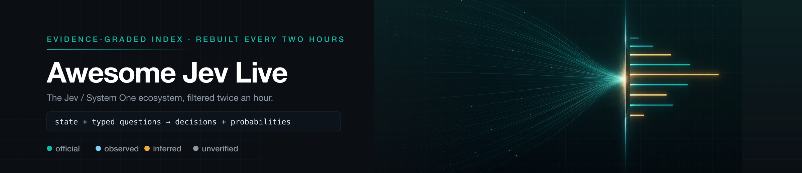
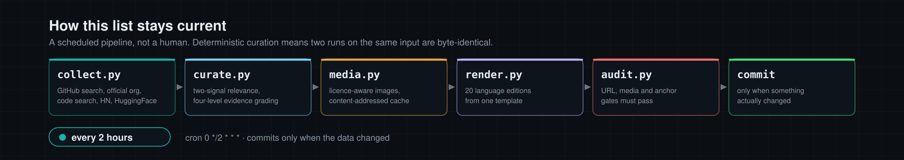

  

<h1 align="center">Awesome Jev Live</h1>

<b>每兩小時自我重建的 Jev 證據分級索引。</b>

  
  
  
  
  
  

<a href="../README.md">English</a> · <a href="README.zh-CN.md">简体中文</a> · <b>繁體中文</b> · <a href="README.ja.md">日本語</a> · <a href="README.ko.md">한국어</a> · <a href="README.es.md">Español</a> · <a href="README.fr.md">Français</a> · <a href="README.de.md">Deutsch</a> · <a href="README.pt-BR.md">Português (Brasil)</a> · <a href="README.ru.md">Русский</a> · <a href="README.it.md">Italiano</a> · <a href="README.ar.md">العربية</a> · <a href="README.hi.md">हिन्दी</a> · <a href="README.tr.md">Türkçe</a> · <a href="README.vi.md">Tiếng Việt</a> · <a href="README.th.md">ไทย</a> · <a href="README.id.md">Bahasa Indonesia</a> · <a href="README.pl.md">Polski</a> · <a href="README.nl.md">Nederlands</a> · <a href="README.uk.md">Українська</a>

> [!NOTE]
> **即時索引** · 上次同步: `2026-09-21T16:41:19+08:00` (UTC+8)
> · 條目: **703** · 本輪新增: **22** · 實作語言: **24**

以下每個條目都由本儲存庫的管線收集、篩選並複查。數字與時間戳記均來自資料來源，而非手工撰寫的快照。

## 🔥 本期精選 · 各領域第一名

每個領域取一名，依證據等級與 Star 數排名，每次同步重新計算。這是排名而非推薦；每個精選都連到下方的完整條目。優先選擇發佈了截圖或錄影的專案，以保證版面可視化。

<table>
<tr>
<td width="50%" valign="top">
<b>🏛️ <a href="https://github.com/typesafe-ai/skills">typesafe-ai/skills</a></b>
⭐1361 · ✅ official
使用 TypeSafe 的 System One API 進行建置的代理技能
</td>
<td width="50%" valign="top">

<b>🧰 <a href="https://github.com/opaielsheikh/typesafe-migration-guard">opaielsheikh/typesafe-migration-guard</a></b>
⭐2 · TypeScript · 👁️ observed
由 TypeSafe AI（Jev System One 模型）提供支援的自動化資料庫遷移安全審查器
</td>
</tr>
<tr>
<td width="50%" valign="top">

<b>🤖 <a href="https://github.com/gargpratyush/jev-router">gargpratyush/jev-router</a></b>
⭐276 · JavaScript · 🔎 inferred
使用 jev-router 將 claude code 中的工作路由至最便宜的模型
</td>
<td width="50%" valign="top">

<b>🛡️ <a href="https://github.com/tshmieldev/sharp">tshmieldev/sharp</a></b>
⭐29 · TypeScript · 🔎 inferred
使用 Jev 或任何 LLM 篩選你的 x 動態消息
</td>
</tr>
<tr>
<td width="50%" valign="top">

<b>🧪 <a href="https://github.com/ikermoel/open-alternative-jev">ikermoel/open-alternative-jev</a></b>
⭐41 · Python · 👁️ observed
TypeSafe 的 Jev 的開源替代方案：一個 System One 風格的模型層，可在單次前向傳播中，從任何開放權重 LLM（HF + vLLM）提供具型別且經校準的決策，並提供誠實的基準測試
</td>
<td width="50%" valign="top">

<b>🔬 <a href="https://github.com/TianyuCodings/NanoJev">TianyuCodings/NanoJev</a></b>
⭐1641 · Python · 🔎 inferred
Jev 的奈米級複製品：平行決策、動態候選項目，以及端到端訓練管線。
</td>
</tr>
<tr>
<td width="50%" valign="top">

<b>🎮 <a href="https://github.com/zadescoxp/Jev-Trades">zadescoxp/Jev-Trades</a></b>
⭐21 · Python · 👁️ observed
使用全新 TypeSafe AI 首個名為 Jev 的 system one 模型的交易機器人
</td>
<td width="50%" valign="top">
<b>📰 <a href="https://docs.typesafe.ai/model-jaggedness/jev-1.13">9 类已知缺陷（jaggedness）</a></b>
⭐0 · ✅ official
字面理解、**計數不可靠**、日期比較、多級間接、無關細節大 state、對抗內容、指令與 criteria 矛盾、結構性不變量、生成。官方建議「拆成原子問題在程式碼裡組合」。
</td>
</tr>
</table>

## 目錄

- [Jev 是什麼？](#jev-是什麼)
- [條目分級方式](#條目分級方式)
- [官方 SDK 與開發者工具](#官方-sdk-與開發者工具) — **6**
- [社群客戶端、SDK 與轉接器](#社群客戶端sdk-與轉接器) — **112**
- [Agent 工具鏈：MCP、鉤子、閘門與編碼 Agent](#agent-工具鏈mcp鉤子閘門與編碼-agent) — **201**
- [路由、護欄與核准](#路由護欄與核准) — **72**
- [評估、校準與基準測試](#評估校準與基準測試) — **76**
- [開放重現、權重與架構研究](#開放重現權重與架構研究) — **32**
- [應用程式、遊戲、機器人與互動示範](#應用程式遊戲機器人與互動示範) — **54**
- [文章、討論與同類清單](#文章討論與同類清單) — **86**
- [其他專案](#其他專案) — **64**
- [依實作語言劃分的專案](#依實作語言劃分的專案)
- [本清單如何保持最新](#本清單如何保持最新)

## Jev 是什麼？

Jev 是 TypeSafe AI 的第一個 **System One model**。它不寫散文。它接收一個狀態，加上由你事先定義答案空間的問題，並回傳帶有機率分布的型別化數值，讓你的程式碼據以分支。

|                  |                                                                                                                              |
| ---------------- | ---------------------------------------------------------------------------------------------------------------------------- |
| **形態：**       | `state + typed questions` → `constrained answers + probabilities` → `your code`                                              |
| **基本元件：**   | `Choice`（從 ≤255 個選項中選一個）、`Score`（2–10 分的評分規準）、`Noul`（機率化的是／否）                                   |
| **端點：**       | `POST https://api.typesafe.ai/v1/systemone`，模型 `jev-1.13.0` / 別名 `jev-latest`                                           |
| **適合的場景：** | 有界工作流程中的路由、分診、評分、內容審核、驗證與低延遲閘門                                                                 |
| **已知限制：**   | 計數並不可靠，多層間接推理較弱，官方資料列出九類鋸齒狀能力缺口。輸出符合 schema 並不等於判斷正確——請在你自己的資料上做校準。 |

## 條目分級方式

這個領域的大多數清單只宣稱收錄。本清單會說明它究竟驗證到什麼程度，再讓你據此篩選。

| 等級         | 含義                                                                                             |
| ------------ | ------------------------------------------------------------------------------------------------ |
| `official`   | 由 TypeSafe AI 官方發布。                                                                        |
| `observed`   | 可開啟並閱讀的公開產物——真實的原始碼、真實的設定，或儲存庫名稱／主題中明確的 TypeSafe/Jev 宣告。 |
| `inferred`   | 以模糊訊號加上相互印證的用語比對而得，但尚未逐行閱讀。                                           |
| `unverified` | 看似相關，但未經任何獨立確認。僅為便於發現而收錄。                                               |

## 官方 SDK 與開發者工具

全數由 TypeSafe 官方發布。從這裡開始。

🏛️ <b><a href="https://github.com/typesafe-ai/skills">typesafe-ai/skills</a></b> · ⭐1361 · ✅ official · 9 天 · ⭐+12

##### 📝 摘要

使用 TypeSafe 的 System One API 進行建置的代理技能

> 💡 供應商自有的代理技能。由於它持續更新，因此最接近 TypeSafe 如何打算從代理驅動 Jev 的規格。

##### 📌 基本資訊

| 欄位 | 值                      |
| ---- | ----------------------- |
| 分類 | `官方 SDK 與開發者工具` |
| 證據 | `official`              |

##### 📊 資料

| 指標     | 值             |
| -------- | -------------- |
| Star 數  | **1361** (+12) |
| 最近推送 | 2026-09-12     |
| 首次收錄 | 2026-09-18     |

🏛️ <b><a href="https://github.com/typesafe-ai/system-one-adapter-python">typesafe-ai/system-one-adapter-python</a></b> · ⭐216 · Python · ✅ official · 2 天 · ⭐+2

##### 📝 摘要

由 LLM APIs 支援的即插即用 TypeSafeClient 替代品

> 💡 即插即用的替代品，以一般的 LLM 提供者支援相同介面。這是在採用任一方案之前，使用自己的資料，誠實地將具型別的決策與提示詞進行 A/B 測試的方式。

🔧 於程式碼中發現使用: `README.md`

##### 📌 基本資訊

| 欄位 | 值                      |
| ---- | ----------------------- |
| 分類 | `官方 SDK 與開發者工具` |
| 證據 | `official`              |
| 語言 | Python                  |

##### 📊 資料

| 指標     | 值           |
| -------- | ------------ |
| Star 數  | **216** (+2) |
| 最近推送 | 2026-09-18   |
| 首次收錄 | 2026-09-18   |

🏛️ <b><a href="https://github.com/typesafe-ai/typesafe-sdk-js">typesafe-ai/typesafe-sdk-js</a></b> · ⭐194 · TypeScript · ✅ official · 5 天

##### 📝 摘要

適用於 TypeSafe API 的官方 TypeScript/JavaScript 函式庫

> 💡 TypeScript 用戶端會從你提出的問題推斷答案型別，因此不相符的回傳型別會成為編譯錯誤，而非執行階段的意外。

##### 📌 基本資訊

| 欄位 | 值                      |
| ---- | ----------------------- |
| 分類 | `官方 SDK 與開發者工具` |
| 證據 | `official`              |
| 語言 | TypeScript              |

##### 📊 資料

| 指標     | 值         |
| -------- | ---------- |
| Star 數  | **194**    |
| 最近推送 | 2026-09-15 |
| 首次收錄 | 2026-09-18 |

🏛️ <b><a href="https://github.com/typesafe-ai/typesafe-sdk-python">typesafe-ai/typesafe-sdk-python</a></b> · ⭐165 · Python · ✅ official · 2 天

##### 📝 摘要

適用於 TypeSafe API 的官方 Python 函式庫

> 💡 同步與非同步用戶端。從 API 金鑰到具型別決策的最快途徑，也是社群用戶端用來比較的參考實作。

🔧 於程式碼中發現使用: `src/typesafe_sdk/__init__.py`, `src/typesafe_sdk/_core/retry.py`, `src/typesafe_sdk/_core/config.py`, `src/typesafe_sdk/_core/logging.py`

##### 📌 基本資訊

| 欄位 | 值                      |
| ---- | ----------------------- |
| 分類 | `官方 SDK 與開發者工具` |
| 證據 | `official`              |
| 語言 | Python                  |

##### 📊 資料

| 指標     | 值         |
| -------- | ---------- |
| Star 數  | **165**    |
| 最近推送 | 2026-09-18 |
| 首次收錄 | 2026-09-18 |

🏛️ <b><a href="https://github.com/TypeSafeAI/clarity-judge">TypeSafeAI/clarity-judge</a></b> · ⭐2 · TypeScript · ✅ official · 0 天

##### 📝 摘要

Multi-axis writing quality checker powered by TypeSafe AI's Jev model. Separate named checks, each with its own verdict and confidence.

##### 📌 基本資訊

| 欄位 | 值                      |
| ---- | ----------------------- |
| 分類 | `官方 SDK 與開發者工具` |
| 證據 | `official`              |
| 語言 | TypeScript              |

##### 📊 資料

| 指標     | 值         |
| -------- | ---------- |
| Star 數  | **2**      |
| 最近推送 | 2026-09-21 |
| 首次收錄 | 2026-09-21 |

🏷 `jev` · `nextjs` · `typesafe` · `typescript` · `writing`

🏛️ <b><a href="https://github.com/typesafe-ai/typesafe-ai.github.io">typesafe-ai/typesafe-ai.github.io</a></b> · ⭐1 · HTML · ✅ official · 108 天

##### 📝 摘要

上游未發布說明。

##### 📌 基本資訊

| 欄位 | 值                      |
| ---- | ----------------------- |
| 分類 | `官方 SDK 與開發者工具` |
| 證據 | `official`              |
| 語言 | HTML                    |

##### 📊 資料

| 指標     | 值         |
| -------- | ---------- |
| Star 數  | **1**      |
| 最近推送 | 2026-06-04 |
| 首次收錄 | 2026-09-18 |

## 社群客戶端、SDK 與轉接器

針對 System One 端點的型別化客戶端，涵蓋社群已經著手的各種語言。

🧰 <b><a href="https://github.com/jexp/neo4jev">jexp/neo4jev</a></b> · ⭐57 · Jupyter · 👁️ observed · 2 天 · ⭐+1

##### 📝 摘要

Typesafe.ai System One Model Jev 透過使用相鄰關係分類器瀏覽 Neo4j 圖譜

##### 📌 基本資訊

| 欄位 | 值                         |
| ---- | -------------------------- |
| 分類 | `社群客戶端、SDK 與轉接器` |
| 證據 | `observed`                 |
| 語言 | Jupyter                    |

##### 📊 資料

| 指標     | 值          |
| -------- | ----------- |
| Star 數  | **57** (+1) |
| 最近推送 | 2026-09-18  |
| 首次收錄 | 2026-09-18  |

🧰 <b><a href="https://github.com/ckaraca/awesome-jev">ckaraca/awesome-jev</a></b> · ⭐8 · Python · 👁️ observed · 0 天

##### 📝 摘要

精選的工具、整合與實驗清單，皆建構於 Jev（TypeSafe AI 的 System One 模型）之上，用於快速、具型別的決策。

##### 📌 基本資訊

| 欄位 | 值                         |
| ---- | -------------------------- |
| 分類 | `社群客戶端、SDK 與轉接器` |
| 證據 | `observed`                 |
| 語言 | Python                     |

##### 📊 資料

| 指標     | 值         |
| -------- | ---------- |
| Star 數  | **8**      |
| 最近推送 | 2026-09-20 |
| 首次收錄 | 2026-09-19 |

🏷 `ai-agents` · `awesome` · `awesome-list` · `computer-use` · `jev` · `llm` · `system-one` · `typesafe`

🧰 <b><a href="https://github.com/AkashPriyadarshii/jev-curate">AkashPriyadarshii/jev-curate</a></b> · ⭐7 · Rust · 👁️ observed · 0 天 · ⭐+1

##### 📝 摘要

由 TypeSafe AI Jev（api.typesafe.ai）驅動的高吞吐量合成與預訓練資料集篩選器。使用 System One 具型別決策（Choice、Score、Noul），以每秒 1,500 列以上的速度串流、篩選並評分 Parquet 與 JSONL 資料集。

##### 📌 基本資訊

| 欄位 | 值                         |
| ---- | -------------------------- |
| 分類 | `社群客戶端、SDK 與轉接器` |
| 證據 | `observed`                 |
| 語言 | Rust                       |

##### 📊 資料

| 指標     | 值         |
| -------- | ---------- |
| Star 數  | **7** (+1) |
| 最近推送 | 2026-09-21 |
| 首次收錄 | 2026-09-18 |

🏷 `arrow` · `cli` · `data-cleaning` · `data-engineering` · `dataset-curation` · `eval-harness` · `fine-tuning` · `jev`

🧰 <b><a href="https://github.com/MrJev/awesome-jev">MrJev/awesome-jev</a></b> · ⭐7 · Python · 👁️ observed · 0 天 · ⭐+1

##### 📝 摘要

為 Jev、TypeSafe AI 的 System One 模型整理的專案、整合與資源清單。

##### 📌 基本資訊

| 欄位 | 值                         |
| ---- | -------------------------- |
| 分類 | `社群客戶端、SDK 與轉接器` |
| 證據 | `observed`                 |
| 語言 | Python                     |

##### 📊 資料

| 指標     | 值         |
| -------- | ---------- |
| Star 數  | **7** (+1) |
| 最近推送 | 2026-09-21 |
| 首次收錄 | 2026-09-18 |

🏷 `ai-agents` · `awesome` · `awesome-list` · `jev` · `mcp` · `typesafe`

🧰 <b><a href="https://github.com/nshkrdotcom/typesafe_sdk">nshkrdotcom/typesafe_sdk</a></b> · ⭐5 · Elixir · 👁️ observed · 1 天

##### 📝 摘要

官方 TypeScript AI SDK（ai / ai-sdk）的慣用、型別安全 Elixir 移植版（提供統一的 LLM 整合、串流文字與結構化輸出、工具呼叫及 agent 工作流程）。Jev 是其目前的旗艦模型，也是第一個 System One 模型。

##### 📌 基本資訊

| 欄位 | 值                         |
| ---- | -------------------------- |
| 分類 | `社群客戶端、SDK 與轉接器` |
| 證據 | `observed`                 |
| 語言 | Elixir                     |

##### 📊 資料

| 指標     | 值         |
| -------- | ---------- |
| Star 數  | **5**      |
| 最近推送 | 2026-09-20 |
| 首次收錄 | 2026-09-18 |

🏷 `agents` · `ai` · `ai-sdk` · `artificial-intelligence` · `elixir` · `function-calling` · `generative-ai` · `jev`

🧰 <b><a href="https://github.com/xingwudao/OpenJev">xingwudao/OpenJev</a></b> · ⭐5 · Python · 👁️ observed · 2 天

##### 📝 摘要

OpenJev：受 Jev 啟發、基於 TypeSafe.ai 概念的獨立 System One 決策 API。Choice、分數與 noul 原語、本機模擬伺服器、Python 與 TypeScript SDKs。已規劃實際推論；與 TypeSafe AI 無關聯。

##### 📌 基本資訊

| 欄位 | 值                         |
| ---- | -------------------------- |
| 分類 | `社群客戶端、SDK 與轉接器` |
| 證據 | `observed`                 |
| 語言 | Python                     |

##### 📊 資料

| 指標     | 值         |
| -------- | ---------- |
| Star 數  | **5**      |
| 最近推送 | 2026-09-18 |
| 首次收錄 | 2026-09-18 |

🏷 `ai-guardrails` · `classification` · `decision-api` · `jev` · `mock-server` · `openjev` · `probabilistic-inference` · `python-sdk`

🧰 <b><a href="https://github.com/kisshan13/typesafe-ai-go">kisshan13/typesafe-ai-go</a></b> · ⭐4 · Go · 👁️ observed · 0 天

##### 📝 摘要

由社群維護、用於 TypeSafe AI System One 評估 API 的 Go SDK，具備型別化問題、流暢建構器、重試與範例。

##### 📌 基本資訊

| 欄位 | 值                         |
| ---- | -------------------------- |
| 分類 | `社群客戶端、SDK 與轉接器` |
| 證據 | `observed`                 |
| 語言 | Go                         |

##### 📊 資料

| 指標     | 值         |
| -------- | ---------- |
| Star 數  | **4**      |
| 最近推送 | 2026-09-20 |
| 首次收錄 | 2026-09-21 |

🏷 `ai` · `jev` · `jev-go-sdk` · `sdk-go` · `structured-output` · `system-one-models` · `typesafe-ai`

🧰 <b><a href="https://github.com/Premo-Cloud/typesafe-sdk-java">Premo-Cloud/typesafe-sdk-java</a></b> · ⭐3 · Java · 👁️ observed · 1 天

##### 📝 摘要

適用於 TypeSafe System One API 的社群 Java 用戶端（非官方）

##### 📌 基本資訊

| 欄位 | 值                         |
| ---- | -------------------------- |
| 分類 | `社群客戶端、SDK 與轉接器` |
| 證據 | `observed`                 |
| 語言 | Java                       |

##### 📊 資料

| 指標     | 值         |
| -------- | ---------- |
| Star 數  | **3**      |
| 最近推送 | 2026-09-19 |
| 首次收錄 | 2026-09-18 |

🏷 `java` · `jev` · `sdk` · `spring-boot` · `system-one` · `system-one-models` · `typesafe`

🧰 <b><a href="https://github.com/opaielsheikh/typesafe-migration-guard">opaielsheikh/typesafe-migration-guard</a></b> · ⭐2 · TypeScript · 👁️ observed · 4 天

##### 📝 摘要

由 TypeSafe AI（Jev System One 模型）提供支援的自動化資料庫遷移安全審查器

##### 📌 基本資訊

| 欄位 | 值                         |
| ---- | -------------------------- |
| 分類 | `社群客戶端、SDK 與轉接器` |
| 證據 | `observed`                 |
| 語言 | TypeScript                 |

##### 📊 資料

| 指標     | 值         |
| -------- | ---------- |
| Star 數  | **2**      |
| 最近推送 | 2026-09-17 |
| 首次收錄 | 2026-09-18 |

---

<table><tr><th align="center" width="50%">🖼 圖片</th><th align="center" width="50%">🎬 影片</th></tr><tr>
<td align="center" valign="top"></td>
<td align="center" valign="top">未發布媒體</td>
</tr></table>

由於上游未宣告再散布授權，資源直接連結至上游儲存庫。

🧰 <b><a href="https://github.com/ajaman190/lumen">ajaman190/lumen</a></b> · ⭐1 · Python · 👁️ observed · 0 天

##### 📝 摘要

Open-source System One decision model built on Qwen3.5. Lumen leverages mixture-of-LoRA adapters, conformal prediction, and block-causal attention to deliver highly calibrated, multi-format decisions (discrete, ordinal, binary) optimized with focal PSR loss.

##### 📌 基本資訊

| 欄位 | 值                         |
| ---- | -------------------------- |
| 分類 | `社群客戶端、SDK 與轉接器` |
| 證據 | `observed`                 |
| 語言 | Python                     |

##### 📊 資料

| 指標     | 值         |
| -------- | ---------- |
| Star 數  | **1**      |
| 最近推送 | 2026-09-21 |
| 首次收錄 | 2026-09-21 |

🏷 `conformal-prediction` · `jev-alternative` · `system-one-model`

🧰 <b><a href="https://github.com/Barneyjm/decision-circuits">Barneyjm/decision-circuits</a></b> · ⭐1 · Python · 👁️ observed · 0 天

##### 📝 摘要

決策電路：向 System One 模型提出具型別的問題，取得校準後的機率，並在程式碼中設定閘門。零相依性的 Python SDK，整合 LangChain、OpenAI Agents 與 Claude Agent SDK。

##### 📌 基本資訊

| 欄位 | 值                         |
| ---- | -------------------------- |
| 分類 | `社群客戶端、SDK 與轉接器` |
| 證據 | `observed`                 |
| 語言 | Python                     |

##### 📊 資料

| 指標     | 值         |
| -------- | ---------- |
| Star 數  | **1**      |
| 最近推送 | 2026-09-21 |
| 首次收錄 | 2026-09-20 |

🏷 `agents` · `calibration` · `decision-circuits` · `guardrails` · `langchain` · `llm` · `python` · `system-one`

🧰 <b><a href="https://github.com/clouatre-labs/decisions-judge-mcp">clouatre-labs/decisions-judge-mcp</a></b> · ⭐1 · JavaScript · 👁️ observed · 0 天

##### 📝 摘要

Typed decisions for AI agents as an MCP tool: yes/no probability (noul), choice, and score in one fast request. Backed by the TypeSafe System One model.

##### 📌 基本資訊

| 欄位 | 值                         |
| ---- | -------------------------- |
| 分類 | `社群客戶端、SDK 與轉接器` |
| 證據 | `observed`                 |
| 語言 | JavaScript                 |

##### 📊 資料

| 指標     | 值         |
| -------- | ---------- |
| Star 數  | **1**      |
| 最近推送 | 2026-09-21 |
| 首次收錄 | 2026-09-21 |

🏷 `agent` · `ai` · `cli` · `decision-making` · `decisions` · `judge` · `llm` · `mcp`

🧰 <b><a href="https://github.com/LeddoEngano/jev-eyes">LeddoEngano/jev-eyes</a></b> · ⭐1 · Python · 👁️ observed · 0 天

##### 📝 摘要

Give Jev eyes — honest, local image perception for TypeSafe's text-only System One model. OCR + spatial layout → Jev state. CLI, MCP server, agent skill.

##### 📌 基本資訊

| 欄位 | 值                         |
| ---- | -------------------------- |
| 分類 | `社群客戶端、SDK 與轉接器` |
| 證據 | `observed`                 |
| 語言 | Python                     |

##### 📊 資料

| 指標     | 值         |
| -------- | ---------- |
| Star 數  | **1**      |
| 最近推送 | 2026-09-20 |
| 首次收錄 | 2026-09-20 |

🏷 `ai-agents` · `classifier` · `computer-vision` · `jev` · `mcp` · `ocr` · `python` · `system-one`

---

<table><tr><th align="center" width="50%">🖼 圖片</th><th align="center" width="50%">🎬 影片</th></tr><tr>
<td align="center" valign="top"></td>
<td align="center" valign="top"> 動態錄影</td>
</tr></table>

🧰 <b><a href="https://github.com/OpenByteInc/QuantDinger">OpenByteInc/QuantDinger</a></b> · ⭐11873 · Python · 🔎 inferred · 0 天 · ⭐+1

##### 📝 摘要

開源 AI 交易作業系統、代理交易與氛圍交易，整合 Jev System One。研究、建構 Python 策略，並在加密貨幣、股票與外匯市場進行回測及模擬／實盤交易。推出你自己的多租戶交易 SaaS，內建使用者管理、計費、付款與結算功能。

##### 📌 基本資訊

| 欄位 | 值                         |
| ---- | -------------------------- |
| 分類 | `社群客戶端、SDK 與轉接器` |
| 證據 | `inferred`                 |
| 語言 | Python                     |

##### 📊 資料

| 指標     | 值             |
| -------- | -------------- |
| Star 數  | **11873** (+1) |
| 最近推送 | 2026-09-21     |
| 首次收錄 | 2026-09-20     |

🏷 `agent` · `alpaca` · `backtesting` · `binance` · `crypto` · `exchange` · `finance` · `fintech`

---

<table><tr><th align="center" width="50%">🖼 圖片</th><th align="center" width="50%">🎬 影片</th></tr><tr>
<td align="center" valign="top"></td>
<td align="center" valign="top">未發布媒體</td>
</tr></table>

🧰 <b><a href="https://github.com/AboveColin/HA-Jev">AboveColin/HA-Jev</a></b> · ⭐39 · Python · 🔎 inferred · 0 天

##### 📝 摘要

問你的房子一個問題，取得一個數字回來。TypeSafe Jev 的 Home Assistant 整合：以感測器形式提供型別化答案、供自動化使用的四個動作，以及 Assist 的對話代理。

##### 📌 基本資訊

| 欄位 | 值                         |
| ---- | -------------------------- |
| 分類 | `社群客戶端、SDK 與轉接器` |
| 證據 | `inferred`                 |
| 語言 | Python                     |

##### 📊 資料

| 指標     | 值         |
| -------- | ---------- |
| Star 數  | **39**     |
| 最近推送 | 2026-09-21 |
| 首次收錄 | 2026-09-18 |

🏷 `ai` · `assist` · `conversation` · `custom-components` · `decision-model` · `hacs` · `home-assistant` · `home-automation`

---

<table><tr><th align="center" width="50%">🖼 圖片</th><th align="center" width="50%">🎬 影片</th></tr><tr>
<td align="center" valign="top"></td>
<td align="center" valign="top">未發布媒體</td>
</tr></table>

🧰 <b><a href="https://github.com/tacticocc/Jevbridge">tacticocc/Jevbridge</a></b> · ⭐33 · TypeScript · 🔎 inferred · 0 天

##### 📝 摘要

ACP 與 MCP 轉接器，將 TypeSafe Jev 與任何 LLM 橋接——電腦使用與型別化決策，並與 Codex、Claude、Grok 和 OpenCode 並行。

##### 📌 基本資訊

| 欄位 | 值                         |
| ---- | -------------------------- |
| 分類 | `社群客戶端、SDK 與轉接器` |
| 證據 | `inferred`                 |
| 語言 | TypeScript                 |

##### 📊 資料

| 指標     | 值         |
| -------- | ---------- |
| Star 數  | **33**     |
| 最近推送 | 2026-09-20 |
| 首次收錄 | 2026-09-19 |

🏷 `acp` · `agent` · `claude` · `computer-use` · `grok` · `jev` · `llm` · `opencode`

---

<table><tr><th align="center" width="50%">🖼 圖片</th><th align="center" width="50%">🎬 影片</th></tr><tr>
<td align="center" valign="top"></td>
<td align="center" valign="top">未發布媒體</td>
</tr></table>

🧰 <b><a href="https://github.com/myc0576/SmartMoney-Cub">myc0576/SmartMoney-Cub</a></b> · ⭐25 · Python · 🔎 inferred · 0 天

##### 📝 摘要

唯讀交易日誌與審查工具：Jev 具型別判斷、代理整合，以及可重現的金融基準測試。不下單，不提供建議。

##### 📌 基本資訊

| 欄位 | 值                         |
| ---- | -------------------------- |
| 分類 | `社群客戶端、SDK 與轉接器` |
| 證據 | `inferred`                 |
| 語言 | Python                     |

##### 📊 資料

| 指標     | 值         |
| -------- | ---------- |
| Star 數  | **25**     |
| 最近推送 | 2026-09-21 |
| 首次收錄 | 2026-09-20 |

🏷 `ai-agent` · `ai-agents` · `backtesting` · `decision-logging` · `deepseek-harness` · `dsh-plugin` · `financial-analysis` · `human-in-the-loop`

---

<table><tr><th align="center" width="50%">🖼 圖片</th><th align="center" width="50%">🎬 影片</th></tr><tr>
<td align="center" valign="top"></td>
<td align="center" valign="top">未發布媒體</td>
</tr></table>

🧰 <b><a href="https://github.com/CheshiAI/Cheshi">CheshiAI/Cheshi</a></b> · ⭐18 · C · 🔎 inferred · 0 天

##### 📝 摘要

由 Jev 驅動的對話記憶：尋找過去的工作階段，並以原始來源重新檢視決策。適用於 OpenAI Codex 的 macOS 工作區。在單一應用程式中管理 AI 對話與代理、使用 CodeGraph 探索程式碼，並搭配 Git、Ghostty 終端機與 Apple Notes 工作。

##### 📌 基本資訊

| 欄位 | 值                         |
| ---- | -------------------------- |
| 分類 | `社群客戶端、SDK 與轉接器` |
| 證據 | `inferred`                 |
| 語言 | C                          |

##### 📊 資料

| 指標     | 值         |
| -------- | ---------- |
| Star 數  | **18**     |
| 最近推送 | 2026-09-20 |
| 首次收錄 | 2026-09-20 |

🏷 `agent-orchestration` · `ai-agents` · `ai-coding-assistant` · `ai-memory` · `apple-notes` · `code-search` · `codegraph` · `codex`

---

<table><tr><th align="center" width="50%">🖼 圖片</th><th align="center" width="50%">🎬 影片</th></tr><tr>
<td align="center" valign="top"></td>
<td align="center" valign="top">未發布媒體</td>
</tr></table>

🧰 <b><a href="https://github.com/shiftynick/jev-axi">shiftynick/jev-axi</a></b> · ⭐17 · TypeScript · 🔎 inferred · 1 天

##### 📝 摘要

適合代理使用的 CLI，用於 TypeSafe 的 Jev：從 shell 取得快速校準判斷（挑選、評分、檢查、排名、分流、防護）

##### 📌 基本資訊

| 欄位 | 值                         |
| ---- | -------------------------- |
| 分類 | `社群客戶端、SDK 與轉接器` |
| 證據 | `inferred`                 |
| 語言 | TypeScript                 |

##### 📊 資料

| 指標     | 值         |
| -------- | ---------- |
| Star 數  | **17**     |
| 最近推送 | 2026-09-19 |
| 首次收錄 | 2026-09-18 |

🏷 `agent-safety` · `ai-agents` · `axi` · `claude-code` · `claude-code-hooks` · `cli` · `codex` · `developer-tools`

---

<table><tr><th align="center" width="50%">🖼 圖片</th><th align="center" width="50%">🎬 影片</th></tr><tr>
<td align="center" valign="top"></td>
<td align="center" valign="top"> 動態錄影</td>
</tr></table>

🧰 <b><a href="https://github.com/utk2103/jev-studio">utk2103/jev-studio</a></b> · ⭐13 · Python · 🔎 inferred · 0 天

##### 📝 摘要

如果你正在嘗試 jev，從這裡開始會更容易

##### 📌 基本資訊

| 欄位 | 值                         |
| ---- | -------------------------- |
| 分類 | `社群客戶端、SDK 與轉接器` |
| 證據 | `inferred`                 |
| 語言 | Python                     |

##### 📊 資料

| 指標     | 值         |
| -------- | ---------- |
| Star 數  | **13**     |
| 最近推送 | 2026-09-21 |
| 首次收錄 | 2026-09-20 |

🏷 `cli` · `jev` · `mcp` · `typesafe-ai`

---

<table><tr><th align="center" width="50%">🖼 圖片</th><th align="center" width="50%">🎬 影片</th></tr><tr>
<td align="center" valign="top"></td>
<td align="center" valign="top">未發布媒體</td>
</tr></table>

🧰 <b><a href="https://github.com/Ray-Hughes/jevalyn">Ray-Hughes/jevalyn</a></b> · ⭐12 · Ruby · 🔎 inferred · 0 天

##### 📝 摘要

Rails 應用程式的決策層。圍繞 TypeSafe 的 Jev System One API 建構的 Rails 原生包裝器：在你的控制流程中提供具型別、經校準的決策。

##### 📌 基本資訊

| 欄位 | 值                         |
| ---- | -------------------------- |
| 分類 | `社群客戶端、SDK 與轉接器` |
| 證據 | `inferred`                 |
| 語言 | Ruby                       |

##### 📊 資料

| 指標     | 值         |
| -------- | ---------- |
| Star 數  | **12**     |
| 最近推送 | 2026-09-21 |
| 首次收錄 | 2026-09-20 |

🏷 `decision-model` · `jev` · `llm` · `rails` · `ruby` · `rubygem` · `typesafe-ai`

---

<table><tr><th align="center" width="50%">🖼 圖片</th><th align="center" width="50%">🎬 影片</th></tr><tr>
<td align="center" valign="top"></td>
<td align="center" valign="top">未發布媒體</td>
</tr></table>

🧰 <b><a href="https://github.com/frostney/clean-code-review">frostney/clean-code-review</a></b> · ⭐7 · TypeScript · 🔎 inferred · 0 天

##### 📝 摘要

pull request 中的每個程式碼檔案，由 TypeSafe 的 Jev 依據 Uncle Bob 的 Clean Code 進行評判，然後由 Luna 審查。建構於 eve 和 Next.js 之上。

##### 📌 基本資訊

| 欄位 | 值                         |
| ---- | -------------------------- |
| 分類 | `社群客戶端、SDK 與轉接器` |
| 證據 | `inferred`                 |
| 語言 | TypeScript                 |

##### 📊 資料

| 指標     | 值         |
| -------- | ---------- |
| Star 數  | **7**      |
| 最近推送 | 2026-09-21 |
| 首次收錄 | 2026-09-21 |

🏷 `agents` · `ai` · `ai-gateway` · `ai-sdk` · `clean-code` · `code-quality` · `code-review` · `developer-tools`

---

<table><tr><th align="center" width="50%">🖼 圖片</th><th align="center" width="50%">🎬 影片</th></tr><tr>
<td align="center" valign="top"></td>
<td align="center" valign="top">未發布媒體</td>
</tr></table>

<b>本分類更多項目</b> · 90

- [dtheofr/typesafe-jev-ruby](https://github.com/dtheofr/typesafe-jev-ruby) - Ruby client for Jev, TypeSafe。
- [jqueryscript/awesome-jev](https://github.com/jqueryscript/awesome-jev) - A curated list of TypeSafe Jev resources, SDKs, agents, MCP servers…
- [Coditan/system-one-axi](https://github.com/Coditan/system-one-axi) - Unofficial AXI-style CLI for TypeSafe System One models, including Jev.
- [GitHub30/OpenJev](https://github.com/GitHub30/OpenJev) - Open-weight System One model (Jev-compatible): calibrated noul / choice / score…
- [SC0d3r/jev-systemone](https://github.com/SC0d3r/jev-systemone) - Typed TypeScript client for Jev System One models, Choice, Score &amp; Noul…
- [Tango-Tango/ex_typesafe](https://github.com/Tango-Tango/ex_typesafe) - An Elixir SDK for Typesafe。
- [thomasbrueggemann/jeffrey](https://github.com/thomasbrueggemann/jeffrey) - A coding agent CLI where Jev (TypeSafe System One) or Laya decide what to do…
- [realZachi/pg-jev](https://github.com/realZachi/pg-jev) - 以自然語言詢問你的 Postgres 資料表問題。由 TypeSafe 的 Jev 驅動的 PostgreSQL 擴充功能.
- [sutro-sh/jev-align](https://github.com/sutro-sh/jev-align) - 使用 Jev 和 GEPA，從人類回饋建構經校準的 AI Functions.
- [juspay/neurolink](https://github.com/juspay/neurolink) - 一個 TypeScript 介面，支援三種推論類型的 40 個 AI 供應商——generate、stream 和 decide.
- [Ying-Kai-Liao/jev-browser](https://github.com/Ying-Kai-Liao/jev-browser) - 瀏覽器自動化，其中 LLM 負責規劃，Jev（Typesafe System One）負責決策。程式庫、CLI 與 MCP 伺服器.
- [yzfly/awesome-jev-zh](https://github.com/yzfly/awesome-jev-zh) - Jev / TypeSafe System One 中文精選列表：官方資料、SDK、熱門應用程式、Agent…
- [pinecone-io/cultivar](https://github.com/pinecone-io/cultivar) - 使用 cultivar 在沙盒中並跨不同代理執行，以測試你的 Agent Skills 與 Docs.
- [burnigtm/jev-mcp](https://github.com/burnigtm/jev-mcp) - 將 TypeSafe Jev 帶入 Cursor、Codex 與任何 MCP 用戶端編碼迴圈的 MCP 伺服器。
- [win4r/jev-skill-suggester](https://github.com/win4r/jev-skill-suggester) - 使用 TypeSafe Jev 推薦已安裝 Skill / 使用 TypeSafe Jev 的有界已安裝 Skill 推薦.
- [fazlerocks/jevmail](https://github.com/fazlerocks/jevmail) - 適用於 Gmail 的開源 AI 電子郵件分流。透過 Vercel AI Gateway，使用 Jev、TypeSafe AI…
- [AkashPriyadarshii/jev-seo](https://github.com/AkashPriyadarshii/jev-seo) - 在 Rust 中，透過 DuckDuckGo 與 TypeSafe Jev System One 取代 Semrush 與 OpenSEO 的 100% 免費…
- [dannote/jev](https://github.com/dannote/jev) - 用於 OTP 的 TypeSafe Jev：從 GenServer 回覆 Jev，並對其答案進行模式比對。
- [danvega/jev-spring-boot-starter](https://github.com/danvega/jev-spring-boot-starter) - 一個簡單的 Spring Boot 4 starter，用於使用 Spring MVC 和 RestClient 的 TypeSafe Jev。
- [Nasrallah-AL/jev-cli](https://github.com/Nasrallah-AL/jev-cli) - 用於 TypeSafe 的 Jev AI 模型的命令列工具。
- [keltokhy/jgrep](https://github.com/keltokhy/jgrep) - grep，但模式是一段描述。使用 TypeSafe 的 Jev 決策模型按意義過濾行：每行約 200 ms，成本為一美分的千分之一.
- [sharziki/semdecide](https://github.com/sharziki/semdecide) - 由 TypeSafe AI Jev 驅動，為 Unix pipelines 和 CI 提供具型別的語意決策.
- [AkashPriyadarshii/jev-superpowers](https://github.com/AkashPriyadarshii/jev-superpowers) - 為 AI 編碼代理打造的系統化軟體開發框架，透過 TypeSafe Jev System One 型別化決策升級。
- [qkal/Canny](https://github.com/qkal/Canny) - 阻止 AI coding agents 在沒有證據的情況下聲稱工作已完成。決定性 hooks 做出決策，TypeSafe 的 Jev 提供建議.
- [himomohi/aside-jev](https://github.com/himomohi/aside-jev) - Aside 代理使用 TypeSafe Jev（System One：Choice/Score/Noul）進行決策.
- [shaharia-lab/jev-cli](https://github.com/shaharia-lab/jev-cli) - 用於 TypeSafe AI 的 Jev 模型的命令列工具。針對任何文字提出是非題、選擇題與評分規準問題，並取得校準後的機率.
- [saibimajdi/typesafeai-dotnet-sdk](https://github.com/saibimajdi/typesafeai-dotnet-sdk) - 用於 TypeSafe AI System One API 的社群 .NET SDK——以具型別方式提出 noul、choice 與 score…
- [carlosedm10/agi-jev-containment](https://github.com/carlosedm10/agi-jev-containment) - AGI JEV Detection — 本機 AI agent 監控器：鏈級惡意 agent 偵測（TypeSafe Jev + Sentinel）、僅升級式…
- [docxology/daf-jev](https://github.com/docxology/daf-jev) - daf-jev：適用於 TypeSafe 的 Jev（System One）決策 API 的可組合 Python…
- [tontoko/jev-browser](https://github.com/tontoko/jev-browser) - 一個有根據的 Jev/Playwright 核心：具型別的 SDK、持久化的 CLI，以及具備原生瀏覽器操作和確定性斷言的 MCP 伺服器.
- [Gaurav-Gosain/jev-go](https://github.com/Gaurav-Gosain/jev-go) - 適用於 TypeSafe 的 Go 用戶端，支援其 System One API 及其模型 Jev：使用具型別判斷與經校準的機率，而非生成文字。
- [Olti1947/jev-java](https://github.com/Olti1947/jev-java) - 適用於 TypeSafe AI Jev System One 決策引擎的慣用 Java SDK。
- [Stumble/jev-go](https://github.com/Stumble/jev-go) - 適用於 TypeSafe AI Jev / System One 的社群 Go SDK。
- [AboveColin/jevclient](https://github.com/AboveColin/jevclient) - 適用於 TypeSafe Jev 的非同步 Python 用戶端。輸入具型別的問題，輸出機率與選項，無需解析散文.
- [AkashPriyadarshii/jev-git](https://github.com/AkashPriyadarshii/jev-git) - Sub-second Git pre-commit &amp; pre-push semantic reflex gate powered by TypeSafe…
- [AkashPriyadarshii/jev-scout](https://github.com/AkashPriyadarshii/jev-scout) - 由 TypeSafe AI Jev System One 評分驅動的零幻覺開源儲存庫與 crate 探索器。
- [brnyxx/jev-ra](https://github.com/brnyxx/jev-ra) - Browser use for coding agents, 3-5x faster than browser-use. MCP server + CLI;
- [Butochnikov/laravel-typesafe-jev](https://github.com/Butochnikov/laravel-typesafe-jev) - 適用於 TypeSafe Jev AI 的非官方 Laravel 整合，具備型別化回應、非同步請求、限定範圍的相依性注入與測試替身.
- [replynodes/jev-web-analyzer](https://github.com/replynodes/jev-web-analyzer) - See what Jev thinks about your SaaS website — powered by ReplyNodes web context…
- [typakon4/jev-layer](https://github.com/typakon4/jev-layer) - 適用於代理程式 harness 的可攜式 System-1 決策層，具備由主機掌控的路由、收據、重播與失敗開放整合.
- [gordan-code/jev-metrics](https://github.com/gordan-code/jev-metrics) - 用 TypeSafe Jev 给 AI coding agent 做持续代码质量 review 的校准审计层.
- [JoacoMarc/jev-harness-router](https://github.com/JoacoMarc/jev-harness-router) - Per-turn router for agent harnesses: one 350ms Jev call picks the model tier…
- [logicrw/ask-jev](https://github.com/logicrw/ask-jev) - Ultra-fast, fail-open advisory decisions and verbatim extractive reading view…
- [MattiooFR/mcp-server-jev](https://github.com/MattiooFR/mcp-server-jev) - Typed AI decisions for Codex, Claude and any MCP client, powered by TypeSafe…
- [mukiwu/jev-search-mcp](https://github.com/mukiwu/jev-search-mcp) - Jev Search as an MCP server, Claude Code plugin and CLI.
- [nekowasabi/jev-routing](https://github.com/nekowasabi/jev-routing) - 適用於 Claude Code、Codex 與 Grok Build 的 Go Jev 測試架構。不使用 npx。不是 MCP 伺服器.
- [RevocGG/typesafe-jev-bridge](https://github.com/RevocGG/typesafe-jev-bridge) - Use the TypeSafe Jev decision model (System One) anywhere: zero-dependency…
- [vercel-labs/jev-ai-sdk-form-router](https://github.com/vercel-labs/jev-ai-sdk-form-router) - Route form submissions to the right people with Jev and AI SDK.
- [zhirschtritt/typesafe-go](https://github.com/zhirschtritt/typesafe-go) - 適用於 TypeSafe AI API 的慣用 Go SDK。
- [33Audits/jev-auto](https://github.com/33Audits/jev-auto) - Claude Code 的逐回合模型路由。能完成工作的最便宜層級，不需要 API 金鑰，並會根據實際發生的情況自行校準.
- [abhisheksharma001/jev-skill](https://github.com/abhisheksharma001/jev-skill) - Agent skill for TypeSafe AI。
- [Akashdb5/jev-sql-guard](https://github.com/Akashdb5/jev-sql-guard) - Real-time SQL guardrail and CI linter that detects unsafe writes, unbounded…
- [Alpha-Harper-Franklin/jev-multimodal](https://github.com/Alpha-Harper-Franklin/jev-multimodal) - Jev + Multimodal: shared visual decisions, evidence adapters, source audits and…
- [ashishakkumar/Jev-Checkpoint](https://github.com/ashishakkumar/Jev-Checkpoint) - A local MCP server that uses TypeSafe Jev to confidence-gate an AI agent。
- [bcivitcioglu/jev-chess](https://github.com/bcivitcioglu/jev-chess) - Two AI models play chess. One picks from the legal moves and cannot play an…
- [ChristianTracy/jev-terrarium-dinosaurs](https://github.com/ChristianTracy/jev-terrarium-dinosaurs) - Autonomous dinosaur ecosystem where code runs the physics and TypeSafe。
- [chy4pro/jev-realtime-sdk](https://github.com/chy4pro/jev-realtime-sdk) - Continuous actions driven by TypeSafe Jev: a code-owned inner tick, a Jev-owned…
- [codebam/jev-guardrails](https://github.com/codebam/jev-guardrails) - Jev-backed guardrails for agent tool calls: library, native…
- [dangquan1402/jev-extract](https://github.com/dangquan1402/jev-extract) - Paragraph information extraction using TypeSafe AI Jev — closed-set extractive…
- [EmilianoVeron/jev-skill](https://github.com/EmilianoVeron/jev-skill) - A Claude Code skill for TypeSafe。
- [FlorianRiquelme/jev-kit](https://github.com/FlorianRiquelme/jev-kit) - Typed client and benchmark harness for Jev, TypeSafe AI。
- [formulahendry/jev-acp](https://github.com/formulahendry/jev-acp) - Use Jev typed decisions from any Agent Client Protocol client or IDE。
- [gecm0/jev-judge-mcp](https://github.com/gecm0/jev-judge-mcp) - MCP server exposing TypeSafe。
- [getmissionctrl/hs-jev](https://github.com/getmissionctrl/hs-jev) - Haskell client for TypeSafe。
- [imsukhe/jev-ai-skill](https://github.com/imsukhe/jev-ai-skill) - A wrapper that gets more value out of TypeSafe。
- [jammaru/jev-affected](https://github.com/jammaru/jev-affected) - Semantic task routing for software development, powered by Jev.
- [jaykang-heo/jev-axi](https://github.com/jaykang-heo/jev-axi) - Agent-ergonomic CLI for TypeSafe Jev: typed judgments (choice, noul, score) for…
- [Kadihx/jev-x-kit](https://github.com/Kadihx/jev-x-kit) - Offline $0 decision layer for coding agents: Choice/Score/Noul primitives…
- [KiritoKing/midscene-jev-runner](https://github.com/KiritoKing/midscene-jev-runner) - Community-maintained JEV runner integration for Midscene Test。
- [lafollett-labs/typesafe-jev-dojo](https://github.com/lafollett-labs/typesafe-jev-dojo) - A live, graphical dojo for TypeSafe。
- [marcosmartinez/jev-acento](https://github.com/marcosmartinez/jev-acento) - ¿Jev entiende tu acento? Pre-registered audit of TypeSafe AI。
- [mheers/typesafeai-systemone-jev-go](https://github.com/mheers/typesafeai-systemone-jev-go) - Typed Go client for the TypeSafe System One API (Jev): structured questions and…
- [mhmdkzr/jev](https://github.com/mhmdkzr/jev) - 非官方的 Go 用戶端，適用於 TypeSafe 的 System One Jev 模型。
- [Qew7/jev-feels](https://github.com/Qew7/jev-feels) - Semantic decisions as ordinary Ruby — feels?, decide, score, Rails validations…
- [resumocast/jev-mcp](https://github.com/resumocast/jev-mcp) - Community experimental MCP server and Pi adapter for bounded TypeSafe Jev…
- [stas4000/jev-marketing](https://github.com/stas4000/jev-marketing) - Seven inspectable marketing workflows with typed Jev decisions, Python CLI, MCP…
- [Talya1412/jev-harness](https://github.com/Talya1412/jev-harness) - TypeSafe Jev (System One) integrations for OMP, MCP, Claude Code, and Pi…
- [TOSUKUi/jev-bridge](https://github.com/TOSUKUi/jev-bridge) - Jev-style /v1/systemone API in front of any OpenAI-compatible LLM server…
- [tr1v3r/dsh-jev](https://github.com/tr1v3r/dsh-jev) - jev × DeepSeek Harness: System One decision client, MCP server, per-turn router…
- [TullyStewart/clj-jev](https://github.com/TullyStewart/clj-jev) - Thin clojure wrapper for Jev, TypeSafe AI。
- [XLCYun/nl-jev](https://github.com/XLCYun/nl-jev) - A CLI chat that generates answers character by character with Jev Choice…
- [pithings/advocaat](https://github.com/pithings/advocaat) - 用於詢問 AI 關於資料問題的小型、型別安全用戶端，由 TypeSafe Jev 驅動.
- [giuliosmall/pg_typesafe](https://github.com/giuliosmall/pg_typesafe) - 用於 TypeSafe AI（Jev）類別分類的預先 Alpha PostgreSQL 擴充功能。
- [obie/ruby_decision_model](https://github.com/obie/ruby_decision_model) - 適用於 Typesafe Jev 等決策模型的 Ruby 用戶端。
- [Das-rebel/a3m-router](https://github.com/Das-rebel/a3m-router) - ⚡ 自適應多模型 LLM 路由器——80+ 個供應商、Jev System One…
- [Brainwires/jevwire](https://github.com/Brainwires/jevwire) - 適用於代理的 Jev 決策層：MCP 伺服器、可嵌入的 DecisionModel 函式庫，以及僅升級用的 Claude Code 外掛程式。
- [gilljon/typesafe-ai-rs](https://github.com/gilljon/typesafe-ai-rs) - 適用於 TypeSafe AI System One API 的獨立非同步與阻塞式 Rust SDK。
- [kushals256/jevcache](https://github.com/kushals256/jevcache) - 當 TypeSafe Jev 表示意圖相同時，跳過昂貴的 LLM 呼叫。OpenAI 相容的本機快取代理 — npx…
- [y0usaf/typesafe-cli](https://github.com/y0usaf/typesafe-cli) - 從 shell 提出 Jev 個具型別問題：以數字而非散文取得 noul、choice 與 score 答案。
- [geilt/typesafe-cli](https://github.com/geilt/typesafe-cli) - 適用於 TypeSafe System One 的 CLI 與 agent skill（Jev）：具型別的 Choice、Score 與 Noul 判斷.

## Agent 工具鏈：MCP、鉤子、閘門與編碼 Agent

成長最快的分類：在 Agent 的下一個動作之前放入型別化判斷的鉤子、MCP 伺服器與閘門。

🤖 <b><a href="https://github.com/tamaratran/fast-jev-compaction">tamaratran/fast-jev-compaction</a></b> · ⭐5632 · TypeScript · 👁️ observed · 3 天 · ⭐+27

##### 📝 摘要

Claude Code 外掛程式，以 Jev 個決策取代壓縮摘要：每次工具呼叫與結果都在一次快速請求中評分，過時的內容會被捨棄或截短，保留的內容則完全維持原樣。

> 💡 以具型別的決策取代編碼代理的上下文壓縮摘要。這是將現有管線中的一次 LLM 呼叫替換掉，而非重新建構整條管線的簡潔範例。

🔧 於程式碼中發現使用: `src/request.ts`, `README.md`

##### 📌 基本資訊

| 欄位 | 值                                          |
| ---- | ------------------------------------------- |
| 分類 | `Agent 工具鏈：MCP、鉤子、閘門與編碼 Agent` |
| 證據 | `observed`                                  |
| 語言 | TypeScript                                  |

##### 📊 資料

| 指標     | 值             |
| -------- | -------------- |
| Star 數  | **5632** (+27) |
| 最近推送 | 2026-09-18     |
| 首次收錄 | 2026-09-18     |

🤖 <b><a href="https://github.com/gargpratyush/jev-router">gargpratyush/jev-router</a></b> · ⭐276 · JavaScript · 🔎 inferred · 1 天 · ⭐+2

##### 📝 摘要

使用 jev-router 將 claude code 中的工作路由至最便宜的模型

> 💡 將每一輪對話路由至能夠處理該輪的最便宜模型。這是 System One 模型最典型的降低成本使用案例。

##### 📌 基本資訊

| 欄位 | 值                                          |
| ---- | ------------------------------------------- |
| 分類 | `Agent 工具鏈：MCP、鉤子、閘門與編碼 Agent` |
| 證據 | `inferred`                                  |
| 語言 | JavaScript                                  |

##### 📊 資料

| 指標     | 值           |
| -------- | ------------ |
| Star 數  | **276** (+2) |
| 最近推送 | 2026-09-19   |
| 首次收錄 | 2026-09-18   |

---

<table><tr><th align="center" width="50%">🖼 圖片</th><th align="center" width="50%">🎬 影片</th></tr><tr>
<td align="center" valign="top"></td>
<td align="center" valign="top">未發布媒體</td>
</tr></table>

🤖 <b><a href="https://github.com/0xNatoshi/jev-codex-router">0xNatoshi/jev-codex-router</a></b> · ⭐117 · Python · 🔎 inferred · 0 天 · ⭐+1

##### 📝 摘要

針對 Codex 的逐回合模型與推理路由，由 Jev（TypeSafe System One）驅動：為每個回合選擇模型、思考深度與速度模式。

> 💡 針對編碼代理的逐回合模型與推理投入路由，由型別化決策驅動。

##### 📌 基本資訊

| 欄位 | 值                                          |
| ---- | ------------------------------------------- |
| 分類 | `Agent 工具鏈：MCP、鉤子、閘門與編碼 Agent` |
| 證據 | `inferred`                                  |
| 語言 | Python                                      |

##### 📊 資料

| 指標     | 值           |
| -------- | ------------ |
| Star 數  | **117** (+1) |
| 最近推送 | 2026-09-21   |
| 首次收錄 | 2026-09-18   |

🏷 `ai` · `codex` · `jev` · `llm` · `macos` · `routing` · `typesafe`

🤖 <b><a href="https://github.com/fatwang2/awesome-jev">fatwang2/awesome-jev</a></b> · ⭐185 · JavaScript · 👁️ observed · 0 天

##### 📝 摘要

以來源為依據的 Jev 專案目錄，附有可重複使用、僅限 Jev 的 GitHub 審查工作流程。

🔧 於程式碼中發現使用: `entries/nshkrdotcom--typesafe_sdk.json`, `entries/vinnie357--typesafe_sdk_ex.json`

##### 📌 基本資訊

| 欄位 | 值                                          |
| ---- | ------------------------------------------- |
| 分類 | `Agent 工具鏈：MCP、鉤子、閘門與編碼 Agent` |
| 證據 | `observed`                                  |
| 語言 | JavaScript                                  |

##### 📊 資料

| 指標     | 值         |
| -------- | ---------- |
| Star 數  | **185**    |
| 最近推送 | 2026-09-20 |
| 首次收錄 | 2026-09-18 |

🏷 `awesome` · `awesome-list` · `github-actions` · `jev` · `open-source` · `typesafe`

🤖 <b><a href="https://github.com/dbreunig/building-with-jev-skill">dbreunig/building-with-jev-skill</a></b> · ⭐128 · 👁️ observed · 3 天

##### 📝 摘要

用於撰寫及改進呼叫 Jev（TypeSafe 的 System One 模型）之程式的技能

> 💡 用於撰寫呼叫 Jev 的程式，而非撰寫呼叫 Jev 的程式的技能。這項區別很重要：它編碼的是設計規則，而非其中一種實作方式。

##### 📌 基本資訊

| 欄位 | 值                                          |
| ---- | ------------------------------------------- |
| 分類 | `Agent 工具鏈：MCP、鉤子、閘門與編碼 Agent` |
| 證據 | `observed`                                  |

##### 📊 資料

| 指標     | 值         |
| -------- | ---------- |
| Star 數  | **128**    |
| 最近推送 | 2026-09-17 |
| 首次收錄 | 2026-09-18 |

🤖 <b><a href="https://github.com/valentynkit/awesome-jev-typesafe">valentynkit/awesome-jev-typesafe</a></b> · ⭐114 · JavaScript · 👁️ observed · 0 天

##### 📝 摘要

使用 TypeSafe 的 Jev 進行具型別的決策，首個 System One 模型

##### 📌 基本資訊

| 欄位 | 值                                          |
| ---- | ------------------------------------------- |
| 分類 | `Agent 工具鏈：MCP、鉤子、閘門與編碼 Agent` |
| 證據 | `observed`                                  |
| 語言 | JavaScript                                  |

##### 📊 資料

| 指標     | 值         |
| -------- | ---------- |
| Star 數  | **114**    |
| 最近推送 | 2026-09-20 |
| 首次收錄 | 2026-09-19 |

🏷 `ai-agents` · `awesome` · `awesome-list` · `claude-code` · `directory` · `jev` · `llm-agents` · `system-one`

🤖 <b><a href="https://github.com/kraayenjon/awesome-jev">kraayenjon/awesome-jev</a></b> · ⭐78 · 👁️ observed · 0 天 · ⭐+1

##### 📝 摘要

精選的 Jev 使用案例、專案、SDKs 與資源清單。Jev 是 TypeSafe AI 用於軟體中快速、具型別決策的 System One 模型——具有校準機率的 Choice、Score 與 Noul。

##### 📌 基本資訊

| 欄位 | 值                                          |
| ---- | ------------------------------------------- |
| 分類 | `Agent 工具鏈：MCP、鉤子、閘門與編碼 Agent` |
| 證據 | `observed`                                  |

##### 📊 資料

| 指標     | 值          |
| -------- | ----------- |
| Star 數  | **78** (+1) |
| 最近推送 | 2026-09-21  |
| 首次收錄 | 2026-09-19  |

🏷 `agents` · `ai` · `ai-agents` · `api` · `artificial-intelligence` · `automation` · `awesome` · `awesome-list`

🤖 <b><a href="https://github.com/GhalebDweikat/winnow">GhalebDweikat/winnow</a></b> · ⭐37 · Python · 👁️ observed · 2 天 · ⭐+1

##### 📝 摘要

用於 Claude Code 的校準式上下文篩網：每個工具結果進入上下文前，都會由 System One 模型判斷。

##### 📌 基本資訊

| 欄位 | 值                                          |
| ---- | ------------------------------------------- |
| 分類 | `Agent 工具鏈：MCP、鉤子、閘門與編碼 Agent` |
| 證據 | `observed`                                  |
| 語言 | Python                                      |

##### 📊 資料

| 指標     | 值          |
| -------- | ----------- |
| Star 數  | **37** (+1) |
| 最近推送 | 2026-09-19  |
| 首次收錄 | 2026-09-18  |

🏷 `claude-code` · `claude-code-plugin` · `context-management` · `jev` · `llm-agents` · `typesafe`

🤖 <b><a href="https://github.com/24601/Augustus">24601/Augustus</a></b> · ⭐6 · Python · 👁️ observed · 0 天

##### 📝 摘要

Agent skill：使用 TypeSafe Jev（System One）設計判斷輔助系統。將 Choice／Score／Noul 對應至決策理論、重新排序與路由。組合代數、問題設計、驗證閘門。MIT。

##### 📌 基本資訊

| 欄位 | 值                                          |
| ---- | ------------------------------------------- |
| 分類 | `Agent 工具鏈：MCP、鉤子、閘門與編碼 Agent` |
| 證據 | `observed`                                  |
| 語言 | Python                                      |

##### 📊 資料

| 指標     | 值         |
| -------- | ---------- |
| Star 數  | **6**      |
| 最近推送 | 2026-09-21 |
| 首次收錄 | 2026-09-18 |

🏷 `agent-skills` · `agent-workflows` · `agentic-ai` · `ai-agents` · `calibrated-confidence` · `claude-code` · `claude-code-skills` · `codex-skills`

🤖 <b><a href="https://github.com/caijinchun/nanojev-arena">caijinchun/nanojev-arena</a></b> · ⭐5 · HTML · 👁️ observed · 1 天

##### 📝 摘要

NanoJev Snake Arena：1 對 4 的人類對 AI 戰艦遊戲 + 100 代理程式群體模擬器。Jev System-One 模型（開源迷你複製版）的本地示範。

##### 📌 基本資訊

| 欄位 | 值                                          |
| ---- | ------------------------------------------- |
| 分類 | `Agent 工具鏈：MCP、鉤子、閘門與編碼 Agent` |
| 證據 | `observed`                                  |
| 語言 | HTML                                        |

##### 📊 資料

| 指標     | 值         |
| -------- | ---------- |
| Star 數  | **5**      |
| 最近推送 | 2026-09-19 |
| 首次收錄 | 2026-09-20 |

---

<table><tr><th align="center" width="50%">🖼 圖片</th><th align="center" width="50%">🎬 影片</th></tr><tr>
<td align="center" valign="top"></td>
<td align="center" valign="top">未發布媒體</td>
</tr></table>

🤖 <b><a href="https://github.com/kolawong/fast-compaction-dsh">kolawong/fast-compaction-dsh</a></b> · ⭐2 · TypeScript · 👁️ observed · 0 天

##### 📝 摘要

Verdict-based context compaction for DeepSeek Harness — replaces lossy LLM summaries with fast keep/truncate/drop decisions from jev-latest; everything kept stays verbatim. Port of tamaratran/fast-jev-compaction.

##### 📌 基本資訊

| 欄位 | 值                                          |
| ---- | ------------------------------------------- |
| 分類 | `Agent 工具鏈：MCP、鉤子、閘門與編碼 Agent` |
| 證據 | `observed`                                  |
| 語言 | TypeScript                                  |

##### 📊 資料

| 指標     | 值         |
| -------- | ---------- |
| Star 數  | **2**      |
| 最近推送 | 2026-09-20 |
| 首次收錄 | 2026-09-20 |

🏷 `compaction` · `context-management` · `cordis` · `deepseek-harness` · `dsh-plugin` · `jev` · `llm`

🤖 <b><a href="https://github.com/rajasekharponakala/jev-mcp">rajasekharponakala/jev-mcp</a></b> · ⭐2 · Python · 👁️ observed · 0 天

##### 📝 摘要

MCP server wrapping TypeSafe's Jev System One models — typed noul/choice/score judgments for AI agents

##### 📌 基本資訊

| 欄位 | 值                                          |
| ---- | ------------------------------------------- |
| 分類 | `Agent 工具鏈：MCP、鉤子、閘門與編碼 Agent` |
| 證據 | `observed`                                  |
| 語言 | Python                                      |

##### 📊 資料

| 指標     | 值         |
| -------- | ---------- |
| Star 數  | **2**      |
| 最近推送 | 2026-09-21 |
| 首次收錄 | 2026-09-21 |

🏷 `agents` · `ai` · `claude-code` · `jev` · `mcp` · `mcp-server` · `opencode` · `structured-output`

🤖 <b><a href="https://github.com/yohanargentina-oss/Foq">yohanargentina-oss/Foq</a></b> · ⭐2 · Python · 👁️ observed · 0 天

##### 📝 摘要

⚡ Foq — the FREE, local, open-source alternative to Jev. Typed System 1 decisions in ~25 ms — no waitlist, no cloud, no per-token cost. foq.fr

##### 📌 基本資訊

| 欄位 | 值                                          |
| ---- | ------------------------------------------- |
| 分類 | `Agent 工具鏈：MCP、鉤子、閘門與編碼 Agent` |
| 證據 | `observed`                                  |
| 語言 | Python                                      |

##### 📊 資料

| 指標     | 值         |
| -------- | ---------- |
| Star 數  | **2**      |
| 最近推送 | 2026-09-20 |
| 首次收錄 | 2026-09-20 |

🏷 `agentic-ai` · `ai` · `decision-engine` · `foq` · `gguf` · `inference` · `jev` · `jev-alternative`

---

<table><tr><th align="center" width="50%">🖼 圖片</th><th align="center" width="50%">🎬 影片</th></tr><tr>
<td align="center" valign="top"></td>
<td align="center" valign="top">未發布媒體</td>
</tr></table>

🤖 <b><a href="https://github.com/cedarmuse-creator/jev-decision-maker-at-meteora">cedarmuse-creator/jev-decision-maker-at-meteora</a></b> · Python · 👁️ observed · 0 天

##### 📝 摘要

Decision Maker at Meteora - a decision agent for Meteora DLMM liquidity on Solana. Named after Jev, TypeSafe AI's System One model (https://console.typesafe.ai/home), which answers its typed Noul and Score questions. Ranks the live pool universe, runs live rug cards, and holds 3-5 pools under explicit hard gates and book rules.

##### 📌 基本資訊

| 欄位 | 值                                          |
| ---- | ------------------------------------------- |
| 分類 | `Agent 工具鏈：MCP、鉤子、閘門與編碼 Agent` |
| 證據 | `observed`                                  |
| 語言 | Python                                      |

##### 📊 資料

| 指標     | 值         |
| -------- | ---------- |
| Star 數  | **0**      |
| 最近推送 | 2026-09-21 |
| 首次收錄 | 2026-09-21 |

---

<table><tr><th align="center" width="50%">🖼 圖片</th><th align="center" width="50%">🎬 影片</th></tr><tr>
<td align="center" valign="top"></td>
<td align="center" valign="top">未發布媒體</td>
</tr></table>

由於上游未宣告再散布授權，資源直接連結至上游儲存庫。

🤖 <b><a href="https://github.com/manjunathshiva/jev-frontier-bench">manjunathshiva/jev-frontier-bench</a></b> · Python · 👁️ observed · 1 天

##### 📝 摘要

TypeSafe Jev 1.13 vs Claude Fable 5.1, GPT-6 Astra, Kimi K3, MiniMax M3 and DeepSeek V4.1 Flash on 200 typed decisions: accuracy, calibration, agreement with 100 human annotators, latency and cost

##### 📌 基本資訊

| 欄位 | 值                                          |
| ---- | ------------------------------------------- |
| 分類 | `Agent 工具鏈：MCP、鉤子、閘門與編碼 Agent` |
| 證據 | `observed`                                  |
| 語言 | Python                                      |

##### 📊 資料

| 指標     | 值         |
| -------- | ---------- |
| Star 數  | **0**      |
| 最近推送 | 2026-09-20 |
| 首次收錄 | 2026-09-20 |

---

<table><tr><th align="center" width="50%">🖼 圖片</th><th align="center" width="50%">🎬 影片</th></tr><tr>
<td align="center" valign="top"></td>
<td align="center" valign="top">未發布媒體</td>
</tr></table>

🤖 <b><a href="https://github.com/reticlehq/reticle">reticlehq/reticle</a></b> · ⭐783 · TypeScript · 🔎 inferred · 1 天

##### 📝 摘要

AI 代理可以產生程式碼，但仍難以理解自己建構的內容。Reticle 將 Jev 風格的機器原生執行階段感知能力帶入網頁與桌面應用程式。

##### 📌 基本資訊

| 欄位 | 值                                          |
| ---- | ------------------------------------------- |
| 分類 | `Agent 工具鏈：MCP、鉤子、閘門與編碼 Agent` |
| 證據 | `inferred`                                  |
| 語言 | TypeScript                                  |

##### 📊 資料

| 指標     | 值         |
| -------- | ---------- |
| Star 數  | **783**    |
| 最近推送 | 2026-09-19 |
| 首次收錄 | 2026-09-19 |

🏷 `agent-skill` · `agent-skills` · `agent-testing` · `agent-verification` · `ai-testing-tool` · `automated-testing` · `claude-code` · `claude-skills`

---

<table><tr><th align="center" width="50%">🖼 圖片</th><th align="center" width="50%">🎬 影片</th></tr><tr>
<td align="center" valign="top"></td>
<td align="center" valign="top">未發布媒體</td>
</tr></table>

由於上游未宣告再散布授權，資源直接連結至上游儲存庫。

🤖 <b><a href="https://github.com/devagrawal09/jev-review">devagrawal09/jev-review</a></b> · ⭐436 · TypeScript · 🔎 inferred · 4 天 · ⭐+3

##### 📝 摘要

使用 TypeSafe Jev 建置的分階段程式碼審查工作流程與本機儀表板。

##### 📌 基本資訊

| 欄位 | 值                                          |
| ---- | ------------------------------------------- |
| 分類 | `Agent 工具鏈：MCP、鉤子、閘門與編碼 Agent` |
| 證據 | `inferred`                                  |
| 語言 | TypeScript                                  |

##### 📊 資料

| 指標     | 值           |
| -------- | ------------ |
| Star 數  | **436** (+3) |
| 最近推送 | 2026-09-17   |
| 首次收錄 | 2026-09-18   |

🏷 `ai` · `code-review` · `jev` · `typesafe-ai` · `typescript`

---

<table><tr><th align="center" width="50%">🖼 圖片</th><th align="center" width="50%">🎬 影片</th></tr><tr>
<td align="center" valign="top"></td>
<td align="center" valign="top">未發布媒體</td>
</tr></table>

🤖 <b><a href="https://github.com/kerpopule/hermes-jev-skills">kerpopule/hermes-jev-skills</a></b> · ⭐321 · Python · 🔎 inferred · 0 天 · ⭐+3

##### 📝 摘要

由 Jev 驅動的模型路由、記憶體、壓縮、技能選擇、電腦與瀏覽器使用功能，適用於 Hermes 代理（也適用於 Claude Code 與 Codex）

##### 📌 基本資訊

| 欄位 | 值                                          |
| ---- | ------------------------------------------- |
| 分類 | `Agent 工具鏈：MCP、鉤子、閘門與編碼 Agent` |
| 證據 | `inferred`                                  |
| 語言 | Python                                      |

##### 📊 資料

| 指標     | 值           |
| -------- | ------------ |
| Star 數  | **321** (+3) |
| 最近推送 | 2026-09-21   |
| 首次收錄 | 2026-09-19   |

---

<table><tr><th align="center" width="50%">🖼 圖片</th><th align="center" width="50%">🎬 影片</th></tr><tr>
<td align="center" valign="top"></td>
<td align="center" valign="top">未發布媒體</td>
</tr></table>

🤖 <b><a href="https://github.com/wy-coliney/jev-browser-use">wy-coliney/jev-browser-use</a></b> · ⭐289 · JavaScript · 🔎 inferred · 2 天 · ⭐+1

##### 📝 摘要

瀏覽器操作速度提升 5–10 倍：Jev 負責點擊，Codex 負責思考與驗證。於 EZCollegeApp 建置。

##### 📌 基本資訊

| 欄位 | 值                                          |
| ---- | ------------------------------------------- |
| 分類 | `Agent 工具鏈：MCP、鉤子、閘門與編碼 Agent` |
| 證據 | `inferred`                                  |
| 語言 | JavaScript                                  |

##### 📊 資料

| 指標     | 值           |
| -------- | ------------ |
| Star 數  | **289** (+1) |
| 最近推送 | 2026-09-19   |
| 首次收錄 | 2026-09-18   |

---

<table><tr><th align="center" width="50%">🖼 圖片</th><th align="center" width="50%">🎬 影片</th></tr><tr>
<td align="center" valign="top"></td>
<td align="center" valign="top">未發布媒體</td>
</tr></table>

🤖 <b><a href="https://github.com/Heman10x-NGU/openJev-verdict-2.0">Heman10x-NGU/openJev-verdict-2.0</a></b> · ⭐217 · Python · 🔎 inferred · 0 天 · ⭐+1

##### 📝 摘要

經校準的 151M 非自回歸決策引擎，在 LocalLLaMA/typed-decisions 上擊敗 TypeSafe Jev 與 Laya（77.10% 準確率、0.0636 Brier、0.0144 ECE）

##### 📌 基本資訊

| 欄位 | 值                                          |
| ---- | ------------------------------------------- |
| 分類 | `Agent 工具鏈：MCP、鉤子、閘門與編碼 Agent` |
| 證據 | `inferred`                                  |
| 語言 | Python                                      |

##### 📊 資料

| 指標     | 值           |
| -------- | ------------ |
| Star 數  | **217** (+1) |
| 最近推送 | 2026-09-20   |
| 首次收錄 | 2026-09-19   |

🏷 `agentic-ai` · `brier-score` · `calibration` · `decision-engine` · `deep-learning` · `encoder` · `jev` · `machine-learning`

---

<table><tr><th align="center" width="50%">🖼 圖片</th><th align="center" width="50%">🎬 影片</th></tr><tr>
<td align="center" valign="top"></td>
<td align="center" valign="top">未發布媒體</td>
</tr></table>

由於上游未宣告再散布授權，資源直接連結至上游儲存庫。

🤖 <b><a href="https://github.com/BillionsBobby/JevRouter">BillionsBobby/JevRouter</a></b> · ⭐124 · TypeScript · 🔎 inferred · 1 天

##### 📝 摘要

一個由 Jev 驅動的輕量路由器，用於模型、工具與子代理

##### 📌 基本資訊

| 欄位 | 值                                          |
| ---- | ------------------------------------------- |
| 分類 | `Agent 工具鏈：MCP、鉤子、閘門與編碼 Agent` |
| 證據 | `inferred`                                  |
| 語言 | TypeScript                                  |

##### 📊 資料

| 指標     | 值         |
| -------- | ---------- |
| Star 數  | **124**    |
| 最近推送 | 2026-09-20 |
| 首次收錄 | 2026-09-18 |

---

<table><tr><th align="center" width="50%">🖼 圖片</th><th align="center" width="50%">🎬 影片</th></tr><tr>
<td align="center" valign="top"></td>
<td align="center" valign="top">未發布媒體</td>
</tr></table>

🤖 <b><a href="https://github.com/RomanSlack/jev-drone">RomanSlack/jev-drone</a></b> · ⭐93 · Python · 🔎 inferred · 4 天 · ⭐+1

##### 📝 摘要

在 MuJoCo 中僅使用攝影機的自主無人機，迴路中以小型判斷模型（TypeSafe Jev）在 2.5Hz 運作

##### 📌 基本資訊

| 欄位 | 值                                          |
| ---- | ------------------------------------------- |
| 分類 | `Agent 工具鏈：MCP、鉤子、閘門與編碼 Agent` |
| 證據 | `inferred`                                  |
| 語言 | Python                                      |

##### 📊 資料

| 指標     | 值          |
| -------- | ----------- |
| Star 數  | **93** (+1) |
| 最近推送 | 2026-09-17  |
| 首次收錄 | 2026-09-18  |

🏷 `autonomous-agents` · `drone` · `mujoco` · `robotics` · `typesafe`

---

<table><tr><th align="center" width="50%">🖼 圖片</th><th align="center" width="50%">🎬 影片</th></tr><tr>
<td align="center" valign="top"></td>
<td align="center" valign="top">未發布媒體</td>
</tr></table>

<b>本分類更多項目</b> · 179

- [BYK/jev-mcp](https://github.com/BYK/jev-mcp) - 以評估優先的 MCP 伺服器，適用於 TypeSafe 的 Jev——一個回傳具型別判定（noul、choice、score）及機率，而非生成文字的…
- [llt22/jev-lab](https://github.com/llt22/jev-lab) - Hands-on research lab for TypeSafe。
- [ahoo/cpa-plugin-systemone](https://github.com/ahoo/cpa-plugin-systemone) - Native SystemOne (Jev) provider for CLIProxyAPI: chat-compatible jev-1.13…
- [api-evangelist/typesafe-ai](https://github.com/api-evangelist/typesafe-ai) - TypeSafe AI is a San Francisco AI lab building System One models — a class of…
- [ChenneyZhuang/laya-browser-agent](https://github.com/ChenneyZhuang/laya-browser-agent) - Local, open-source Jev alternative: browser agent decisions with Laya。
- [ChenneyZhuang/localdecide](https://github.com/ChenneyZhuang/localdecide) - Local, open-source Jev alternative: browser agent decisions with Laya。
- [JiaWeiXie/jev-enhanced-plugin](https://github.com/JiaWeiXie/jev-enhanced-plugin) - A Claude Code plugin that takes skills already in use and adds one thing to…
- [jms-dcksn/uipath-jev-guardrail-connector](https://github.com/jms-dcksn/uipath-jev-guardrail-connector) - 由 TypeSafe Jev System One 模型支援的 UiPath 自帶防護欄連接器：以自然語言描述的代理原則，透過經校準的機率強制執行.
- [SherifAshraf2003/jev-use](https://github.com/SherifAshraf2003/jev-use) - A computer-use agent whose decision layer is a System One model, not a frontier…
- [sudeshkar/jev-corrective-rag](https://github.com/sudeshkar/jev-corrective-rag) - Corrective RAG where every decision gate is a typed System One model call…
- [logicrw/awesome-jev-projects](https://github.com/logicrw/awesome-jev-projects) - Awesome Jev：有來源依據的開源生態系雷達、白話專案探索，以及自動 GitHub 同步。
- [wuyoscar/jev-skill](https://github.com/wuyoscar/jev-skill) - 一個很棒的 Jev 使用案例、工作流程與代理技能集合.
- [NiazMorshed2007/jev-review](https://github.com/NiazMorshed2007/jev-review) - 以本機優先的 MCP 外掛程式，透過 Jev 由 AI 編碼代理持續進行軟體品質審查.
- [jkudish/jev-mcp](https://github.com/jkudish/jev-mcp) - 來自 TypeSafe 的 Jev 模型的快速、低成本、具型別判斷，作為 MCP 工具.
- [tamaratran/jev-pruner](https://github.com/tamaratran/jev-pruner) - Claude Code 外掛：在模型看到之前，用 TypeSafe Jev 修剪冗長的 Bash 輸出。
- [y0usaf/pi-jev](https://github.com/y0usaf/pi-jev) - 將 TypeSafe Jev 作為 Pi 編碼代理的決策層：經過測量的工具呼叫閘門，加上 jev_ask 以取得具型別、經校準的答案。
- [vinilana/jev-eval-agent](https://github.com/vinilana/jev-eval-agent)
- [supercorp-ai/supercov](https://github.com/supercorp-ai/supercov) - 編碼代理的程式碼品質與覆蓋率。
- [savka777/jev-use](https://github.com/savka777/jev-use) - 說出來，你的 Mac 就會照做。基於 Jev 的電腦使用 harness，透過 Accessibility 讀取螢幕。快速，無需視覺模型。
- [vinilana/jev-gateway](https://github.com/vinilana/jev-gateway) - 一種將 jev 與你的編碼代理搭配使用，以進行工具呼叫推理的簡易方式。
- [Bodila51/grok-bot-jev](https://github.com/Bodila51/grok-bot-jev) - 將 TypeSafe Jev 連接至 Grok Bot，作為低成本決策層——使用量閘門、技能範本、範例。
- [yikangy873-gif/jev-desktop](https://github.com/yikangy873-gif/jev-desktop) - 在 Codex Computer Use 中進行 TypeSafe Jev 動作選擇。
- [shantanugoel/ask-jev-skill](https://github.com/shantanugoel/ask-jev-skill) - 給 Hermes 和其他代理使用的技能，用來詢問 typesafe 的 jev。
- [socai-io/jev-social](https://github.com/socai-io/jev-social) - 由 Jev 驅動的 Instagram、TikTok 與 LinkedIn 研究：具型別路由、真實瀏覽器證據、串流貼文卡片、影片擷取，以及附引用的 socai…
- [samdotmak/jev-recall](https://github.com/samdotmak/jev-recall) - 依相關性而非相似性擷取：使用 TypeSafe 的 Jev 篩選 AI 助理的記憶。
- [intikhab49/open-jev-typed-decision-engine](https://github.com/intikhab49/open-jev-typed-decision-engine) - TypeSafe Jev 的開放重現：一個 150M 型別化決策引擎（在一次非自回歸傳遞中完成 noul/choice/score，具校準信心度）.
- [walidboulanouar/awesome-jev-use-cases](https://github.com/walidboulanouar/awesome-jev-use-cases) - TypeSafe AI Jev 使用案例的 Awesome 清單：74 個依按讚數排名的示範、150+ 個 GitHub 儲存庫、限制、成本與 API 範例.
- [TheoOliveira/pi-jev](https://github.com/TheoOliveira/pi-jev) - 使用 TypeSafe Jev 為 Pi 編碼代理提供語意工具路由與型別化 System One 決策。
- [DanRWilloughby/snifftest](https://github.com/DanRWilloughby/snifftest) - 一個能嗅出 AI 寫作跡象的散文 linter。零相依、可計數規則加上一個判斷模型.
- [Zaious/jev-capability-atlas](https://github.com/Zaious/jev-capability-atlas) - 獨立且以證據為基礎的地圖，說明 TypeSafe 的 Jev 何時確實有效、何時失效——真實的 API 呼叫收據，而非排行榜。以中文為主的雙語 repo.
- [compozy/yoshi](https://github.com/compozy/yoshi) - 用於 Claude Code 和 Codex 的上下文修剪代理：Jev 判斷哪些歷史仍然需要，以測量而非宣稱.
- [jomatsu/pi-jev-auto-mode](https://github.com/jomatsu/pi-jev-auto-mode) - 由 Jev（TypeSafe System One）支援的 Pi 編碼代理自動模式：以語意方式自動核准 bash、write 和 edit…
- [altryne/jevify](https://github.com/altryne/jevify) - 用於探索 TypeSafe Jev 機會、設計具型別問題，並從近期社群實驗中學習的代理技能.
- [everyinfra/jev-radar](https://github.com/everyinfra/jev-radar) - 📡 全網最全 · 全球最完整的 Jev（TypeSafe AI System One）生態系追蹤器 — 220+ 個已記錄案例 · 108 筆按信心分級的項目…
- [safzanpirani/pi-jev-skill-picker](https://github.com/safzanpirani/pi-jev-skill-picker) - 使用 TypeSafe Jev 為目前任務排名 Pi Agent Skills。
- [wd041216-bit/zero-api-key-web-search](https://github.com/wd041216-bit/zero-api-key-web-search) - 為 AI agents 打造、由 Jev 驅動的搜尋基礎設施：零 API 金鑰、MCP 就緒、具 LLM 脈絡感知，並具本機神經證據驗證.
- [blakestone-x/jev-mcp](https://github.com/blakestone-x/jev-mcp) - 用於 TypeSafe Jev 的 MCP 伺服器：為任何代理提供型別化分類、評分、檢查、比對與篩選，且每個答案都有信心度。
- [anandi1989/awesome-jev-usecases](https://github.com/anandi1989/awesome-jev-usecases) - 有證據支持的真實世界 Jev（TypeSafe AI System One）使用案例索引：儲存庫、模式、基準測試與實測結果。
- [philippdubach/pi-jev-router](https://github.com/philippdubach/pi-jev-router) - 一個基於 Jev、用於 pi 的極簡 Pareto-optimal OpenRouter 模型路由器。
- [chy4pro/jev-for-chrome](https://github.com/chy4pro/jev-for-chrome) - Jev for Chrome：使用 TypeSafe Jev（一個亞秒級決策模型）驅動你正在查看的分頁.
- [openlayer-ai/jevals](https://github.com/openlayer-ai/jevals) - 在單一請求中完成 Agent evals 與 guardrails。建立於 Jev、Kev 和 Laya 之上.
- [shitianfang/jev-use](https://github.com/shitianfang/jev-use) - Claude Code / Codex / pi 外掛程式，會將不需要文字輸出的代理步驟交給 Jev（TypeSafe 的判斷模型）——實測 p50 約…
- [abhishek085/open-spark-jev](https://github.com/abhishek085/open-spark-jev) - 受 TypeSafe 的 Jev 和 System One 啟發的開源本機決策模型——基於 Qwen3，為 NVIDIA DGX Spark 建構.
- [huntedman/JevLint](https://github.com/huntedman/JevLint) - 由 Jev 驅動的可設定語意 linting，包含檔案層級 NOUL 判斷與 magic-strings 外掛.
- [jiawei686/jev-ultrafast-mcp](https://github.com/jiawei686/jev-ultrafast-mcp) - 將瀏覽器工作交接出去：一個由決策模型驅動頁面的 MCP 伺服器，讓一個流程只需一次工具呼叫，而不是每次點擊都消耗一輪.
- [inso1337/revl](https://github.com/inso1337/revl) - 一種用於安全、通用時空可組合性的語言（Cordis 範式）與編排工具.
- [ranjan2829/AskJev](https://github.com/ranjan2829/AskJev) - AskJev — 適用於任何網站的 Jev 自動駕駛 + 不可逆點擊防護（TypeSafe System One，而非 Claude）。
- [zjunlp/JevLoop](https://github.com/zjunlp/JevLoop) - 決策不需耗費大型語言模型呼叫的代理程式迴圈。零依賴、可離線執行、不需要 API key.
- [imMamdouhaboammar/get-fable](https://github.com/imMamdouhaboammar/get-fable) - 讓你已在使用的模型透過更好的規劃、持久脈絡、技能、hooks、失敗處理與驗證，運作得更像前沿模型。
- [jackbarunz/jev-tool-router](https://github.com/jackbarunz/jev-tool-router) - 由 Jev 驅動的 MCP 工具路由，用於 Codex。
- [libingzheren/Jev-Mem](https://github.com/libingzheren/Jev-Mem) - Jev-Mem：System-One Controlled Agentic Memory。
- [nozomi-koborinai/jev-spec](https://github.com/nozomi-koborinai/jev-spec) - ⚡ 在每次 commit 時捕捉規格漂移：使用 TypeSafe AI 的 Jev 模型，根據你的 Markdown 規格檢查你的程式碼.
- [abhishekashokvkumar/jev-mcp-dispatcher](https://github.com/abhishekashokvkumar/jev-mcp-dispatcher) - 完全由 TypeSafe 的 Jev 驅動的自然語言 MCP 工具分派器——不使用通用型 LLM.
- [ajensenwaud/hermes-jev-plugin](https://github.com/ajensenwaud/hermes-jev-plugin) - Hermes Agent 的 TypeSafe Jev（System One）決策工具：jev_check / jev_route / jev_score /…
- [noetion/dsh-jev](https://github.com/noetion/dsh-jev) - 註冊 jev_ask 的 DSH 套件，適用於 TypeSafe Jev noul、choice 與 score 回答.
- [rthomas24/jev-realtime-trading](https://github.com/rthomas24/jev-realtime-trading) - 在即時行情帶上進行模擬交易的代理程式，每秒由 TypeSafe 的 Jev（System One）做出決策。Electron 桌面應用程式.
- [teempai/jev-in-codex](https://github.com/teempai/jev-in-codex) - 透過 MCP 為 Codex 提供由 Jev 驅動的工具與技能選擇、情境搜尋和輸出分流。
- [zhangxaochen/dsh-jev](https://github.com/zhangxaochen/dsh-jev) - 適用於 DeepSeek Harness（dsh）的 Jev（System One 決策模型）外掛套件。
- [anisselbd/jev-phishing-bench](https://github.com/anisselbd/jev-phishing-bench) - Jev（TypeSafe）與 Claude Haiku 4.5 在 2,000 封網路釣魚電子郵件上的比較：準確度、校準、延遲、成本。可重現的基準測試.
- [Bodila51/Jev-chooses-a-LLM](https://github.com/Bodila51/Jev-chooses-a-LLM) - Jev Router for Cursor - TypeSafe Jev picks COST/BALANCED/INTELLIGENCE, Cursor…
- [buluoray/JevOnly](https://github.com/buluoray/JevOnly) - Pure Jev that can &quot;type&quot; and drive towards task completion.
- [jiangkoumo/ego-jev](https://github.com/jiangkoumo/ego-jev) - Drive the ego lite browser with Jev (TypeSafe System One): one indexed element…
- [omkarghugarkar007/actiongate-jev](https://github.com/omkarghugarkar007/actiongate-jev) - 用於 AI agents 的開源 Jev 工具呼叫授權閘道：確定性政策、精確動作的一次性許可、MCP 與 HTTP 強制執行.
- [rizafahmi/pi-jev-task-router](https://github.com/rizafahmi/pi-jev-task-router) - Per-prompt model routing for the Pi coding agent: classify each prompt with…
- [robokrunch/awesome-jev](https://github.com/robokrunch/awesome-jev) - A curated list of resources for Jev — TypeSafe AI。
- [samtay32/jev-system-architect](https://github.com/samtay32/jev-system-architect) - 適用於 TypeSafe AI Jev/System One 的系統架構 skill——找出模糊的語意判斷，並將其轉化為小型…
- [ZephyrDeng/ego-jev](https://github.com/ZephyrDeng/ego-jev) - Jev (TypeSafe System One) inner loop for ego-browser — one ~0.4s typed decision…
- [anasbekheit/typesafe-jev-mcp](https://github.com/anasbekheit/typesafe-jev-mcp) - MCP server exposing TypeSafe。
- [Ashfaqbs/jev-mcp-spring](https://github.com/Ashfaqbs/jev-mcp-spring) - Java/Spring Boot MCP server for TypeSafe Jev。
- [Braedennn/OpenJev](https://github.com/Braedennn/OpenJev) - Jev-governed AI agent harness: every step routed through TypeSafe Jev decisions。
- [chy4pro/jev-dev-kit](https://github.com/chy4pro/jev-dev-kit) - Framework for agents on TypeSafe Jev: turns candidates into valid Jev questions…
- [chy4pro/jev-in-mcp](https://github.com/chy4pro/jev-in-mcp) - MCP relay that adds use_jev to every server: Jev picks the tool calls, the…
- [ctaxnagomi/instruct-jev](https://github.com/ctaxnagomi/instruct-jev) - INSTRUCT_JEV - TypeSafe AI Jev / System One instruction corpus…
- [eugeniughelbur/jev-engineering](https://github.com/eugeniughelbur/jev-engineering) - The decision layer for AI agents. Typed, calibrated decisions in ~400ms for two…
- [g0runmezadam/what-is-jev](https://github.com/g0runmezadam/what-is-jev) - Independent, source-linked research on TypeSafe AI。
- [jbt95/jev-toolkit](https://github.com/jbt95/jev-toolkit) - MCP-first toolkit for TypeSafe/Jev — the System One decision model.
- [jimmyliao/jev-storyboard-lab](https://github.com/jimmyliao/jev-storyboard-lab) - Google ADK vs Microsoft Agent Framework for structured-output agents, with…
- [jmanhype/jev-dspy-lab](https://github.com/jmanhype/jev-dspy-lab) - DSPy 工作流程中 Jev／TypeSafe 決策的可重現校準與選擇性風險基準測試。
- [jms-dcksn/jev-pii-guardrail](https://github.com/jms-dcksn/jev-pii-guardrail) - 一個 UiPath 編碼代理，在 LLM 邊界上使用自訂 PII 偵測防護欄，並以 TypeSafe Jev 模型作為 LangChain…
- [keiffff/jev-kit](https://github.com/keiffff/jev-kit) - Jev toolkit for building fast, testable AI decision points for agent…
- [majiayu000/awesome-jev](https://github.com/majiayu000/awesome-jev) - A curated list of Jev / TypeSafe System One projects, SDKs, tutorials, and…
- [nanami-0713/dsh-jev-decide](https://github.com/nanami-0713/dsh-jev-decide) - DSH plugin: register TypeSafe Jev (System One decision model) as an agent tool…
- [omni-/ask-jev](https://github.com/omni-/ask-jev) - 利用 TypeSafe AI 提供的 RLCD 類型模型 Jev，獨立且低成本地評判代理式編碼工作階段.
- [onlyjq04/jev-agent-hooks](https://github.com/onlyjq04/jev-agent-hooks) - TypeSafe Jev hooks for Claude Code, Codex and pi: per-turn skill suggestion and…
- [Pasblinn/jev-lab](https://github.com/Pasblinn/jev-lab) - Open lab: Jev (TypeSafe System One) routing in front of Claude Code - measured…
- [reiswaffel78/jev-agent-toolkit](https://github.com/reiswaffel78/jev-agent-toolkit) - Jev-first portable Agent Skill and optional MCP bridge for Claude Code, Codex…
- [RudyJunyu/Jev-MCP](https://github.com/RudyJunyu/Jev-MCP) - Jev MCP Hub is a small Go gateway that exposes TypeSafe。
- [themsquared/jev-benchmark](https://github.com/themsquared/jev-benchmark) - TypeSafe AI 的 Jev 在代理工具呼叫風險分類上的可重現基準測試：準確度、延遲，以及信心分數是否值得用於路由.
- [Umbylicus/umby-jev-stack](https://github.com/Umbylicus/umby-jev-stack) - Portable agent skill: TypeSafe Jev as a cheap code-review classifier。
- [wotai-dev/typesafe-jev-tools](https://github.com/wotai-dev/typesafe-jev-tools) - 一個 Claude Code 鉤子，會詢問你正在撰寫的決策是否真的需要模型.
- [zurfyx/jev-browser-skill](https://github.com/zurfyx/jev-browser-skill) - Let Jev, TypeSafe。
- [zzz1YAO/DataJev](https://github.com/zzz1YAO/DataJev) - ⚡ DataJev LLM → Analyze Jev → Continue / Switch / Verify / Stop System-1…
- [1816586742-stack/jev-craft](https://github.com/1816586742-stack/jev-craft) - 让 Agent 长出「操作杆」：用 System One 模型（Jev）承担高频判断、多模态模型当眼睛.
- [1aifanatic/jev-uipath-coded-agent](https://github.com/1aifanatic/jev-uipath-coded-agent) - FINS demo: a UiPath coded agent for AML alert triage where every decision is…
- [1deat0r/Jev-Grep](https://github.com/1deat0r/Jev-Grep) - Local-first, type-safe evidence retrieval for humans and AI agents.
- [abgregs/jev-experiments](https://github.com/abgregs/jev-experiments) - Jev-powered experiments — jev-skill-router: typed skill routing for coding…
- [aiwithenoch/Jev-Skill](https://github.com/aiwithenoch/Jev-Skill) - Open-source Jev harness for TypeSafe, OpenJev, Ollama, vLLM, LM Studio, and…
- [andrei10k/claude-jev-model-router](https://github.com/andrei10k/claude-jev-model-router) - A local proxy that sits between Claude Code and the Anthropic API and uses…
- [andrewdeng318/paperclip-plugin-jev](https://github.com/andrewdeng318/paperclip-plugin-jev) - Community Paperclip plugin for Jev-powered issue triage and automatic routing.
- [atulify/omp-plugin-jev-router](https://github.com/atulify/omp-plugin-jev-router) - Route Oh My Pi prompts between simple and advanced models with TypeSafe AI。
- [az9713/jev-projects](https://github.com/az9713/jev-projects) - Small demos of Jev (TypeSafe) through the Vercel AI Gateway: wiki race, town of…
- [boriscardano/herdr-jev-router](https://github.com/boriscardano/herdr-jev-router) - Mandatory Jev-based routing for Herdr-managed agent spawns。
- [cbruyndoncx/AskJev-MCP](https://github.com/cbruyndoncx/AskJev-MCP) - 適用於 TypeSafe 的 MCP 伺服器之 System One API（Jev）：具校準機率與信心度的具型別選擇／noul／分數判斷。
- [CodeIA-Academy/jev-mcp](https://github.com/CodeIA-Academy/jev-mcp) - MCP local que expone Jev (TypeSafe) como herramienta para Claude Code, Codex…
- [coderexpert123/jev-browser-wingman](https://github.com/coderexpert123/jev-browser-wingman) - Browser automation where TypeSafe。
- [CompleteDotTech/jev-factorio-agent](https://github.com/CompleteDotTech/jev-factorio-agent) - Jev picks what, code owns how - a System One Factorio agent driven by…
- [ctmx/openrouter-jev-mcp](https://github.com/ctmx/openrouter-jev-mcp) - High-speed System One Jev AI decision gateway and MCP server powered by…
- [cyberspace-cs/jev-agent-routing](https://github.com/cyberspace-cs/jev-agent-routing) - DIY Jev fast decision layer for Agent - 10x faster, 10x cheaper。
- [Dreydrey9000/jev-relay](https://github.com/Dreydrey9000/jev-relay) - Guarded local-first decision advice for Claude Code, Codex and Hermes/Jax, with…
- [eddydong/JevTest](https://github.com/eddydong/JevTest) - Labeled replacement bench for TypeSafe Jev: classifiers, first-response…
- [eriklee1895/jev-town](https://github.com/eriklee1895/jev-town) - 一个不停在做决定的小镇：每个居民每刻的判断都是一次 Jev（TypeSafe System One）调用，概率、犹豫和「哪些决定只是抛硬币」都看得见 · A…
- [Eronmmer/jev-cua](https://github.com/Eronmmer/jev-cua) - Production local Cua + TypeSafe Jev fast-path runtime for Codex and Waku。
- [gbesse/temporal-jev-decisions](https://github.com/gbesse/temporal-jev-decisions) - Bounded Jev Activities and deterministic Workflow examples for Temporal.
- [gbesse/wordpress-jev-rules](https://github.com/gbesse/wordpress-jev-rules) - WordPress Playground validation for the PHP plugin.
- [ghubnab99/jev-enterprise-decision-fabric](https://github.com/ghubnab99/jev-enterprise-decision-fabric) - Architecture for running many semantic decisions through one validated path…
- [glud123/jev-assist](https://github.com/glud123/jev-assist) - Rank every file in a repo by relevance to a task before you start reading — one…
- [goodruizhan/pi-jev-control](https://github.com/goodruizhan/pi-jev-control) - System-One control plane for Pi Coding Agent powered by TypeSafe Jev.
- [gowtham980/jev-router](https://github.com/gowtham980/jev-router) - Provider-neutral, quality-aware model routing for OpenClaw。
- [grapefruit0205/jev-save](https://github.com/grapefruit0205/jev-save) - Runtime efficiency guard for coding agents (Claude Code, Codex): Jev judges…
- [gualican/jev-model-router](https://github.com/gualican/jev-model-router) - Routes prompts to the right Claude tier (Haiku/Sonnet/Opus) using TypeSafe。
- [hoaphm/jev-decision-maker](https://github.com/hoaphm/jev-decision-maker) - omp plugin: JEV (TypeSafe System One) picks the next coding step from…
- [ieee0824/jev-mcp](https://github.com/ieee0824/jev-mcp) - A Rust MCP server for TypeSafe AI Jev structured decisions。
- [JLegends/opencode-jev-compaction](https://github.com/JLegends/opencode-jev-compaction) - opencode plugins that replace lossy compaction with Jev decisions: score every…
- [JxWayne890/jev-control-plane](https://github.com/JxWayne890/jev-control-plane) - JEV powered model and reasoning routing for delegated Codex work。
- [kaijia323/dsh-plugin-jev](https://github.com/kaijia323/dsh-plugin-jev) - TypeSafe Jev (System One decision model) as a native jev_decide tool plugin for…
- [Kaos599/jev-writer](https://github.com/Kaos599/jev-writer) - Find out which qualities of your writing actually predict engagement.
- [kurihada/pi-jev-permit](https://github.com/kurihada/pi-jev-permit) - A Jev (TypeSafe System One) permission gate for the Pi coding agent: judges…
- [lazyoft/jev-explorer](https://github.com/lazyoft/jev-explorer) - Goal-driven browser exploration with Jev, compact evidence, and persistent…
- [makefunstuff/jev-lsp](https://github.com/makefunstuff/jev-lsp) - An LSP server whose ambient pass runs the rules a repository states in…
- [mednabouli/jev-ai-polymarket-copy-trading](https://github.com/mednabouli/jev-ai-polymarket-copy-trading) - Automated Polymarket copy trading bot with MCP servers, Telegram alerts, and…
- [MercatorProj/MyJev](https://github.com/MercatorProj/MyJev) - Adapt language models to Jev-style structured questions.
- [mjyoke1111/jev-lab](https://github.com/mjyoke1111/jev-lab) - Real browser-agent safety evaluation: Jev versus a baseline on benign and…
- [Mrribvar/hermes-jev-plugin](https://github.com/Mrribvar/hermes-jev-plugin) - Jev (TypeSafe AI) evaluation plugin for Hermes Agent — structured…
- [mywwave/cursor-jev](https://github.com/mywwave/cursor-jev) - Cursor plugin that routes subagents with TypeSafe Jev and exposes Choice…
- [NaluKicks-808/jev-field-guide-skill](https://github.com/NaluKicks-808/jev-field-guide-skill) - A Claude Code skill of field notes on Jev: which question shape fits which job…
- [NaluKicks-808/jev-field-trial](https://github.com/NaluKicks-808/jev-field-trial) - A pre-registered field trial of Jev。
- [novaleolin/jev-evolve](https://github.com/novaleolin/jev-evolve) - Self-improving agents that know what。
- [obetomuniz/auto-jev-codex-for-paseo](https://github.com/obetomuniz/auto-jev-codex-for-paseo) - A Paseo provider that uses TypeSafe Jev to route each Codex turn.
- [olivdx/jev-mcp](https://github.com/olivdx/jev-mcp) - Jev-powered decision layer for coding agents.
- [pedroknigge/mcp_jev](https://github.com/pedroknigge/mcp_jev) - 開放 MCP 伺服器，在本機執行 TypeSafe Jev（System One）套件——適用於 Cursor 與代理的 Choice / Noul /…
- [Pizzawookiee/jev-tree-memory](https://github.com/Pizzawookiee/jev-tree-memory) - TypeSafe。
- [PromptEngineer48/laya-vs-jev-arena](https://github.com/PromptEngineer48/laya-vs-jev-arena) - Laya (open source, local) vs TypeSafe Jev (API): two AI models race in Snake…
- [Randy0609/agent-jev-harness](https://github.com/Randy0609/agent-jev-harness) - 给你的 AI 助手一套可检查的工作流程：面向企业经营者的 Agent + JEV Harness，含开工分流、证据复核、完整源码与示例.
- [raniellimontagna/jev-guard-mcp](https://github.com/raniellimontagna/jev-guard-mcp) - A guarded MCP layer for Jev-powered browser decisions with isolated Playwright…
- [RefoundAI/jev-editor-skill](https://github.com/RefoundAI/jev-editor-skill) - Editorial gate skill for Claude Code and other agents.
- [Rorogogogo/jev-browser-relay](https://github.com/Rorogogogo/jev-browser-relay) - A high-speed browser runtime for AI coding agents: Jev drives the browser loop…
- [Ryder-MHumble/Awsome-Jev-Router](https://github.com/Ryder-MHumble/Awsome-Jev-Router) - A Jev practice catalog and local-first Agent skill router: map recurring logs…
- [Sachin-chaurasiya/scam-checker-with-jev](https://github.com/Sachin-chaurasiya/scam-checker-with-jev) - Paste a suspicious text message. Get a straight answer and the reasons behind…
- [sbhand22/jev-agent-eval-example](https://github.com/sbhand22/jev-agent-eval-example) - A runnable decision-first agent evaluation example using Jev and TypeSafe AI.
- [Shalimov04/open-jev](https://github.com/Shalimov04/open-jev) - Distil a prompt into a small, fast, calibrated classifier.
- [shimo4228/jev-skill-router](https://github.com/shimo4228/jev-skill-router) - Claude Code plugin: asks TypeSafe Jev which installed skill fits each prompt…
- [ShunL12324/jev-browser-use](https://github.com/ShunL12324/jev-browser-use) - Chrome extension and MCP bridge with TypeSafe Jev browser experiments。
- [SuperInstance/jev-quilt](https://github.com/SuperInstance/jev-quilt) - JEV for quilt as understood output: cellular-first decision substrate — typed…
- [SupremeDreamZ/jev-fastloop](https://github.com/SupremeDreamZ/jev-fastloop) - Cheap fail-open semantic edge layer for Jev (TypeSafe System One): decision…
- [svitaTLCO/jev-skill](https://github.com/svitaTLCO/jev-skill) - Empirical research, agent skills, and a production-grade swarm engine…
- [sypherin/jev-trace-classifier](https://github.com/sypherin/jev-trace-classifier) - 在 collusion.wiki 語料庫上應用 TypeSafe Jev（noul judgment primitive）：代理與人類頁面作者辨識，並與本機…
- [ThePFMind/jev-mcp](https://github.com/ThePFMind/jev-mcp) - MCP server exposing TypeSafe AI。
- [TheWayWithin/jev-bench](https://github.com/TheWayWithin/jev-bench) - Does the cited source actually say it? A 42-claim benchmark: Jev。
- [To3akaRin/Jev-agent](https://github.com/To3akaRin/Jev-agent) - Context-aware clipboard suggestions for macOS, with local Laya inference and…
- [Towzai/dsh-memory-jev](https://github.com/Towzai/dsh-memory-jev) - Memory plugin for DeepSeek Harness: every memory read/write is a typed…
- [tphakala/jev-mcp](https://github.com/tphakala/jev-mcp) - MCP server exposing TypeSafe。
- [uninhibited-scholar/jev-universal](https://github.com/uninhibited-scholar/jev-universal) - Jev structured decisions for Claude, ChatGPT, Kimi Code, ZCode and Codex via MCP。
- [vineetagarwal54/jev-mcp-middleware](https://github.com/vineetagarwal54/jev-mcp-middleware) - Semantic MCP middleware that intercepts AI-agent tool calls and combines…
- [vlasvar/jev-research](https://github.com/vlasvar/jev-research) - Local-first research app: Jev triage + Codex synthesis。
- [wangdada8208/codex-cua-jev](https://github.com/wangdada8208/codex-cua-jev) - Bridge Codex native macOS Computer Use runtime to any AI agent without login…
- [Wany-i/jev-ads-analysis](https://github.com/Wany-i/jev-ads-analysis) - 把决策模型 Jev 接进亚马逊广告优化的参考实现：规则层出可追溯结论，Jev 出独立第二意见，分歧即信号。输出可落到飞书多维表格.
- [WaynezProg/jev-kit](https://github.com/WaynezProg/jev-kit) - Source-bound evidence checks and bounded Jev judgments for coding agents via…
- [weidacn/jev-ai-mcp](https://github.com/weidacn/jev-ai-mcp) - MCP server for Jev AI (jev-ai.pro): classification, scoring, yes/no checks…
- [wr0x00/jev_mcp](https://github.com/wr0x00/jev_mcp) - Jev_MCP将你的jev变成mcp插件，辅助LLM做决策。Jev_MCP turns your jev into an MCP plugin…
- [yangzhou-chaofan/awesome-jev-prompt](https://github.com/yangzhou-chaofan/awesome-jev-prompt) - 來自 x / github / 最新來源的 jev 最新百大展示案例（持續更新）。
- [ZeroX-01/jev-atlas](https://github.com/ZeroX-01/jev-atlas) - Continuously updated public index of real TypeSafe JEV projects, videos…
- [ZizhuangCui/codex-jev-imagegen](https://github.com/ZizhuangCui/codex-jev-imagegen) - Jev-powered decision workflows for Codex image generation.
- [notque/vexjoy-agent](https://github.com/notque/vexjoy-agent) - 具備 Jev 智慧路由的 VexJoy AI Agent——/do 會將白話英文請求路由至適合的專業代理，並透過審查、測試與學習迴圈控管工作.
- [rmalde/minecraft-agent](https://github.com/rmalde/minecraft-agent) - 用於 Minecraft 的 Astra 規劃器與 JEV 控制器，具備原生錄製、經測試的路線與執行驗證.
- [DevMortimer/pi-warden](https://github.com/DevMortimer/pi-warden) - 基於 pi-typesafe、用於 Pi 的護欄，會引導代理而非打斷你：Jev…
- [bhavikprit/reflex-ai](https://github.com/bhavikprit/reflex-ai) - ⚡ 通用 System-1 AI 執行環境與雙腦閘道。為代理程式提供低於 15 毫秒的校準決策（noul、choice、score）.
- [lhemerly/mcts-agent](https://github.com/lhemerly/mcts-agent) - 使用 TypeSafe Jev System One 原語與 Gemini 的判別式蒙地卡羅樹搜尋。
- [JanOstrowka/typesafe-assist](https://github.com/JanOstrowka/typesafe-assist) - 由 TypeSafe 的 Jev（System One）模型驅動的 Home Assistant Assist 對話代理。
- [Mawfyy/jevflow](https://github.com/Mawfyy/jevflow) - 將機率式 AI 決策作為可組合的後端原語——具型別判斷（noul/score/choice）、決定性閾值與可解釋工作流程.

## 路由、護欄與核准

最貼近生產環境的用法——把每個請求送到確實能處理它的最便宜模型，並對結果保留確定性檢查。

🛡️ <b><a href="https://github.com/Dicklesworthstone/skillranker">Dicklesworthstone/skillranker</a></b> · ⭐106 · Rust · 👁️ observed · 0 天

##### 📝 摘要

由 TypeSafe.ai 的 Jev 驅動的 Rust CLI，使用即時工作階段上下文為下一步排列代理技能。包含 Claude Code hooks、結構化 JSON、棄權功能與本機回饋。需要一組 TypeSafe API 金鑰。

> 💡 以型別化決策為代理技能排名。對任何先前是提示詞的「在 N 個候選者中選擇」問題都很有用的模型。

##### 📌 基本資訊

| 欄位 | 值                 |
| ---- | ------------------ |
| 分類 | `路由、護欄與核准` |
| 證據 | `observed`         |
| 語言 | Rust               |

##### 📊 資料

| 指標     | 值         |
| -------- | ---------- |
| Star 數  | **106**    |
| 最近推送 | 2026-09-21 |
| 首次收錄 | 2026-09-18 |

🏷 `agent-skills` · `ai-agents` · `asupersync` · `claude-code` · `cli` · `developer-tools` · `frankentui` · `jev`

🛡️ <b><a href="https://github.com/Justmalhar/awesome-jev-apps">Justmalhar/awesome-jev-apps</a></b> · ⭐2 · Python · 👁️ observed · 1 天

##### 📝 摘要

使用 Jev（一個 System One 模型）建置的 Awesome 應用程式集合

##### 📌 基本資訊

| 欄位 | 值                 |
| ---- | ------------------ |
| 分類 | `路由、護欄與核准` |
| 證據 | `observed`         |
| 語言 | Python             |

##### 📊 資料

| 指標     | 值         |
| -------- | ---------- |
| Star 數  | **2**      |
| 最近推送 | 2026-09-19 |
| 首次收錄 | 2026-09-19 |

🏷 `ai` · `awesome-list` · `jev` · `openrouter` · `python` · `streamlit` · `typesafe`

🛡️ <b><a href="https://github.com/alperenerol/jev-1.13-mini-benchmark">alperenerol/jev-1.13-mini-benchmark</a></b> · ⭐1 · Python · 👁️ observed · 1 天

##### 📝 摘要

Mini benchmark of TypeSafe's jev-1.13 structured decision model (OpenRouter Decisions API) on labeled support-triage: noul/choice/score, consistency, cost, lessons learned

##### 📌 基本資訊

| 欄位 | 值                 |
| ---- | ------------------ |
| 分類 | `路由、護欄與核准` |
| 證據 | `observed`         |
| 語言 | Python             |

##### 📊 資料

| 指標     | 值         |
| -------- | ---------- |
| Star 數  | **1**      |
| 最近推送 | 2026-09-19 |
| 首次收錄 | 2026-09-20 |

🛡️ <b><a href="https://github.com/2nd1st/Jevsus">2nd1st/Jevsus</a></b> · Python · 👁️ observed · 0 天

##### 📝 摘要

What Jev answers when the only options are true and false. 3,539 statements put to TypeSafe's System One model, one subject swapped at a time — open dataset, runner and every raw response.

##### 📌 基本資訊

| 欄位 | 值                 |
| ---- | ------------------ |
| 分類 | `路由、護欄與核准` |
| 證據 | `observed`         |
| 語言 | Python             |

##### 📊 資料

| 指標     | 值         |
| -------- | ---------- |
| Star 數  | **0**      |
| 最近推送 | 2026-09-20 |
| 首次收錄 | 2026-09-21 |

🏷 `ai-evaluation` · `ai-safety` · `benchmark` · `dataset` · `jev` · `llm` · `open-data` · `typesafe`

🛡️ <b><a href="https://github.com/aniruddh-krovvidi/switchboard">aniruddh-krovvidi/switchboard</a></b> · Python · 👁️ observed · 0 天

##### 📝 摘要

適用於 LLM 閘道的防護欄與模型路由器，使用 TypeSafe 的 Jev（System One 模型），並搭配獨立的準確度／校準／延遲評估。標準函式庫 Python。

##### 📌 基本資訊

| 欄位 | 值                 |
| ---- | ------------------ |
| 分類 | `路由、護欄與核准` |
| 證據 | `observed`         |
| 語言 | Python             |

##### 📊 資料

| 指標     | 值         |
| -------- | ---------- |
| Star 數  | **0**      |
| 最近推送 | 2026-09-20 |
| 首次收錄 | 2026-09-18 |

🛡️ <b><a href="https://github.com/copyleftdev/braess-router">copyleftdev/braess-router</a></b> · Rust · 👁️ observed · 0 天

##### 📝 摘要

Bounded semantic routing with Jev and Poise. Rust, single-server, alpha.

##### 📌 基本資訊

| 欄位 | 值                 |
| ---- | ------------------ |
| 分類 | `路由、護欄與核准` |
| 證據 | `observed`         |
| 語言 | Rust               |

##### 📊 資料

| 指標     | 值         |
| -------- | ---------- |
| Star 數  | **0**      |
| 最近推送 | 2026-09-21 |
| 首次收錄 | 2026-09-21 |

🏷 `admission-control` · `ai-routing` · `backpressure` · `confidence-aware-ai` · `jev` · `load-balancing` · `rate-limiting` · `rust`

🛡️ <b><a href="https://github.com/NeOMakinG/kev-model-router">NeOMakinG/kev-model-router</a></b> · Python · 👁️ observed · 0 天

##### 📝 摘要

Jev-style model routing powered by kev — a tiny local System One model classifies every request and picks the right LLM. 100% local, 100% free.

##### 📌 基本資訊

| 欄位 | 值                 |
| ---- | ------------------ |
| 分類 | `路由、護欄與核准` |
| 證據 | `observed`         |
| 語言 | Python             |

##### 📊 資料

| 指標     | 值         |
| -------- | ---------- |
| Star 數  | **0**      |
| 最近推送 | 2026-09-20 |
| 首次收錄 | 2026-09-21 |

🛡️ <b><a href="https://github.com/pozapas/jev-calibrated-narrative-coding">pozapas/jev-calibrated-narrative-coding</a></b> · Python · 👁️ observed · 0 天

##### 📝 摘要

Calibrated conversion of police crash narratives into probabilistic crash variables with a System One model. Pipeline, schema and aggregated results.

##### 📌 基本資訊

| 欄位 | 值                 |
| ---- | ------------------ |
| 分類 | `路由、護欄與核准` |
| 證據 | `observed`         |
| 語言 | Python             |

##### 📊 資料

| 指標     | 值         |
| -------- | ---------- |
| Star 數  | **0**      |
| 最近推送 | 2026-09-21 |
| 首次收錄 | 2026-09-21 |

🛡️ <b><a href="https://github.com/STiFLeR7/Jev-LLM-Playground">STiFLeR7/Jev-LLM-Playground</a></b> · JavaScript · 👁️ observed · 0 天

##### 📝 摘要

Independent playground for TypeSafe AI Jev decision models: typed decisions, support-ticket routing, reproducible evaluations, and a local browser demo.

🔧 於程式碼中發現使用: `doc/research/tweets-and-community.md`

##### 📌 基本資訊

| 欄位 | 值                 |
| ---- | ------------------ |
| 分類 | `路由、護欄與核准` |
| 證據 | `observed`         |
| 語言 | JavaScript         |

##### 📊 資料

| 指標     | 值         |
| -------- | ---------- |
| Star 數  | **0**      |
| 最近推送 | 2026-09-21 |
| 首次收錄 | 2026-09-21 |

🏷 `ai-evaluation` · `benchmarking` · `decision-models` · `javascript` · `jev` · `nodejs` · `playground` · `structured-decisions`

🛡️ <b><a href="https://github.com/victorbvieira/system-one-lab">victorbvieira/system-one-lab</a></b> · 👁️ observed · 0 天

##### 📝 摘要

Benchmarking System One models against LLMs for typed decisions in Python. Jev vs. LLM on routing, urgency triage and content selection, with reproducible evals.

##### 📌 基本資訊

| 欄位 | 值                 |
| ---- | ------------------ |
| 分類 | `路由、護欄與核准` |
| 證據 | `observed`         |

##### 📊 資料

| 指標     | 值         |
| -------- | ---------- |
| Star 數  | **0**      |
| 最近推送 | 2026-09-21 |
| 首次收錄 | 2026-09-21 |

🛡️ <b><a href="https://github.com/wjdjdakf17/jev-study">wjdjdakf17/jev-study</a></b> · TypeScript · 👁️ observed · 0 天

##### 📝 摘要

Jev(TypeSafe AI System One Model) 스터디 — 타입화된 결정·RLCD·confidence-gated routing을 한국어 노트와 TypeScript 목업으로 정리

##### 📌 基本資訊

| 欄位 | 值                 |
| ---- | ------------------ |
| 分類 | `路由、護欄與核准` |
| 證據 | `observed`         |
| 語言 | TypeScript         |

##### 📊 資料

| 指標     | 值         |
| -------- | ---------- |
| Star 數  | **0**      |
| 最近推送 | 2026-09-21 |
| 首次收錄 | 2026-09-20 |

🏷 `ai` · `decision-model` · `jev` · `jevlike` · `llm` · `study-notes` · `system-one-model` · `typesafe`

🛡️ <b><a href="https://github.com/tshmieldev/sharp">tshmieldev/sharp</a></b> · ⭐29 · TypeScript · 🔎 inferred · 0 天

##### 📝 摘要

使用 Jev 或任何 LLM 篩選你的 x 動態消息

##### 📌 基本資訊

| 欄位 | 值                 |
| ---- | ------------------ |
| 分類 | `路由、護欄與核准` |
| 證據 | `inferred`         |
| 語言 | TypeScript         |

##### 📊 資料

| 指標     | 值         |
| -------- | ---------- |
| Star 數  | **29**     |
| 最近推送 | 2026-09-21 |
| 首次收錄 | 2026-09-21 |

🏷 `ai` · `classification` · `classification-algorithm` · `classification-model` · `classification-models` · `classifier` · `focus-management` · `focus-tool`

---

<table><tr><th align="center" width="50%">🖼 圖片</th><th align="center" width="50%">🎬 影片</th></tr><tr>
<td align="center" valign="top"></td>
<td align="center" valign="top"> 動態錄影</td>
</tr></table>

🛡️ <b><a href="https://github.com/mejiasd3v/pi-jev-router">mejiasd3v/pi-jev-router</a></b> · ⭐9 · JavaScript · 🔎 inferred · 0 天 · **NEW**

##### 📝 摘要

使用 TypeSafe 的 Jev 透過 Vercel AI Gateway 為 Pi 自動進行模型路由

##### 📌 基本資訊

| 欄位 | 值                 |
| ---- | ------------------ |
| 分類 | `路由、護欄與核准` |
| 證據 | `inferred`         |
| 語言 | JavaScript         |

##### 📊 資料

| 指標     | 值         |
| -------- | ---------- |
| Star 數  | **9**      |
| 最近推送 | 2026-09-21 |
| 首次收錄 | 2026-09-21 |

---

<table><tr><th align="center" width="50%">🖼 圖片</th><th align="center" width="50%">🎬 影片</th></tr><tr>
<td align="center" valign="top"></td>
<td align="center" valign="top">未發布媒體</td>
</tr></table>

🛡️ <b><a href="https://github.com/collapseindex/dinostomp">collapseindex/dinostomp</a></b> · ⭐6 · Python · 🔎 inferred · 1 天

##### 📝 摘要

AI 評估的驗證層。不只檢查分數，也檢查工具：資料、評分器、執行結果、數字、主張，以及自身。

##### 📌 基本資訊

| 欄位 | 值                 |
| ---- | ------------------ |
| 分類 | `路由、護欄與核准` |
| 證據 | `inferred`         |
| 語言 | Python             |

##### 📊 資料

| 指標     | 值         |
| -------- | ---------- |
| Star 數  | **6**      |
| 最近推送 | 2026-09-19 |
| 首次收錄 | 2026-09-19 |

🏷 `ai-safety` · `audit` · `benchmark` · `calibration` · `dino` · `evals` · `evaluation` · `harness`

---

<table><tr><th align="center" width="50%">🖼 圖片</th><th align="center" width="50%">🎬 影片</th></tr><tr>
<td align="center" valign="top"></td>
<td align="center" valign="top"> 動態錄影</td>
</tr></table>

由於上游未宣告再散布授權，資源直接連結至上游儲存庫。

🛡️ <b><a href="https://github.com/valentynkit/jev-plays-pokemon-red">valentynkit/jev-plays-pokemon-red</a></b> · ⭐4 · Python · 🔎 inferred · 1 天

##### 📝 摘要

在 PyBoy 上執行 Pokemon Red：程式碼負責路線與算術，Jev 約在 100 毫秒內於分支處做出選擇，校準結果經過測量而非假定。

##### 📌 基本資訊

| 欄位 | 值                 |
| ---- | ------------------ |
| 分類 | `路由、護欄與核准` |
| 證據 | `inferred`         |
| 語言 | Python             |

##### 📊 資料

| 指標     | 值         |
| -------- | ---------- |
| Star 數  | **4**      |
| 最近推送 | 2026-09-19 |
| 首次收錄 | 2026-09-19 |

---

<table><tr><th align="center" width="50%">🖼 圖片</th><th align="center" width="50%">🎬 影片</th></tr><tr>
<td align="center" valign="top"></td>
<td align="center" valign="top"> 動態錄影</td>
</tr></table>

🛡️ <b><a href="https://github.com/rupeshpoojary9/poorjev">rupeshpoojary9/poorjev</a></b> · ⭐3 · Python · 🔎 inferred · 0 天

##### 📝 摘要

開源、本機的 Jev 替代方案：一個 System One 決策層，具備可證明校準的信心（ECE 0.170→0.071）。型別化決策、可離線執行、不需要 API key、無需候補名單。

##### 📌 基本資訊

| 欄位 | 值                 |
| ---- | ------------------ |
| 分類 | `路由、護欄與核准` |
| 證據 | `inferred`         |
| 語言 | Python             |

##### 📊 資料

| 指標     | 值         |
| -------- | ---------- |
| Star 數  | **3**      |
| 最近推送 | 2026-09-21 |
| 首次收錄 | 2026-09-21 |

🏷 `calibration` · `classification` · `conformal-prediction` · `jev` · `jev-alternative` · `llm` · `llm-guardrails` · `local-llm`

---

<table><tr><th align="center" width="50%">🖼 圖片</th><th align="center" width="50%">🎬 影片</th></tr><tr>
<td align="center" valign="top"></td>
<td align="center" valign="top">未發布媒體</td>
</tr></table>

🛡️ <b><a href="https://github.com/coco-research/jev-use">coco-research/jev-use</a></b> · ⭐2 · Rust · 🔎 inferred · 0 天

##### 📝 摘要

Voice-driven control layer for macOS. Jev is the fallback, not the router. Rust core, Tauri shell.

##### 📌 基本資訊

| 欄位 | 值                 |
| ---- | ------------------ |
| 分類 | `路由、護欄與核准` |
| 證據 | `inferred`         |
| 語言 | Rust               |

##### 📊 資料

| 指標     | 值         |
| -------- | ---------- |
| Star 數  | **2**      |
| 最近推送 | 2026-09-21 |
| 首次收錄 | 2026-09-20 |

---

<table><tr><th align="center" width="50%">🖼 圖片</th><th align="center" width="50%">🎬 影片</th></tr><tr>
<td align="center" valign="top"></td>
<td align="center" valign="top">未發布媒體</td>
</tr></table>

🛡️ <b><a href="https://github.com/kenhuangus/jev-usecases">kenhuangus/jev-usecases</a></b> · ⭐2 · Python · 🔎 inferred · 2 天

##### 📝 摘要

Production TypeSafe Jev (System One) use-case harnesses with confidence-gated decision logic

##### 📌 基本資訊

| 欄位 | 值                 |
| ---- | ------------------ |
| 分類 | `路由、護欄與核准` |
| 證據 | `inferred`         |
| 語言 | Python             |

##### 📊 資料

| 指標     | 值         |
| -------- | ---------- |
| Star 數  | **2**      |
| 最近推送 | 2026-09-18 |
| 首次收錄 | 2026-09-20 |

---

<table><tr><th align="center" width="50%">🖼 圖片</th><th align="center" width="50%">🎬 影片</th></tr><tr>
<td align="center" valign="top"></td>
<td align="center" valign="top">未發布媒體</td>
</tr></table>

🛡️ <b><a href="https://github.com/selcukusta/jev-mailroom">selcukusta/jev-mailroom</a></b> · ⭐2 · Python · 🔎 inferred · 0 天

##### 📝 摘要

Email triage PoC: reads a mailbox over IMAP and classifies each message by what it is and what it's about, using TypeSafe System One (Jev) — 11 questions in a single call, decided in Python.

##### 📌 基本資訊

| 欄位 | 值                 |
| ---- | ------------------ |
| 分類 | `路由、護欄與核准` |
| 證據 | `inferred`         |
| 語言 | Python             |

##### 📊 資料

| 指標     | 值         |
| -------- | ---------- |
| Star 數  | **2**      |
| 最近推送 | 2026-09-20 |
| 首次收錄 | 2026-09-21 |

🏷 `classification` · `decision-engine` · `email-triage` · `imap` · `jev` · `maildir` · `poc` · `python`

---

<table><tr><th align="center" width="50%">🖼 圖片</th><th align="center" width="50%">🎬 影片</th></tr><tr>
<td align="center" valign="top"></td>
<td align="center" valign="top">未發布媒體</td>
</tr></table>

🛡️ <b><a href="https://github.com/Bnymn1306/jev-github-quality-gate">Bnymn1306/jev-github-quality-gate</a></b> · ⭐1 · TypeScript · 🔎 inferred · 0 天

##### 📝 摘要

A Jev-powered quality gate for GitHub issues, pull requests, and commits.

##### 📌 基本資訊

| 欄位 | 值                 |
| ---- | ------------------ |
| 分類 | `路由、護欄與核准` |
| 證據 | `inferred`         |
| 語言 | TypeScript         |

##### 📊 資料

| 指標     | 值         |
| -------- | ---------- |
| Star 數  | **1**      |
| 最近推送 | 2026-09-20 |
| 首次收錄 | 2026-09-21 |

🏷 `ai-evaluation` · `developer-tools` · `github` · `jev` · `llm-evaluation` · `quality-gate` · `system-one` · `typesafe-ai`

---

<table><tr><th align="center" width="50%">🖼 圖片</th><th align="center" width="50%">🎬 影片</th></tr><tr>
<td align="center" valign="top"></td>
<td align="center" valign="top">未發布媒體</td>
</tr></table>

🛡️ <b><a href="https://github.com/copyleftdev/jev-labs">copyleftdev/jev-labs</a></b> · ⭐1 · Python · 🔎 inferred · 1 天

##### 📝 摘要

Never confidently wrong: a TLA+-verified consensus kernel around TypeSafe's Jev, run through 1,680 chaos-tested pharmacy decisions with zero wrong verdicts. Film, code, and every captured call.

##### 📌 基本資訊

| 欄位 | 值                 |
| ---- | ------------------ |
| 分類 | `路由、護欄與核准` |
| 證據 | `inferred`         |
| 語言 | Python             |

##### 📊 資料

| 指標     | 值         |
| -------- | ---------- |
| Star 數  | **1**      |
| 最近推送 | 2026-09-19 |
| 首次收錄 | 2026-09-19 |

🏷 `ai-safety` · `antithesis` · `asyncapi` · `byzantine-fault-tolerance` · `calibration` · `chaos-engineering` · `consensus` · `deterministic-simulation`

---

<table><tr><th align="center" width="50%">🖼 圖片</th><th align="center" width="50%">🎬 影片</th></tr><tr>
<td align="center" valign="top"></td>
<td align="center" valign="top"> <a href="https://img.youtube.com/vi/C_l8FI1oddE/maxresdefault.jpg">觀看平台 img.youtube.com</a> · 播放會在主機網站開啟；GitHub 無法內嵌播放</td>
</tr></table>

🛡️ <b><a href="https://github.com/da-vinci-noob/pi-jev-model-router">da-vinci-noob/pi-jev-model-router</a></b> · ⭐1 · TypeScript · 🔎 inferred · 0 天

##### 📝 摘要

Route pi prompts to task-appropriate model tiers with TypeSafe Jev typed judgments. Budget-aware, with automatic fallback.

##### 📌 基本資訊

| 欄位 | 值                 |
| ---- | ------------------ |
| 分類 | `路由、護欄與核准` |
| 證據 | `inferred`         |
| 語言 | TypeScript         |

##### 📊 資料

| 指標     | 值         |
| -------- | ---------- |
| Star 數  | **1**      |
| 最近推送 | 2026-09-20 |
| 首次收錄 | 2026-09-21 |

---

<table><tr><th align="center" width="50%">🖼 圖片</th><th align="center" width="50%">🎬 影片</th></tr><tr>
<td align="center" valign="top"></td>
<td align="center" valign="top">未發布媒體</td>
</tr></table>

<b>本分類更多項目</b> · 50

- [keeltrace/hermes-jev](https://github.com/keeltrace/hermes-jev) - 使用 TypeSafe Jev 進行具型別的 System One 決策、排名、驗證，以及可選擇啟用的 Hermes 工具閘門.
- [rajdhakad9826/jev-router](https://github.com/rajdhakad9826/jev-router) - 注重成本的 LLM 路由器，會選擇能夠處理查詢的最便宜模型，並使用 TypeSafe 的 Jev 進行快速分類，而不是呼叫 LLM.
- [scienthoon/jev-ood-calibration](https://github.com/scienthoon/jev-ood-calibration) - 對 TypeSafe 的 Jev 進行獨立校準測試，測試其不可能見過的任務：900 個由規則生成的支援工單。
- [maker-KK/todo-jev](https://github.com/maker-KK/todo-jev) - ⚡ 由 TypeSafe Jev（System One）提供支援的超高速、低成本智慧任務分類器與三層路由引擎。
- [4esv/jev-eval](https://github.com/4esv/jev-eval) - Benchmark TypeSafe Jev against any OpenRouter model on your own labelled…
- [hj01857655/jev-router](https://github.com/hj01857655/jev-router) - Jev-powered support ticket router — parallel structured decisions via TypeSafe…
- [a1325127730-cyber/jev-quiz-router](https://github.com/a1325127730-cyber/jev-quiz-router) - Jev-first quiz automation with reasoning-model fallback, CSV/Excel import…
- [Akashdb5/jev-outreach-router](https://github.com/Akashdb5/jev-outreach-router) - Jev-powered Python pipeline for filtering cold outreach leads, detecting buying…
- [Akashdb5/jev-router](https://github.com/Akashdb5/jev-router) - Jev-powered security screening and cost-aware routing for OpenAI, Anthropic…
- [Andymulb/jev_the_philosopher](https://github.com/Andymulb/jev_the_philosopher) - A decision model answers every moral dilemma from the film The Philosophers: 39…
- [Atikpui007/clash-jev](https://github.com/Atikpui007/clash-jev) - A Clash Royale bot with no trained policy: Jev (TypeSafe System One) makes…
- [bavovna/jev-like-srv](https://github.com/bavovna/jev-like-srv) - jev HTTP router framework compatible with typesafe API。
- [bitnovus/jev-spam-eval](https://github.com/bitnovus/jev-spam-eval) - 使用 TypeSafe Jev Noul 問題進行零樣本垃圾郵件篩選，並與 TF-IDF 基準比較。
- [colinmcdermott/grok-jev-router](https://github.com/colinmcdermott/grok-jev-router) - Jev decides, Grok Bot executes, humans control irreversible actions.
- [daviddl9/jev-router](https://github.com/daviddl9/jev-router) - Jev-powered routing for OMP and Pi: complex planning and review, focused…
- [dtduc-git/jev-packs](https://github.com/dtduc-git/jev-packs) - Evidence-gated registry of Jev question packs — curated questions, golden cases…
- [endman100/research-Qwen3.8-JevLike](https://github.com/endman100/research-Qwen3.8-JevLike) - 71-label binary routing vs JSON Schema on Qwen3.8 NVFP4 / RTX 5090…
- [EricsenSemedo/t3code-jev](https://github.com/EricsenSemedo/t3code-jev) - Personal T3 Code fork with an opt-in Jev model-routing trial.
- [finnhll/jev-eval](https://github.com/finnhll/jev-eval) - Validation harness for Jev&#x27;s Choice, Score and Noul primitives on OpenRouter&#x27;s…
- [fly2abhishek/jev-field-tests](https://github.com/fly2abhishek/jev-field-tests) - Twelve field tests for TypeSafe。
- [gaborishka/jev-wrapped](https://github.com/gaborishka/jev-wrapped) - Telegram channel X-ray: Jev judges a year of posts, you get a card.
- [gbesse/node-red-contrib-jev-decisions](https://github.com/gbesse/node-red-contrib-jev-decisions) - Native Node-RED nodes for versioned Jev decisions, review routing and…
- [gbesse/unity-jev-behavior](https://github.com/gbesse/unity-jev-behavior) - Guarded asynchronous decision nodes for Unity Behavior, using a server-side…
- [Haslab-dev/pandu-jev](https://github.com/Haslab-dev/pandu-jev) - Pandu, is mini Jev model, inspired by Jev.
- [jijaraba/LogiPulseAI_JEV](https://github.com/jijaraba/LogiPulseAI_JEV) - Real-time last-mile delivery exception triage: Jev (TypeSafe AI System One)…
- [kevin9327/jev-bot](https://github.com/kevin9327/jev-bot) - JevBot：TypeSafe Jev 支援機器人。輸入 Choice+Score+Noul，輸出預設回覆／升級處理／封鎖。不是聊天機器人.
- [kyle-chalmers/typesafe-jev-incident-router](https://github.com/kyle-chalmers/typesafe-jev-incident-router) - Confidence-gated incident routing with TypeSafe Jev。
- [meetr1912/jev-arena](https://github.com/meetr1912/jev-arena) - 用於 TypeSafe Jev 的校準競技場：在分析上已知的隨機世界中，測量可靠性、Brier/ECE，以及由信心閘控的風險覆蓋率.
- [mikakostoev/jev-voice-control](https://github.com/mikakostoev/jev-voice-control) - Always-listening voice control for macOS: on-device speech → TypeSafe Jev…
- [mizchi/jev-test-filter](https://github.com/mizchi/jev-test-filter) - Score every test against a git diff with Jev, and emit the filter arguments…
- [pathak-r/how-good-is-jev](https://github.com/pathak-r/how-good-is-jev) - How good is Jev? TypeSafe Jev vs an LLM on the same intent-routing task.
- [petercr/jev-orchestrator](https://github.com/petercr/jev-orchestrator) - An mini node orchestrator that uses Jev to handle routing to different LLMs…
- [PeterP22/jev-triage](https://github.com/PeterP22/jev-triage) - Confidence-gated creator inbox triage on TypeSafe。
- [Qingbolan/Jev2SemOpt](https://github.com/Qingbolan/Jev2SemOpt) - Typed semantic operators for pandas, powered by local LLM2Jev runtimes or the…
- [RichardoMrMu/jev-mini](https://github.com/RichardoMrMu/jev-mini) - Put Jev。
- [ryokobachan/slither-jev](https://github.com/ryokobachan/slither-jev) - Experimental TypeSafe Jev controller for slither.io via Vercel AI Gateway。
- [saurabhkumar8112/jev-gpt5-routing-study](https://github.com/saurabhkumar8112/jev-gpt5-routing-study) - Reproducible offline Jev and GPT-5 routing study: cost, accuracy, and failed…
- [shivanathd/jev-playground](https://github.com/shivanathd/jev-playground) - TypeSafe Jev（System One）的 BYOK 遊樂場：Choice、Score、Noul 範例，用於正式環境閘門.
- [skiingfalcon/jev-email-cascade](https://github.com/skiingfalcon/jev-email-cascade) - Proves an email-triage cascade: Jev decides via typed questions, a policy…
- [smarthi/assembly-jev-router](https://github.com/smarthi/assembly-jev-router) - Apple Silicon Assembly implementation of Jev router。
- [souvikr/jev-test](https://github.com/souvikr/jev-test) - Test harness + benchmark for TypeSafe。
- [willkelly/jev-evaluation](https://github.com/willkelly/jev-evaluation) - An adversarial evaluation of TypeSafe。
- [yjsplay2002/jev-router-dashboard](https://github.com/yjsplay2002/jev-router-dashboard) - Local, privacy-first dashboard for Jev Router classification and model-routing…
- [yodablocks/jev-orderby-bench](https://github.com/yodablocks/jev-orderby-bench) - Does ORDER BY over a Jev probability put rows in a defensible order?
- [yyy-router/QA-Classifier-Jev](https://github.com/yyy-router/QA-Classifier-Jev) - Question classification experiment using TypeSafe AI Jev for QA/RAG routing.
- [Zafer-Liu/jev-demo-moderator](https://github.com/Zafer-Liu/jev-demo-moderator) - Comment moderation console adapted for TypeSafe Jev - spam/abuse/borderline…
- [Zafer-Liu/jev-demo-router](https://github.com/Zafer-Liu/jev-demo-router) - Support-ticket routing MVP adapted for TypeSafe Jev - 100/100 classification…
- [iammrduncan/typesafe-ai-benchmark](https://github.com/iammrduncan/typesafe-ai-benchmark) - 這是一個模仿 typesafe ai 結構化輸出的 LLM Gateway。就像冒牌的 Jev.
- [kerryrm/systemANE](https://github.com/kerryrm/systemANE) - 使用 Apple&#x27;s Neural Engine 作為「System One」決策引擎的概念驗證，會升級交由 Apple&#x27;s Foundation…
- [joshhu/jevtest](https://github.com/joshhu/jevtest) - 情緒測謊器：嘴上說「好」，心裡真的好嗎？用 TypeSafe Jev（System One 模型）透過 OpenRouter 即時判斷，並與一般 LLM 對照。

## 評估、校準與基準測試

人們憑什麼知道這些判斷是否可靠。校準是這個生態系尚未解決的問題，而這些專案正是在量測它。

🧪 <b><a href="https://github.com/OmniJev/awesome-jev-gallery">OmniJev/awesome-jev-gallery</a></b> · ⭐128 · JavaScript · 👁️ observed · 0 天

##### 📝 摘要

🔥🔥 System One 模型背後的論文、公開重現與獨立評估，以及 Jev。

##### 📌 基本資訊

| 欄位 | 值                     |
| ---- | ---------------------- |
| 分類 | `評估、校準與基準測試` |
| 證據 | `observed`             |
| 語言 | JavaScript             |

##### 📊 資料

| 指標     | 值         |
| -------- | ---------- |
| Star 數  | **128**    |
| 最近推送 | 2026-09-20 |
| 首次收錄 | 2026-09-20 |

🏷 `awesome` · `awesome-list` · `calibrated-probabilities` · `calibration` · `decision-models` · `jev` · `llm` · `llm-evaluation`

🧪 <b><a href="https://github.com/ikermoel/open-alternative-jev">ikermoel/open-alternative-jev</a></b> · ⭐41 · Python · 👁️ observed · 0 天

##### 📝 摘要

TypeSafe 的 Jev 的開源替代方案：一個 System One 風格的模型層，可在單次前向傳播中，從任何開放權重 LLM（HF + vLLM）提供具型別且經校準的決策，並提供誠實的基準測試

##### 📌 基本資訊

| 欄位 | 值                     |
| ---- | ---------------------- |
| 分類 | `評估、校準與基準測試` |
| 證據 | `observed`             |
| 語言 | Python                 |

##### 📊 資料

| 指標     | 值         |
| -------- | ---------- |
| Star 數  | **41**     |
| 最近推送 | 2026-09-21 |
| 首次收錄 | 2026-09-18 |

🏷 `calibration` · `classification` · `jev` · `jev-alternative` · `llm` · `logprobs` · `open-jev` · `open-source-jev`

---

<table><tr><th align="center" width="50%">🖼 圖片</th><th align="center" width="50%">🎬 影片</th></tr><tr>
<td align="center" valign="top"></td>
<td align="center" valign="top">未發布媒體</td>
</tr></table>

🧪 <b><a href="https://github.com/hev/reranker">hev/reranker</a></b> · ⭐8 · Python · 👁️ observed · 3 天

##### 📝 摘要

將 Jev（TypeSafe 的 System One 模型）用作經校準的重新排名器：一次呼叫，最多 30 份文件，每份文件一個機率。Apache-2.0。

##### 📌 基本資訊

| 欄位 | 值                     |
| ---- | ---------------------- |
| 分類 | `評估、校準與基準測試` |
| 證據 | `observed`             |
| 語言 | Python                 |

##### 📊 資料

| 指標     | 值         |
| -------- | ---------- |
| Star 數  | **8**      |
| 最近推送 | 2026-09-17 |
| 首次收錄 | 2026-09-18 |

🧪 <b><a href="https://github.com/akash-kamat/system-one-gemma">akash-kamat/system-one-gemma</a></b> · ⭐3 · Python · 👁️ observed · 3 天

##### 📝 摘要

開源的 Jev 風格 System One 決策模型。Gemma 3 270M 搭配評分頭——在單次前向傳遞中快速產生經校準的決策。不生成文字。受 TypeSafe.ai 的 Jev 啟發。

##### 📌 基本資訊

| 欄位 | 值                     |
| ---- | ---------------------- |
| 分類 | `評估、校準與基準測試` |
| 證據 | `observed`             |
| 語言 | Python                 |

##### 📊 資料

| 指標     | 值         |
| -------- | ---------- |
| Star 數  | **3**      |
| 最近推送 | 2026-09-18 |
| 首次收錄 | 2026-09-18 |

🏷 `calibration` · `decision-model` · `gemma` · `jev` · `lora` · `machine-learning` · `scoring-model` · `system-one`

🧪 <b><a href="https://github.com/Gaurav-Gosain/jev-sec-bench">Gaurav-Gosain/jev-sec-bench</a></b> · ⭐2 · Go · 👁️ observed · 5 天

##### 📝 摘要

針對 Jev（TypeSafe 的 System One 模型）的盲測安全性基準：提示注入與易受攻擊程式碼偵測，建構於 jev-go 之上

##### 📌 基本資訊

| 欄位 | 值                     |
| ---- | ---------------------- |
| 分類 | `評估、校準與基準測試` |
| 證據 | `observed`             |
| 語言 | Go                     |

##### 📊 資料

| 指標     | 值         |
| -------- | ---------- |
| Star 數  | **2**      |
| 最近推送 | 2026-09-16 |
| 首次收錄 | 2026-09-18 |

---

<table><tr><th align="center" width="50%">🖼 圖片</th><th align="center" width="50%">🎬 影片</th></tr><tr>
<td align="center" valign="top"></td>
<td align="center" valign="top">未發布媒體</td>
</tr></table>

🧪 <b><a href="https://github.com/edgardcham/huncho">edgardcham/huncho</a></b> · ⭐1 · TypeScript · 👁️ observed · 0 天

##### 📝 摘要

在 System One 模型上將決策作為程式碼：型別化問題、具遲滯的閾值、巢狀決策、日誌、校準

##### 📌 基本資訊

| 欄位 | 值                     |
| ---- | ---------------------- |
| 分類 | `評估、校準與基準測試` |
| 證據 | `observed`             |
| 語言 | TypeScript             |

##### 📊 資料

| 指標     | 值         |
| -------- | ---------- |
| Star 數  | **1**      |
| 最近推送 | 2026-09-20 |
| 首次收錄 | 2026-09-18 |

🧪 <b><a href="https://github.com/ItBayMax/typesafe-ai-jev-example">ItBayMax/typesafe-ai-jev-example</a></b> · ⭐1 · Python · 👁️ observed · 0 天

##### 📝 摘要

Hands-on demos for TypeSafe's Jev (System One) model: six runnable examples and four field notes. Runs offline with no API key; samples/ holds real measured output from jev-1.13.0.

##### 📌 基本資訊

| 欄位 | 值                     |
| ---- | ---------------------- |
| 分類 | `評估、校準與基準測試` |
| 證據 | `observed`             |
| 語言 | Python                 |

##### 📊 資料

| 指標     | 值         |
| -------- | ---------- |
| Star 數  | **1**      |
| 最近推送 | 2026-09-21 |
| 首次收錄 | 2026-09-21 |

🏷 `ai-engineering` · `classification` · `jev` · `llm` · `python` · `rag` · `system-one` · `typesafe`

🧪 <b><a href="https://github.com/aarora79/jev-samples">aarora79/jev-samples</a></b> · 👁️ observed · 1 天

##### 📝 摘要

Runnable samples for Jev, TypeSafe AI's System One model. Send state and questions carrying their own answer options, then branch on the typed value that comes back.

##### 📌 基本資訊

| 欄位 | 值                     |
| ---- | ---------------------- |
| 分類 | `評估、校準與基準測試` |
| 證據 | `observed`             |

##### 📊 資料

| 指標     | 值         |
| -------- | ---------- |
| Star 數  | **0**      |
| 最近推送 | 2026-09-20 |
| 首次收錄 | 2026-09-19 |

🏷 `calibration` · `classification` · `code-samples` · `confidence-thresholds` · `decision-making` · `examples` · `jev` · `llm`

---

<table><tr><th align="center" width="50%">🖼 圖片</th><th align="center" width="50%">🎬 影片</th></tr><tr>
<td align="center" valign="top"></td>
<td align="center" valign="top">未發布媒體</td>
</tr></table>

由於上游未宣告再散布授權，資源直接連結至上游儲存庫。

🧪 <b><a href="https://github.com/Barneyjm/circuit">Barneyjm/circuit</a></b> · Python · 👁️ observed · 0 天

##### 📝 摘要

Open-weights System One models (text, images, audio) and the harness that trains and measures them: LoRA plus a pointer readout head, code-labeled data, calibration on the scoreboard.

##### 📌 基本資訊

| 欄位 | 值                     |
| ---- | ---------------------- |
| 分類 | `評估、校準與基準測試` |
| 證據 | `observed`             |
| 語言 | Python                 |

##### 📊 資料

| 指標     | 值         |
| -------- | ---------- |
| Star 數  | **0**      |
| 最近推送 | 2026-09-21 |
| 首次收錄 | 2026-09-20 |

🏷 `calibration` · `decision-circuits` · `lora` · `multimodal` · `pytorch` · `qwen` · `system-one`

🧪 <b><a href="https://github.com/daisuke7/jevlergy">daisuke7/jevlergy</a></b> · Python · 👁️ observed · 0 天

##### 📝 摘要

Evaluating TypeSafe's System One model Jev through camera-based food allergen estimation (Flutter, iOS/Android)

##### 📌 基本資訊

| 欄位 | 值                     |
| ---- | ---------------------- |
| 分類 | `評估、校準與基準測試` |
| 證據 | `observed`             |
| 語言 | Python                 |

##### 📊 資料

| 指標     | 值         |
| -------- | ---------- |
| Star 數  | **0**      |
| 最近推送 | 2026-09-20 |
| 首次收錄 | 2026-09-20 |

---

<table><tr><th align="center" width="50%">🖼 圖片</th><th align="center" width="50%">🎬 影片</th></tr><tr>
<td align="center" valign="top"></td>
<td align="center" valign="top"> 動態錄影</td>
</tr></table>

🧪 <b><a href="https://github.com/elcronos/jev-vs-open-decision-models">elcronos/jev-vs-open-decision-models</a></b> · Python · 👁️ observed · 0 天

##### 📝 摘要

Zero-shot benchmark of TypeSafe Jev 1.13 (decision model) vs open-weight non-generative models PrismNLI-0.4B and Laya: frozen protocol, raw predictions, calibration, latency, report

##### 📌 基本資訊

| 欄位 | 值                     |
| ---- | ---------------------- |
| 分類 | `評估、校準與基準測試` |
| 證據 | `observed`             |
| 語言 | Python                 |

##### 📊 資料

| 指標     | 值         |
| -------- | ---------- |
| Star 數  | **0**      |
| 最近推送 | 2026-09-20 |
| 首次收錄 | 2026-09-20 |

---

<table><tr><th align="center" width="50%">🖼 圖片</th><th align="center" width="50%">🎬 影片</th></tr><tr>
<td align="center" valign="top"></td>
<td align="center" valign="top">未發布媒體</td>
</tr></table>

由於上游未宣告再散布授權，資源直接連結至上游儲存庫。

🧪 <b><a href="https://github.com/emretheus/jev-rag-benchmark">emretheus/jev-rag-benchmark</a></b> · Python · 👁️ observed · 0 天

##### 📝 摘要

Free English RAG benchmark for TypeSafe Jev 1.13 — frozen candidate pools, calibration, paired bootstrap CIs, $0 runs. Compared with OpenJev and NVIDIA cross-encoders.

##### 📌 基本資訊

| 欄位 | 值                     |
| ---- | ---------------------- |
| 分類 | `評估、校準與基準測試` |
| 證據 | `observed`             |
| 語言 | Python                 |

##### 📊 資料

| 指標     | 值         |
| -------- | ---------- |
| Star 數  | **0**      |
| 最近推送 | 2026-09-20 |
| 首次收錄 | 2026-09-21 |

🏷 `benchmark` · `calibration` · `information-retrieval` · `jev` · `llm-evaluation` · `nvidia` · `openjev` · `rag`

🧪 <b><a href="https://github.com/ignitewala/system-one">ignitewala/system-one</a></b> · Python · 👁️ observed · 0 天

##### 📝 摘要

System-one model evaluation and example

##### 📌 基本資訊

| 欄位 | 值                     |
| ---- | ---------------------- |
| 分類 | `評估、校準與基準測試` |
| 證據 | `observed`             |
| 語言 | Python                 |

##### 📊 資料

| 指標     | 值         |
| -------- | ---------- |
| Star 數  | **0**      |
| 最近推送 | 2026-09-20 |
| 首次收錄 | 2026-09-20 |

---

<table><tr><th align="center" width="50%">🖼 圖片</th><th align="center" width="50%">🎬 影片</th></tr><tr>
<td align="center" valign="top"></td>
<td align="center" valign="top">未發布媒體</td>
</tr></table>

🧪 <b><a href="https://github.com/KeWang0622/jev-board-game">KeWang0622/jev-board-game</a></b> · Python · 👁️ observed · 0 天

##### 📝 摘要

Belief as a primitive: instrumenting social-deduction games (Undercover, Werewolf, Avalon) with TypeSafe's calibrated System-One model, Jev.

##### 📌 基本資訊

| 欄位 | 值                     |
| ---- | ---------------------- |
| 分類 | `評估、校準與基準測試` |
| 證據 | `observed`             |
| 語言 | Python                 |

##### 📊 資料

| 指標     | 值         |
| -------- | ---------- |
| Star 數  | **0**      |
| 最近推送 | 2026-09-21 |
| 首次收錄 | 2026-09-21 |

---

<table><tr><th align="center" width="50%">🖼 圖片</th><th align="center" width="50%">🎬 影片</th></tr><tr>
<td align="center" valign="top"></td>
<td align="center" valign="top">未發布媒體</td>
</tr></table>

🧪 <b><a href="https://github.com/YuyaForest/JEV-Prompt-Injection-Guardian">YuyaForest/JEV-Prompt-Injection-Guardian</a></b> · TypeScript · 👁️ observed · 0 天

##### 📝 摘要

JEV Prompt Injection Guardian is a prompt injection quarantine and risk-scoring system for LLMs powered by JEV (jev-1.13.0), TypeSafe AI's innovative "System One" model, as its primary engine.  By eliminating ambiguous, long-winded natural language explanations, it instantly computes rigorously calibrated probability risk-scores.

##### 📌 基本資訊

| 欄位 | 值                     |
| ---- | ---------------------- |
| 分類 | `評估、校準與基準測試` |
| 證據 | `observed`             |
| 語言 | TypeScript             |

##### 📊 資料

| 指標     | 值         |
| -------- | ---------- |
| Star 數  | **0**      |
| 最近推送 | 2026-09-20 |
| 首次收錄 | 2026-09-21 |

---

<table><tr><th align="center" width="50%">🖼 圖片</th><th align="center" width="50%">🎬 影片</th></tr><tr>
<td align="center" valign="top"></td>
<td align="center" valign="top">未發布媒體</td>
</tr></table>

由於上游未宣告再散布授權，資源直接連結至上游儲存庫。

🧪 <b><a href="https://github.com/Heman10x-NGU/Verdict-open-jev">Heman10x-NGU/Verdict-open-jev</a></b> · ⭐55 · Python · 🔎 inferred · 0 天

##### 📝 摘要

基於 ModernBERT（151M）的非自回歸決策引擎，具備校準不確定性（RLCD）、TypeSafe AI Jev 基準測試稽核，以及瀏覽器內 WebGPU 遊樂場

##### 📌 基本資訊

| 欄位 | 值                     |
| ---- | ---------------------- |
| 分類 | `評估、校準與基準測試` |
| 證據 | `inferred`             |
| 語言 | Python                 |

##### 📊 資料

| 指標     | 值         |
| -------- | ---------- |
| Star 數  | **55**     |
| 最近推送 | 2026-09-20 |
| 首次收錄 | 2026-09-18 |

🏷 `brier-score` · `calibration` · `decision-engine` · `edge-ai` · `gliclass` · `jev` · `modernbert` · `onnx`

---

<table><tr><th align="center" width="50%">🖼 圖片</th><th align="center" width="50%">🎬 影片</th></tr><tr>
<td align="center" valign="top"></td>
<td align="center" valign="top">未發布媒體</td>
</tr></table>

由於上游未宣告再散布授權，資源直接連結至上游儲存庫。

🧪 <b><a href="https://github.com/abhixhek/jevcal">abhixhek/jevcal</a></b> · ⭐10 · Python · 🔎 inferred · 3 天

##### 📝 摘要

不再猜測信心閾值：針對 LLM 教師模型，校準、設定閾值並檢查具型別決策模型（TypeSafe Jev）的漂移。

##### 📌 基本資訊

| 欄位 | 值                     |
| ---- | ---------------------- |
| 分類 | `評估、校準與基準測試` |
| 證據 | `inferred`             |
| 語言 | Python                 |

##### 📊 資料

| 指標     | 值         |
| -------- | ---------- |
| Star 數  | **10**     |
| 最近推送 | 2026-09-18 |
| 首次收錄 | 2026-09-19 |

🏷 `calibration` · `confidence-thresholds` · `jev` · `llm-evals` · `system-one` · `typesafe`

---

<table><tr><th align="center" width="50%">🖼 圖片</th><th align="center" width="50%">🎬 影片</th></tr><tr>
<td align="center" valign="top"></td>
<td align="center" valign="top">未發布媒體</td>
</tr></table>

🧪 <b><a href="https://github.com/zwliJay/jev-forge">zwliJay/jev-forge</a></b> · ⭐5 · Python · 🔎 inferred · 1 天

##### 📝 摘要

用於 Jev 風格決策模型的開放訓練與推論堆疊。訓練模型從共用前綴為動態候選分支評分，支援高基數選擇、校準與快速批次推論。

##### 📌 基本資訊

| 欄位 | 值                     |
| ---- | ---------------------- |
| 分類 | `評估、校準與基準測試` |
| 證據 | `inferred`             |
| 語言 | Python                 |

##### 📊 資料

| 指標     | 值         |
| -------- | ---------- |
| Star 數  | **5**      |
| 最近推送 | 2026-09-19 |
| 首次收錄 | 2026-09-20 |

---

<table><tr><th align="center" width="50%">🖼 圖片</th><th align="center" width="50%">🎬 影片</th></tr><tr>
<td align="center" valign="top"></td>
<td align="center" valign="top"> 動態錄影</td>
</tr></table>

由於上游未宣告再散布授權，資源直接連結至上游儲存庫。

🧪 <b><a href="https://github.com/cobusgreyling/Jev">cobusgreyling/Jev</a></b> · ⭐3 · Python · 🔎 inferred · 1 天

##### 📝 摘要

非官方 TypeSafe Jev 展示 — System One 個決策，而非聊天。

##### 📌 基本資訊

| 欄位 | 值                     |
| ---- | ---------------------- |
| 分類 | `評估、校準與基準測試` |
| 證據 | `inferred`             |
| 語言 | Python                 |

##### 📊 資料

| 指標     | 值         |
| -------- | ---------- |
| Star 數  | **3**      |
| 最近推送 | 2026-09-20 |
| 首次收錄 | 2026-09-19 |

🏷 `calibrated-decisions` · `jev` · `showcase` · `system-one` · `typesafe`

---

<table><tr><th align="center" width="50%">🖼 圖片</th><th align="center" width="50%">🎬 影片</th></tr><tr>
<td align="center" valign="top"></td>
<td align="center" valign="top">未發布媒體</td>
</tr></table>

🧪 <b><a href="https://github.com/wondertwins/jev-benchmark">wondertwins/jev-benchmark</a></b> · ⭐3 · Python · 🔎 inferred · 4 天

##### 📝 摘要

TypeSafe 的 Jev（System One）模型的基準測試與遊樂場：西洋棋，以及語音轉文字遊戲 NPC 的「玩家正在與誰對話」

##### 📌 基本資訊

| 欄位 | 值                     |
| ---- | ---------------------- |
| 分類 | `評估、校準與基準測試` |
| 證據 | `inferred`             |
| 語言 | Python                 |

##### 📊 資料

| 指標     | 值         |
| -------- | ---------- |
| Star 數  | **3**      |
| 最近推送 | 2026-09-16 |
| 首次收錄 | 2026-09-18 |

---

<table><tr><th align="center" width="50%">🖼 圖片</th><th align="center" width="50%">🎬 影片</th></tr><tr>
<td align="center" valign="top"></td>
<td align="center" valign="top"> 動態錄影</td>
</tr></table>

🧪 <b><a href="https://github.com/Dililianxice/jev-inner-speech-bci">Dililianxice/jev-inner-speech-bci</a></b> · ⭐1 · Python · 🔎 inferred · 0 天

##### 📝 摘要

A reproducible benchmark connecting Jev semantic priors with intracortical inner-speech BCI decoding.

##### 📌 基本資訊

| 欄位 | 值                     |
| ---- | ---------------------- |
| 分類 | `評估、校準與基準測試` |
| 證據 | `inferred`             |
| 語言 | Python                 |

##### 📊 資料

| 指標     | 值         |
| -------- | ---------- |
| Star 數  | **1**      |
| 最近推送 | 2026-09-21 |
| 首次收錄 | 2026-09-21 |

🏷 `brain-computer-interface` · `brain-computer-interfaces` · `inner-speech` · `jev` · `jev-ai` · `neural-decoding` · `neuroscience`

---

<table><tr><th align="center" width="50%">🖼 圖片</th><th align="center" width="50%">🎬 影片</th></tr><tr>
<td align="center" valign="top"></td>
<td align="center" valign="top">未發布媒體</td>
</tr></table>

🧪 <b><a href="https://github.com/Adilmp/does-jev-confidence-mean-anything">Adilmp/does-jev-confidence-mean-anything</a></b> · Python · 🔎 inferred · 2 天

##### 📝 摘要

A calibration audit of TypeSafe's Jev: does a decision model's stated confidence mean what it claims? 8,000 judgments against human annotations, $0.05.

##### 📌 基本資訊

| 欄位 | 值                     |
| ---- | ---------------------- |
| 分類 | `評估、校準與基準測試` |
| 證據 | `inferred`             |
| 語言 | Python                 |

##### 📊 資料

| 指標     | 值         |
| -------- | ---------- |
| Star 數  | **0**      |
| 最近推送 | 2026-09-19 |
| 首次收錄 | 2026-09-19 |

🏷 `benchmark` · `calibration` · `jev` · `llm-evaluation` · `machine-learning` · `model-evaluation` · `reproducible-research` · `typesafe`

---

<table><tr><th align="center" width="50%">🖼 圖片</th><th align="center" width="50%">🎬 影片</th></tr><tr>
<td align="center" valign="top"></td>
<td align="center" valign="top">未發布媒體</td>
</tr></table>

由於上游未宣告再散布授權，資源直接連結至上游儲存庫。

<b>本分類更多項目</b> · 54

- [jburns24/jev-demo](https://github.com/jburns24/jev-demo) - playing with jev-latest evaluation model。
- [S1LV3RJ1NX/openjev](https://github.com/S1LV3RJ1NX/openjev) - Open System One models: typed decisions with calibrated probabilities…
- [VarSamLewis/eval-diff](https://github.com/VarSamLewis/eval-diff) - CI tool to send PR diff to a system one model for change evaluation。
- [AbdelStark/jev-benchmarks](https://github.com/AbdelStark/jev-benchmarks) - 針對具型別決策模型的機率感知評估：校準、選擇性風險、延遲，以及可重現的基準測試.
- [zhangcy122/OpenJev](https://github.com/zhangcy122/OpenJev) - OpenJev：TypeSafe Jev 的開源替代方案。由開放 LLMs 與受限 logprob 校準驅動的型別化機率決策…
- [cablehead/jev.nu](https://github.com/cablehead/jev.nu) - 適用於 TypeSafe System One API 的 Nushell 模組：具型別且附經校準機率的決策。
- [y0usaf/jev-lm](https://github.com/y0usaf/jev-lm) - 輸出層為 Jev 的詞級語言模型：n-gram 起草器、Noul 區塊驗證，以及 bits-per-token 評估。
- [us/jev-local](https://github.com/us/jev-local) - 本地 Jev 相容評估伺服器：POST /v1/systemone，具型別化 noul/choice/score、開放權重、無候補名單。
- [KantaHayashiAI/jev-does-not-play-dice](https://github.com/KantaHayashiAI/jev-does-not-play-dice) - 關於 Jev 的機率校準、不確定性回報與預測機率保留的實驗.
- [tubone24/jev-practice-speed](https://github.com/tubone24/jev-practice-speed) - A WebGL demo where you play the card game Speed against a CPU whose brain is…
- [123Satyajeet123/jev-wide](https://github.com/123Satyajeet123/jev-wide) - Rank or pick from more candidates than Jev can see in one call.
- [AHTOOOXA/jev-cyrillic-audit](https://github.com/AHTOOOXA/jev-cyrillic-audit) - Does TypeSafe。
- [Alpha-Harper-Franklin/jev-drive](https://github.com/Alpha-Harper-Franklin/jev-drive) - Jev + autonomous driving: structured decisions, multimodal baselines, recovery…
- [angelgalvisc/snake-arena-jev-vs-llms](https://github.com/angelgalvisc/snake-arena-jev-vs-llms) - How many decisions can a model make in a minute, and what do they cost? Jev, a…
- [AnthusAI/Jev-Calibration](https://github.com/AnthusAI/Jev-Calibration) - Does Jev。
- [ARCJ137442/jev-2048](https://github.com/ARCJ137442/jev-2048) - An instrumented 2048 web lab where every move is a Jev (TypeSafe AI System One)…
- [beingcognitive/jev-go](https://github.com/beingcognitive/jev-go) - Can you beat Jev at Gomoku, Go or chess? Play TypeSafe。
- [clduab11/jev-test](https://github.com/clduab11/jev-test) - Pre-registered benchmark: can a 2B local model (Gemma 4 E2B) answer web…
- [cloudbtl/JevRAG](https://github.com/cloudbtl/JevRAG) - Option-ready retrieval for decision models (TypeSafe Jev) on the CloudBTL…
- [co1smos/jev-demo](https://github.com/co1smos/jev-demo) - Historical paper-trading simulator for evaluating TypeSafe AI JEV decisions。
- [colinmcnamara/jev-first-look](https://github.com/colinmcnamara/jev-first-look) - Scripts and raw results for a first hands-on look at Jev, TypeSafe AI。
- [dnakhoa/jev-deferred-crispification](https://github.com/dnakhoa/jev-deferred-crispification) - 立場論文：TypeSafe AI 的 Jev 與 System-One 決策模型所缺少的 Hidden-Markov 與模糊原語.
- [edgelabs-ai/jev48](https://github.com/edgelabs-ai/jev48) - Open, auditable reproduction of TypeSafe Jev: a 2B probabilistic decision model…
- [eggmasonvalue/jev-takes-mauboussin](https://github.com/eggmasonvalue/jev-takes-mauboussin) - 使用 Michael Mauboussin 的 50 題決策校準測試評估 TypeSafe 的 Jev。
- [jujumilk3/jev-calibration-audit](https://github.com/jujumilk3/jev-calibration-audit) - 僅使用 API 對 TypeSafe AI 的 Jev 決策模型進行獨立校準稽核。
- [khmuhtadin/n8n-nodes-jev-classification](https://github.com/khmuhtadin/n8n-nodes-jev-classification) - n8n community node for Jev by TypeSafe AI: classify, score and check text with…
- [kokuren333/jev-jmle-benchmark](https://github.com/kokuren333/jev-jmle-benchmark) - Benchmarking Jev on Japanese Medical Licensing Examination questions: accuracy…
- [Maverick-Ansh/jev-from-scratch](https://github.com/Maverick-Ansh/jev-from-scratch) - A first-principles rebuild of TypeSafe。
- [meetr1912/jev-bracket](https://github.com/meetr1912/jev-bracket) - TypeSafe Jev 在回合扇出中預測一場 32 隊合成賽事：校準後的 Brier 對比 Elo／種子／oracle，以及 Monte Carlo…
- [mintannn/jev-asks-until-sure](https://github.com/mintannn/jev-asks-until-sure) - A twenty-questions guesser that keeps asking until Jev。
- [musman550/musfira-ai-made-the-horizontal-open-source-model-for-jev-with-rlcd-and](https://github.com/musman550/musfira-ai-made-the-horizontal-open-source-model-for-jev-with-rlcd-and) - 使用 RLCD 為 Jev 製作水平開源模型，且超越所有 Jev 基準測試。
- [Nixz0824/rag-jev](https://github.com/Nixz0824/rag-jev) - 国服《英雄联盟》版本更新公告的本地 RAG 问答：数字只来自公告，Jev（TypeSafe System One）负责候选重排与回答自检。
- [onlyoneaman/jev-eval](https://github.com/onlyoneaman/jev-eval) - TypeSafe 的 Jev 對比 gpt-5.4-mini 與 gpt-5.6-luna，使用四組公開分類資料集：案例、逐項答案、評分、圖表。
- [patelvishwa112/jev-system-one-rlcd](https://github.com/patelvishwa112/jev-system-one-rlcd) - Jev System One AI &amp; RLCD Reproduction Engine: Sub-70ms Calibrated Decisions…
- [pozapas/jev-gold-labeling](https://github.com/pozapas/jev-gold-labeling) - Blind human labelling app for the Jev crash-narrative calibration reference set…
- [RadRebelSam/jev-decision-lab](https://github.com/RadRebelSam/jev-decision-lab) - A transparent Next.js benchmark comparing function-only personalization with a…
- [rubinagentagi-tech/jev-heart-risk-bench](https://github.com/rubinagentagi-tech/jev-heart-risk-bench) - Benchmarking Jev (TypeSafe System One) on 5,000 real CDC survey respondents…
- [Running-Dolphins/jev-bench](https://github.com/Running-Dolphins/jev-bench) - Measure accuracy and calibration of Jev。
- [shunta-furukawa/jev-tick-lab](https://github.com/shunta-furukawa/jev-tick-lab) - 僅向前的實驗：Jev（TypeSafe System One）在 bitbank 上做出一秒鐘交易判斷，並記錄以供校準分析.
- [Siim/jev-claim-vs-measured](https://github.com/Siim/jev-claim-vs-measured) - I tested the &#x27;AI model for HFT&#x27; hype: TypeSafe Jev on 298,549 intraday trades.
- [sjyangkevin/jev-as-a-judge](https://github.com/sjyangkevin/jev-as-a-judge) - A local demo comparing Jev and LLM judges for answer evaluation, with native…
- [teyhouse/jev-secret-detection](https://github.com/teyhouse/jev-secret-detection) - 測量 TypeSafe 的 RLCD-Jev 模型從檔案片段中找出真實秘密憑證的能力。
- [UpHash-Network/mini-jev](https://github.com/UpHash-Network/mini-jev) - Typed decisions from frozen local LLMs, with reproducible evaluation and…
- [VladUZH/jev-calibration](https://github.com/VladUZH/jev-calibration) - Pretrained base LMs are already calibrated on option-logit readouts;
- [WiredMind2/jev](https://github.com/WiredMind2/jev) - Independent research notes toward an open Jev-like decision model: public…
- [xienda/dsh-jev-verify](https://github.com/xienda/dsh-jev-verify) - Jev (TypeSafe System One) decision tools + live verification benchmark for…
- [yslinear/cartpole-jev](https://github.com/yslinear/cartpole-jev) - A tug-of-war over one shared actuator — you and TypeSafe。
- [zhangcy122/OpenJevPro](https://github.com/zhangcy122/OpenJevPro) - OpenJevPro: Production-grade typed probabilistic decision API。
- [kyotofin/tax-doc-classifier](https://github.com/kyotofin/tax-doc-classifier) - 基於 Jev 決策建置的稅務文件頁面分類器。涵蓋 261 份 IRS 表格，達到 100% 嚴格準確率，每頁約 $0.001.
- [Mapika/decider](https://github.com/Mapika/decider) - 具校準機率的一次通過型別化決策（System One 風格模型），由 Qwen3.5-2B 微調而來。
- [fstandhartinger/jevbench](https://github.com/fstandhartinger/jevbench) - JevBench v1——Jev 類型決策模型的基準測試：智慧、便宜、快速、可靠、開放.
- [mithalouni/system-one-open](https://github.com/mithalouni/system-one-open) - TypeSafe 的 Jev 的開放式複製品：在 Gemma 4 E2B／Gemma 3 270M（Modal）上，於單次前向傳播中完成具型別的校準決策。
- [genai-craft/openvons](https://github.com/genai-craft/openvons) - openvons（open-Jev）：以機率回答有限選項的判斷層——文字／影像／日語語音指令。
- [shamazharikh/qwen-rlcd](https://github.com/shamazharikh/qwen-rlcd) - Qwen3.5-0.8B 上的 Jev 風格校準決策模型（Choice/Score/Noul）。

## 開放重現、權重與架構研究

開放的權重、小型重現實作與架構研究。其中若干專案之所以存在，是因為單憑公開資料無法重現其校準行為。

🔬 <b><a href="https://github.com/kshetrajna12/reflex">kshetrajna12/reflex</a></b> · ⭐89 · Python · 👁️ observed · 0 天

##### 📝 摘要

小型開放決策模型：狀態 + 具型別問題 -> 經校準的機率。在 Qwen3.5 上重現 Jev / System One。

> 💡 具備相同「狀態加具型別問題」介面的開放決策模型。即使你從未執行它，也值得將其作為結構參考來閱讀。

##### 📌 基本資訊

| 欄位 | 值                         |
| ---- | -------------------------- |
| 分類 | `開放重現、權重與架構研究` |
| 證據 | `observed`                 |
| 語言 | Python                     |

##### 📊 資料

| 指標     | 值         |
| -------- | ---------- |
| Star 數  | **89**     |
| 最近推送 | 2026-09-21 |
| 首次收錄 | 2026-09-18 |

🔬 <b><a href="https://github.com/TianyuCodings/NanoJev">TianyuCodings/NanoJev</a></b> · ⭐1641 · Python · 🔎 inferred · 0 天 · ⭐+12

##### 📝 摘要

Jev 的奈米級複製品：平行決策、動態候選項目，以及端到端訓練管線。

> 💡 平行決策結構的小型複製品。適合在沒有供應商技術堆疊的情況下閱讀架構，也是數項介面相關主張最初得以驗證的方式。

##### 📌 基本資訊

| 欄位 | 值                         |
| ---- | -------------------------- |
| 分類 | `開放重現、權重與架構研究` |
| 證據 | `inferred`                 |
| 語言 | Python                     |

##### 📊 資料

| 指標     | 值             |
| -------- | -------------- |
| Star 數  | **1641** (+12) |
| 最近推送 | 2026-09-20     |
| 首次收錄 | 2026-09-18     |

---

<table><tr><th align="center" width="50%">🖼 圖片</th><th align="center" width="50%">🎬 影片</th></tr><tr>
<td align="center" valign="top"></td>
<td align="center" valign="top"> 動態錄影</td>
</tr></table>

🔬 <b><a href="https://github.com/r-ms/mini-jev">r-ms/mini-jev</a></b> · ⭐38 · Python · 🔎 inferred · 2 天

##### 📝 摘要

mini-Jev：在凍結的 Qwen3-4B 上，Jev 風格型別化決策介面看起來是什麼樣子——讀取選項字母的 logits，而不是產生 JSON。預註冊實驗、結果、教學基準。

> 💡 最值得閱讀的獨立重現：它展示了讀取 logits 的機制可運作，也明確警告其讀出的占比不是校準機率。這項警告是此生態系中最重要的單一注意事項。

##### 📌 基本資訊

| 欄位 | 值                         |
| ---- | -------------------------- |
| 分類 | `開放重現、權重與架構研究` |
| 證據 | `inferred`                 |
| 語言 | Python                     |

##### 📊 資料

| 指標     | 值         |
| -------- | ---------- |
| Star 數  | **38**     |
| 最近推送 | 2026-09-18 |
| 首次收錄 | 2026-09-18 |

---

<table><tr><th align="center" width="50%">🖼 圖片</th><th align="center" width="50%">🎬 影片</th></tr><tr>
<td align="center" valign="top"></td>
<td align="center" valign="top">未發布媒體</td>
</tr></table>

🔬 <b><a href="https://github.com/kiroclawai/system-one-blueprint">kiroclawai/system-one-blueprint</a></b> · Python · 👁️ observed · 0 天

##### 📝 摘要

Jev-class System One model blueprint — built from open components (50M encoder + parallel decision heads, Needle3 distillation, RLCD path)

##### 📌 基本資訊

| 欄位 | 值                         |
| ---- | -------------------------- |
| 分類 | `開放重現、權重與架構研究` |
| 證據 | `observed`                 |
| 語言 | Python                     |

##### 📊 資料

| 指標     | 值         |
| -------- | ---------- |
| Star 數  | **0**      |
| 最近推送 | 2026-09-20 |
| 首次收錄 | 2026-09-21 |

🔬 <b><a href="https://huggingface.co/lafalce/system-one-model">lafalce/system-one-model</a></b> · model · 👁️ observed · 1 天

##### 📝 摘要

上游未發布說明。

##### 📌 基本資訊

| 欄位 | 值                         |
| ---- | -------------------------- |
| 分類 | `開放重現、權重與架構研究` |
| 證據 | `observed`                 |

##### 📊 資料

| 指標     | 值         |
| -------- | ---------- |
| 首次收錄 | 2026-09-20 |

🏷 `transformers` · `safetensors` · `modernbert` · `lora` · `text-classification` · `decision-model` · `en` · `base_model:answerdotai/ModernBERT-base`

🔬 <b><a href="https://github.com/LouisUltra/jev-deep-dive">LouisUltra/jev-deep-dive</a></b> · Python · 👁️ observed · 0 天

##### 📝 摘要

An evidence-graded deep dive into Jev (TypeSafe AI's System One model): interface, verification, reproduction comparison, and field guide. Bilingual (EN/中文), with runnable probe tools.

##### 📌 基本資訊

| 欄位 | 值                         |
| ---- | -------------------------- |
| 分類 | `開放重現、權重與架構研究` |
| 證據 | `observed`                 |
| 語言 | Python                     |

##### 📊 資料

| 指標     | 值         |
| -------- | ---------- |
| Star 數  | **0**      |
| 最近推送 | 2026-09-20 |
| 首次收錄 | 2026-09-21 |

🏷 `ai` · `bilingual` · `decision-model` · `deep-dive` · `jev` · `llm` · `system-one-model` · `typesafe`

---

<table><tr><th align="center" width="50%">🖼 圖片</th><th align="center" width="50%">🎬 影片</th></tr><tr>
<td align="center" valign="top"></td>
<td align="center" valign="top"> 動態錄影 · <a href="https://raw.githubusercontent.com/LouisUltra/jev-deep-dive/main/assets/side_by_side_maze.mp4">開啟影片</a></td>
</tr></table>

🔬 <b><a href="https://huggingface.co/mobarmg/jev-schema-scorer-deberta-v3-large">mobarmg/jev-schema-scorer-deberta-v3-large</a></b> · model · 👁️ observed · 2 天

##### 📝 摘要

上游未發布說明。

##### 📌 基本資訊

| 欄位 | 值                         |
| ---- | -------------------------- |
| 分類 | `開放重現、權重與架構研究` |
| 證據 | `observed`                 |

##### 📊 資料

| 指標     | 值         |
| -------- | ---------- |
| 首次收錄 | 2026-09-18 |

🏷 `transformers` · `safetensors` · `deberta-v2` · `text-classification` · `deberta-v3` · `schema-conditioned` · `candidate-scoring` · `zero-shot-classification`

🔬 <b><a href="https://huggingface.co/SargeDev/jev-distill-corpus">SargeDev/jev-distill-corpus</a></b> · model · 👁️ observed · 0 天

##### 📝 摘要

上游未發布說明。

##### 📌 基本資訊

| 欄位 | 值                         |
| ---- | -------------------------- |
| 分類 | `開放重現、權重與架構研究` |
| 證據 | `observed`                 |

##### 📊 資料

| 指標     | 值         |
| -------- | ---------- |
| 首次收錄 | 2026-09-18 |

🏷 `reranker` · `memory-gating` · `distillation` · `lora` · `system-one` · `license:apache-2.0` · `region:us`

🔬 <b><a href="https://github.com/featherless-ai/simple-jev">featherless-ai/simple-jev</a></b> · ⭐422 · Python · 🔎 inferred · 0 天 · ⭐+3

##### 📝 摘要

將任何開放模型轉換為分類器/jev 端點

##### 📌 基本資訊

| 欄位 | 值                         |
| ---- | -------------------------- |
| 分類 | `開放重現、權重與架構研究` |
| 證據 | `inferred`                 |
| 語言 | Python                     |

##### 📊 資料

| 指標     | 值           |
| -------- | ------------ |
| Star 數  | **422** (+3) |
| 最近推送 | 2026-09-21   |
| 首次收錄 | 2026-09-19   |

---

<table><tr><th align="center" width="50%">🖼 圖片</th><th align="center" width="50%">🎬 影片</th></tr><tr>
<td align="center" valign="top"></td>
<td align="center" valign="top">未發布媒體</td>
</tr></table>

🔬 <b><a href="https://github.com/wfzyx/von">wfzyx/von</a></b> · ⭐286 · Python · 🔎 inferred · 0 天 · ⭐+2

##### 📝 摘要

開源的 System One 決策模型。低於 15ms、非自回歸、可在本機直接替換 TypeSafe Jev。

##### 📌 基本資訊

| 欄位 | 值                         |
| ---- | -------------------------- |
| 分類 | `開放重現、權重與架構研究` |
| 證據 | `inferred`                 |
| 語言 | Python                     |

##### 📊 資料

| 指標     | 值           |
| -------- | ------------ |
| Star 數  | **286** (+2) |
| 最近推送 | 2026-09-21   |
| 首次收錄 | 2026-09-19   |

🏷 `decision-model` · `jev` · `machine-learning` · `python` · `rlcd` · `system-one` · `typesafe`

🔬 <b><a href="https://github.com/ekzhang/openjev-sglang">ekzhang/openjev-sglang</a></b> · ⭐242 · Python · 🔎 inferred · 0 天 · ⭐+2

##### 📝 摘要

基於開放模型的 Jev 相容 API 端點（僅預填）

> 💡 由開放模型提供服務的 Jev 相容端點，因此無需託管的 API 也能操作該介面。

##### 📌 基本資訊

| 欄位 | 值                         |
| ---- | -------------------------- |
| 分類 | `開放重現、權重與架構研究` |
| 證據 | `inferred`                 |
| 語言 | Python                     |

##### 📊 資料

| 指標     | 值           |
| -------- | ------------ |
| Star 數  | **242** (+2) |
| 最近推送 | 2026-09-21   |
| 首次收錄 | 2026-09-18   |

🏷 `jev` · `llm` · `structured-generation` · `systemone`

---

<table><tr><th align="center" width="50%">🖼 圖片</th><th align="center" width="50%">🎬 影片</th></tr><tr>
<td align="center" valign="top"></td>
<td align="center" valign="top"> 動態錄影</td>
</tr></table>

由於上游未宣告再散布授權，資源直接連結至上游儲存庫。

🔬 <b><a href="https://github.com/FBddcz/embodied-jev">FBddcz/embodied-jev</a></b> · ⭐140 · Python · 🔎 inferred · 0 天

##### 📝 摘要

EmbodiedJev：使用 MiniCPM5-2B、Jev 與相容模型 APIs 的 MuJoCo 機器人決策工作台

##### 📌 基本資訊

| 欄位 | 值                         |
| ---- | -------------------------- |
| 分類 | `開放重現、權重與架構研究` |
| 證據 | `inferred`                 |
| 語言 | Python                     |

##### 📊 資料

| 指標     | 值         |
| -------- | ---------- |
| Star 數  | **140**    |
| 最近推送 | 2026-09-20 |
| 首次收錄 | 2026-09-20 |

---

<table><tr><th align="center" width="50%">🖼 圖片</th><th align="center" width="50%">🎬 影片</th></tr><tr>
<td align="center" valign="top"></td>
<td align="center" valign="top"> 動態錄影 · <a href="https://github.com/FBddcz/embodied-jev/raw/refs/heads/main/docs/media/jev-hierarchical.mp4">開啟影片</a></td>
</tr></table>

🔬 <b><a href="https://github.com/choxos/jev-reviewer">choxos/jev-reviewer</a></b> · ⭐30 · JavaScript · 🔎 inferred · 1 天

##### 📝 摘要

系統性審查的資料擷取，引用自論文。請試驗報告及其補充資料套用你的擷取表單，或套用 RoB 2、ROBINS-I、QUADAS-2 或 TIDieR 範本；Jev 指向各行，每個答案都是附頁碼的逐字引用，由你檢查後匯出表格。檔案會留在你的瀏覽器中。

##### 📌 基本資訊

| 欄位 | 值                         |
| ---- | -------------------------- |
| 分類 | `開放重現、權重與架構研究` |
| 證據 | `inferred`                 |
| 語言 | JavaScript                 |

##### 📊 資料

| 指標     | 值         |
| -------- | ---------- |
| Star 數  | **30**     |
| 最近推送 | 2026-09-19 |
| 首次收錄 | 2026-09-18 |

🏷 `clinical-trials` · `cochrane` · `data-extraction` · `endnote` · `evidence-based-medicine` · `evidence-synthesis` · `jev` · `literature-review`

---

<table><tr><th align="center" width="50%">🖼 圖片</th><th align="center" width="50%">🎬 影片</th></tr><tr>
<td align="center" valign="top"></td>
<td align="center" valign="top"> 動態錄影</td>
</tr></table>

🔬 <b><a href="https://github.com/AiPersonacademy/jev-resume-disqualifier">AiPersonacademy/jev-resume-disqualifier</a></b> · ⭐3 · Python · 🔎 inferred · 0 天

##### 📝 摘要

Jev Resume Disqualifier：低於 25ms 的自動履歷淘汰引擎，由 TypeSafe Jev System One 決策智慧驅動。透過決定性日期運算與符合 EEOC 安全規範的拒絕通知，淘汰 80% 不合格申請者。

##### 📌 基本資訊

| 欄位 | 值                         |
| ---- | -------------------------- |
| 分類 | `開放重現、權重與架構研究` |
| 證據 | `inferred`                 |
| 語言 | Python                     |

##### 📊 資料

| 指標     | 值         |
| -------- | ---------- |
| Star 數  | **3**      |
| 最近推送 | 2026-09-20 |
| 首次收錄 | 2026-09-21 |

🏷 `applicant-tracking-system` · `ats` · `candidate-knockout` · `date-math` · `eeoc-compliance` · `jev` · `jev-ai` · `jev-decision-engine`

---

<table><tr><th align="center" width="50%">🖼 圖片</th><th align="center" width="50%">🎬 影片</th></tr><tr>
<td align="center" valign="top"></td>
<td align="center" valign="top">未發布媒體</td>
</tr></table>

🔬 <b><a href="https://github.com/ShuhanSun/jev-oas-sentinel">ShuhanSun/jev-oas-sentinel</a></b> · ⭐3 · Python · 🔎 inferred · 0 天

##### 📝 摘要

使用確定性檢查與 TypeSafe JEV System One 語義審查，捕捉隱藏在 OpenAPI 散文中的 API 破壞性行為。

##### 📌 基本資訊

| 欄位 | 值                         |
| ---- | -------------------------- |
| 分類 | `開放重現、權重與架構研究` |
| 證據 | `inferred`                 |
| 語言 | Python                     |

##### 📊 資料

| 指標     | 值         |
| -------- | ---------- |
| Star 數  | **3**      |
| 最近推送 | 2026-09-20 |
| 首次收錄 | 2026-09-20 |

🏷 `api-compatibility` · `api-governance` · `breaking-changes` · `code-quality` · `contract-testing` · `github-action` · `github-actions` · `jev`

---

<table><tr><th align="center" width="50%">🖼 圖片</th><th align="center" width="50%">🎬 影片</th></tr><tr>
<td align="center" valign="top"></td>
<td align="center" valign="top"> 動態錄影</td>
</tr></table>

🔬 <b><a href="https://github.com/liao96312/jev-arena-nanojev">liao96312/jev-arena-nanojev</a></b> · ⭐2 · Python · 🔎 inferred · 0 天

##### 📝 摘要

完全本地的 NanoJev 网格决策游戏实验场，支持中文 Pygame、多关卡与 GTX 1660S 训练

##### 📌 基本資訊

| 欄位 | 值                         |
| ---- | -------------------------- |
| 分類 | `開放重現、權重與架構研究` |
| 證據 | `inferred`                 |
| 語言 | Python                     |

##### 📊 資料

| 指標     | 值         |
| -------- | ---------- |
| Star 數  | **2**      |
| 最近推送 | 2026-09-21 |
| 首次收錄 | 2026-09-21 |

---

<table><tr><th align="center" width="50%">🖼 圖片</th><th align="center" width="50%">🎬 影片</th></tr><tr>
<td align="center" valign="top"></td>
<td align="center" valign="top">未發布媒體</td>
</tr></table>

由於上游未宣告再散布授權，資源直接連結至上游儲存庫。

🔬 <b><a href="https://github.com/kw2828/OpenJev">kw2828/OpenJev</a></b> · ⭐1 · Python · 🔎 inferred · 0 天

##### 📝 摘要

Browser decision playground and reproducible experiments on memory, uncertainty, and Doom control

##### 📌 基本資訊

| 欄位 | 值                         |
| ---- | -------------------------- |
| 分類 | `開放重現、權重與架構研究` |
| 證據 | `inferred`                 |
| 語言 | Python                     |

##### 📊 資料

| 指標     | 值         |
| -------- | ---------- |
| Star 數  | **1**      |
| 最近推送 | 2026-09-21 |
| 首次收錄 | 2026-09-21 |

---

<table><tr><th align="center" width="50%">🖼 圖片</th><th align="center" width="50%">🎬 影片</th></tr><tr>
<td align="center" valign="top"></td>
<td align="center" valign="top"> 動態錄影</td>
</tr></table>

🔬 <b><a href="https://github.com/laguagu/jev-rerank-bench">laguagu/jev-rerank-bench</a></b> · TypeScript · 🔎 inferred · 0 天

##### 📝 摘要

Does a typed-judgment model rerank better than a cross-encoder? Jev, Voyage, GPT-4.1-mini, GPT-5.6-luna and Laya over identical shortlists on two Finnish legal corpora.

##### 📌 基本資訊

| 欄位 | 值                         |
| ---- | -------------------------- |
| 分類 | `開放重現、權重與架構研究` |
| 證據 | `inferred`                 |
| 語言 | TypeScript                 |

##### 📊 資料

| 指標     | 值         |
| -------- | ---------- |
| Star 數  | **0**      |
| 最近推送 | 2026-09-20 |
| 首次收錄 | 2026-09-21 |

---

<table><tr><th align="center" width="50%">🖼 圖片</th><th align="center" width="50%">🎬 影片</th></tr><tr>
<td align="center" valign="top"></td>
<td align="center" valign="top">未發布媒體</td>
</tr></table>

🔬 <b><a href="https://github.com/zhihz/openjev">zhihz/openjev</a></b> · ⭐26 · Python · ❓ unverified · 4 天

##### 📝 摘要

從上下文、問題與候選答案產生的本機雙語機率決策。受 TypeSafe Jev 啟發的獨立研究預覽。

##### 📌 基本資訊

| 欄位 | 值                         |
| ---- | -------------------------- |
| 分類 | `開放重現、權重與架構研究` |
| 證據 | `unverified`               |
| 語言 | Python                     |

##### 📊 資料

| 指標     | 值         |
| -------- | ---------- |
| Star 數  | **26**     |
| 最近推送 | 2026-09-16 |
| 首次收錄 | 2026-09-18 |

---

<table><tr><th align="center" width="50%">🖼 圖片</th><th align="center" width="50%">🎬 影片</th></tr><tr>
<td align="center" valign="top"></td>
<td align="center" valign="top">未發布媒體</td>
</tr></table>

由於上游未宣告再散布授權，資源直接連結至上游儲存庫。

<b>本分類更多項目</b> · 13

- [hyperspaceai/jevcache](https://github.com/hyperspaceai/jevcache) - 適用於 TypeSafe Jev 級模型的決策快取——將決策記憶化，使重複決策免費、具確定性且可共享。單一 2 MB 二進位檔.
- [bnsd55/jevmlx](https://github.com/bnsd55/jevmlx) - 適用於 Apple Silicon 上任何 MLX 模型的 Jev 風格平行受限決策。一次前向傳遞即可得到型別化、符合 schema 的 JSON.
- [mizchi/jev-lint](https://github.com/mizchi/jev-lint) - 由 jev scorerer 對程式碼中的文字進行 lint。
- [whyashthakker/awesome-jev-use-cases](https://github.com/whyashthakker/awesome-jev-use-cases) - Jev 使用案例的精選清單。與 GPT 模型（LLMs）在成本與速度方面進行比較.
- [legacybridge-tech/pi-typesafe-jev](https://github.com/legacybridge-tech/pi-typesafe-jev) - A pi extension that exposes TypeSafe (Jev, System One) judgments as five pi…
- [CryptoJones/jev-testbed](https://github.com/CryptoJones/jev-testbed) - Jev (TypeSafe System One) vs a heuristic scorer for book-candidate selection…
- [emilesilvis/jev-experiment](https://github.com/emilesilvis/jev-experiment) - Reproducible Jev and GPT-4o mini classification experiments, findings, and…
- [Eran-BA/Jev_from_GLiNER2](https://github.com/Eran-BA/Jev_from_GLiNER2) - Architecture and implementation specification for a GLiNER2-based decision…
- [luckberonne/mini-jev](https://github.com/luckberonne/mini-jev) - Clasificador de comandos de shell de una sola pasada。
- [mori-ikuri/jev-divination-lab](https://github.com/mori-ikuri/jev-divination-lab) - Researching shared-axis comparison of independent divination readings with Jev…
- [Raunaksplanet/jev-research-sept-2026](https://github.com/Raunaksplanet/jev-research-sept-2026) - Research notes and writeup on Jev, the TypeSafe AI System One decision model…
- [yo4e/JevPip](https://github.com/yo4e/JevPip) - GMOのFX/BTC市場データに対応したローカル市場研究ターミナル。ライブチャート、ペーパートレード、バックテスト、安全監督、TypeSafe Jev連携.
- [Astro-Han/decision-head-rlcd](https://github.com/Astro-Han/decision-head-rlcd) - 決策模型的泛化能力從何而來？RLCD on Qwen3.5-4B、依訓練資料覆蓋率分組的留出集、JevBench 和三個外部套件.

## 應用程式、遊戲、機器人與互動示範

遊戲、機器人、瀏覽器與儀表板。正是示範讓延遲與成本的說法變得可讀。

🎮 <b><a href="https://github.com/v-modal/awesome-jev-tools">v-modal/awesome-jev-tools</a></b> · ⭐590 · 👁️ observed · 1 天 · ⭐+1

##### 📝 摘要

為 Jev 打造的工具精選清單——TypeSafe AI 用於具型別決策的 System One 模型。

##### 📌 基本資訊

| 欄位 | 值                                 |
| ---- | ---------------------------------- |
| 分類 | `應用程式、遊戲、機器人與互動示範` |
| 證據 | `observed`                         |

##### 📊 資料

| 指標     | 值           |
| -------- | ------------ |
| Star 數  | **590** (+1) |
| 最近推送 | 2026-09-19   |
| 首次收錄 | 2026-09-20   |

🏷 `awesome` · `awesome-list` · `awesome-lists` · `jev` · `llm` · `robotics` · `robotics-algorithms` · `robotics-control`

🎮 <b><a href="https://github.com/zadescoxp/Jev-Trades">zadescoxp/Jev-Trades</a></b> · ⭐21 · Python · 👁️ observed · 2 天

##### 📝 摘要

使用全新 TypeSafe AI 首個名為 Jev 的 system one 模型的交易機器人

##### 📌 基本資訊

| 欄位 | 值                                 |
| ---- | ---------------------------------- |
| 分類 | `應用程式、遊戲、機器人與互動示範` |
| 證據 | `observed`                         |
| 語言 | Python                             |

##### 📊 資料

| 指標     | 值         |
| -------- | ---------- |
| Star 數  | **21**     |
| 最近推送 | 2026-09-18 |
| 首次收錄 | 2026-09-18 |

🏷 `automated-testing` · `backtesting` · `crypto-trading-bot-latest` · `trading-bot-ai-automated`

---

<table><tr><th align="center" width="50%">🖼 圖片</th><th align="center" width="50%">🎬 影片</th></tr><tr>
<td align="center" valign="top"></td>
<td align="center" valign="top"> 動態錄影</td>
</tr></table>

🎮 <b><a href="https://github.com/daftAI2026/awesome-jev">daftAI2026/awesome-jev</a></b> · ⭐5 · TypeScript · 👁️ observed · 0 天

##### 📝 摘要

TypeSafe System One / Jev 社群目錄 — 圍繞具型別決策的 GitHub 個專案與文章（typesafe.ai）

##### 📌 基本資訊

| 欄位 | 值                                 |
| ---- | ---------------------------------- |
| 分類 | `應用程式、遊戲、機器人與互動示範` |
| 證據 | `observed`                         |
| 語言 | TypeScript                         |

##### 📊 資料

| 指標     | 值         |
| -------- | ---------- |
| Star 數  | **5**      |
| 最近推送 | 2026-09-21 |
| 首次收錄 | 2026-09-18 |

🏷 `awesome-list` · `cloudflare-workers` · `directory` · `jev` · `system-one` · `typesafe`

🎮 <b><a href="https://github.com/chris-wozniczek/jev-voice-control">chris-wozniczek/jev-voice-control</a></b> · ⭐2 · Swift · 👁️ observed · 0 天 · ⭐+1

##### 📝 摘要

用語音控制你的 Mac。語音 → Jev（TypeSafe AI System One 模型）型別化決策 → macOS 動作。選單列 Swift 應用程式。

##### 📌 基本資訊

| 欄位 | 值                                 |
| ---- | ---------------------------------- |
| 分類 | `應用程式、遊戲、機器人與互動示範` |
| 證據 | `observed`                         |
| 語言 | Swift                              |

##### 📊 資料

| 指標     | 值         |
| -------- | ---------- |
| Star 數  | **2** (+1) |
| 最近推送 | 2026-09-21 |
| 首次收錄 | 2026-09-19 |

🎮 <b><a href="https://github.com/Ashadeepa/typesafe-jev-model-use-cases">Ashadeepa/typesafe-jev-model-use-cases</a></b> · ⭐1 · Python · 👁️ observed · 2 天

##### 📝 摘要

Runnable demos of TypeSafe's System One model (Jev) — parallel Noul judgments and a Choice-based citation/claim checker

##### 📌 基本資訊

| 欄位 | 值                                 |
| ---- | ---------------------------------- |
| 分類 | `應用程式、遊戲、機器人與互動示範` |
| 證據 | `observed`                         |
| 語言 | Python                             |

##### 📊 資料

| 指標     | 值         |
| -------- | ---------- |
| Star 數  | **1**      |
| 最近推送 | 2026-09-19 |
| 首次收錄 | 2026-09-19 |

🎮 <b><a href="https://github.com/mabodx/awesome-jev">mabodx/awesome-jev</a></b> · ⭐1 · Python · 👁️ observed · 0 天

##### 📝 摘要

A community directory of open-source projects built on Jev, TypeSafe AI's System One model. Live index: jevusers.com

##### 📌 基本資訊

| 欄位 | 值                                 |
| ---- | ---------------------------------- |
| 分類 | `應用程式、遊戲、機器人與互動示範` |
| 證據 | `observed`                         |
| 語言 | Python                             |

##### 📊 資料

| 指標     | 值         |
| -------- | ---------- |
| Star 數  | **1**      |
| 最近推送 | 2026-09-20 |
| 首次收錄 | 2026-09-21 |

🏷 `awesome` · `jev` · `system-one` · `typesafe`

🎮 <b><a href="https://github.com/Shashank-H/jev-trader">Shashank-H/jev-trader</a></b> · ⭐1 · JavaScript · 👁️ observed · 0 天

##### 📝 摘要

使用 SystemOne 模型的自動化交易者 - TypesafeAI Jev

##### 📌 基本資訊

| 欄位 | 值                                 |
| ---- | ---------------------------------- |
| 分類 | `應用程式、遊戲、機器人與互動示範` |
| 證據 | `observed`                         |
| 語言 | JavaScript                         |

##### 📊 資料

| 指標     | 值         |
| -------- | ---------- |
| Star 數  | **1**      |
| 最近推送 | 2026-09-21 |
| 首次收錄 | 2026-09-19 |

🎮 <b><a href="https://github.com/Ashadeepa/typesafe-showcase">Ashadeepa/typesafe-showcase</a></b> · TypeScript · 👁️ observed · 0 天

##### 📝 摘要

Next.js UI showing off TypeSafe's System One model (Jev) — parallel Noul judgments and a Choice-based citation checker, deployable to Vercel

##### 📌 基本資訊

| 欄位 | 值                                 |
| ---- | ---------------------------------- |
| 分類 | `應用程式、遊戲、機器人與互動示範` |
| 證據 | `observed`                         |
| 語言 | TypeScript                         |

##### 📊 資料

| 指標     | 值         |
| -------- | ---------- |
| Star 數  | **0**      |
| 最近推送 | 2026-09-20 |
| 首次收錄 | 2026-09-19 |

🎮 <b><a href="https://github.com/matsuikentaro1/jev-title-abstract-screening">matsuikentaro1/jev-title-abstract-screening</a></b> · JavaScript · 👁️ observed · 0 天

##### 📝 摘要

Title and abstract screening for systematic reviews with Jev, a System One model

##### 📌 基本資訊

| 欄位 | 值                                 |
| ---- | ---------------------------------- |
| 分類 | `應用程式、遊戲、機器人與互動示範` |
| 證據 | `observed`                         |
| 語言 | JavaScript                         |

##### 📊 資料

| 指標     | 值         |
| -------- | ---------- |
| Star 數  | **0**      |
| 最近推送 | 2026-09-20 |
| 首次收錄 | 2026-09-20 |

🎮 <b><a href="https://x.com/tspy/status/2100864234523685146">Xtags — X intent labeller</a></b> · @tspy · 👁️ observed · 3 天

##### 📝 摘要

Xtags: a Chrome extension that labels each post in an X timeline with what it is trying to get from you — inducement, provocation, promotion, machine-generated, persuasion, entertainment, information — drawn as a tag plus a probability right after the timestamp. A side panel reports session counts (seen, judged, correct) and cumulative token cost. The author reports near-instant responses and usable accuracy before any tuning.

➡️ **Original project (manifoldor/xtags)** — [https://github.com/manifoldor/xtags](https://github.com/manifoldor/xtags)

> 💡 Worth reading as a latency argument rather than an accuracy one: labelling a timeline only works if the decision costs less than the scroll, which is the constraint a generative model cannot meet.

##### 📌 基本資訊

| 欄位   | 值                                   |
| ------ | ------------------------------------ |
| 分類   | `應用程式、遊戲、機器人與互動示範`   |
| 證據   | `observed`                           |
| 擁有者 | [yishan](https://x.com/tspy) · @tspy |

##### 📊 資料

| 指標     | 值         |
| -------- | ---------- |
| 瀏覽     | **9873**   |
| 按讚數   | 24         |
| 留言數   | 11         |
| 發佈     | 2026-09-18 |
| 首次收錄 | 2026-09-18 |

🏷 `x`

---

<table><tr><th align="center" width="50%">🖼 圖片</th><th align="center" width="50%">🎬 影片</th></tr><tr>
<td align="center" valign="top"></td>
<td align="center" valign="top"> 動態錄影 · <a href="https://video.twimg.com/amplify_video/2100858340331200512/vid/avc1/1242x720/ex2FF5-TerVxo9xX.mp4">開啟影片</a></td>
</tr></table>

🎮 <b><a href="https://github.com/jarrodwatts/jev-trader">jarrodwatts/jev-trader</a></b> · ⭐1655 · TypeScript · 🔎 inferred · 4 天 · ⭐+7

##### 📝 摘要

每個 Monad 區塊進行一次 AI 交易決策。在 Kuru MON-USDC 上使用 Jev。

##### 📌 基本資訊

| 欄位 | 值                                 |
| ---- | ---------------------------------- |
| 分類 | `應用程式、遊戲、機器人與互動示範` |
| 證據 | `inferred`                         |
| 語言 | TypeScript                         |

##### 📊 資料

| 指標     | 值            |
| -------- | ------------- |
| Star 數  | **1655** (+7) |
| 最近推送 | 2026-09-17    |
| 首次收錄 | 2026-09-18    |

🎮 <b><a href="https://github.com/superagents-lab/jev-search">superagents-lab/jev-search</a></b> · ⭐347 · TypeScript · 🔎 inferred · 0 天 · ⭐+1

##### 📝 摘要

使用 TypeSafe 的 Jev 搜尋網路：來源選擇、查詢理解與相關性排序。使用 Search1API 建置。

##### 📌 基本資訊

| 欄位 | 值                                 |
| ---- | ---------------------------------- |
| 分類 | `應用程式、遊戲、機器人與互動示範` |
| 證據 | `inferred`                         |
| 語言 | TypeScript                         |

##### 📊 資料

| 指標     | 值           |
| -------- | ------------ |
| Star 數  | **347** (+1) |
| 最近推送 | 2026-09-20   |
| 首次收錄 | 2026-09-18   |

---

<table><tr><th align="center" width="50%">🖼 圖片</th><th align="center" width="50%">🎬 影片</th></tr><tr>
<td align="center" valign="top"></td>
<td align="center" valign="top">未發布媒體</td>
</tr></table>

🎮 <b><a href="https://github.com/jkudish/jev-browser">jkudish/jev-browser</a></b> · ⭐208 · TypeScript · 🔎 inferred · 0 天 · ⭐+3

##### 📝 摘要

使用 Typesafe 的 Jev 模型操作瀏覽器

##### 📌 基本資訊

| 欄位 | 值                                 |
| ---- | ---------------------------------- |
| 分類 | `應用程式、遊戲、機器人與互動示範` |
| 證據 | `inferred`                         |
| 語言 | TypeScript                         |

##### 📊 資料

| 指標     | 值           |
| -------- | ------------ |
| Star 數  | **208** (+3) |
| 最近推送 | 2026-09-21   |
| 首次收錄 | 2026-09-18   |

---

<table><tr><th align="center" width="50%">🖼 圖片</th><th align="center" width="50%">🎬 影片</th></tr><tr>
<td align="center" valign="top"></td>
<td align="center" valign="top"> 動態錄影 · <a href="https://raw.githubusercontent.com/jkudish/jev-browser/main/assets/github-demo.mp4">開啟影片</a></td>
</tr></table>

🎮 <b><a href="https://github.com/hr98w/jev-visual">hr98w/jev-visual</a></b> · ⭐189 · Python · 🔎 inferred · 2 天 · ⭐+1

##### 📝 摘要

Apple Silicon 上類似 Jev 的教育性視覺推論實驗：共享上下文、直接候選評分，以及本機視覺示範。

##### 📌 基本資訊

| 欄位 | 值                                 |
| ---- | ---------------------------------- |
| 分類 | `應用程式、遊戲、機器人與互動示範` |
| 證據 | `inferred`                         |
| 語言 | Python                             |

##### 📊 資料

| 指標     | 值           |
| -------- | ------------ |
| Star 數  | **189** (+1) |
| 最近推送 | 2026-09-18   |
| 首次收錄 | 2026-09-18   |

---

<table><tr><th align="center" width="50%">🖼 圖片</th><th align="center" width="50%">🎬 影片</th></tr><tr>
<td align="center" valign="top"></td>
<td align="center" valign="top">未發布媒體</td>
</tr></table>

🎮 <b><a href="https://github.com/mrnugget/jev-shell-history">mrnugget/jev-shell-history</a></b> · ⭐79 · TypeScript · 🔎 inferred · 3 天

##### 📝 摘要

由 Jev（TypeSafe）排名的 Fish 風格 zsh 歷史自動建議

##### 📌 基本資訊

| 欄位 | 值                                 |
| ---- | ---------------------------------- |
| 分類 | `應用程式、遊戲、機器人與互動示範` |
| 證據 | `inferred`                         |
| 語言 | TypeScript                         |

##### 📊 資料

| 指標     | 值         |
| -------- | ---------- |
| Star 數  | **79**     |
| 最近推送 | 2026-09-18 |
| 首次收錄 | 2026-09-18 |

---

<table><tr><th align="center" width="50%">🖼 圖片</th><th align="center" width="50%">🎬 影片</th></tr><tr>
<td align="center" valign="top"></td>
<td align="center" valign="top"> 動態錄影</td>
</tr></table>

由於上游未宣告再散布授權，資源直接連結至上游儲存庫。

🎮 <b><a href="https://github.com/w3cj/jev-chat">w3cj/jev-chat</a></b> · ⭐69 · TypeScript · 🔎 inferred · 2 天

##### 📝 摘要

使用 Jev 建構、且不使用 LLM 的工具呼叫聊天機器人。

##### 📌 基本資訊

| 欄位 | 值                                 |
| ---- | ---------------------------------- |
| 分類 | `應用程式、遊戲、機器人與互動示範` |
| 證據 | `inferred`                         |
| 語言 | TypeScript                         |

##### 📊 資料

| 指標     | 值         |
| -------- | ---------- |
| Star 數  | **69**     |
| 最近推送 | 2026-09-18 |
| 首次收錄 | 2026-09-19 |

---

<table><tr><th align="center" width="50%">🖼 圖片</th><th align="center" width="50%">🎬 影片</th></tr><tr>
<td align="center" valign="top"></td>
<td align="center" valign="top"> <a href="https://www.youtube.com/watch?v=QbYBRjOaGOo">觀看平台 youtube.com</a> · 播放會在主機網站開啟；GitHub 無法內嵌播放</td>
</tr></table>

🎮 <b><a href="https://github.com/aowang-ai/jev-trade">aowang-ai/jev-trade</a></b> · ⭐65 · TypeScript · 🔎 inferred · 1 天 · ⭐+1

##### 📝 摘要

Hyperliquid 上的即時 Jev 交易者

##### 📌 基本資訊

| 欄位 | 值                                 |
| ---- | ---------------------------------- |
| 分類 | `應用程式、遊戲、機器人與互動示範` |
| 證據 | `inferred`                         |
| 語言 | TypeScript                         |

##### 📊 資料

| 指標     | 值          |
| -------- | ----------- |
| Star 數  | **65** (+1) |
| 最近推送 | 2026-09-19  |
| 首次收錄 | 2026-09-19  |

🏷 `hyperliquid` · `jev` · `quantitative-finance` · `typesafe`

---

<table><tr><th align="center" width="50%">🖼 圖片</th><th align="center" width="50%">🎬 影片</th></tr><tr>
<td align="center" valign="top"></td>
<td align="center" valign="top">未發布媒體</td>
</tr></table>

由於上游未宣告再散布授權，資源直接連結至上游儲存庫。

🎮 <b><a href="https://github.com/NanmiCoder/jev-arena">NanmiCoder/jev-arena</a></b> · ⭐53 · JavaScript · 🔎 inferred · 0 天 · ⭐+4

##### 📝 摘要

Jev 模型介紹與實測：通過 Choice / Score / Noul 將自然語言轉為帶類型的判斷與概率，用於分類、評分和路由；支持與 DeepSeek 等模型對比評論打標、速度與結果，含 CSV/Excel 導入、原速回放與離線報告。

##### 📌 基本資訊

| 欄位 | 值                                 |
| ---- | ---------------------------------- |
| 分類 | `應用程式、遊戲、機器人與互動示範` |
| 證據 | `inferred`                         |
| 語言 | JavaScript                         |

##### 📊 資料

| 指標     | 值          |
| -------- | ----------- |
| Star 數  | **53** (+4) |
| 最近推送 | 2026-09-20  |
| 首次收錄 | 2026-09-20  |

---

<table><tr><th align="center" width="50%">🖼 圖片</th><th align="center" width="50%">🎬 影片</th></tr><tr>
<td align="center" valign="top"></td>
<td align="center" valign="top"> 動態錄影</td>
</tr></table>

🎮 <b><a href="https://github.com/Dimweaker/jev-libero">Dimweaker/jev-libero</a></b> · ⭐36 · Python · 🔎 inferred · 0 天 · ⭐+1

##### 📝 摘要

使用 Jev 進行細緻的機器人控制、物理預覽，以及可設定的 LIBERO 任務。

##### 📌 基本資訊

| 欄位 | 值                                 |
| ---- | ---------------------------------- |
| 分類 | `應用程式、遊戲、機器人與互動示範` |
| 證據 | `inferred`                         |
| 語言 | Python                             |

##### 📊 資料

| 指標     | 值          |
| -------- | ----------- |
| Star 數  | **36** (+1) |
| 最近推送 | 2026-09-21  |
| 首次收錄 | 2026-09-21  |

🏷 `emobodied-ai` · `jev` · `libero` · `llm` · `model-based-control` · `mujoco` · `robosuite` · `robot-manipulation`

---

<table><tr><th align="center" width="50%">🖼 圖片</th><th align="center" width="50%">🎬 影片</th></tr><tr>
<td align="center" valign="top"></td>
<td align="center" valign="top"> 動態錄影</td>
</tr></table>

🎮 <b><a href="https://github.com/hectorlcastro09/jev-torneo-animales">hectorlcastro09/jev-torneo-animales</a></b> · HTML · 🔎 inferred · 0 天

##### 📝 摘要

Winner-stays-on animal tournament refereed by Jev (TypeSafe System One): a local game to feel how fast typed decisions are. UI in Spanish.

##### 📌 基本資訊

| 欄位 | 值                                 |
| ---- | ---------------------------------- |
| 分類 | `應用程式、遊戲、機器人與互動示範` |
| 證據 | `inferred`                         |
| 語言 | HTML                               |

##### 📊 資料

| 指標     | 值         |
| -------- | ---------- |
| Star 數  | **0**      |
| 最近推送 | 2026-09-21 |
| 首次收錄 | 2026-09-21 |

🏷 `game` · `jev` · `llm` · `python` · `system-one` · `typesafe`

---

<table><tr><th align="center" width="50%">🖼 圖片</th><th align="center" width="50%">🎬 影片</th></tr><tr>
<td align="center" valign="top"></td>
<td align="center" valign="top">未發布媒體</td>
</tr></table>

🎮 <b><a href="https://github.com/muratcanberber/JEV-TheFishGame">muratcanberber/JEV-TheFishGame</a></b> · JavaScript · 🔎 inferred · 0 天

##### 📝 摘要

🐠 A multiplayer fish game where every AI decision is a TypeSafe Jev (System One) call — flee, hunt, roam, with live confidence bars. Node + WebSocket + Three.js.

##### 📌 基本資訊

| 欄位 | 值                                 |
| ---- | ---------------------------------- |
| 分類 | `應用程式、遊戲、機器人與互動示範` |
| 證據 | `inferred`                         |
| 語言 | JavaScript                         |

##### 📊 資料

| 指標     | 值         |
| -------- | ---------- |
| Star 數  | **0**      |
| 最近推送 | 2026-09-21 |
| 首次收錄 | 2026-09-21 |

🏷 `ai` · `game` · `jev` · `multiplayer` · `nodejs` · `threejs` · `typesafe` · `websocket`

---

<table><tr><th align="center" width="50%">🖼 圖片</th><th align="center" width="50%">🎬 影片</th></tr><tr>
<td align="center" valign="top"></td>
<td align="center" valign="top">未發布媒體</td>
</tr></table>

🎮 <b><a href="https://github.com/Nancy-Chauhan/hearth-jev-rental-search">Nancy-Chauhan/hearth-jev-rental-search</a></b> · JavaScript · 🔎 inferred · 0 天

##### 📝 摘要

Autonomous multi-source rental search powered by TypeSafe Jev

##### 📌 基本資訊

| 欄位 | 值                                 |
| ---- | ---------------------------------- |
| 分類 | `應用程式、遊戲、機器人與互動示範` |
| 證據 | `inferred`                         |
| 語言 | JavaScript                         |

##### 📊 資料

| 指標     | 值         |
| -------- | ---------- |
| Star 數  | **0**      |
| 最近推送 | 2026-09-21 |
| 首次收錄 | 2026-09-21 |

---

<table><tr><th align="center" width="50%">🖼 圖片</th><th align="center" width="50%">🎬 影片</th></tr><tr>
<td align="center" valign="top"></td>
<td align="center" valign="top">未發布媒體</td>
</tr></table>

<b>本分類更多項目</b> · 32

- [droidrun/mobile-jev](https://github.com/droidrun/mobile-jev)
- [moritzkremb/jev-voice-browser](https://github.com/moritzkremb/jev-voice-browser) - 透過語音控制真實瀏覽器。Jev（TypeSafe System One）在每個口語單字約 300 毫秒內決定意圖與目標；Playwright…
- [kevinbadi/jev-voice](https://github.com/kevinbadi/jev-voice) - 與你的 Mac 對話。每個指令使用本機 whisper.cpp + 一次 Jev（TypeSafe）呼叫 + macOS 自動化.
- [bilune/jev-design](https://github.com/bilune/jev-design) - 模型能設計儀表板嗎？一個整套設計系統都由 Jev 根據一句話簡述於執行階段生成的主控台.
- [emrickgarrett/OneVOneJev](https://github.com/emrickgarrett/OneVOneJev) - 1v1 Jev quickscope 競技場——Three.js + TypeSafe System One。
- [paulsmith/computer-use-jev](https://github.com/paulsmith/computer-use-jev) - 由 Jev（TypeSafe System One）作為決策者驅動的 macOS 電腦操作。
- [daidr/browser-jev](https://github.com/daidr/browser-jev) - Run Jev-like decisions in your browser with the Prompt API.
- [kazuhideoki/jev-search](https://github.com/kazuhideoki/jev-search) - Recursive semantic file search using TypeSafe Jev and fzf。
- [PistachioAIHQ/jev-synergy-screening](https://github.com/PistachioAIHQ/jev-synergy-screening) - Jev（TypeSafe System One）× ASReview SYNERGY 摘要篩選示範——Choice/Noul 與黃金標籤比較。
- [02Raj/jev-spring-boot-starter](https://github.com/02Raj/jev-spring-boot-starter) - Spring Boot starter for TypeSafe AI。
- [0xagentlabs/jev-five](https://github.com/0xagentlabs/jev-five) - TypeSafe Jev System One powered Gomoku arena。
- [Alpha-Harper-Franklin/jev-vla](https://github.com/Alpha-Harper-Franklin/jev-vla) - Jev + VLA: structured decisions, failure detection, and recovery for…
- [Alpha-Harper-Franklin/jev-wam](https://github.com/Alpha-Harper-Franklin/jev-wam) - Jev + WAM: structured decisions for World Action Models and world-model…
- [ben0128/jev-fighter-demo](https://github.com/ben0128/jev-fighter-demo) - 2D fighting demo where TypeSafe。
- [Ege-BULUT/jev-play-games](https://github.com/Ege-BULUT/jev-play-games) - Watch TypeSafe。
- [Eric-Zhou-0302/jev-A-share-trader](https://github.com/Eric-Zhou-0302/jev-A-share-trader) - A Jev-powered technical analysis workspace for China A-shares, supporting…
- [Gaoridang/jev-day0-fast-compaction](https://github.com/Gaoridang/jev-day0-fast-compaction) - Day 0 Jev Daily Pipeline demo: viewable fast-jev-compaction pattern。
- [HamsterPark/Jev-Xiangqi](https://github.com/HamsterPark/Jev-Xiangqi) - Play Chinese chess against Jev AI in the browser。
- [Illumintrix/jev-decision-lab](https://github.com/Illumintrix/jev-decision-lab) - Live Jev support-ticket judgment demo using Choice, Noul and Score primitives.
- [juanAndresArriaga/system-one-jev-demo](https://github.com/juanAndresArriaga/system-one-jev-demo) - TypeSafe System One／Jev 的微型示範：輸入非結構化狀態 → 輸出型別化機率決策（noul、choice、score）.
- [lalitsonawane/jev-snake](https://github.com/lalitsonawane/jev-snake) - Snake autoplay powered by TypeSafe Jev (System One)。
- [liuwengood123gmail/jev-playground](https://github.com/liuwengood123gmail/jev-playground) - Local test harness for TypeSafe。
- [LucasZhangTJU/guandan-jev](https://github.com/LucasZhangTJU/guandan-jev) - 一个用TypeSafe Jev打简化掼蛋的demo；TypeSafe Jev plays simplified Guandan — LLM…
- [nico-martin/open-jev-demo](https://github.com/nico-martin/open-jev-demo) - Interactive demo for the open-jev npm package: typed decisions in the browser…
- [sriannamalai/Jev.UI](https://github.com/sriannamalai/Jev.UI) - Easy to use User Interface for System One。
- [takafumikobayashi/jev-snap-lab](https://github.com/takafumikobayashi/jev-snap-lab) - Tiny inputs. Instant decisions. A small experimental playground for exploring…
- [tomsen02/jev-bombergirl](https://github.com/tomsen02/jev-bombergirl) - Jev vs uniform random in Bomberman: four action interfaces, decision logs, and…
- [winter-loo/jev-voice-browser](https://github.com/winter-loo/jev-voice-browser) - Voice-controlled browser via Jev, native CDP (port 9229), Doubao Voice Bridge…
- [withabdul/n8n-nodes-jev-systemone](https://github.com/withabdul/n8n-nodes-jev-systemone) - n8n community node for the Jev (System One) model by TypeSafe。
- [wwwyo/jev-playground](https://github.com/wwwyo/jev-playground) - Playground for TypeSafe AI。
- [realZachi/typesafe-adblock](https://github.com/realZachi/typesafe-adblock) - 🧹 有趣專案：一個 Chrome 擴充功能，會詢問微型 AI 決策模型（TypeSafe Jev）「這個 DOM 元素是廣告嗎？」並將它從頁面上彈出.
- [sorrycc/typesafe-snake](https://github.com/sorrycc/typesafe-snake) - 由 TypeSafe 的 Jev 模型自動遊玩的 Snake：每個 tick 做出一個 System One 選擇，合法走法與事實由程式碼產生。

## 文章、討論與同類清單

發布討論串、獨立報導以及本領域的其他精選清單。本儲存庫並非唯一，明說這一點比假裝不是更有用。

📰 <b><a href="https://docs.typesafe.ai/model-jaggedness/jev-1.13">9 类已知缺陷（jaggedness）</a></b> · ✅ official · 3 天

##### 📝 摘要

字面理解、**計數不可靠**、日期比較、多級間接、無關細節大 state、對抗內容、指令與 criteria 矛盾、結構性不變量、生成。官方建議「拆成原子問題在程式碼裡組合」。

> 💡 **能力邊界**——這是廠商自認的邊界清單，已完整收錄

##### 📌 基本資訊

| 欄位 | 值                     |
| ---- | ---------------------- |
| 分類 | `文章、討論與同類清單` |
| 證據 | `official`             |

##### 📊 資料

| 指標     | 值         |
| -------- | ---------- |
| 首次收錄 | 2026-09-20 |

🏷 `collection` · `官方`

📰 <b><a href="https://docs.typesafe.ai/cookbooks/consistency_choice_cookbook">`consistency_choice` cookbook 正式回答了&quot;重复调用结果会变&quot;</a></b> · ✅ official · 3 天

##### 📝 摘要

同一審核 rubric、**8 個 Choice × 每個條件重複 15 次**。TypeSafe **raw agree 90.8%**（8 題中有 2 題翻轉，但 **conflicts=0**——翻轉只發生在「具體標籤 ↔ uncertain」之間）。**加上一條 abstention 規則（使用 `probabilities` 要求 top probability ≥ 0.60，否則由 `uncertain` 轉人工）後一致率升至 99.2%**，automatic 74.2%，**不增加模型呼叫**。對照：Haiku t=0 100%、Opus 4.8 reasoning 92.5%、gpt-5.4-mini t=0 99.2%。官方聲明：這不會使模型變得確定；這些數字代表的是**重複性而非正確性**；0.60 是示例策略，生產環境閾值要使用帶標籤樣本與成本來決定。

> 💡 **\[DEFINITION-CHANGE\]** 回寫了 B5、關鍵數字表、SKILL.md 鐵律 3 與上線第 6 項、適用性邊界第 6 項——**本庫此前把「非確定性」記為風險，現改為官方的正解：用 abstention 管理它**

##### 📌 基本資訊

| 欄位 | 值                     |
| ---- | ---------------------- |
| 分類 | `文章、討論與同類清單` |
| 證據 | `official`             |

##### 📊 資料

| 指標     | 值         |
| -------- | ---------- |
| 首次收錄 | 2026-09-20 |

🏷 `collection` · `官方`

📰 <b><a href="https://docs.typesafe.ai/confidence">confidence 的官方语义确认</a></b> · ✅ official · 3 天

##### 📝 摘要

官方明說 `confidence` 是**從 `probabilities` 分布算出的統計量**，分布越集中就越確定；**Noul 不帶 confidence**；官方明說「你沒有被鎖死在我們的定義上」；閾值應「從保守值開始，在你自己的資料上測試」。

> 💡 與 Archer 的逆向公式一致，寫入定義檔案

##### 📌 基本資訊

| 欄位 | 值                     |
| ---- | ---------------------- |
| 分類 | `文章、討論與同類清單` |
| 證據 | `official`             |

##### 📊 資料

| 指標     | 值         |
| -------- | ---------- |
| 首次收錄 | 2026-09-20 |

🏷 `collection` · `官方`

📰 <b><a href="https://www.langchain.com/blog/building-a-harness-with-jev（2026-09-17">LangChain 官方博文解释了&quot;为什么 agent 护栏品类爆发&quot; — ，Sydney Runkle &amp; Hunter Lovell）</a></b> · ✅ official

##### 📝 摘要

*「像 claude、codex、cursor 這類 Coding harnesses 已經推出某種方式來分類危險動作……**直到現在，這個分類器步驟一直被鎖在 harness 的閉源部分。現在既然有了便宜且高效能的分類器模型，我們就能採用相同模式，將它應用到所有 agents！**」*；並給出 router 範例（使用 Jev 依自訂標準選擇模型，機率保留在 agent state 中）與 *「Jev 不是 LLM 的 drop-in replacement」*。

> 💡 **解釋了本庫觀察到的「護欄用品化」現象**——這是因閉源 harness 特性被開源化；已寫入片段庫 §2.5

##### 📌 基本資訊

| 欄位 | 值                     |
| ---- | ---------------------- |
| 分類 | `文章、討論與同類清單` |
| 證據 | `official`             |

##### 📊 資料

| 指標     | 值         |
| -------- | ---------- |
| 首次收錄 | 2026-09-20 |

🏷 `collection` · `官方/生态`

📰 <b><a href="https://typesafe.ai/team">TypeSafe 新增 Team 頁面 + 導覽新增 `Enterprise` 入口（產品化／商業化訊號）</a></b> · ✅ official · 2 天

##### 📝 摘要

TypeSafe 新增 Team 頁面 + 導覽新增 `Enterprise` 入口（產品化／商業化訊號）

> 💡 **\[DEFINITION-CHANGE\]**（團隊事實 + 產品化訊號）；`01-系统定义/jev-系统定义.md` 新增 **§6b/6c**；`references/README.md` 快速事實卡更新

##### 📌 基本資訊

| 欄位 | 值                     |
| ---- | ---------------------- |
| 分類 | `文章、討論與同類清單` |
| 證據 | `official`             |

##### 📊 資料

| 指標     | 值         |
| -------- | ---------- |
| 首次收錄 | 2026-09-20 |

🏷 `collection` · `官方·定义级`

📰 <b><a href="https://vercel.com/changelog/typesafe-ai-jev-now-available-on-ai-gateway">Vercel 官方 changelog 宣布 Jev 上架 AI Gateway</a></b> · ✅ official

##### 📝 摘要

Vercel 官方 changelog 宣布 Jev 上架 AI Gateway

> 💡 片段庫 Vercel 行補上 **AI SDK 用法**（真正的增量）；**關鍵數字表無需修改**（數字已有）→ **本輪定義層級變更降級為「否」**

##### 📌 基本資訊

| 欄位 | 值                     |
| ---- | ---------------------- |
| 分類 | `文章、討論與同類清單` |
| 證據 | `official`             |

##### 📊 資料

| 指標     | 值         |
| -------- | ---------- |
| 首次收錄 | 2026-09-20 |

🏷 `collection` · `官方·定义级`

📰 <b><a href="https://docs.typesafe.ai/llms.txt">发现并抓取 18 篇官方 cookbook 实战配方（此前完全缺失）</a></b> · ✅ official · 3 天

##### 📝 摘要

`llms.txt` 全站 111 頁；本地原有 30 頁，diff 後發現 `cookbooks/` 下有 **18 篇配方**（含可執行程式碼、真實資料集、實測數字）。逐篇擷取並加入 `type: official-cookbook` frontmatter。

> 💡 新建 `03-能力边界/jev-官方cookbook配方.md` 索引頁；**這是「從原理走到生產」的那一層**

##### 📌 基本資訊

| 欄位 | 值                     |
| ---- | ---------------------- |
| 分類 | `文章、討論與同類清單` |
| 證據 | `official`             |

##### 📊 資料

| 指標     | 值         |
| -------- | ---------- |
| 首次收錄 | 2026-09-20 |

🏷 `collection` · `官方`

📰 <b><a href="https://github.com/typesafe-ai/skills（⭐128">安装官方 agent skill `typesafe-ai` — ，MIT）</a></b> · ✅ official · 3 天

##### 📝 摘要

`npx -y skills@latest add typesafe-ai/skills -s typesafe-ai -g -a '*' --copy -y` → 安裝到 `~/.agents/skills/typesafe-ai/`（單檔案 SKILL.md，149 行／10 KB，涵蓋 79 個 agent）。安全評估：Gen=Safe、Socket=0 alerts、Snyk=Low Risk。唯一失敗項目是 Eve（不支援全域安裝，無影響）。

> 💡 與我們的 `jev` skill **並存互補**

##### 📌 基本資訊

| 欄位 | 值                     |
| ---- | ---------------------- |
| 分類 | `文章、討論與同類清單` |
| 證據 | `official`             |

##### 📊 資料

| 指標     | 值         |
| -------- | ---------- |
| 首次收錄 | 2026-09-20 |

🏷 `collection` · `官方`

📰 <b><a href="https://docs.typesafe.ai/llms.txt`">官方文档 diff 再次验证有效 — `</a></b> · ✅ official

##### 📝 摘要

本輪 diff 未發現新增頁面（30 篇 + 18 cookbook 已齊）；說明採集器的 diff 邏輯正確。

> 💡 保留為每輪固定步驟

##### 📌 基本資訊

| 欄位 | 值                     |
| ---- | ---------------------- |
| 分類 | `文章、討論與同類清單` |
| 證據 | `official`             |

##### 📊 資料

| 指標     | 值         |
| -------- | ---------- |
| 首次收錄 | 2026-09-20 |

🏷 `collection` · `官方`

📰 <b><a href="https://docs.typesafe.ai/models">官方文档索引与限流/上下文/定制政策全部核实</a></b> · ✅ official · 3 天

##### 📝 摘要

端點 `POST https://api.typesafe.ai/v1/systemone`；`jev-1.13.0`，別名 `jev-latest`/`jev-preview`；每次請求 64k、state+最長問題 32k；限流 250k tok/s、1200 req/min 且**動態調整**；僅文字輸入；Choice≤255、Score 2–10 檔；**不進行 fine-tune、所有帳號共用同一套權重**；不使用客戶資料訓練；英語最準。

> 💡 **架構／能力邊界**——寫入 `01-系统定义/jev-系统定义.md` 與 `jev-能力与边界-准确定义.md`

##### 📌 基本資訊

| 欄位 | 值                     |
| ---- | ---------------------- |
| 分類 | `文章、討論與同類清單` |
| 證據 | `official`             |

##### 📊 資料

| 指標     | 值         |
| -------- | ---------- |
| 首次收錄 | 2026-09-20 |

🏷 `collection` · `官方`

📰 <b><a href="https://docs.typesafe.ai/migrating-to-v1">补齐官方缺失页：迁移到 v1 API</a></b> · ✅ official · 3 天

##### 📝 摘要

preview 端点 `/preview/evaluation` → 稳定版 **`POST /v1/systemone`**；`prompts` 数组 → `questions` map；`responses` 数组 → `answers` map；字段改名 **`probability`→`noul`、`chosen`→`choice`、`expectation`→`score`**；choice 概率由数组变 map；**score 概率为 v1 新增**；认证不变。

> 💡 入档 `官方文档快照/migrating-to-v1.md`；这也给出了**第二种官方页发现渠道**（官方 skill 的文档路由表）

##### 📌 基本資訊

| 欄位 | 值                     |
| ---- | ---------------------- |
| 分類 | `文章、討論與同類清單` |
| 證據 | `official`             |

##### 📊 資料

| 指標     | 值         |
| -------- | ---------- |
| 首次收錄 | 2026-09-20 |

🏷 `collection` · `官方`

📰 <b><a href="https://news.ycombinator.com/item?id=49717558">Introducing System One Models and Jev</a></b> · ⭐1930 · 👁️ observed · 5 天

##### 📝 摘要

上游未發布說明。

##### 📌 基本資訊

| 欄位 | 值                     |
| ---- | ---------------------- |
| 分類 | `文章、討論與同類清單` |
| 證據 | `observed`             |

##### 📊 資料

| 指標     | 值         |
| -------- | ---------- |
| 首次收錄 | 2026-09-18 |

<b>本分類更多項目</b> · 74

- [yibie/awesome-jev](https://github.com/yibie/awesome-jev) - 以 Jev 建置的公開專案、整合與討論精選清單——TypeSafe AI 用於具型別決策的 System One 模型.
- [Anil-matcha/awesome-jev-by-typesafe](https://github.com/Anil-matcha/awesome-jev-by-typesafe) - 由證據支持的使用案例、模式、提示詞，以及適用於 TypeSafe Jev 的入門程式碼——一種用於軟體中快速、具型別且能感知信心度之決策的 System…
- [AbdelStark/awesome-typesafe](https://github.com/AbdelStark/awesome-typesafe) - 為 TypeSafe、System One 模型與 Jev 精選的官方資源與社群專案清單.
- [cobanov/awesome-jev](https://github.com/cobanov/awesome-jev) - 以 Jev 建置的、經精選且有來源依據的專案清單；TypeSafe AI 用於具型別決策的 System One 模型.
- [hellogumbo/awesome-jev](https://github.com/hellogumbo/awesome-jev) - 建立在 Jev、TypeSafe AI 的 System One 模型之上的專案社群目錄.
- [Show HN: CUA-S1 – A System One Model for Computer Use](https://news.ycombinator.com/item?id=49767564) - 你好，HN！我們是 Cua 的 Dillon 和 Francesco。我們想知道，有多少電腦使用任務實際上需要完整的通用 LLM。
- [Open-sourced jev architecture last year with model,paper and dataset](https://news.ycombinator.com/item?id=49736660) - 現在大家都在談論這種架構——它不是自回歸式的，並且能使用 json schema 以極快速度進行機率預測.
- [Typesafe-computer-use drives a Mac toward a goal for 1/50th of a cent per step](https://news.ycombinator.com/item?id=49733647)
- [Kev: Tiny Jev-like family of decision models built on top of Qwen3.5](https://news.ycombinator.com/item?id=49783999)
- [aliaihub/awesome-jev-usecases](https://github.com/aliaihub/awesome-jev-usecases) - 使用 Jev、TypeSafe AI 的 System One 模型進行建置時，以證據為依據的使用案例、模式與指南。每項主張均有標籤並附上來源.
- [Show HN: Will Jev pull the lever in the trolley problem?](https://news.ycombinator.com/item?id=49773756) - 你們一直等待的 Jev 基準測試：Jev 會在電車難題中拉下操縱桿嗎？別想太多 :) 在軌道兩側放上任何你想放的東西，GPU。
- [Inventor of ChatGPT and RLHF Launches Typesafe.ai](https://news.ycombinator.com/item?id=49763045)
- [Sub-15ms, non-autoregressive, local drop-in alternative to TypeSafe Jev](https://news.ycombinator.com/item?id=49781612)
- [Jev is about to change the AI economy](https://news.ycombinator.com/item?id=49747584)
- [Jev's Architecture Unmasked](https://news.ycombinator.com/item?id=49783588)
- [Typesafe AI](https://news.ycombinator.com/item?id=49746625)
- [Cua S1- A family of System One models](https://news.ycombinator.com/item?id=49758885)
- [Have a Question? Ask Jev](https://news.ycombinator.com/item?id=49782388)
- [I Built a System One Model on a RTX 3070](https://news.ycombinator.com/item?id=49770066)
- [Jev is now available to everyone. No waitlist.](https://news.ycombinator.com/item?id=49780343)
- [jtnkminimal/awesome-jev](https://github.com/jtnkminimal/awesome-jev) - 使用 Jev、TypeSafe 的 System One 模型建置的精選專案.
- [Mini-Jev – typesafe's Jev implemented on top of an LLM locally](https://news.ycombinator.com/item?id=49748643)
- [Turn any Llama-server into a jev system one endpoint](https://news.ycombinator.com/item?id=49783288)
- [Two techniques for working with System One models](https://news.ycombinator.com/item?id=49755005)
- [TypeSafe / Jev latency-focused demos built by Devin](https://news.ycombinator.com/item?id=49757995)
- [Typesafe AI](https://news.ycombinator.com/item?id=49736875)
- [TypeSafe AI's Jev Is Not an LLM – and That May Be the Point](https://news.ycombinator.com/item?id=49761730)
- [TypeSafe's Jev Can't See. I Made It Guess What I Drew Anyway](https://news.ycombinator.com/item?id=49768633)
- [Using system-one models inside high-throughput data pipelines](https://news.ycombinator.com/item?id=49771931)
- [What is a System One model and why we need it?](https://news.ycombinator.com/item?id=49760138)
- [You could have built Jev](https://news.ycombinator.com/item?id=49783456)
- [A deep dive into Jev, TypeSafe's System One model](https://news.ycombinator.com/item?id=49774157)
- [A MySQL plugin that filters rows by meaning (built on TypeSafe Jev)](https://news.ycombinator.com/item?id=49774592)
- [Find-jevable-code – audit a repo for Jev-replaceable decisions](https://news.ycombinator.com/item?id=49783502)
- [How to classify, route, and score with Jev and AI SDK](https://news.ycombinator.com/item?id=49765748)
- [Jev as a Primitive Feature of Ruby](https://news.ycombinator.com/item?id=49757734)
- [Replacing an agentic classification loop with Jev: 7x faster](https://news.ycombinator.com/item?id=49783806)
- [Show HN: Explore 2D semantic space with the Jev model](https://news.ycombinator.com/item?id=49753667) - SemanticSpace 是一項圍繞 Jev、TypeSafe AI 的新模型進行的實驗.
- [Show HN: Jev, Fly Me to the Moon](https://news.ycombinator.com/item?id=49769916) - 我建立了 Odyssey，這是一段從地球前往月球軌道、以瀏覽器為基礎的旅程。 它使用 Jev 的 TypeSafe AI，在導航動作之間做出選擇.
- [Show HN: Open-Source Alternative to TypeSafe.ai](https://news.ycombinator.com/item?id=49750649)
- [Show HN: Sokit – a LangChain like harness for Jev (or other System 1 models)](https://news.ycombinator.com/item?id=49744527) - 坦白說，這是用 AI 編寫的，我不否認這一點。不過，我想使用 Jev…
- [Show HN: Typesafe Java SDK (Unofficial)](https://news.ycombinator.com/item?id=49762324)
- [Talk to Hector Salamanca, powered by Jev and a bell](https://news.ycombinator.com/item?id=49782733)
- [The first (public) System One Model; Jev gives AI the properties of code](https://news.ycombinator.com/item?id=49729945)
- [Typesafe's Jev is the fish at the poker table](https://news.ycombinator.com/item?id=49745212)
- [Typesafe.ai Jev Open Source Alternative Qwen-2.5-1B-RLCD](https://news.ycombinator.com/item?id=49734345)
- [RadRebelSam/awesome-jev](https://github.com/RadRebelSam/awesome-jev) - A crawler-maintained directory of projects built on Jev, TypeSafe AI。
- [108 条声明对照：Jev 的校准并不独特（含作者自我修正）](https://truestandard.ai/blog/jev-accuracy-tested)
- [\[cellcog.ai 追踪页\]() 自称分层记录 *"claims / concedes / measured / found, dated"* → 与本库锚页设计意图一致，值得长期对照](https://cellcog.ai/blog/jev-typesafe-decision-model)
- [\`calibre\`：独立标定实验证明"阈值参数不跨数据集迁移"](https://github.com/FirasSX914/calibre) - 在两个带标签数据集（**Banking77** 与 **Web of Science**）上独立测量 Jev 校准，**协议在出结果前冻结**，原始…
- [\`classifier.dev\`：建在 Jev 上的免费零样本分类服务（含 agent skill）](https://classifier.dev) - **无 API key、无账号**的零样本分类 HTTP 服务；提供 `openapi.json`(OpenAPI 3.1) 与…
- [\`clownware/bouncer\` 提供目前最硬的第三方独立标定数据](https://github.com/clownware/bouncer) - 6 个问题的准确率/Brier/分桶可靠度：Brier **0.036–0.149**；高置信桶（0.9–1.0）多为 100%。
- [\`Jev Judge vs Dimension Scores\`：分解不总是更好（含日语多语证据）](https://agentjournal.dev/blog/llm-judge-vs-feature-extraction/) - 三个分类任务上对比&quot;每题一个直接 Jev 问题&quot; vs &quot;12–14 个打分维度 + 本地拟合权重&quot;；**5,477 条测试行、3,410 万输入…
- [New：\[InfoWorld（2026-09-17）\]() —— 企业媒体视角，用例清单：*"which tool to invoke, which action to take next, whether a request should be approved, when a task…](https://www.infoworld.com/article/4223468/typesafe-ais-new-models-work-with-machines-not-humans.html)
- [X 上一条新描述口径](https://x.com/testingcatalog/status/2099968075861008781) - 把 Jev 描述为 *&quot;a small and customizable System One decision model&quot;*，并明确 *。
- [X： \[@omarsar0\]()（Elvis Saravia, DAIR.AI）独立表述了本库的「铁律 1」](https://x.com/omarsar0/status/2099933100440494105) - *。
- [X：\[@heyDhavall\]() 的简洁概括（*"why make software wait for an LLM to generate paragraphs when it really just needs decisions?"*）](https://x.com/heyDhavall/status/2099926342095798783)
- [X：拿到本库最具体的单次成本数字 — \[@moritzkremb\]()](https://x.com/moritzkremb) - *。
- [发现与本库做同一件事的 agent skill：\`decision-first\`](https://github.com/harrymunro/decision-first) - *。
- [新用例：上下文压缩（LiteLLM 的 TypeSafe 护栏）](https://github.com/BerriAI/litellm) - `litellm/types/proxy/guardrails/guardrail_hooks/typesafe.py` 实现了 **compaction…
- [独立第三方与我们的术语纪律收敛：\[HarnessRouter（2026-09-20）\]()](https://harnessrouter.ai/blog/what-is-a-system-one-model)
- [生态跨过一条线：出现 Jev-HTTP-API 兼容的开源服务端](https://github.com/ekzhang/openjev-sglang（⭐**123**）) - *。
- [第 9 份独立评测：\[@juanmacias《Testing TypeSafe's Jev - Legal Corpus》\]()](https://x.com/i/article/2100463318209048850)
- [第三方深度解读补充大量可操作实测](https://flaviocopes.com/jev) - ① **Noul 的 0.5 不等于&quot;中等&quot;**，意味模型分不出来；② **Score 不是测量**，不要在档位间插值。
- [第三方独立实测：Classmethod / DevelopersIO](https://dev.classmethod.jp/en/articles/jev-for-llm-model-routing/) - 40 次调用全成功、10/10 分类正确；median **0.643–0.674…
- [第三方独立实测：Vercel 生产集成（最重要产业证据）](https://x.com/rauchg/status/2100307962262872105) - fx 默认 auto 模式的 safety reviewer 原跑 GPT Luna，换 Jev 后 **p95 快 18× 且更准**；。
- [闭环信号：Archer 那篇文章上了 HN —— \`Jev's Architecture Unmasked\`（\[item 49766351\]()，1pt）](https://news.ycombinator.com/item?id=49766351)
- [AnotiaWang/awesome-jev](https://github.com/AnotiaWang/awesome-jev) - 精選的優秀 Jev / TypeSafe System One 應用程式、函式庫與資源清單.
- [AppitStudio/awesome-jev](https://github.com/AppitStudio/awesome-jev) - 精選的 Jev 資源與可執行範例，適用於型別化 AI 決策.
- [mizzlelover/jev-hub](https://github.com/mizzlelover/jev-hub) - JEV HUB · X 上關於 TypeSafe AI「系統一模型」Jev 的長文與示範影片彙整（保留原始連結與作者）｜誰是專家 出品。
- [AiPersonacademy/Awesome-jev-use](https://github.com/AiPersonacademy/Awesome-jev-use) - 由 APA（AIPersona Academy）整理的優秀 Jev / TypeSafe System One 應用程式、函式庫與資源清單。
- [AgentBuff/awesome-jev](https://github.com/AgentBuff/awesome-jev) - A provenance-first, machine-readable directory of the TypeSafe Jev ecosystem。
- [CodeAlex52/awesome-jev-cn](https://github.com/CodeAlex52/awesome-jev-cn) - Jev 中文精选：System One决策模型中文教程/KOL/小红书/B站/实测。
- [X 社区：发布日官方账号被钓鱼](https://commondefense.ai/blog/typesafe-x-account-phished) - @typesafeai 在发布日 11:17am 发布后，5:43pm 被 CEO 报告被盗，5:54pm 确认钓鱼，11:49pm 夺回。

## 其他專案

🧩 <b><a href="https://github.com/browser-use/jev-ultrafast">browser-use/jev-ultrafast</a></b> · ⭐13509 · Python · 👁️ observed · 2 天 · ⭐+79

##### 📝 摘要

我。就是。速度。

🔧 於程式碼中發現使用: `jev_ultrafast/model.py`

##### 📌 基本資訊

| 欄位 | 值         |
| ---- | ---------- |
| 分類 | `其他專案` |
| 證據 | `observed` |
| 語言 | Python     |

##### 📊 資料

| 指標     | 值              |
| -------- | --------------- |
| Star 數  | **13509** (+79) |
| 最近推送 | 2026-09-18      |
| 首次收錄 | 2026-09-18      |

---

<table><tr><th align="center" width="50%">🖼 圖片</th><th align="center" width="50%">🎬 影片</th></tr><tr>
<td align="center" valign="top"></td>
<td align="center" valign="top"> 動態錄影 · <a href="https://raw.githubusercontent.com/browser-use/jev-ultrafast/main/docs/demo.mp4">開啟影片</a></td>
</tr></table>

🧩 <b><a href="https://github.com/jaredpalmer/kev">jaredpalmer/kev</a></b> · ⭐1378 · Python · 👁️ observed · 0 天 · ⭐+47

##### 📝 摘要

建立在 Qwen3.5 之上的小型類 Jev 決策模型家族，你可以自行訓練與執行

🔧 於程式碼中發現使用: `README.md`

##### 📌 基本資訊

| 欄位 | 值         |
| ---- | ---------- |
| 分類 | `其他專案` |
| 證據 | `observed` |
| 語言 | Python     |

##### 📊 資料

| 指標     | 值             |
| -------- | -------------- |
| Star 數  | **1378** (+47) |
| 最近推送 | 2026-09-21     |
| 首次收錄 | 2026-09-21     |

🏷 `decision-model` · `jev` · `qwen3`

---

<table><tr><th align="center" width="50%">🖼 圖片</th><th align="center" width="50%">🎬 影片</th></tr><tr>
<td align="center" valign="top"></td>
<td align="center" valign="top">未發布媒體</td>
</tr></table>

🧩 <b><a href="https://github.com/deepanwadhwa/OpenDecision">deepanwadhwa/OpenDecision</a></b> · ⭐43 · Python · 👁️ observed · 0 天

##### 📝 摘要

OpenDecision 是類似 typesafe jev 的開源語意決策引擎。

🔧 於程式碼中發現使用: `examples/m3_typesafe_sdk_demo.py`

##### 📌 基本資訊

| 欄位 | 值         |
| ---- | ---------- |
| 分類 | `其他專案` |
| 證據 | `observed` |
| 語言 | Python     |

##### 📊 資料

| 指標     | 值         |
| -------- | ---------- |
| Star 數  | **43**     |
| 最近推送 | 2026-09-20 |
| 首次收錄 | 2026-09-19 |

🏷 `automation` · `jev` · `nli` · `nli-tasks` · `systemone` · `typesafe-ai`

🧩 <b><a href="https://github.com/HarnessRouter/SystemOneHarness">HarnessRouter/SystemOneHarness</a></b> · ⭐34 · Python · 👁️ observed · 0 天

##### 📝 摘要

用於 system one 模型的 system one Harness

##### 📌 基本資訊

| 欄位 | 值         |
| ---- | ---------- |
| 分類 | `其他專案` |
| 證據 | `observed` |
| 語言 | Python     |

##### 📊 資料

| 指標     | 值         |
| -------- | ---------- |
| Star 數  | **34**     |
| 最近推送 | 2026-09-21 |
| 首次收錄 | 2026-09-20 |

🧩 <b><a href="https://github.com/parth-kp/jev-mail-classifier">parth-kp/jev-mail-classifier</a></b> · ⭐11 · Python · 👁️ observed · 0 天

##### 📝 摘要

使用 Jev（TypeSafe 的 System One 模型）分類你的收件匣——所有功能皆由設定驅動，包括加標籤、移動、標記與通知。

##### 📌 基本資訊

| 欄位 | 值         |
| ---- | ---------- |
| 分類 | `其他專案` |
| 證據 | `observed` |
| 語言 | Python     |

##### 📊 資料

| 指標     | 值         |
| -------- | ---------- |
| Star 數  | **11**     |
| 最近推送 | 2026-09-20 |
| 首次收錄 | 2026-09-19 |

---

<table><tr><th align="center" width="50%">🖼 圖片</th><th align="center" width="50%">🎬 影片</th></tr><tr>
<td align="center" valign="top"></td>
<td align="center" valign="top">未發布媒體</td>
</tr></table>

🧩 <b><a href="https://github.com/PsiACE/dohnuts">PsiACE/dohnuts</a></b> · ⭐4 · Python · 👁️ observed · 0 天

##### 📝 摘要

Dohnuts 建構用於直接決策的小型多模態模型。-> System One 模型

##### 📌 基本資訊

| 欄位 | 值         |
| ---- | ---------- |
| 分類 | `其他專案` |
| 證據 | `observed` |
| 語言 | Python     |

##### 📊 資料

| 指標     | 值         |
| -------- | ---------- |
| Star 數  | **4**      |
| 最近推送 | 2026-09-21 |
| 首次收錄 | 2026-09-21 |

🏷 `jev` · `laya` · `llm` · `lora` · `system-one` · `system-one-model`

---

<table><tr><th align="center" width="50%">🖼 圖片</th><th align="center" width="50%">🎬 影片</th></tr><tr>
<td align="center" valign="top"></td>
<td align="center" valign="top">未發布媒體</td>
</tr></table>

🧩 <b><a href="https://github.com/soderlind/ai-provider-for-jev">soderlind/ai-provider-for-jev</a></b> · ⭐3 · PHP · 👁️ observed · 2 天

##### 📝 摘要

將 WordPress 連接至 TypeSafe 的 Jev System One 模型，以進行結構化決策（choice、score、noul）。

##### 📌 基本資訊

| 欄位 | 值         |
| ---- | ---------- |
| 分類 | `其他專案` |
| 證據 | `observed` |
| 語言 | PHP        |

##### 📊 資料

| 指標     | 值         |
| -------- | ---------- |
| Star 數  | **3**      |
| 最近推送 | 2026-09-18 |
| 首次收錄 | 2026-09-18 |

🧩 <b><a href="https://github.com/codaaiteam/jev-ai">codaaiteam/jev-ai</a></b> · ⭐2 · 👁️ observed · 2 天

##### 📝 摘要

Jev AI 快速入門與常見問題——TypeSafe AI 的 System One 模型。免費試用：jevtypesafeai.com

##### 📌 基本資訊

| 欄位 | 值         |
| ---- | ---------- |
| 分類 | `其他專案` |
| 證據 | `observed` |

##### 📊 資料

| 指標     | 值         |
| -------- | ---------- |
| Star 數  | **2**      |
| 最近推送 | 2026-09-19 |
| 首次收錄 | 2026-09-19 |

🏷 `ai` · `api` · `jev` · `jev-ai` · `llm` · `system-one` · `typesafe-ai`

🧩 <b><a href="https://github.com/DevItaliya22/jev-chess">DevItaliya22/jev-chess</a></b> · TypeScript · 👁️ observed · 0 天

##### 📝 摘要

Jev (TypeSafe AI's System One model) playing chess against itself, graded by Stockfish

##### 📌 基本資訊

| 欄位 | 值         |
| ---- | ---------- |
| 分類 | `其他專案` |
| 證據 | `observed` |
| 語言 | TypeScript |

##### 📊 資料

| 指標     | 值         |
| -------- | ---------- |
| Star 數  | **0**      |
| 最近推送 | 2026-09-21 |
| 首次收錄 | 2026-09-21 |

🧩 <b><a href="https://github.com/fewhnhouse/jev-review-action">fewhnhouse/jev-review-action</a></b> · TypeScript · 👁️ observed · 0 天

##### 📝 摘要

A Github Action for a Code Review Classifier built with the System One model Jev

##### 📌 基本資訊

| 欄位 | 值         |
| ---- | ---------- |
| 分類 | `其他專案` |
| 證據 | `observed` |
| 語言 | TypeScript |

##### 📊 資料

| 指標     | 值         |
| -------- | ---------- |
| Star 數  | **0**      |
| 最近推送 | 2026-09-21 |
| 首次收錄 | 2026-09-21 |

🧩 <b><a href="https://github.com/jrmmendes/system-one-api">jrmmendes/system-one-api</a></b> · Python · 👁️ observed · 0 天

##### 📝 摘要

System one model API based on Laya

##### 📌 基本資訊

| 欄位 | 值         |
| ---- | ---------- |
| 分類 | `其他專案` |
| 證據 | `observed` |
| 語言 | Python     |

##### 📊 資料

| 指標     | 值         |
| -------- | ---------- |
| Star 數  | **0**      |
| 最近推送 | 2026-09-21 |
| 首次收錄 | 2026-09-21 |

🧩 <b><a href="https://github.com/Lancer59/SystemOneModels">Lancer59/SystemOneModels</a></b> · Python · 👁️ observed · 0 天

##### 📝 摘要

Testing out System One Models

##### 📌 基本資訊

| 欄位 | 值         |
| ---- | ---------- |
| 分類 | `其他專案` |
| 證據 | `observed` |
| 語言 | Python     |

##### 📊 資料

| 指標     | 值         |
| -------- | ---------- |
| Star 數  | **0**      |
| 最近推送 | 2026-09-20 |
| 首次收錄 | 2026-09-21 |

🧩 <b><a href="https://github.com/brainstormity/Jev-X-Sentiment-Analysis">brainstormity/Jev-X-Sentiment-Analysis</a></b> · ⭐143 · Python · 🔎 inferred · 1 天

##### 📝 摘要

上游未發布說明。

##### 📌 基本資訊

| 欄位 | 值         |
| ---- | ---------- |
| 分類 | `其他專案` |
| 證據 | `inferred` |
| 語言 | Python     |

##### 📊 資料

| 指標     | 值         |
| -------- | ---------- |
| Star 數  | **143**    |
| 最近推送 | 2026-09-19 |
| 首次收錄 | 2026-09-20 |

---

<table><tr><th align="center" width="50%">🖼 圖片</th><th align="center" width="50%">🎬 影片</th></tr><tr>
<td align="center" valign="top"></td>
<td align="center" valign="top">未發布媒體</td>
</tr></table>

由於上游未宣告再散布授權，資源直接連結至上游儲存庫。

🧩 <b><a href="https://github.com/Yinsongxu/LLM2Jev">Yinsongxu/LLM2Jev</a></b> · ⭐108 · Python · 🔎 inferred · 0 天

##### 📝 摘要

使用 Choice、Score 與 Noul 輸出，將本地語言模型調整為相容於 Jev 的結構化決策引擎，由僅預填二進位推理提供支援。

##### 📌 基本資訊

| 欄位 | 值         |
| ---- | ---------- |
| 分類 | `其他專案` |
| 證據 | `inferred` |
| 語言 | Python     |

##### 📊 資料

| 指標     | 值         |
| -------- | ---------- |
| Star 數  | **108**    |
| 最近推送 | 2026-09-20 |
| 首次收錄 | 2026-09-20 |

---

<table><tr><th align="center" width="50%">🖼 圖片</th><th align="center" width="50%">🎬 影片</th></tr><tr>
<td align="center" valign="top"></td>
<td align="center" valign="top">未發布媒體</td>
</tr></table>

🧩 <b><a href="https://github.com/manifoldor/xtags">manifoldor/xtags</a></b> · ⭐10 · JavaScript · 🔎 inferred · 0 天

##### 📝 摘要

在 X 的時間軸上，為每則貼文標示它想讓你做什麼。判斷來自 Jev，這是一個只回傳機率、不生成文字的模型。

##### 📌 基本資訊

| 欄位 | 值         |
| ---- | ---------- |
| 分類 | `其他專案` |
| 證據 | `inferred` |
| 語言 | JavaScript |

##### 📊 資料

| 指標     | 值         |
| -------- | ---------- |
| Star 數  | **10**     |
| 最近推送 | 2026-09-20 |
| 首次收錄 | 2026-09-19 |

🏷 `ai` · `chrome-extension` · `jev` · `typesafe` · `userscript` · `x-twitter`

---

<table><tr><th align="center" width="50%">🖼 圖片</th><th align="center" width="50%">🎬 影片</th></tr><tr>
<td align="center" valign="top"></td>
<td align="center" valign="top">未發布媒體</td>
</tr></table>

🧩 <b><a href="https://github.com/collapseindex/jev-ultralightspeed">collapseindex/jev-ultralightspeed</a></b> · ⭐6 · Python · 🔎 inferred · 0 天

##### 📝 摘要

BRRRRRRRRRRRRRRRRRRRRRR

##### 📌 基本資訊

| 欄位 | 值         |
| ---- | ---------- |
| 分類 | `其他專案` |
| 證據 | `inferred` |
| 語言 | Python     |

##### 📊 資料

| 指標     | 值         |
| -------- | ---------- |
| Star 數  | **6**      |
| 最近推送 | 2026-09-21 |
| 首次收錄 | 2026-09-21 |

🏷 `batching` · `classification` · `http2` · `jev` · `llm` · `memes` · `speed` · `speed-test`

---

<table><tr><th align="center" width="50%">🖼 圖片</th><th align="center" width="50%">🎬 影片</th></tr><tr>
<td align="center" valign="top"></td>
<td align="center" valign="top"> <a href="https://github.com/collapseindex/jev-ultralightspeed/raw/main/docs/demo.mp4">開啟影片</a></td>
</tr></table>

由於上游未宣告再散布授權，資源直接連結至上游儲存庫。

🧩 <b><a href="https://github.com/haseeb-heaven/jev-system-one">haseeb-heaven/jev-system-one</a></b> · ⭐4 · Python · 🔎 inferred · 4 天

##### 📝 摘要

精緻的 OpenAI + TypeSafe Jev 終端機介面，提供具透明決策報告的答案

##### 📌 基本資訊

| 欄位 | 值         |
| ---- | ---------- |
| 分類 | `其他專案` |
| 證據 | `inferred` |
| 語言 | Python     |

##### 📊 資料

| 指標     | 值         |
| -------- | ---------- |
| Star 數  | **4**      |
| 最近推送 | 2026-09-17 |
| 首次收錄 | 2026-09-18 |

---

<table><tr><th align="center" width="50%">🖼 圖片</th><th align="center" width="50%">🎬 影片</th></tr><tr>
<td align="center" valign="top"></td>
<td align="center" valign="top">未發布媒體</td>
</tr></table>

🧩 <b><a href="https://github.com/littlewindy123/jev-weekend-shopping-chrome">littlewindy123/jev-weekend-shopping-chrome</a></b> · ⭐4 · JavaScript · 🔎 inferred · 0 天

##### 📝 摘要

把對雙休的支持，帶進每一次購物。逛淘寶、京東時，JEV 即時猜測商品背後的工作制，疑似非雙休直接蓋上 PASS。原頁生效，邊逛邊選。

##### 📌 基本資訊

| 欄位 | 值         |
| ---- | ---------- |
| 分類 | `其他專案` |
| 證據 | `inferred` |
| 語言 | JavaScript |

##### 📊 資料

| 指標     | 值         |
| -------- | ---------- |
| Star 數  | **4**      |
| 最近推送 | 2026-09-21 |
| 首次收錄 | 2026-09-21 |

🏷 `ai` · `chrome-extension` · `jd` · `jev` · `shopping` · `taobao` · `weekend`

---

<table><tr><th align="center" width="50%">🖼 圖片</th><th align="center" width="50%">🎬 影片</th></tr><tr>
<td align="center" valign="top"></td>
<td align="center" valign="top">未發布媒體</td>
</tr></table>

🧩 <b><a href="https://github.com/uhhfeef/jev-lm">uhhfeef/jev-lm</a></b> · ⭐2 · Python · 🔎 inferred · 0 天

##### 📝 摘要

A character-level language model built on Jev, a System One classifier

##### 📌 基本資訊

| 欄位 | 值         |
| ---- | ---------- |
| 分類 | `其他專案` |
| 證據 | `inferred` |
| 語言 | Python     |

##### 📊 資料

| 指標     | 值         |
| -------- | ---------- |
| Star 數  | **2**      |
| 最近推送 | 2026-09-20 |
| 首次收錄 | 2026-09-21 |

---

<table><tr><th align="center" width="50%">🖼 圖片</th><th align="center" width="50%">🎬 影片</th></tr><tr>
<td align="center" valign="top"></td>
<td align="center" valign="top"> 動態錄影</td>
</tr></table>

由於上游未宣告再散布授權，資源直接連結至上游儲存庫。

🧩 <b><a href="https://github.com/ASV-Labs/ask-jev-series">ASV-Labs/ask-jev-series</a></b> · TypeScript · 🔎 inferred · 0 天

##### 📝 摘要

Ask for the night you want. TypeSafe Jev weighs every flagship series on Netflix, Prime, Disney+, Max, Apple TV+, Hulu, Paramount+, Peacock, and Crunchyroll.

##### 📌 基本資訊

| 欄位 | 值         |
| ---- | ---------- |
| 分類 | `其他專案` |
| 證據 | `inferred` |
| 語言 | TypeScript |

##### 📊 資料

| 指標     | 值         |
| -------- | ---------- |
| Star 數  | **0**      |
| 最近推送 | 2026-09-21 |
| 首次收錄 | 2026-09-21 |

🏷 `jev` · `mit` · `nextjs` · `open-source` · `streaming` · `typesafe`

---

<table><tr><th align="center" width="50%">🖼 圖片</th><th align="center" width="50%">🎬 影片</th></tr><tr>
<td align="center" valign="top"></td>
<td align="center" valign="top">未發布媒體</td>
</tr></table>

🧩 <b><a href="https://github.com/davafons/focus-jev">davafons/focus-jev</a></b> · JavaScript · 🔎 inferred · 0 天

##### 📝 摘要

A focused Chromium extension that uses JEV to keep browsing aligned with one session goal.

##### 📌 基本資訊

| 欄位 | 值         |
| ---- | ---------- |
| 分類 | `其他專案` |
| 證據 | `inferred` |
| 語言 | JavaScript |

##### 📊 資料

| 指標     | 值         |
| -------- | ---------- |
| Star 數  | **0**      |
| 最近推送 | 2026-09-21 |
| 首次收錄 | 2026-09-21 |

🏷 `chrome-extension` · `focus` · `jev` · `productivity`

---

<table><tr><th align="center" width="50%">🖼 圖片</th><th align="center" width="50%">🎬 影片</th></tr><tr>
<td align="center" valign="top"></td>
<td align="center" valign="top">未發布媒體</td>
</tr></table>

🧩 <b><a href="https://github.com/kevin9327/jev-master">kevin9327/jev-master</a></b> · Python · 🔎 inferred · 0 天

##### 📝 摘要

使用 Jev 的具型別 System One 決策：在程式碼中組合 Choice + Score + Noul。

##### 📌 基本資訊

| 欄位 | 值         |
| ---- | ---------- |
| 分類 | `其他專案` |
| 證據 | `inferred` |
| 語言 | Python     |

##### 📊 資料

| 指標     | 值         |
| -------- | ---------- |
| Star 數  | **0**      |
| 最近推送 | 2026-09-20 |
| 首次收錄 | 2026-09-18 |

---

<table><tr><th align="center" width="50%">🖼 圖片</th><th align="center" width="50%">🎬 影片</th></tr><tr>
<td align="center" valign="top"></td>
<td align="center" valign="top">未發布媒體</td>
</tr></table>

<b>本分類更多項目</b> · 42

- [staturecrane/jev-testing](https://github.com/staturecrane/jev-testing) - Running some tests with TypesafeAI。
- [Sac-Y/Jev-cu](https://github.com/Sac-Y/Jev-cu)
- [dabit3/jev-experiments](https://github.com/dabit3/jev-experiments)
- [logan-markewich/jeff](https://github.com/logan-markewich/jeff) - 由 GliFormer 驅動、可直接替換 TypeSafe 的 jev 的自架式替代方案.
- [uehaj/jev-semgrep](https://github.com/uehaj/jev-semgrep) - 跨語言按意義 grep。TypeSafe Jev 會根據意義為每一行評分；使用 AND／OR／NOT 組合意義。按意義尋找 grep.
- [daseinlabs/open-jev](https://github.com/daseinlabs/open-jev) - 具備自訂微調功能的開放 Jev 實作。
- [oso95/x-scanner](https://github.com/oso95/x-scanner) - Chrome 擴充功能，會用型別化 Jev 判斷為你在 X 上捲過的每篇貼文加上標籤，並顯示即時成本計數器。
- [Kevthetech143/super-jev](https://github.com/Kevthetech143/super-jev) - 一個用於 TypeSafe Jev 的小型、可擴充的決策到行動框架。
- [lbotinelly/jev-little-airways](https://github.com/lbotinelly/jev-little-airways) - 針對 Jev（TypeSafe 的 System One 決策模型）的展示與說明能力研究.
- [comoc/jev-minesweeper](https://github.com/comoc/jev-minesweeper) - 讓 TypeSafe Jev（System One）在瀏覽器上解開踩地雷的示範。
- [exfly/laya-jev-compatible-server](https://github.com/exfly/laya-jev-compatible-server) - A TypeSafe Jev-compatible HTTP server (POST /v1/systemone)。
- [yijunyu/jev-rs](https://github.com/yijunyu/jev-rs) - System One judgments (noul/choice/score) from any LLM in one prefill — a Rust…
- [2951461586/Jev-Register-Tool](https://github.com/2951461586/Jev-Register-Tool) - TypeSafe（Jev / System One）申请 → 确认邮件 → 获批 → 注册 → 建 API Key 全链路工具，纯 HTTP 无浏览器。
- [abhishekmamdapure/jev-information-extraction](https://github.com/abhishekmamdapure/jev-information-extraction) - Parsing the PDF and extracting the relevant information。
- [TanayPadar/gpt-vs-jev](https://github.com/TanayPadar/gpt-vs-jev) - 比較 GPT 產生的語言與 JEV 對相同輸入所做的結構化 Noul 決策.
- [akash-kamat/jev-llm](https://github.com/akash-kamat/jev-llm) - An LLM built without a language model — using TypeSafe Jev。
- [andrest04/jev-lab](https://github.com/andrest04/jev-lab) - A local Node lab for TypeSafe。
- [basmilius/homey-jev](https://github.com/basmilius/homey-jev) - Jev decision-making for Homey, with user-provided context.
- [BeiZi6/jev-introduction](https://github.com/BeiZi6/jev-introduction) - Jev 中文介绍：System One、State、Choice、Score、Noul，提供 Markdown、HTML 和 PDF.
- [f/jev-leftpad](https://github.com/f/jev-leftpad) - Left-pad strings with TypeSafe AI。
- [fumokmm/jev-oppao](https://github.com/fumokmm/jev-oppao) - Jev で「いっぱい→おっぱい」を Noul / Choice / Score で聞く最小デモ。
- [gbesse/camunda-jev-connector](https://github.com/gbesse/camunda-jev-connector) - Camunda 8 decision worker, Modeler template and BPMN example using Jev.
- [gbesse/directus-extension-jev](https://github.com/gbesse/directus-extension-jev) - Native Directus Flow operation for versioned Jev decisions with server-side…
- [gbesse/django-jev-decisions](https://github.com/gbesse/django-jev-decisions) - Django model decision queue, admin history and stale-state checks for Jev.
- [HamsterPark/Jev-Huarongdao](https://github.com/HamsterPark/Jev-Huarongdao) - Watch Jev AI play the classic Huarong Dao sliding puzzle。
- [HermeticOrmus/jev-primitives](https://github.com/HermeticOrmus/jev-primitives) - Jev primitives: Choice / Score / Noul explainers + examples。
- [iAziz786/omp-jev-decision](https://github.com/iAziz786/omp-jev-decision) - omp extension: a read-tier `decision` tool backed by TypeSafe System One (Jev)…
- [konaito/jev-fetch](https://github.com/konaito/jev-fetch) - Ultra-fast, cost-effective intelligent web scraping powered by JEV (System One)。
- [lvk901/jevSweeper](https://github.com/lvk901/jevSweeper) - Jev (TypeSafe System One) plays Minesweeper, scored against an exact…
- [memorysaver/jev-atari-lab](https://github.com/memorysaver/jev-atari-lab) - Challenge Atari with Jev: structured decisions, value questions, and replayable…
- [mikeyacobian/jev-stub](https://github.com/mikeyacobian/jev-stub) - Tiny Jev (typesafe) call stub — sample rows + Choice/noul questions。
- [Qingbolan/llm2jev-releases](https://github.com/Qingbolan/llm2jev-releases) - Inspired by Jev. Turn LLMs into decision engines—score choices, skip the chat.
- [qlj215/Jev-projects](https://github.com/qlj215/Jev-projects) - Jev 文本判断工具：Noul、Choice、Score，深色本地网页与命令行，Python 标准库实现.
- [robfrase/jev](https://github.com/robfrase/jev) - Local &quot;System One&quot; — typed closed-set decisions on local Qwen/Spark.
- [rupeshs/flappybird-jev-test](https://github.com/rupeshs/flappybird-jev-test) - Testing flappy bird with SystemOne Jev like model locally。
- [ryuchan00/jev_practice](https://github.com/ryuchan00/jev_practice) - Jev (TypeSafe System One) と LLM に同じゲームを打たせて、レイテンシ・コスト・判断の質を比べる練習台。
- [schalkneethling/jev-lint](https://github.com/schalkneethling/jev-lint) - An experiment with semantic code linting using Jev from TypeSafe AI。
- [tibuchivn/jev-complete.nvim](https://github.com/tibuchivn/jev-complete.nvim) - Semantic code completion for Neovim using Jev (TypeSafe AI) as a ranking…
- [zhazhahuiyuxiaoxiao/jev-personal-radar](https://github.com/zhazhahuiyuxiaoxiao/jev-personal-radar) - Private-first daily information radar using Jev, GitHub and RSS。
- [razorback16/openjev](https://github.com/razorback16/openjev) - 基於 DiffusionGemma 的開放、相容 Jev 的 System One 決策伺服器。
- [iapp-technology/openthai-systemone](https://github.com/iapp-technology/openthai-systemone) - OpenThai-SystemOne：開放 Thai + English System One 決策模型。
- [phyous/tsai-sc](https://github.com/phyous/tsai-sc) - TypeSafe Jev 透過鍵盤和滑鼠控制原版 StarCraft shareware，並記錄動作機率.

## 依實作語言劃分的專案

該生態系集中在 Python 與 TypeScript，但其他語言的型別化客戶端仍不斷出現。本表由條目本身產生。

| 語言       | 條目 | 範例                                                                                                        |
| ---------- | ---- | ----------------------------------------------------------------------------------------------------------- |
| Python     | 270  | `typesafe-ai/system-one-adapter-python`, `typesafe-ai/typesafe-sdk-python`, `ckaraca/awesome-jev`           |
| TypeScript | 150  | `typesafe-ai/typesafe-sdk-js`, `TypeSafeAI/clarity-judge`, `opaielsheikh/typesafe-migration-guard`          |
| JavaScript | 85   | `clouatre-labs/decisions-judge-mcp`, `Ying-Kai-Liao/jev-browser`, `AkashPriyadarshii/jev-superpowers`       |
| HTML       | 16   | `typesafe-ai/typesafe-ai.github.io`, `yzfly/awesome-jev-zh`, `caijinchun/nanojev-arena`                     |
| Go         | 15   | `kisshan13/typesafe-ai-go`, `Gaurav-Gosain/jev-go`, `Stumble/jev-go`                                        |
| Rust       | 15   | `AkashPriyadarshii/jev-curate`, `AkashPriyadarshii/jev-seo`, `shaharia-lab/jev-cli`                         |
| Java       | 4    | `Premo-Cloud/typesafe-sdk-java`, `danvega/jev-spring-boot-starter`, `Olti1947/jev-java`                     |
| Jupyter    | 4    | `jexp/neo4jev`, `GitHub30/OpenJev`, `bitnovus/jev-spam-eval`                                                |
| Ruby       | 4    | `dtheofr/typesafe-jev-ruby`, `Ray-Hughes/jevalyn`, `Qew7/jev-feels`                                         |
| Swift      | 4    | `savka777/jev-use`, `To3akaRin/Jev-agent`, `mikakostoev/jev-voice-control`                                  |
| C#         | 3    | `saibimajdi/typesafeai-dotnet-sdk`, `ghubnab99/jev-enterprise-decision-fabric`, `gbesse/unity-jev-behavior` |
| Elixir     | 3    | `nshkrdotcom/typesafe_sdk`, `Tango-Tango/ex_typesafe`, `dannote/jev`                                        |
| PHP        | 3    | `Butochnikov/laravel-typesafe-jev`, `gbesse/wordpress-jev-rules`, `soderlind/ai-provider-for-jev`           |
| C          | 2    | `CheshiAI/Cheshi`, `giuliosmall/pg_typesafe`                                                                |
| CSS        | 2    | `AbdelStark/awesome-typesafe`, `mizzlelover/jev-hub`                                                        |
| PowerShell | 2    | `omni-/ask-jev`, `vineetagarwal54/jev-mcp-middleware`                                                       |
| Shell      | 2    | `realZachi/pg-jev`, `wotai-dev/typesafe-jev-tools`                                                          |
| TeX        | 2    | `Andymulb/jev_the_philosopher`, `dnakhoa/jev-deferred-crispification`                                       |
| Assembly   | 1    | `smarthi/assembly-jev-router`                                                                               |
| Clojure    | 1    | `TullyStewart/clj-jev`                                                                                      |
| Haskell    | 1    | `getmissionctrl/hs-jev`                                                                                     |
| Lua        | 1    | `tibuchivn/jev-complete.nvim`                                                                               |
| Makefile   | 1    | `bavovna/jev-like-srv`                                                                                      |
| Nushell    | 1    | `cablehead/jev.nu`                                                                                          |

僅統計有宣告語言的條目。基礎設施、文件與討論類條目不計入本表。

## 本清單如何保持最新

沒有人手工編輯本 README 的內文。儲存庫依排程執行一條五階段管線，且僅在確有變動時才提交。

|             |                                                                                                                                                                                                       |
| ----------- | ----------------------------------------------------------------------------------------------------------------------------------------------------------------------------------------------------- |
| **collect** | 跨查詢矩陣的 GitHub 搜尋、官方組織、GitHub 程式碼搜尋、Hacker News 與 Hugging Face hub。                                                                                                              |
| **curate**  | 具確定性且不使用 LLM，因此對同一輸入連續執行兩次會產生逐位元組相同的輸出。相關性由雙訊號規則判定；名稱衝突項（JeVois、JEvents、Jevil、jEveAssets、ESP32-RLCD 及類似者）由一份明確且可稽核的清單排除。 |
| **media**   | 收集各專案自己的截圖與螢幕錄影。只有在專案宣告可再散布的授權時，資源才會被複製進本儲存庫；否則直接連結上游 URL，並在卡片上註明。                                                                      |
| **render**  | 由同一份範本產生所有語言版本，因此這二十份 README 在結構上不可能出現偏差。                                                                                                                            |
| **audit**   | 若條目缺少 URL、連結失效、兩個條目重複同一 URL，或某份 README 偏離其產生形態，則建置失敗。                                                                                                            |

## 貢獻指南

歡迎指正，這是改進本清單最快的方式。若條目歸類有誤、分級有誤，或某個專案被誤判為名稱衝突而排除，請開 issue 或 pull request——最後一類正是自動篩選器最容易出錯的地方。新增條目最好透過在 `scripts/collect.py` 中加入來源，而不是直接編輯 README，因為 README 每一輪都會重新產生。

---

獨立社群專案。與 TypeSafe AI 無隸屬關係，未獲其背書或審閱。產品行為、定價、限制與模型別名均可能隨時變更；任何關鍵依賴請以官方文件為準。資源歸其上游專案所有，僅在授權允許的情況下轉載。

產生工具 · `render.py` · 2026-09-21T16:41:19+08:00
